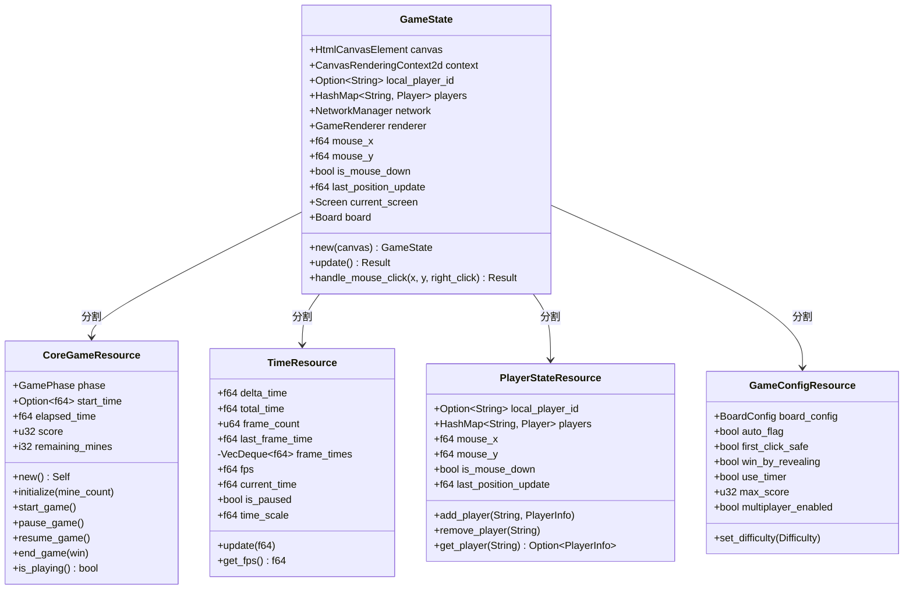
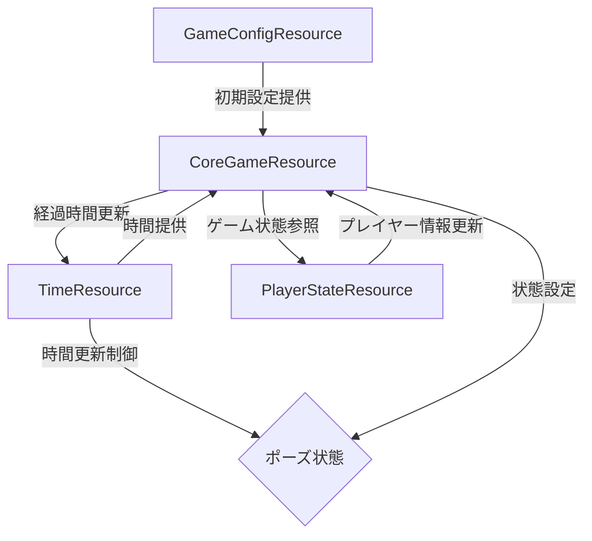
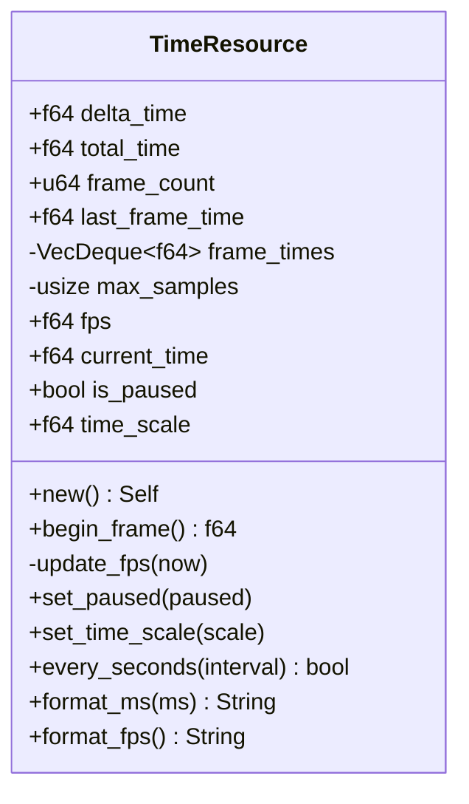
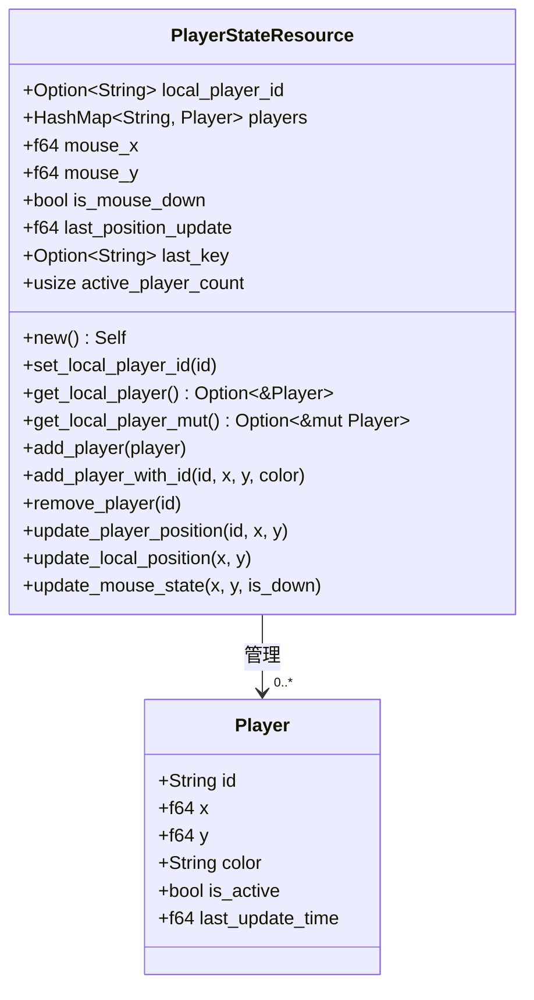
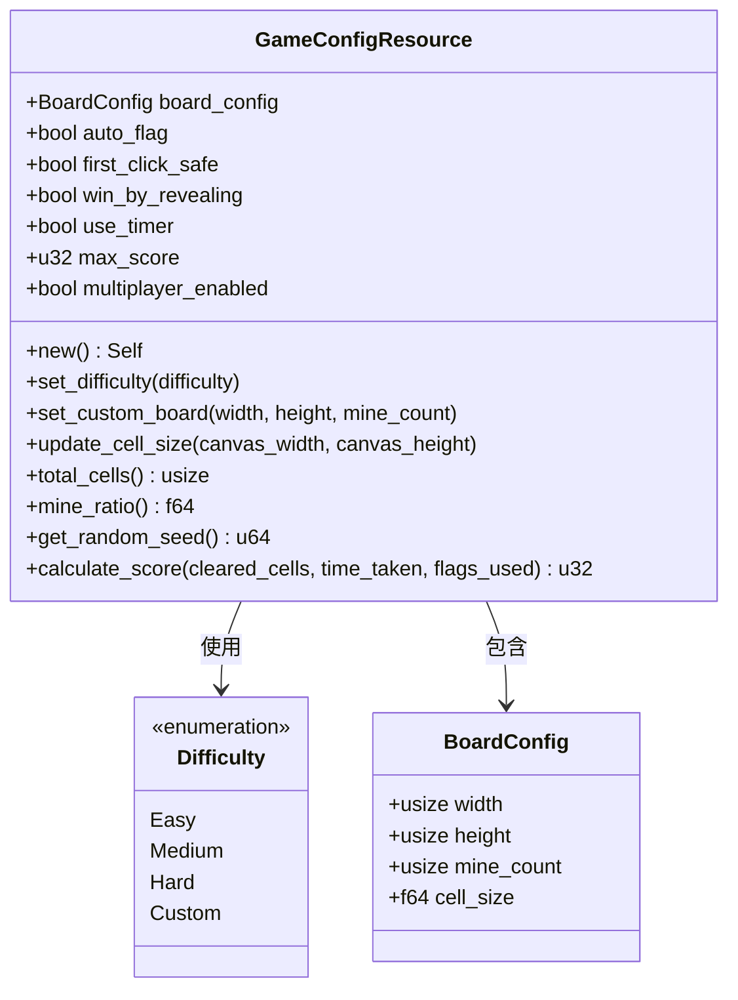

# リソース設計の詳細化

## 概要
ゲーム状態をECSリソースに変換するための第一ステップとして、各リソースの詳細設計を行います。
既存の`GameState`から分離する4つの主要リソースの構造と責任範囲を定義します。

## リソースの分類と役割



## リソース間の相互作用



## 各リソースの詳細定義

### 1. CoreGameResource

```mermaid
classDiagram
    class GamePhase {
        <<enumeration>>
        Ready
        Playing
        Paused
        GameOver{win: bool}
    }
    
    class CoreGameResource {
        +GamePhase phase
        +Option~f64~ start_time
        +f64 elapsed_time
        +u32 score
        +i32 remaining_mines
        +new() Self
        +initialize(mine_count)
        +start_game()
        +pause_game()
        +resume_game()
        +end_game(win)
        +is_game_started() bool
        +is_playing() bool
        +is_paused() bool
        +is_game_over() bool
        +is_win() bool
        +update_elapsed_time()
        +add_score(points)
        +update_remaining_mines(is_flagged)
        +elapsed_time_string() String
    }
    
    CoreGameResource --> GamePhase : 使用
```

### 2. TimeResource 



### 3. PlayerStateResource



### 4. GameConfigResource



## 次のステップ

- リソースマネージャーの設計と実装
- 各リソースの詳細実装
- システムとの統合方法の確立 