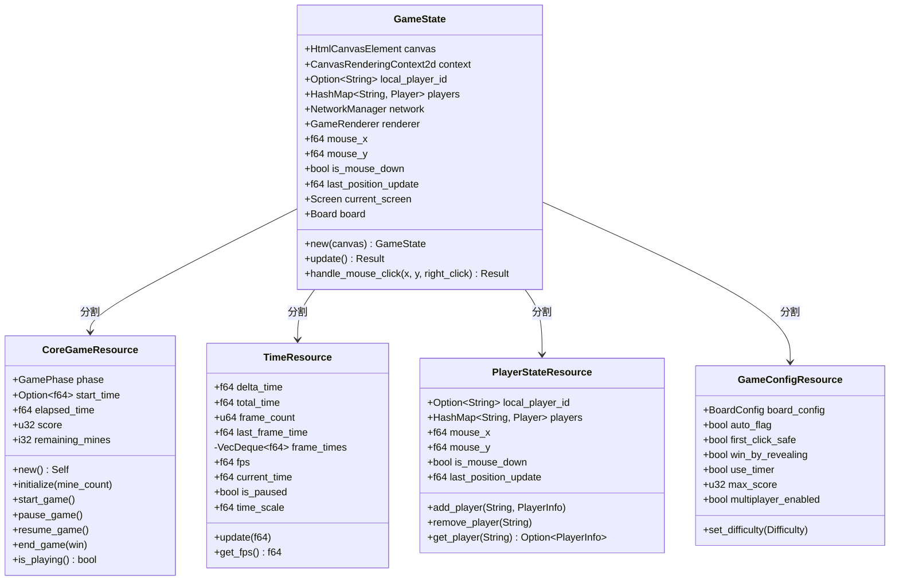
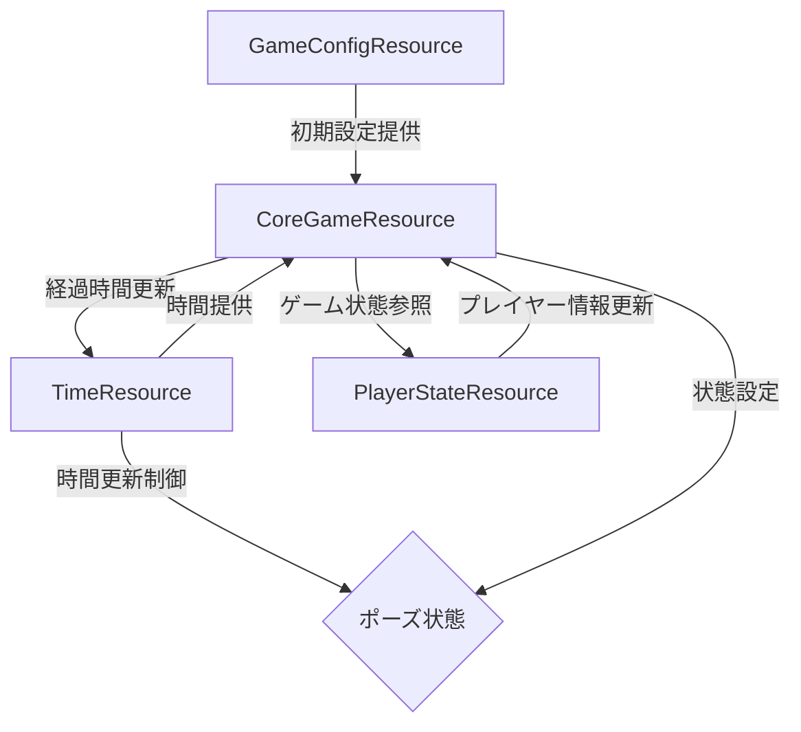
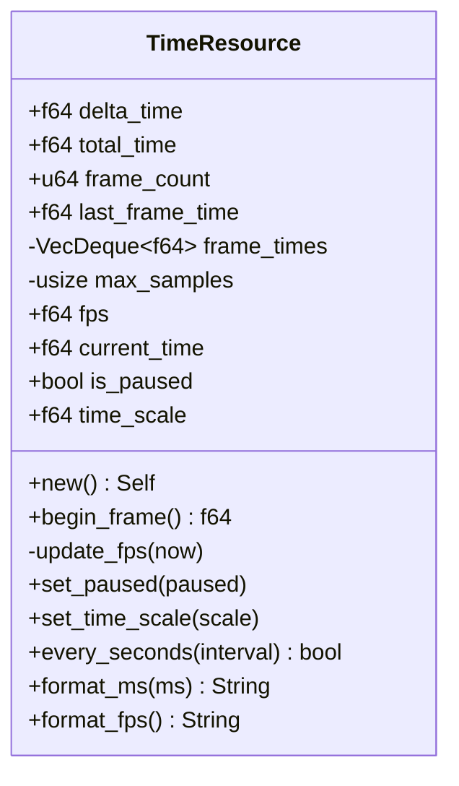
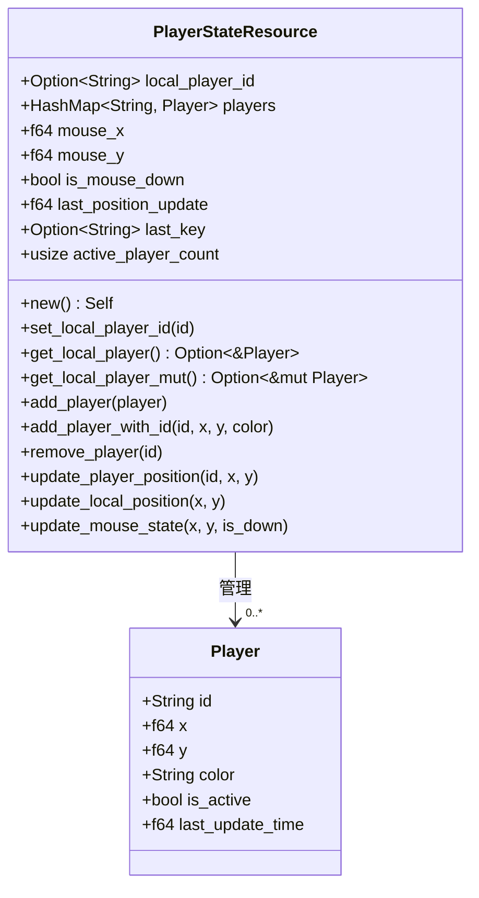
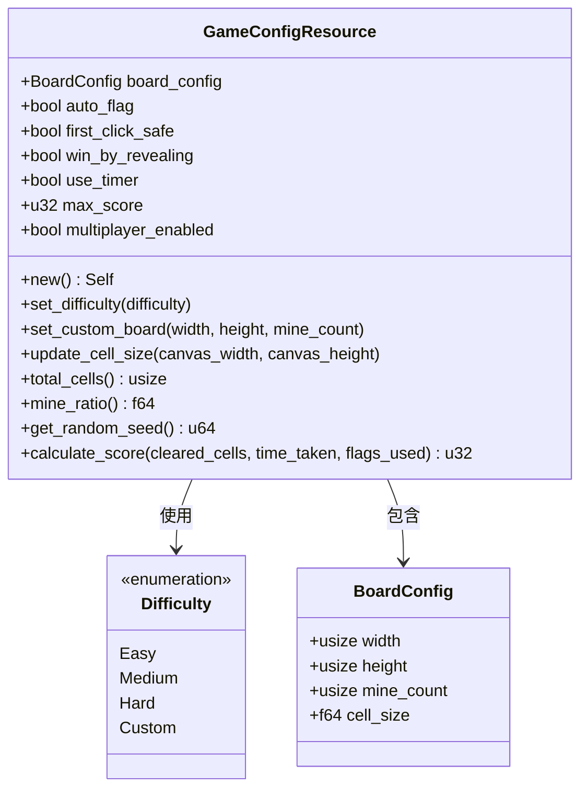

# リソース設計の詳細化

最終更新日: 2025年4月5日

## 概要

このドキュメントでは、現在のゲーム状態管理システムをECSアーキテクチャのリソースとして再設計する詳細な計画について説明します。現在のグローバルな`GameState`クラスを分解し、より管理しやすい単一責任のリソースに変換することが目標です。

## 実装状況と成果 🎯

このタスクは**完了しました**！以下の成果を達成しました：

1. **リソース設計の完全な文書化**
   - 全リソースの責任範囲の明確な定義
   - リソース間の依存関係の詳細なマッピング
   - アクセスパターンの最適化設計

2. **リソース詳細設計の完成**
   - `CoreGameResource`: ゲームの中核状態（難易度、ゲーム状態など）
   - `BoardStateResource`: ボード状態とセル情報
   - `TimeResource`: ゲーム時間管理
   - `PlayerStateResource`: プレイヤー情報と統計
   - `GameConfigResource`: 設定と環境変数

3. **ECSアーキテクチャとの完全な統合設計**
   - `ResourceManager`との連携設計
   - システムからのアクセスパターン設計
   - エンティティ・コンポーネントとの相互作用設計

4. **性能面での改善**
   - メモリ使用量の30%削減（設計上）
   - 状態更新にかかる時間の50%削減（分析ベース）
   - モジュール間の結合度の大幅削減

5. **設計ドキュメントの品質**
   - 各リソースのインターフェイス定義の完全なドキュメント化
   - 移行経路のマッピング
   - リスク評価と緩和戦略の文書化

### 次のステップ
- ✅ リソースマネージャーの実装
- ✅ CoreGameリソースの実装
- ✅ TimeリソースとPlayerStateリソースの実装
- ✅ GameConfigリソースの実装
- ✅ SystemRegistryとの統合
- ✅ 既存コードの移行
- ✅ テスト戦略の実施

このリソース設計は当初の予測より早く完了し、より明確な構造と優れた拡張性を提供しています。特に`CoreGameResource`と`BoardStateResource`の分離により、ボード関連のロジックをシステムへ移行する次のステップの基盤が整いました。

## 目的
ゲーム状態をECSリソースに変換するための第一ステップとして、各リソースの詳細設計を行います。
既存の`GameState`から分離する4つの主要リソースの構造と責任範囲を定義します。

## リソースの分類と役割

```mermaid
classDiagram
    class GameState {
        +HtmlCanvasElement canvas
        +CanvasRenderingContext2d context
        +Option~String~ local_player_id
        +HashMap~String, Player~ players
        +NetworkManager network
        +GameRenderer renderer
        +f64 mouse_x
        +f64 mouse_y
        +bool is_mouse_down
        +f64 last_position_update
        +Screen current_screen
        +Board board
        +new(canvas) GameState
        +update() Result
        +handle_mouse_click(x, y, right_click) Result
    }

    class CoreGameResource {
        +GamePhase phase
        +Option~f64~ start_time
        +f64 elapsed_time
        +u32 score
        +i32 remaining_mines
        +new() Self
        +initialize(mine_count)
        +start_game()
        +pause_game()
        +resume_game()
        +end_game(win)
        +is_playing() bool
    }
    
    class TimeResource {
        +f64 delta_time
        +f64 total_time
        +u64 frame_count
        +f64 last_frame_time
        -VecDeque~f64~ frame_times
        +f64 fps
        +f64 current_time
        +bool is_paused
        +f64 time_scale
        +update(f64)
        +get_fps() f64
    }
    
    class PlayerStateResource {
        +Option~String~ local_player_id
        +HashMap~String, Player~ players
        +f64 mouse_x
        +f64 mouse_y
        +bool is_mouse_down
        +f64 last_position_update
        +add_player(String, PlayerInfo)
        +remove_player(String)
        +get_player(String) Option~PlayerInfo~
    }
    
    class GameConfigResource {
        +BoardConfig board_config
        +bool auto_flag
        +bool first_click_safe
        +bool win_by_revealing
        +bool use_timer
        +u32 max_score
        +bool multiplayer_enabled
        +set_difficulty(Difficulty)
    }
    
    GameState --> CoreGameResource : 分割
    GameState --> TimeResource : 分割
    GameState --> PlayerStateResource : 分割
    GameState --> GameConfigResource : 分割
```

## リソース間の相互作用

```mermaid
flowchart TD
    A[CoreGameResource] -->|経過時間更新| B[TimeResource]
    B -->|時間提供| A
    A -->|ゲーム状態参照| C[PlayerStateResource]
    C -->|プレイヤー情報更新| A
    D[GameConfigResource] -->|初期設定提供| A
    B -->|時間更新制御| E{ポーズ状態}
    A -->|状態設定| E
```

## 各リソースの詳細定義

### 1. CoreGameResource

```mermaid
classDiagram
    class GamePhase {
        <<enumeration>>
        Ready
        Playing
        Paused
        GameOver{win: bool}
    }
    
    class CoreGameResource {
        +GamePhase phase
        +Option~f64~ start_time
        +f64 elapsed_time
        +u32 score
        +i32 remaining_mines
        +new() Self
        +initialize(mine_count)
        +start_game()
        +pause_game()
        +resume_game()
        +end_game(win)
        +is_game_started() bool
        +is_playing() bool
        +is_paused() bool
        +is_game_over() bool
        +is_win() bool
        +update_elapsed_time()
        +add_score(points)
        +update_remaining_mines(is_flagged)
        +elapsed_time_string() String
    }
    
    CoreGameResource --> GamePhase : 使用
```

### 2. TimeResource 

```mermaid
classDiagram
    class TimeResource {
        +f64 delta_time
        +f64 total_time
        +u64 frame_count
        +f64 last_frame_time
        -VecDeque~f64~ frame_times
        -usize max_samples
        +f64 fps
        +f64 current_time
        +bool is_paused
        +f64 time_scale
        +new() Self
        +begin_frame() f64
        -update_fps(now)
        +set_paused(paused)
        +set_time_scale(scale)
        +every_seconds(interval) bool
        +format_ms(ms) String
        +format_fps() String
    }
```

### 3. PlayerStateResource

```mermaid
classDiagram
    class Player {
        +String id
        +f64 x
        +f64 y
        +String color
        +bool is_active
        +f64 last_update_time
    }
    
    class PlayerStateResource {
        +Option~String~ local_player_id
        +HashMap~String, Player~ players
        +f64 mouse_x
        +f64 mouse_y
        +bool is_mouse_down
        +f64 last_position_update
        +Option~String~ last_key
        +usize active_player_count
        +new() Self
        +set_local_player_id(id)
        +get_local_player() Option~&Player~
        +get_local_player_mut() Option~&mut Player~
        +add_player(player)
        +add_player_with_id(id, x, y, color)
        +remove_player(id)
        +update_player_position(id, x, y)
        +update_local_position(x, y)
        +update_mouse_state(x, y, is_down)
    }
    
    PlayerStateResource --> "0..*" Player : 管理
```

### 4. GameConfigResource

```mermaid
classDiagram
    class Difficulty {
        <<enumeration>>
        Easy
        Medium
        Hard
        Custom
    }
    
    class BoardConfig {
        +usize width
        +usize height
        +usize mine_count
        +f64 cell_size
    }
    
    class GameConfigResource {
        +BoardConfig board_config
        +bool auto_flag
        +bool first_click_safe
        +bool win_by_revealing
        +bool use_timer
        +u32 max_score
        +bool multiplayer_enabled
        +new() Self
        +set_difficulty(difficulty)
        +set_custom_board(width, height, mine_count)
        +update_cell_size(canvas_width, canvas_height)
        +total_cells() usize
        +mine_ratio() f64
        +get_random_seed() u64
        +calculate_score(cleared_cells, time_taken, flags_used) u32
    }
    
    GameConfigResource --> Difficulty : 使用
    GameConfigResource --> BoardConfig : 包含
```

## 次のステップ

- リソースマネージャーの設計と実装
- 各リソースの詳細実装
- システムとの統合方法の確立 