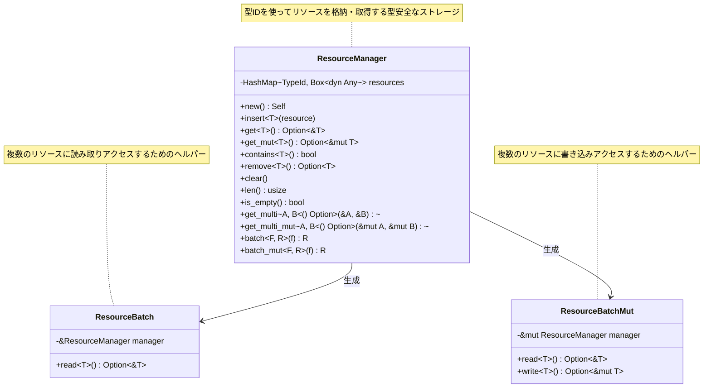
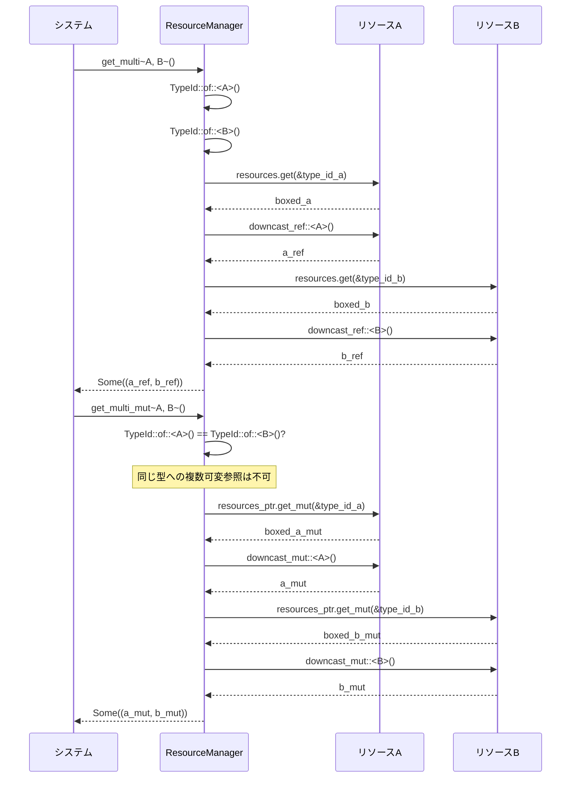
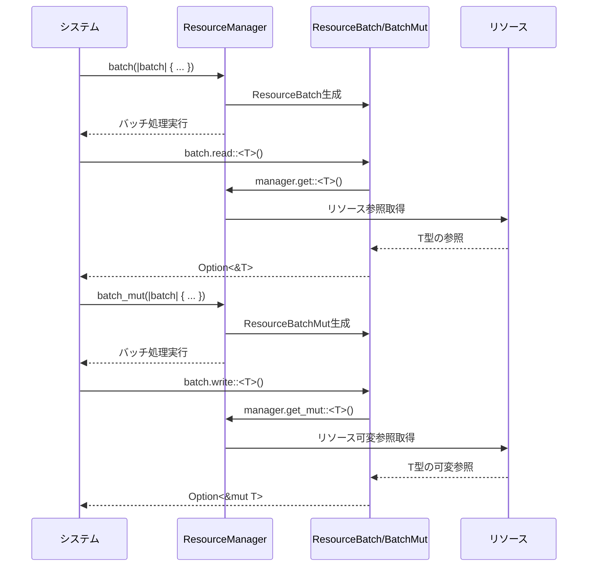
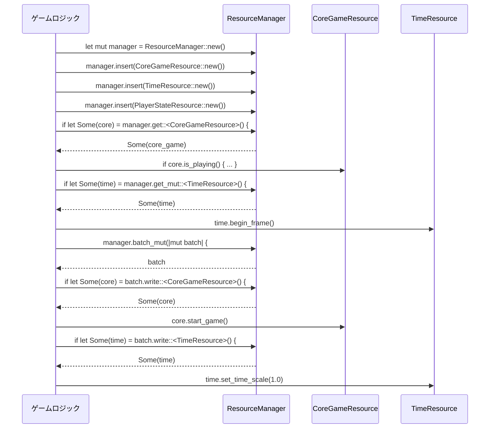

# リソースマネージャーの設計

## 概要
リソースマネージャーは、ゲーム内の様々なリソースを型安全に管理するためのコンテナです。
各システムはこのマネージャーを通じて必要なリソースにアクセスします。

## リソースマネージャーの設計



## リソースアクセスの仕組み

```mermaid
flowchart TD
    A[システム] -->|get~T~()| B[ResourceManager]
    B -->|TypeId::of::<T>()| C[型IDの生成]
    C -->|resources.get()| D[リソース検索]
    D -->|downcast_ref::<T>()| E[型キャスト]
    E --> F[Option~&T~]
    F --> A
    
    G[システム] -->|get_mut~T~()| H[ResourceManager]
    H -->|TypeId::of::<T>()| I[型IDの生成]
    I -->|resources.get_mut()| J[リソース検索]
    J -->|downcast_mut::<T>()| K[型キャスト]
    K --> L[Option~&mut T~]
    L --> G
```

## 複数リソースの同時アクセス



## バッチ処理の実装



## 使用例



## 次のステップ

1. リソースマネージャーの実装
2. CoreGameリソースの実装
3. 他のリソースの実装
4. リソースマネージャーとシステムの統合 