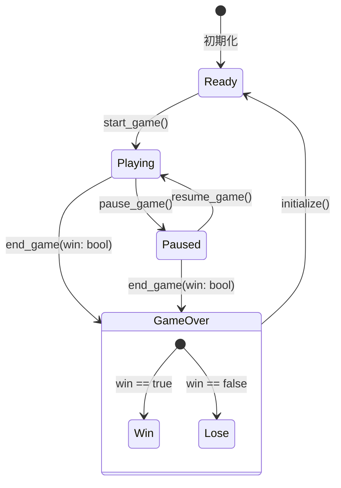
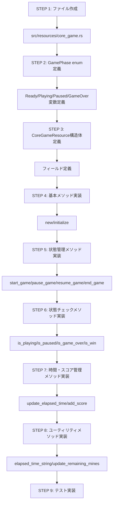

# CoreGameリソースの実装

## 概要
CoreGameResourceはゲームの中核となる状態を管理するリソースです。
ゲームフェーズ、タイミング、スコアなどの基本的なゲーム状態を扱います。

## クラス構造

```mermaid
classDiagram
    class GamePhase {
        <<enumeration>>
        Ready
        Playing
        Paused
        GameOver{win: bool}
    }
    
    class CoreGameResource {
        +GamePhase phase
        +Option~f64~ start_time
        +f64 elapsed_time
        +u32 score
        +i32 remaining_mines
        +new() Self
        +initialize(mine_count)
        +start_game()
        +pause_game()
        +resume_game()
        +end_game(win)
        +is_game_started() bool
        +is_playing() bool
        +is_paused() bool
        +is_game_over() bool
        +is_win() bool
        +update_elapsed_time()
        +add_score(points)
        +update_remaining_mines(is_flagged)
        +elapsed_time_string() String
    }
    
    CoreGameResource --> GamePhase : 使用
```

## ゲーム状態遷移



## 主要メソッドの実装

### 初期化と状態管理

```mermaid
flowchart TD
    A[new] --> B[phase = Ready]
    B --> C[start_time = None]
    C --> D[elapsed_time = 0.0]
    D --> E[score = 0]
    E --> F[remaining_mines = 0]
    
    G[initialize] --> H[phase = Ready]
    H --> I[start_time = None]
    I --> J[elapsed_time = 0.0]
    J --> K[score = 0]
    K --> L[remaining_mines = mine_count]
    
    M[start_game] --> N[phase = Playing]
    N --> O[start_time = Some<現在時刻>]
    O --> P[elapsed_time = 0.0]
    
    Q[pause_game] --> R{is_playing?}
    R -->|Yes| S[phase = Paused]
    R -->|No| T[何もしない]
    
    U[resume_game] --> V{is_paused?}
    V -->|Yes| W[phase = Playing]
    V -->|No| X[何もしない]
    
    Y[end_game] --> Z[phase = GameOver { win }]
```

### 状態チェック機能

```mermaid
flowchart LR
    A[is_game_started] --> B{phase?}
    B -->|Playing/Paused/GameOver| C[true]
    B -->|Ready| D[false]
    
    E[is_playing] --> F{phase == Playing?}
    F -->|Yes| G[true]
    F -->|No| H[false]
    
    I[is_paused] --> J{phase == Paused?}
    J -->|Yes| K[true]
    J -->|No| L[false]
    
    M[is_game_over] --> N{phase == GameOver?}
    N -->|Yes| O[true]
    N -->|No| P[false]
    
    Q[is_win] --> R{phase == GameOver{win:true}?}
    R -->|Yes| S[true]
    R -->|No| T[false]
```

### 時間とスコア管理

```mermaid
flowchart TD
    A[update_elapsed_time] --> B{is_playing?}
    B -->|Yes| C{start_time存在?}
    C -->|Yes| D[現在時刻取得]
    D --> E[elapsed_time = (now - start_time) / 1000.0]
    C -->|No| F[何もしない]
    B -->|No| G[何もしない]
    
    H[add_score] --> I[score += points]
    
    J[update_remaining_mines] --> K{is_flagged?}
    K -->|Yes| L[remaining_mines -= 1]
    K -->|No| M[remaining_mines += 1]
    L --> N[remaining_mines = max(0, remaining_mines)]
    M --> N
    
    O[elapsed_time_string] --> P[total_seconds = elapsed_time as u32]
    P --> Q[minutes = total_seconds / 60]
    Q --> R[seconds = total_seconds % 60]
    R --> S[format!("{:02}:{:02}", minutes, seconds)]
```

## 実装手順



## ファイル構造

```mermaid
classDiagram
    class src/resources/mod.rs {
        pub mod core_game
        pub use core_game::{CoreGameResource, GamePhase}
    }
    
    class src/resources/core_game.rs {
        pub enum GamePhase { ... }
        pub struct CoreGameResource { ... }
        impl CoreGameResource { ... }
        #[cfg(test)] mod tests { ... }
    }
```

## 次のステップ

- TimeResourceの実装
- PlayerStateResourceの実装
- リソース間の連携テスト 