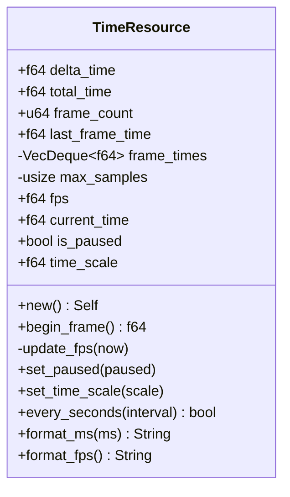
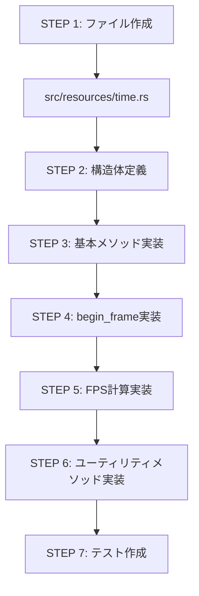
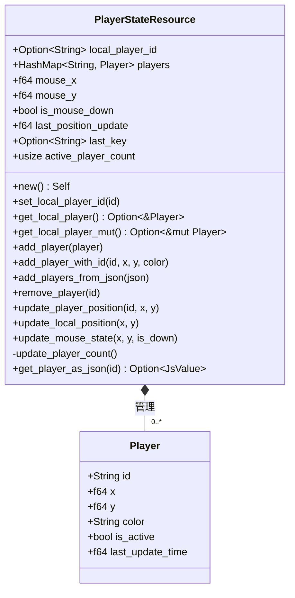
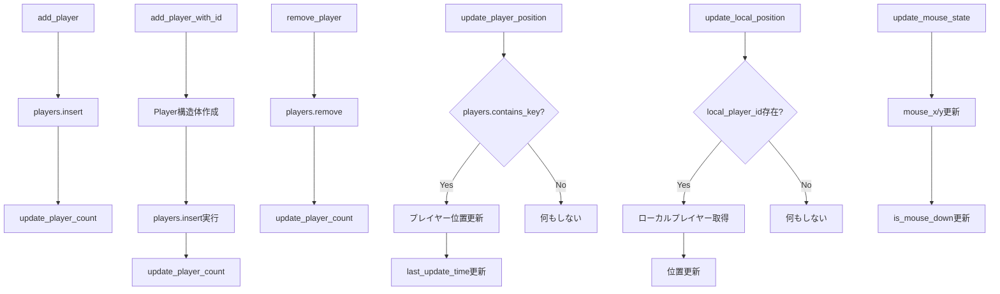
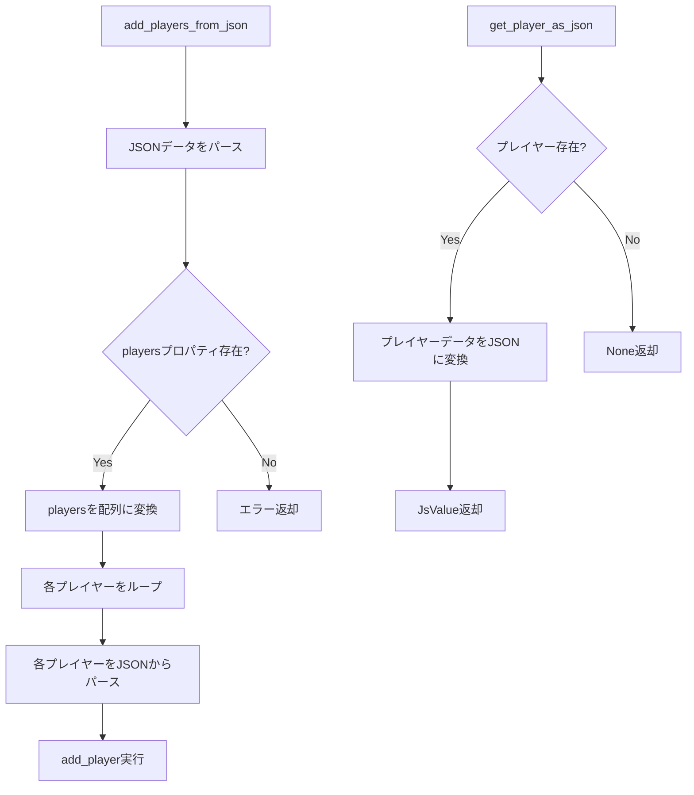
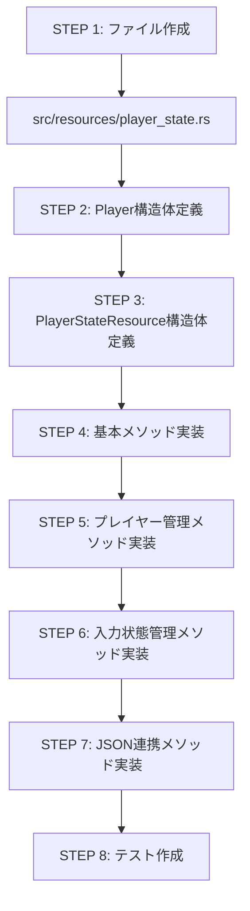

# TimeリソースとPlayerStateリソースの実装

## 目次
1. [TimeResourceの設計と実装](#timeresourceの設計と実装)
2. [PlayerStateResourceの設計と実装](#playerstateresourceの設計と実装)

## TimeResourceの設計と実装

### 概要
TimeResourceはゲーム内の時間管理を担当するリソースです。フレーム間の経過時間、FPS測定、時間スケーリングなどの機能を提供します。

### クラス構造



### フレーム更新処理

```mermaid
flowchart TD
    A[begin_frame] --> B[js_sys::Date::now取得]
    B --> C{last_frame_time == 0?}
    C -->|Yes| D[初回フレーム処理]
    D --> E[現在時刻を保存]
    E --> F[delta_time = 0]
    C -->|No| G[経過時間計算]
    G --> H[delta_time = (now - last_frame_time) / 1000.0]
    F --> I{is_paused?}
    H --> I
    I -->|Yes| J[delta_time = 0]
    I -->|No| K[時間スケール適用]
    J --> M[frame_count++]
    K --> L[total_time += delta_time]
    L --> M
    M --> N[update_fps実行]
    N --> O[last_frame_time = now]
    O --> P[current_time = now]
    P --> Q[delta_time返却]
```

### FPS計算

```mermaid
flowchart LR
    A[update_fps] --> B[frame_times.push_back<現在時刻>]
    B --> C{frame_times.len() > max_samples?}
    C -->|Yes| D[frame_times.pop_front]
    D --> E[サンプル平均計算]
    C -->|No| E
    E --> F[平均フレーム時間算出]
    F --> G[fps = 1000.0 / 平均フレーム時間]
```

### 時間ユーティリティ

```mermaid
flowchart TD
    A[every_seconds] --> B[interval = 最大値(interval, 0.001)]
    B --> C[elapsed = (total_time / interval)四捨五入]
    C --> D[elapsed * interval == total_time四捨五入?]
    D -->|Yes| E[true返却]
    D -->|No| F[false返却]
    
    G[format_ms] --> H[秒計算: seconds = floor(ms / 1000)]
    H --> I[分計算: minutes = floor(seconds / 60)]
    I --> J[秒調整: seconds = seconds % 60]
    J --> K[ミリ秒計算: ms_part = ms % 1000]
    K --> L[文字列整形]
    
    M[format_fps] --> N[小数点1桁までのfps文字列]
```

### 実装ステップ



## PlayerStateResourceの設計と実装

### 概要
PlayerStateResourceはプレイヤー関連の状態を管理するリソースです。ローカルプレイヤーと他のプレイヤーの情報、マウス入力状態などを管理します。

### クラス構造



### プレイヤー管理フロー



### JSON連携



### 実装ステップ



## ファイル構造

```mermaid
classDiagram
    class src/resources/mod.rs {
        pub mod time
        pub mod player_state
        pub use time::TimeResource
        pub use player_state::{PlayerStateResource, Player}
    }
    
    class src/resources/time.rs {
        pub struct TimeResource { ... }
        impl TimeResource { ... }
        #[cfg(test)] mod tests { ... }
    }
    
    class src/resources/player_state.rs {
        pub struct Player { ... }
        pub struct PlayerStateResource { ... }
        impl PlayerStateResource { ... }
        #[cfg(test)] mod tests { ... }
    }
```

## 次のステップ

- GameConfigResourceの実装
- リソース間の連携テスト
- SystemRegistryとの統合 