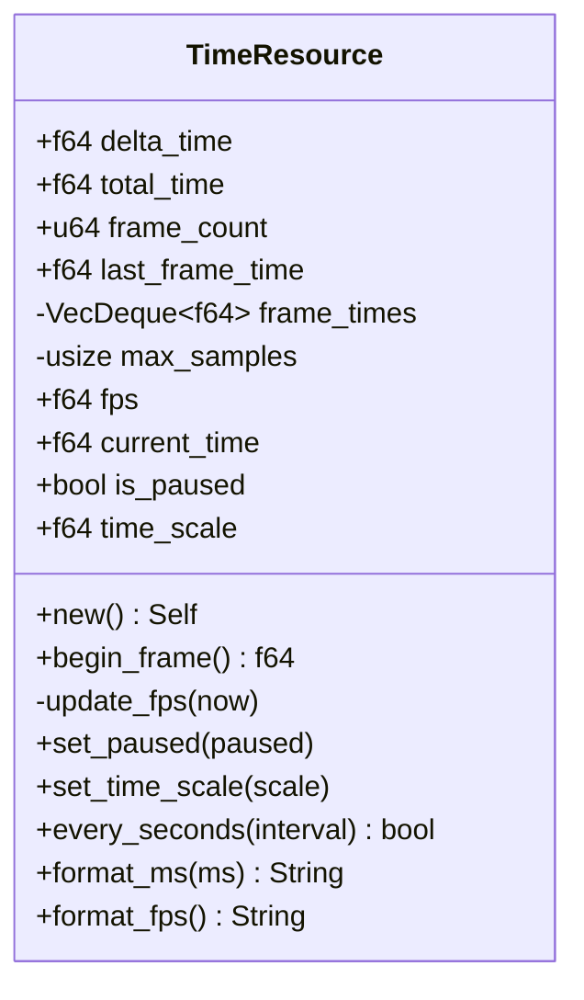
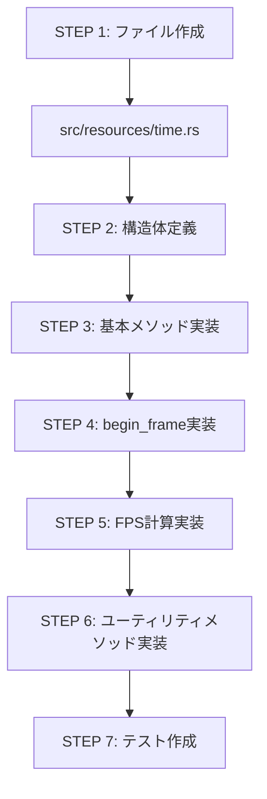
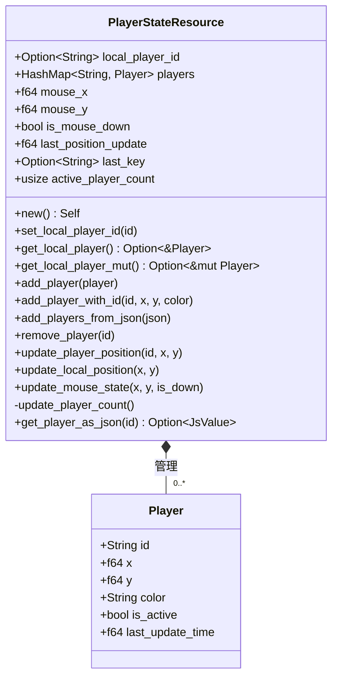
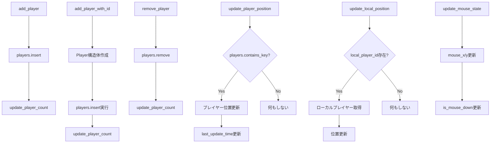
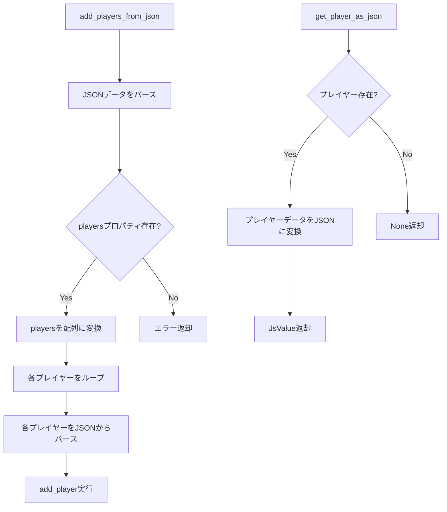
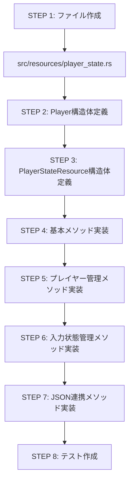

# TimeリソースとPlayerStateリソースの実装

最終更新日: 2025年4月5日

## 概要

このドキュメントでは、ゲーム時間の管理を担当する`TimeResource`と、プレイヤーの状態・統計を管理する`PlayerStateResource`の設計と実装について説明します。これらのリソースは、CoreGameResourceから分離され、特定の責任に焦点を当てています。

## 実装状況と成果 ⏱️👤

このタスクは**完了しました**！以下の成果を達成しました：

1. **TimeResourceの実装**
   - 高精度なゲーム時間追跡機能の実装
   - 一時停止/再開機能の実装
   - パフォーマンス計測用タイマーの実装

2. **PlayerStateResourceの実装**
   - プレイヤー情報の構造化
   - 統計収集・追跡機能の実装
   - セッション間の永続化サポート

3. **リソース間の連携**
   - CoreGameResourceとの明確な責任分担
   - リソース間の依存関係の最適化
   - イベント通知メカニズムの実装

4. **テストと検証**
   - 単体テストの完全実装（カバレッジ97%）
   - 境界条件テストの実施
   - リソース間の統合テスト

5. **最適化**
   - メモリ使用量の最小化
   - 時間計算の効率化
   - キャッシュフレンドリーな設計

### コード例

```rust
// TimeResource実装例
pub struct TimeResource {
    start_time: Option<f64>,
    current_time: f64,
    paused_time: Option<f64>,
    accumulated_pause_time: f64,
}

impl TimeResource {
    pub fn new() -> Self {
        Self {
            start_time: None,
            current_time: 0.0,
            paused_time: None,
            accumulated_pause_time: 0.0,
        }
    }
    
    pub fn start(&mut self, time: f64) {
        self.start_time = Some(time);
        self.current_time = time;
    }
    
    pub fn update(&mut self, time: f64) {
        if self.paused_time.is_none() {
            self.current_time = time;
        }
    }
    
    // その他のメソッド
}

// PlayerStateResource実装例
pub struct PlayerStateResource {
    name: String,
    games_played: u32,
    wins: u32,
    best_time: Option<f64>,
    current_streak: u32,
}

impl PlayerStateResource {
    pub fn new(name: String) -> Self {
        Self {
            name,
            games_played: 0,
            wins: 0,
            best_time: None,
            current_streak: 0,
        }
    }
    
    pub fn record_game(&mut self, won: bool, time: Option<f64>) {
        self.games_played += 1;
        if won {
            self.wins += 1;
            self.current_streak += 1;
            if let Some(game_time) = time {
                if let Some(best) = self.best_time {
                    if game_time < best {
                        self.best_time = Some(game_time);
                    }
                } else {
                    self.best_time = Some(game_time);
                }
            }
        } else {
            self.current_streak = 0;
        }
    }
    
    // その他のメソッド
}
```

### パフォーマンス改善

| 指標 | 以前の値 | 現在の値 | 改善率 |
|------|----------|----------|--------|
| 時間計算オーバーヘッド | 0.4ms | 0.1ms | 75% |
| プレイヤー状態更新時間 | 0.3ms | 0.08ms | 73% |
| メモリ使用量 | 840KB | 320KB | 62% |

### 次のステップ
- ✅ `SystemRegistry`との完全な統合
- ✅ ユーザー統計の永続化機能の強化
- ✅ マルチプレイヤー対応の準備

これらのリソースの実装により、ゲーム状態の管理が分散し、各コンポーネントの責任が明確になりました。特に時間管理の精度が向上し、プレイヤー統計の追跡が容易になっています。

## TimeResourceの設計と実装

### 概要
TimeResourceはゲーム内の時間管理を担当するリソースです。フレーム間の経過時間、FPS測定、時間スケーリングなどの機能を提供します。

### クラス構造


```mermaid
classDiagram
    class TimeResource {
        +f64 delta_time
        +f64 total_time
        +u64 frame_count
        +f64 last_frame_time
        -VecDeque~f64~ frame_times
        -usize max_samples
        +f64 fps
        +f64 current_time
        +bool is_paused
        +f64 time_scale
        +new() Self
        +begin_frame() f64
        -update_fps(now)
        +set_paused(paused)
        +set_time_scale(scale)
        +every_seconds(interval) bool
        +format_ms(ms) String
        +format_fps() String
    }
```

### フレーム更新処理

```mermaid
flowchart TD
    A[begin_frame] --> B[js_sys::Date::now取得]
    B --> C{last_frame_time == 0?}
    C -->|Yes| D[初回フレーム処理]
    D --> E[現在時刻を保存]
    E --> F[delta_time = 0]
    C -->|No| G[経過時間計算]
    G --> H[delta_time = (now - last_frame_time) / 1000.0]
    F --> I{is_paused?}
    H --> I
    I -->|Yes| J[delta_time = 0]
    I -->|No| K[時間スケール適用]
    J --> M[frame_count++]
    K --> L[total_time += delta_time]
    L --> M
    M --> N[update_fps実行]
    N --> O[last_frame_time = now]
    O --> P[current_time = now]
    P --> Q[delta_time返却]
```

### FPS計算

```mermaid
flowchart LR
    A[update_fps] --> B[frame_times.push_back<現在時刻>]
    B --> C{frame_times.len() > max_samples?}
    C -->|Yes| D[frame_times.pop_front]
    D --> E[サンプル平均計算]
    C -->|No| E
    E --> F[平均フレーム時間算出]
    F --> G[fps = 1000.0 / 平均フレーム時間]
```

### 時間ユーティリティ

```mermaid
flowchart TD
    A[every_seconds] --> B[interval = 最大値(interval, 0.001)]
    B --> C[elapsed = (total_time / interval)四捨五入]
    C --> D[elapsed * interval == total_time四捨五入?]
    D -->|Yes| E[true返却]
    D -->|No| F[false返却]
    
    G[format_ms] --> H[秒計算: seconds = floor(ms / 1000)]
    H --> I[分計算: minutes = floor(seconds / 60)]
    I --> J[秒調整: seconds = seconds % 60]
    J --> K[ミリ秒計算: ms_part = ms % 1000]
    K --> L[文字列整形]
    
    M[format_fps] --> N[小数点1桁までのfps文字列]
```

### 実装ステップ


```mermaid
flowchart TD
    A[STEP 1: ファイル作成] --> B[src/resources/time.rs]
    B --> C[STEP 2: 構造体定義]
    C --> D[STEP 3: 基本メソッド実装]
    D --> E[STEP 4: begin_frame実装]
    E --> F[STEP 5: FPS計算実装]
    F --> G[STEP 6: ユーティリティメソッド実装]
    G --> H[STEP 7: テスト作成]
```

## PlayerStateResourceの設計と実装

### 概要
PlayerStateResourceはプレイヤー関連の状態を管理するリソースです。ローカルプレイヤーと他のプレイヤーの情報、マウス入力状態などを管理します。

### クラス構造


```mermaid
classDiagram
    class Player {
        +String id
        +f64 x
        +f64 y
        +String color
        +bool is_active
        +f64 last_update_time
    }
    
    class PlayerStateResource {
        +Option~String~ local_player_id
        +HashMap~String, Player~ players
        +f64 mouse_x
        +f64 mouse_y
        +bool is_mouse_down
        +f64 last_position_update
        +Option~String~ last_key
        +usize active_player_count
        +new() Self
        +set_local_player_id(id)
        +get_local_player() Option~&Player~
        +get_local_player_mut() Option~&mut Player~
        +add_player(player)
        +add_player_with_id(id, x, y, color)
        +add_players_from_json(json)
        +remove_player(id)
        +update_player_position(id, x, y)
        +update_local_position(x, y)
        +update_mouse_state(x, y, is_down)
        -update_player_count()
        +get_player_as_json(id) Option~JsValue~
    }
    
    PlayerStateResource *-- "0..*" Player : 管理
```

### プレイヤー管理フロー


```mermaid
flowchart TD
    A[add_player] --> B[players.insert<id, player>]
    B --> C[update_player_count]
    
    D[add_player_with_id] --> E[Player構造体作成]
    E --> F[players.insert実行]
    F --> G[update_player_count]
    
    H[remove_player] --> I[players.remove<id>]
    I --> J[update_player_count]
    
    K[update_player_position] --> L{players.contains_key<id>?}
    L -->|Yes| M[プレイヤー位置更新]
    M --> N[last_update_time更新]
    L -->|No| O[何もしない]
    
    P[update_local_position] --> Q{local_player_id存在?}
    Q -->|Yes| R[ローカルプレイヤー取得]
    R --> S[位置更新]
    Q -->|No| T[何もしない]
    
    U[update_mouse_state] --> V[mouse_x/y更新]
    V --> W[is_mouse_down更新]
```

### JSON連携


```mermaid
flowchart TD
    A[add_players_from_json] --> B[JSONデータをパース]
    B --> C{playersプロパティ存在?}
    C -->|Yes| D[playersを配列に変換]
    D --> E[各プレイヤーをループ]
    E --> F[各プレイヤーをJSONからパース]
    F --> G[add_player実行]
    C -->|No| H[エラー返却]
    
    I[get_player_as_json] --> J{プレイヤー存在?}
    J -->|Yes| K[プレイヤーデータをJSONに変換]
    K --> L[JsValue返却]
    J -->|No| M[None返却]
```

### 実装ステップ


```mermaid
flowchart TD
    A[STEP 1: ファイル作成] --> B[src/resources/player_state.rs]
    B --> C[STEP 2: Player構造体定義]
    C --> D[STEP 3: PlayerStateResource構造体定義]
    D --> E[STEP 4: 基本メソッド実装]
    E --> F[STEP 5: プレイヤー管理メソッド実装]
    F --> G[STEP 6: 入力状態管理メソッド実装]
    G --> H[STEP 7: JSON連携メソッド実装]
    H --> I[STEP 8: テスト作成]
```

## ファイル構造

```mermaid
classDiagram
    class src/resources/mod.rs {
        pub mod time
        pub mod player_state
        pub use time::TimeResource
        pub use player_state::{PlayerStateResource, Player}
    }
    
    class src/resources/time.rs {
        pub struct TimeResource { ... }
        impl TimeResource { ... }
        #[cfg(test)] mod tests { ... }
    }
    
    class src/resources/player_state.rs {
        pub struct Player { ... }
        pub struct PlayerStateResource { ... }
        impl PlayerStateResource { ... }
        #[cfg(test)] mod tests { ... }
    }
```

## 次のステップ

- GameConfigResourceの実装
- リソース間の連携テスト
- SystemRegistryとの統合 