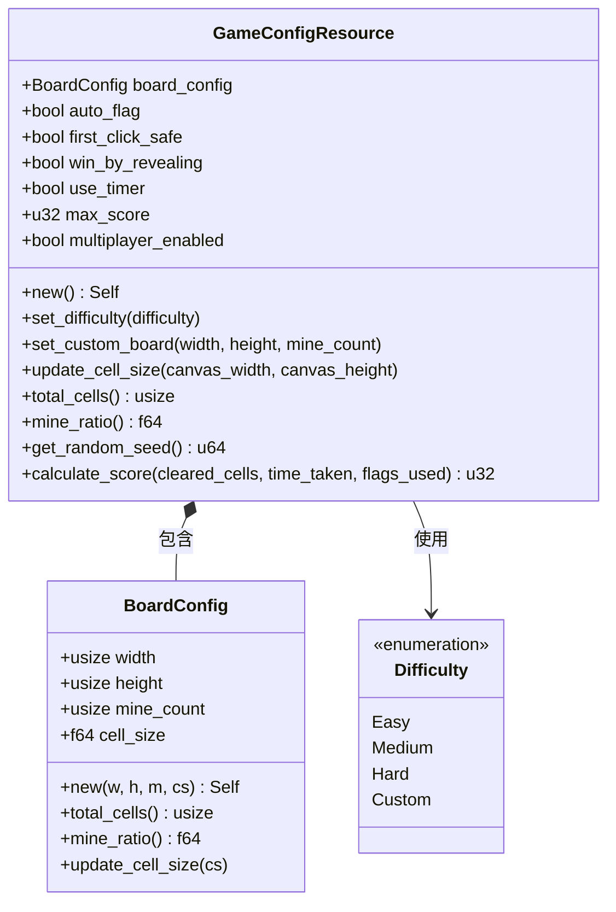
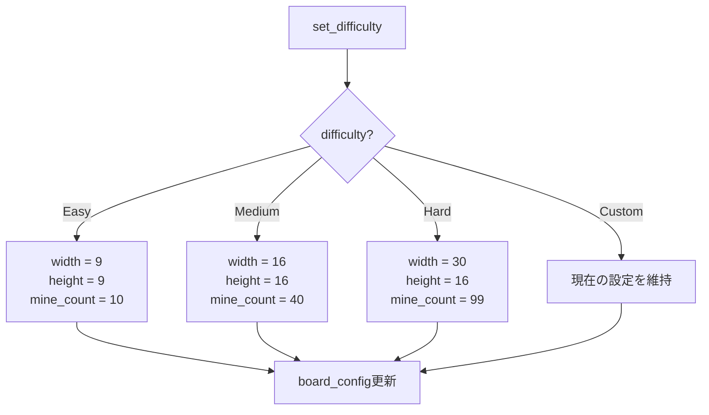
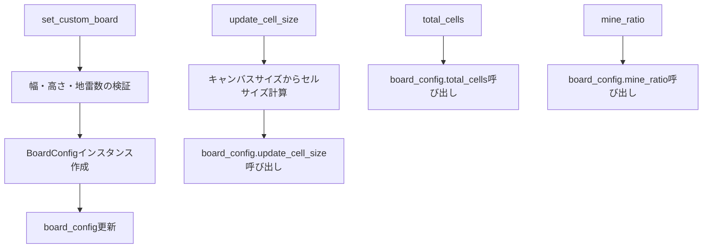
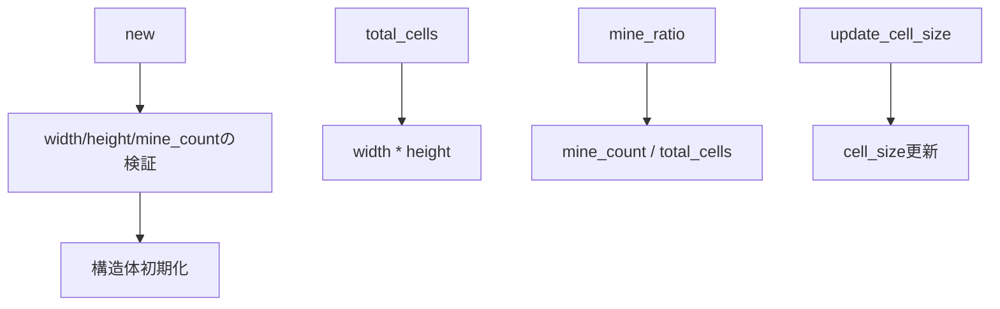
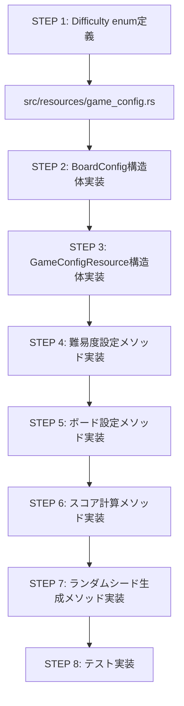
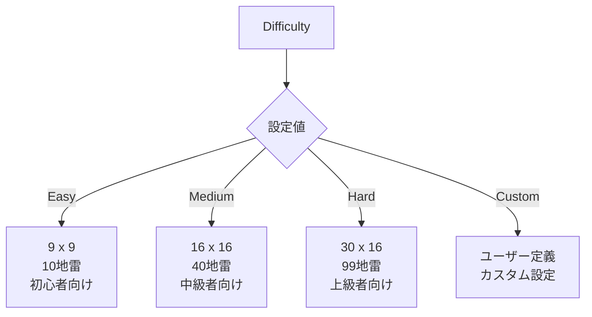
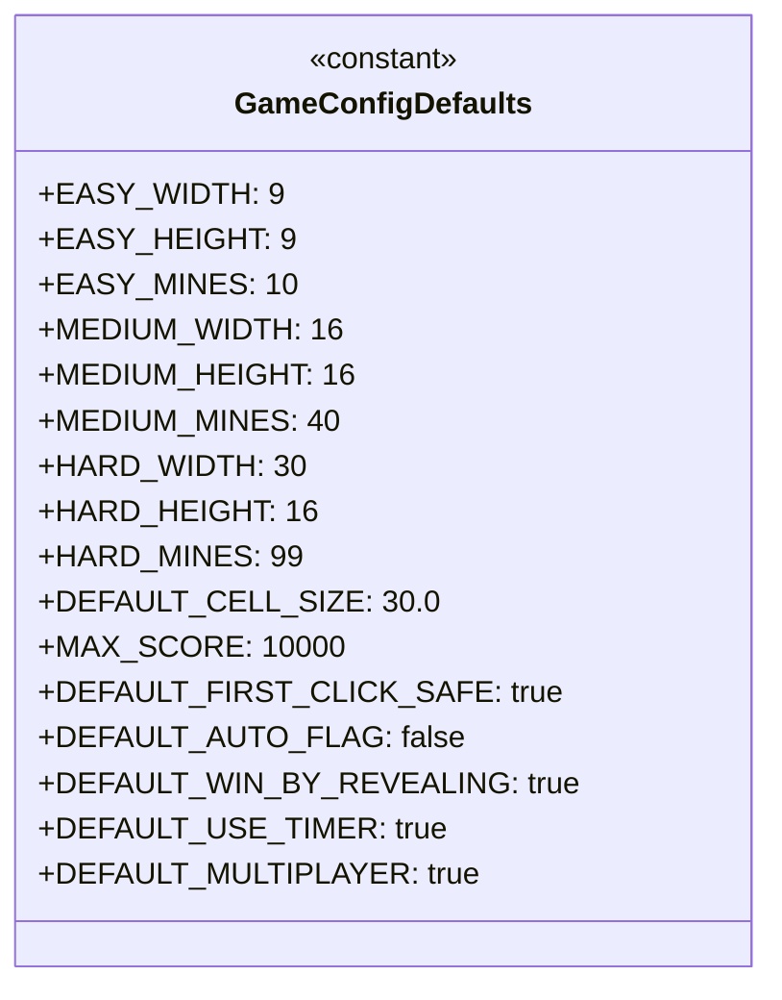

# GameConfigリソースの実装

## 概要
GameConfigResourceはゲームの設定情報を管理するリソースです。
ボード設定、難易度、ゲームルールなどの設定を一元管理します。

## クラス構造



## 難易度設定



## ボード設定管理



## スコア計算

```mermaid
flowchart TD
    A[calculate_score] --> B[基本スコア = cleared_cells * 10]
    B --> C[時間ペナルティ = time_taken * 0.5]
    C --> D[フラグボーナス = 正確なフラグ * 5]
    D --> E[難易度ボーナス計算]
    E --> F{どの難易度?}
    F -->|Easy| G[難易度係数 = 1.0]
    F -->|Medium| H[難易度係数 = 1.2]
    F -->|Hard| I[難易度係数 = 1.5]
    F -->|Custom| J[難易度係数 = 1.0 + mine_ratio]
    G & H & I & J --> K[最終スコア = <br>(基本スコア - 時間ペナルティ + フラグボーナス) * 難易度係数]
    K --> L[スコア = max(0, 最終スコア)]
    L --> M[スコア = min(max_score, スコア)]
```

## ランダムシード生成

```mermaid
flowchart LR
    A[get_random_seed] --> B[現在時刻取得]
    B --> C[シード計算: seed = (time * 1000).floor()]
    C --> D[ゲーム設定に基づく追加ハッシュ]
    D --> E[u64シード値返却]
```

## BoardConfig実装



## 実装ステップ



## 難易度に応じたデフォルト設定



## ファイル構造

```mermaid
classDiagram
    class src/resources/mod.rs {
        pub mod game_config
        pub mod board_config
        pub use game_config::{GameConfigResource, Difficulty}
        pub use board_config::BoardConfig
    }
    
    class src/resources/game_config.rs {
        pub enum Difficulty { ... }
        pub struct GameConfigResource { ... }
        impl GameConfigResource { ... }
        #[cfg(test)] mod tests { ... }
    }
    
    class src/resources/board_config.rs {
        pub struct BoardConfig { ... }
        impl BoardConfig { ... }
        #[cfg(test)] mod tests { ... }
    }
```

## 設定のデフォルト値



## 次のステップ

- SystemRegistryとの統合
- 既存コードの移行計画
- リソース間の連携テスト 