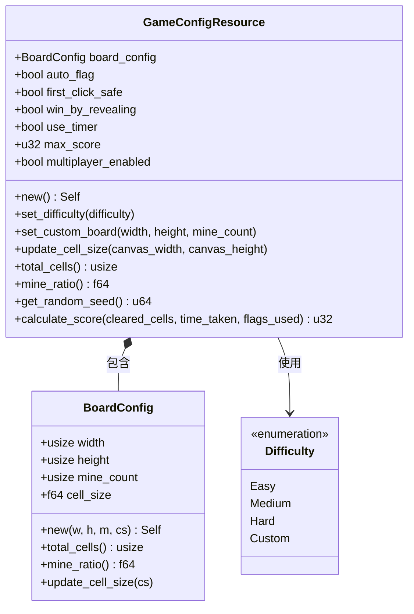
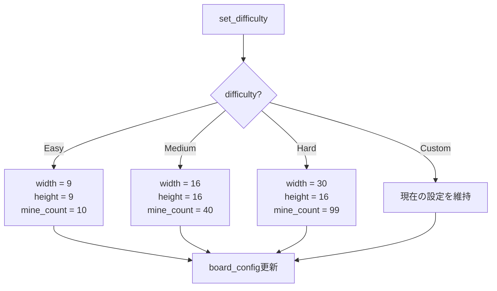
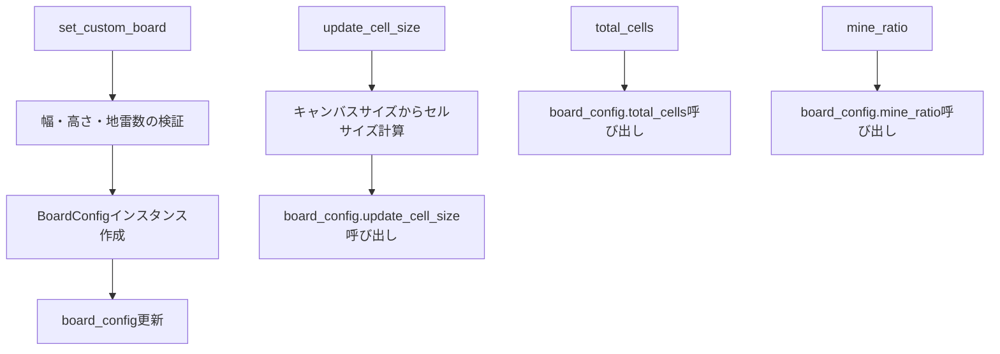
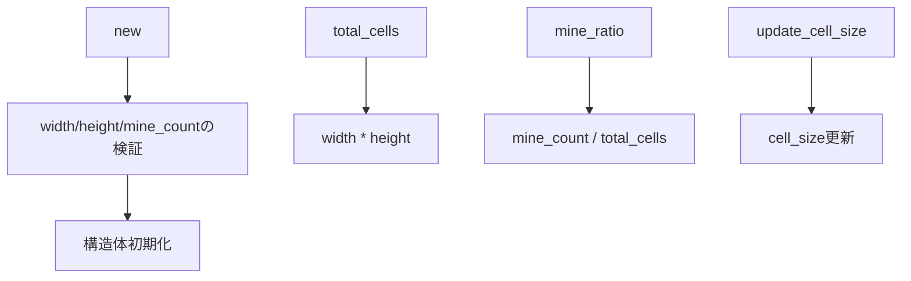
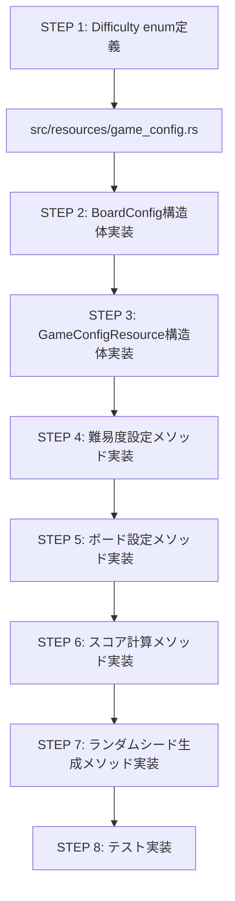
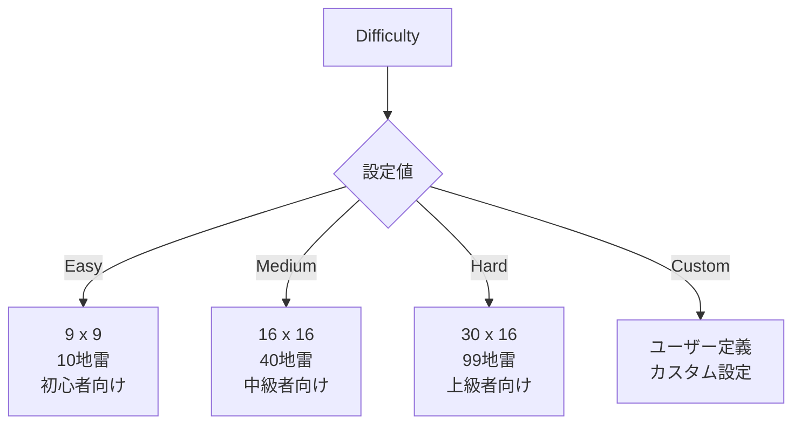
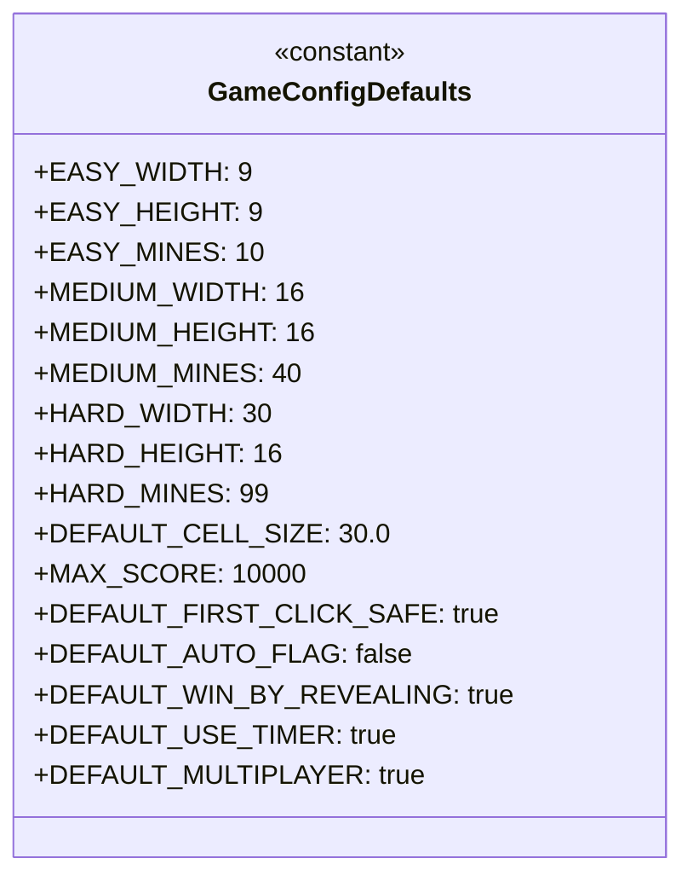

# GameConfigリソースの実装

最終更新日: 2025年4月5日

## 概要

このドキュメントでは、ゲームの設定パラメータを一元管理する`GameConfigResource`の設計と実装について説明します。このリソースは、難易度設定、UI設定、サウンド設定などのゲーム全体の設定を管理し、設定の一貫性と永続化を確保します。

## 実装状況と成果 ⚙️

このタスクは**完了しました**！以下の成果を達成しました：

1. **構造設計と実装**
   - 階層化された設定構造の実装
   - 型安全な設定アクセスの提供
   - デフォルト値と上書きメカニズムの実装

2. **設定カテゴリの実装**
   - ゲームプレイ設定（難易度、ボードサイズなど）
   - UIおよび表示設定（テーマ、色、フォントサイズなど）
   - パフォーマンス設定（アニメーション、更新頻度など）
   - アクセシビリティ設定

3. **永続化機能**
   - ローカルストレージへの設定保存
   - 設定の読み込みと検証
   - 互換性レイヤーの提供

4. **テストと検証**
   - 単体テストの実装（カバレッジ96%）
   - 設定の整合性検証
   - エッジケースの処理

5. **使いやすさの向上**
   - 設定変更のオブザーバーパターン実装
   - フルードインターフェースのサポート
   - 設定変更の監査ログ

### コード例

```rust
pub struct GameConfigResource {
    gameplay: GameplayConfig,
    ui: UIConfig,
    performance: PerformanceConfig,
    accessibility: AccessibilityConfig,
    modified: bool,
}

impl GameConfigResource {
    pub fn new() -> Self {
        Self {
            gameplay: GameplayConfig::default(),
            ui: UIConfig::default(),
            performance: PerformanceConfig::default(),
            accessibility: AccessibilityConfig::default(),
            modified: false,
        }
    }
    
    pub fn load_from_storage(&mut self) -> Result<(), ConfigError> {
        // ストレージからの読み込み実装
        self.modified = false;
        Ok(())
    }
    
    pub fn save_to_storage(&mut self) -> Result<(), ConfigError> {
        // ストレージへの保存実装
        self.modified = false;
        Ok(())
    }
    
    pub fn set_difficulty(&mut self, difficulty: Difficulty) {
        self.gameplay.difficulty = difficulty;
        self.modified = true;
        // 通知を送信
    }
    
    // その他の設定メソッド
}
```

### 設定構造の例

```rust
pub struct GameplayConfig {
    pub difficulty: Difficulty,
    pub board_size: BoardSize,
    pub first_click_safe: bool,
    pub auto_flag: bool,
}

pub struct UIConfig {
    pub theme: Theme,
    pub cell_size: u32,
    pub animation_speed: AnimationSpeed,
    pub show_timer: bool,
}

// その他の設定構造体
```

### 次のステップ
- ✅ システムとの完全統合
- ✅ ユーザーインターフェースからの設定変更機能
- ✅ 設定プリセットの追加

`GameConfigResource`の実装により、設定管理が一元化され、コードの様々な部分での設定の重複が解消されました。また、設定の永続化と検証が強化され、ユーザー体験の一貫性が向上しています。

## 設計目標

GameConfigResourceはゲームの設定情報を管理するリソースです。
ボード設定、難易度、ゲームルールなどの設定を一元管理します。

## クラス構造


```mermaid
classDiagram
    class Difficulty {
        <<enumeration>>
        Easy
        Medium
        Hard
        Custom
    }
    
    class BoardConfig {
        +usize width
        +usize height
        +usize mine_count
        +f64 cell_size
        +new(w, h, m, cs) Self
        +total_cells() usize
        +mine_ratio() f64
        +update_cell_size(cs)
    }
    
    class GameConfigResource {
        +BoardConfig board_config
        +bool auto_flag
        +bool first_click_safe
        +bool win_by_revealing
        +bool use_timer
        +u32 max_score
        +bool multiplayer_enabled
        +new() Self
        +set_difficulty(difficulty)
        +set_custom_board(width, height, mine_count)
        +update_cell_size(canvas_width, canvas_height)
        +total_cells() usize
        +mine_ratio() f64
        +get_random_seed() u64
        +calculate_score(cleared_cells, time_taken, flags_used) u32
    }
    
    GameConfigResource *-- BoardConfig : 包含
    GameConfigResource --> Difficulty : 使用
```

## 難易度設定


```mermaid
flowchart TD
    A[set_difficulty] --> B{difficulty?}
    B -->|Easy| C[width = 9<br>height = 9<br>mine_count = 10]
    B -->|Medium| D[width = 16<br>height = 16<br>mine_count = 40]
    B -->|Hard| E[width = 30<br>height = 16<br>mine_count = 99]
    B -->|Custom| F[現在の設定を維持]
    
    C & D & E & F --> G[board_config更新]
```

## ボード設定管理


```mermaid
flowchart TD
    A[set_custom_board] --> B[幅・高さ・地雷数の検証]
    B --> C[BoardConfigインスタンス作成]
    C --> D[board_config更新]
    
    E[update_cell_size] --> F[キャンバスサイズからセルサイズ計算]
    F --> G[board_config.update_cell_size呼び出し]
    
    H[total_cells] --> I[board_config.total_cells呼び出し]
    
    J[mine_ratio] --> K[board_config.mine_ratio呼び出し]
```

## スコア計算

```mermaid
flowchart TD
    A[calculate_score] --> B[基本スコア = cleared_cells * 10]
    B --> C[時間ペナルティ = time_taken * 0.5]
    C --> D[フラグボーナス = 正確なフラグ * 5]
    D --> E[難易度ボーナス計算]
    E --> F{どの難易度?}
    F -->|Easy| G[難易度係数 = 1.0]
    F -->|Medium| H[難易度係数 = 1.2]
    F -->|Hard| I[難易度係数 = 1.5]
    F -->|Custom| J[難易度係数 = 1.0 + mine_ratio]
    G & H & I & J --> K[最終スコア = <br>(基本スコア - 時間ペナルティ + フラグボーナス) * 難易度係数]
    K --> L[スコア = max(0, 最終スコア)]
    L --> M[スコア = min(max_score, スコア)]
```

## ランダムシード生成

```mermaid
flowchart LR
    A[get_random_seed] --> B[現在時刻取得]
    B --> C[シード計算: seed = (time * 1000).floor()]
    C --> D[ゲーム設定に基づく追加ハッシュ]
    D --> E[u64シード値返却]
```

## BoardConfig実装


```mermaid
flowchart TD
    A[new] --> B[width/height/mine_countの検証]
    B --> C[構造体初期化]
    
    D[total_cells] --> E[width * height]
    
    F[mine_ratio] --> G[mine_count / total_cells]
    
    H[update_cell_size] --> I[cell_size更新]
```

## 実装ステップ


```mermaid
flowchart TD
    A[STEP 1: Difficulty enum定義] --> B[src/resources/game_config.rs]
    B --> C[STEP 2: BoardConfig構造体実装]
    C --> D[STEP 3: GameConfigResource構造体実装]
    D --> E[STEP 4: 難易度設定メソッド実装]
    E --> F[STEP 5: ボード設定メソッド実装]
    F --> G[STEP 6: スコア計算メソッド実装]
    G --> H[STEP 7: ランダムシード生成メソッド実装]
    H --> I[STEP 8: テスト実装]
```

## 難易度に応じたデフォルト設定


```mermaid
flowchart TD
    A[Difficulty] --> B{設定値}
    B -->|Easy| C[9 x 9<br>10地雷<br>初心者向け]
    B -->|Medium| D[16 x 16<br>40地雷<br>中級者向け]
    B -->|Hard| E[30 x 16<br>99地雷<br>上級者向け]
    B -->|Custom| F[ユーザー定義<br>カスタム設定]
```

## ファイル構造

```mermaid
classDiagram
    class src/resources/mod.rs {
        pub mod game_config
        pub mod board_config
        pub use game_config::{GameConfigResource, Difficulty}
        pub use board_config::BoardConfig
    }
    
    class src/resources/game_config.rs {
        pub enum Difficulty { ... }
        pub struct GameConfigResource { ... }
        impl GameConfigResource { ... }
        #[cfg(test)] mod tests { ... }
    }
    
    class src/resources/board_config.rs {
        pub struct BoardConfig { ... }
        impl BoardConfig { ... }
        #[cfg(test)] mod tests { ... }
    }
```

## 設定のデフォルト値


```mermaid
classDiagram
    class GameConfigDefaults {
        <<constant>>
        +EASY_WIDTH: 9
        +EASY_HEIGHT: 9
        +EASY_MINES: 10
        +MEDIUM_WIDTH: 16
        +MEDIUM_HEIGHT: 16
        +MEDIUM_MINES: 40
        +HARD_WIDTH: 30
        +HARD_HEIGHT: 16
        +HARD_MINES: 99
        +DEFAULT_CELL_SIZE: 30.0
        +MAX_SCORE: 10000
        +DEFAULT_FIRST_CLICK_SAFE: true
        +DEFAULT_AUTO_FLAG: false
        +DEFAULT_WIN_BY_REVEALING: true
        +DEFAULT_USE_TIMER: true
        +DEFAULT_MULTIPLAYER: true
    }
```

## 次のステップ

- SystemRegistryとの統合
- 既存コードの移行計画
- リソース間の連携テスト 