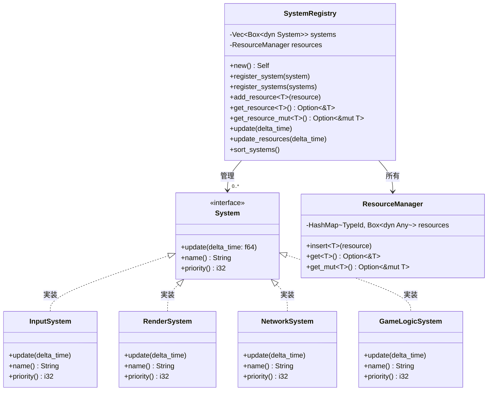
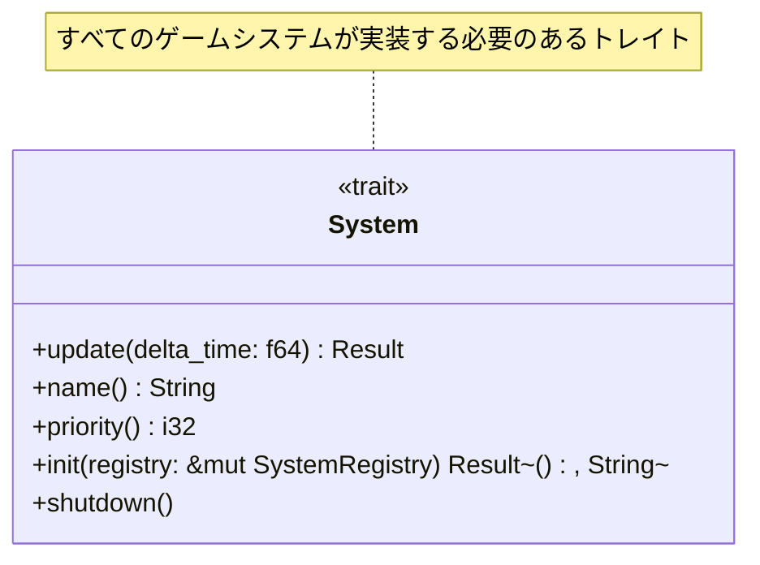
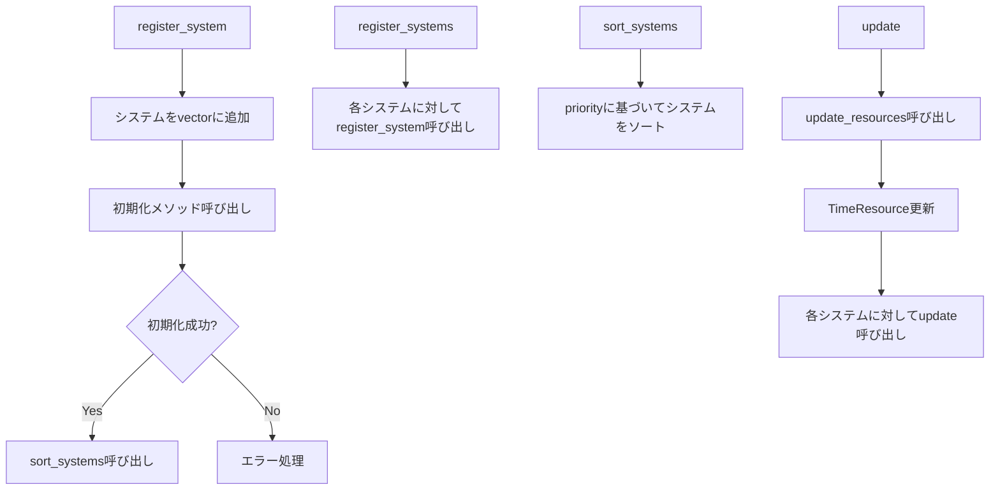
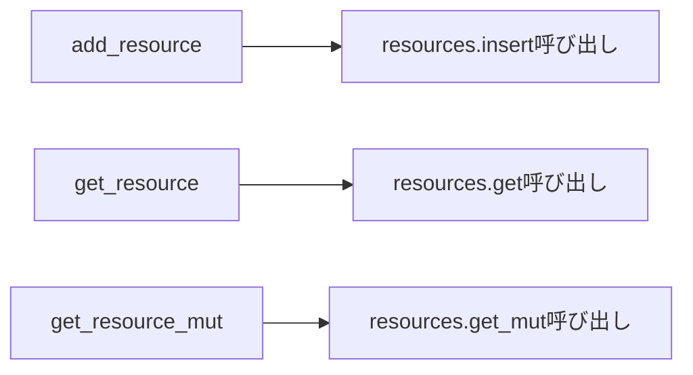
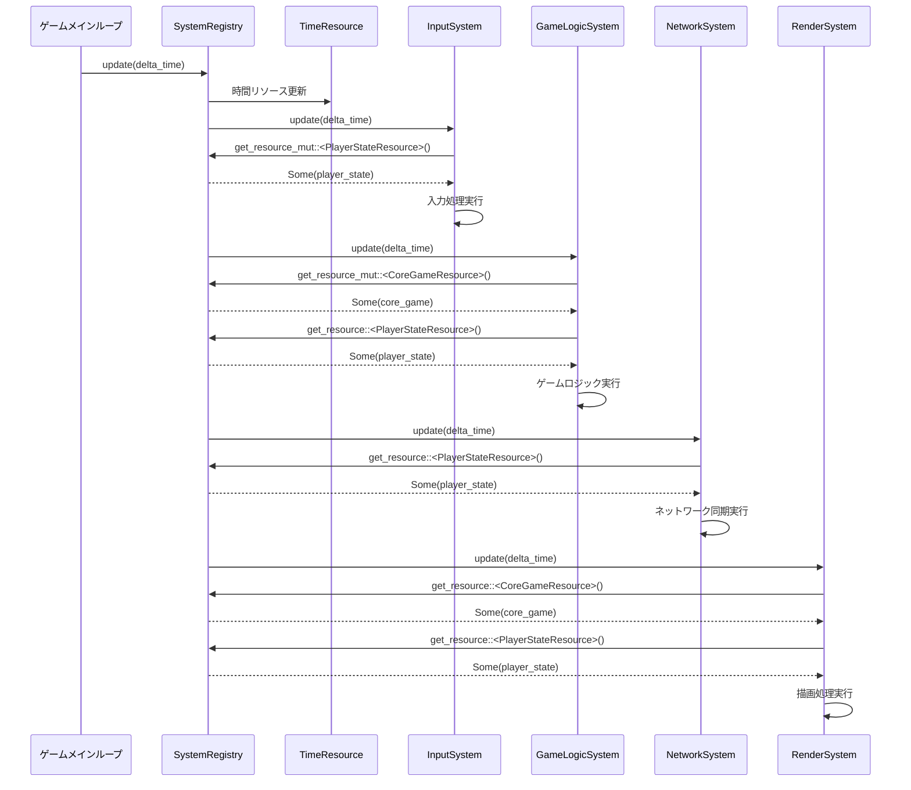
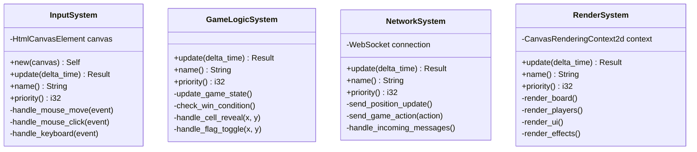
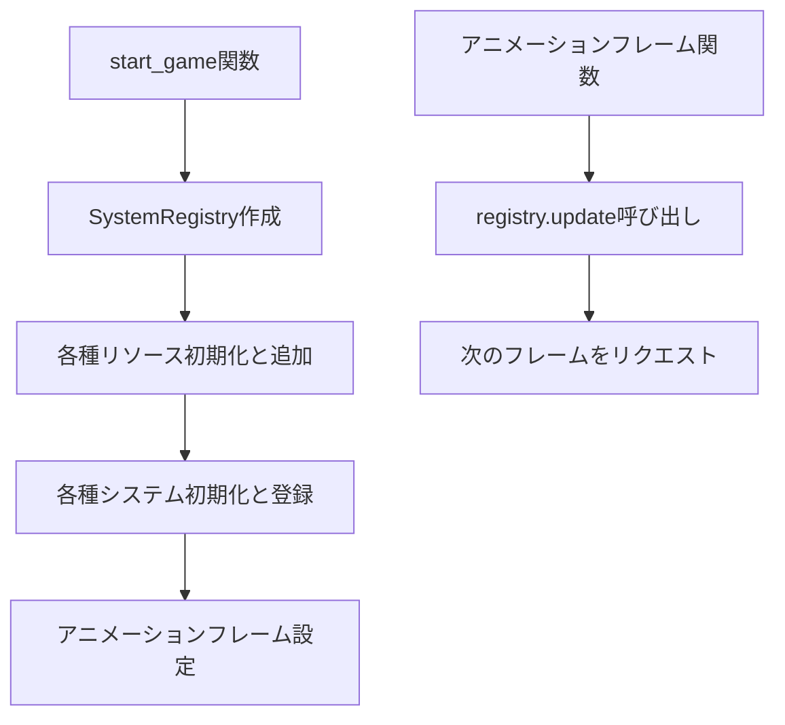

# SystemRegistryとの統合

## 概要
SystemRegistryは、ゲームシステムとリソースマネージャーを統合し、
ECSアーキテクチャの中心となるコンポーネントです。システムの登録、実行順序の管理、
そしてリソースアクセスの仲介を行います。

## クラス構造



## Systemインターフェース



## SystemRegistryの初期化

```mermaid
flowchart TD
    A[new] --> B[systems = Vec::new()]
    B --> C[resources = ResourceManager::new()]
    C --> D[SystemRegistry構造体初期化]
```

## システム登録と実行



## リソースアクセス委譲



## システム実行フロー



## 主要システムの実装計画



## 優先度ベースのシステム順序

```mermaid
flowchart LR
    A[InputSystem<br>priority=10] --> B[GameLogicSystem<br>priority=20]
    B --> C[NetworkSystem<br>priority=30]
    C --> D[RenderSystem<br>priority=40]
    
    note for A "入力処理は最も早く実行"
    note for B "入力に基づいてゲームロジックを実行"
    note for C "状態変更をネットワークで同期"
    note for D "最終的な状態を描画"
```

## SystemRegistryのファイル構造

```mermaid
classDiagram
    class src/ecs/mod.rs {
        pub mod system
        pub mod system_registry
        pub use system::System
        pub use system_registry::SystemRegistry
    }
    
    class src/ecs/system.rs {
        pub trait System { ... }
    }
    
    class src/ecs/system_registry.rs {
        pub struct SystemRegistry { ... }
        impl SystemRegistry { ... }
    }
    
    class src/systems/mod.rs {
        pub mod input_system
        pub mod game_logic_system
        pub mod network_system
        pub mod render_system
        pub use input_system::InputSystem
        pub use game_logic_system::GameLogicSystem
        pub use network_system::NetworkSystem
        pub use render_system::RenderSystem
    }
```

## ゲームメインループの統合



## 次のステップ

- 既存コードの移行計画
- 各システムの詳細実装
- リソースとシステムの連携テスト
- パフォーマンス検証 