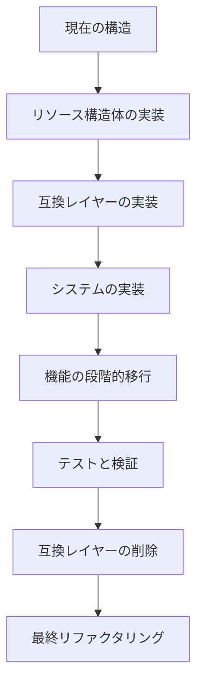
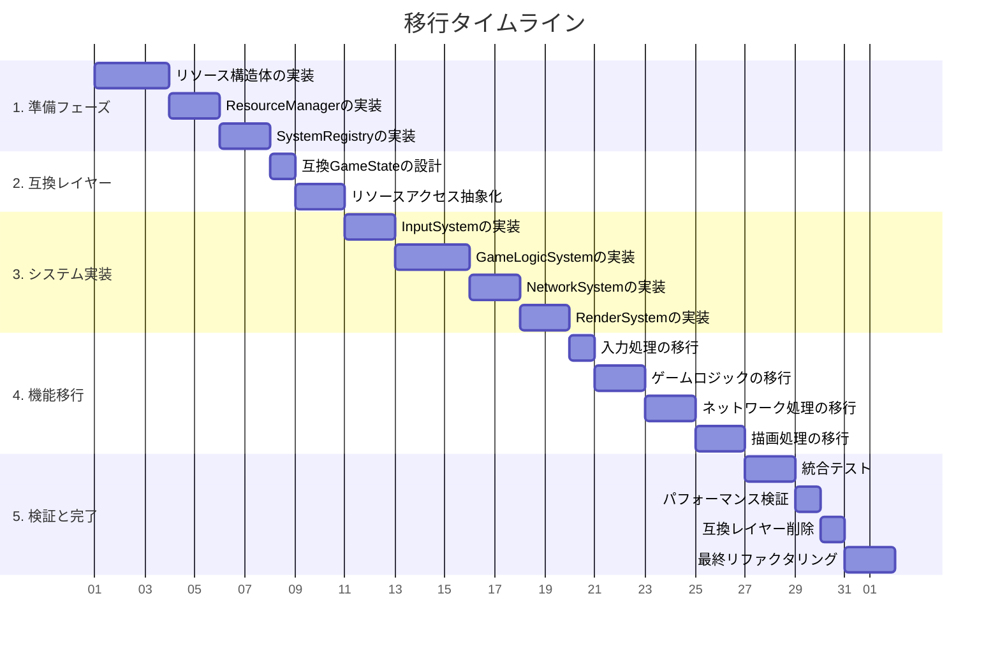
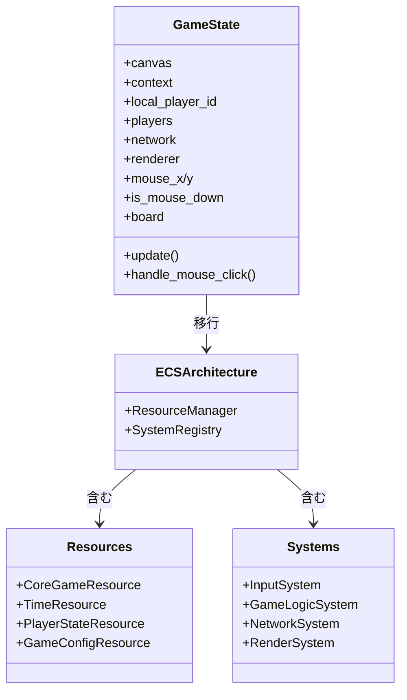
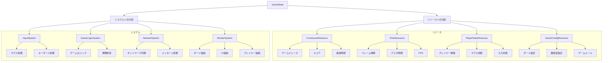
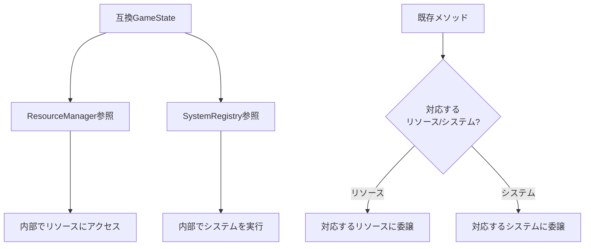
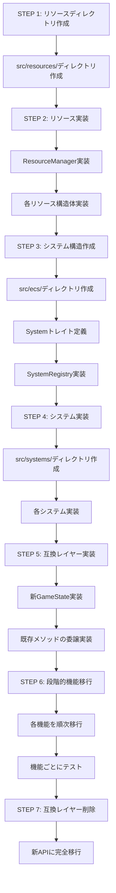
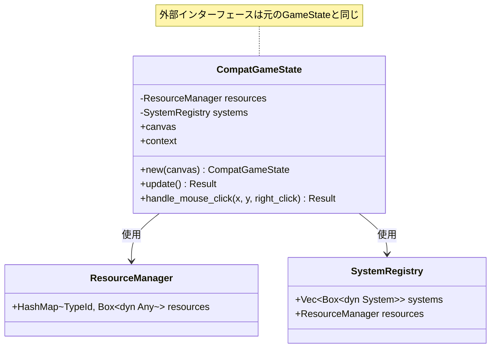
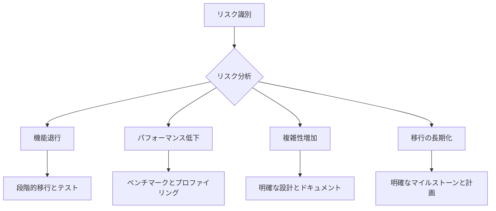

# 既存コードの移行計画

## 概要
既存の`GameState`からECSベースの新しいアーキテクチャへの段階的な移行計画を示します。
この計画では、機能を中断することなく、安全に移行するための方法を定義します。

## 移行の基本フロー



## 段階的アプローチ



## 現在のコード構造と移行先の対応



## GameStateの分割マッピング



## 互換レイヤーの実装



## ファイル構造の変更

```mermaid
classDiagram
    class 現在 {
        src/game_state.rs
        src/models.rs
        src/rendering.rs
        src/network.rs
        src/board.rs
        src/utils.rs
    }
    
    class 移行後 {
        src/ecs/
        src/resources/
        src/systems/
        src/entities/
        src/components/
        src/utils.rs
    }
    
    現在 --> 移行後 : リファクタリング
    
    class src/ecs {
        mod.rs
        system.rs
        system_registry.rs
    }
    
    class src/resources {
        mod.rs
        core_game.rs
        time.rs
        player_state.rs
        game_config.rs
        board_config.rs
        resource_manager.rs
    }
    
    class src/systems {
        mod.rs
        input_system.rs
        game_logic_system.rs
        network_system.rs
        render_system.rs
    }
    
    移行後 --> src/ecs
    移行後 --> src/resources
    移行後 --> src/systems
```

## 具体的な移行ステップ



## STEP 5: 互換レイヤー詳細設計



## リスク管理



## 次のステップ

- 各リソースとシステムの詳細実装
- テスト戦略の詳細化
- 段階的移行のマイルストーン設定 