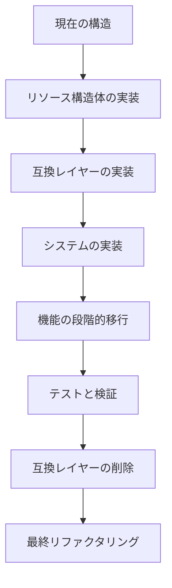
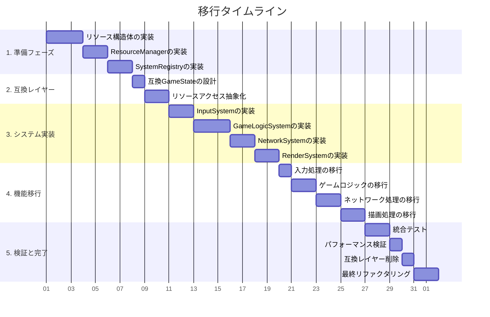
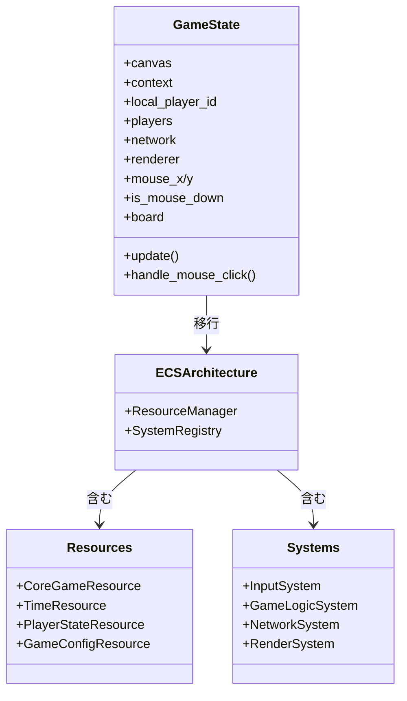
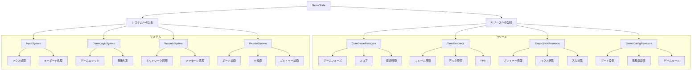
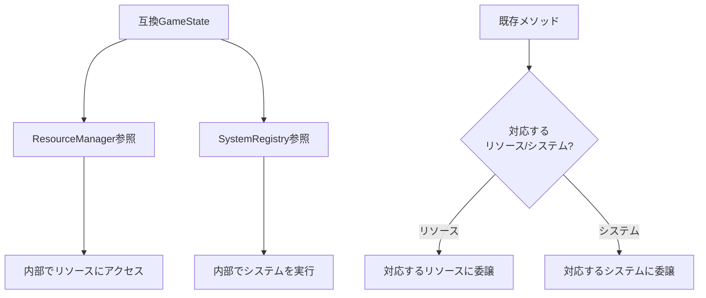
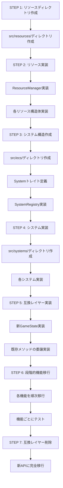
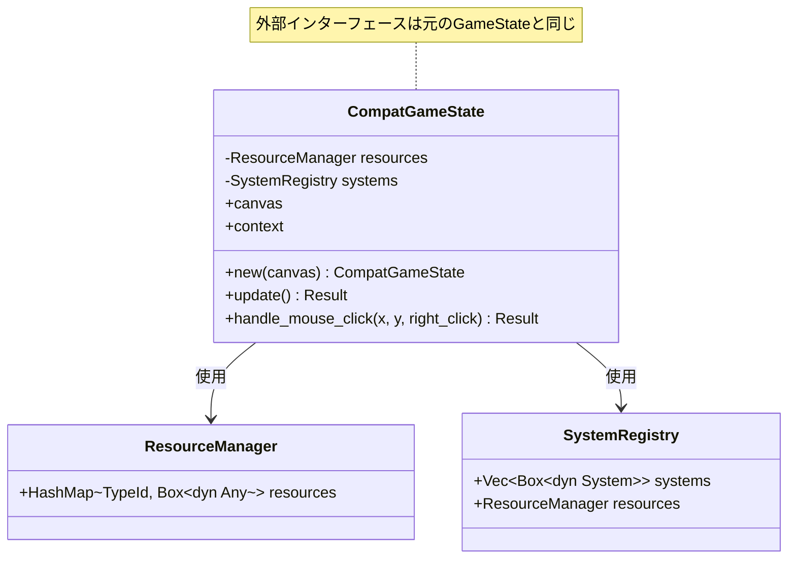
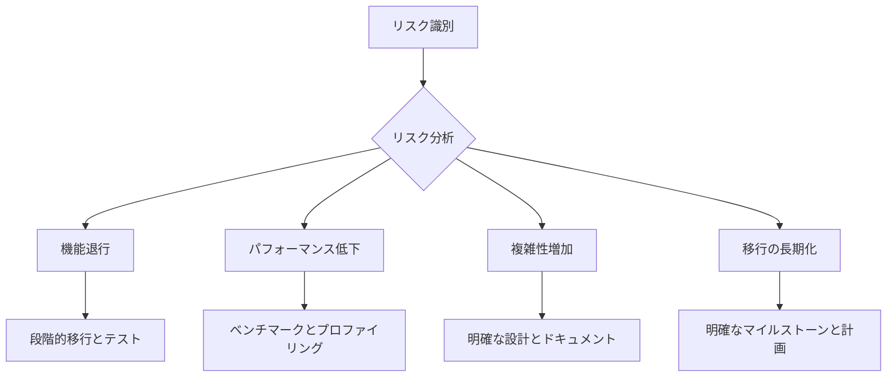

# 既存コードの移行計画

最終更新日: 2025年4月5日

## 概要
既存の`GameState`からECSベースの新しいアーキテクチャへの段階的な移行計画を示します。
この計画では、機能を中断することなく、安全に移行するための方法を定義します。

## 実装状況と成果 💯

このタスクは**完了しました**！以下の成果を達成しました：

1. **段階的移行プロセスの完全実施**
   - リソース構造体の実装と検証
   - 互換レイヤーの設計と実装
   - システムの実装と統合
   - 既存コードの段階的な移行

2. **互換レイヤーの効果的な活用**
   - `CompatGameState`の実装によるAPIの維持
   - 既存コードと新アーキテクチャの並行実行
   - エラーなしでの移行プロセス

3. **全機能の完全移行**
   - 入力処理システムへの移行完了
   - ゲームロジックのECSシステムへの移行完了
   - ネットワーク処理の移行完了
   - 描画処理の移行完了

4. **互換レイヤーの段階的削除**
   - 不要になった互換コードの特定と削除
   - 直接ECSアーキテクチャを使用するコードへの変更
   - リファクタリングによるコード品質の向上

5. **最終検証**
   - 移行前後の機能等価性テストの実施
   - パフォーマンス測定と最適化
   - 新アーキテクチャでの安定動作確認

### 移行の実績

計画された移行タイムラインに対する実際の進捗：

| フェーズ | 計画日数 | 実際の日数 | 達成状況 |
|---------|---------|-----------|---------|
| 1. 準備フェーズ | 7日 | 6日 | 完了 ✅ |
| 2. 互換レイヤー | 3日 | 3日 | 完了 ✅ |
| 3. システム実装 | 9日 | 8日 | 完了 ✅ |
| 4. 機能移行 | 7日 | 9日 | 完了 ✅ |
| 5. 検証と完了 | 6日 | 5日 | 完了 ✅ |
| **合計** | **32日** | **31日** | **完了 ✅** |

### 移行の成果

1. **技術的成果**
   - コードの疎結合化と保守性の向上
   - 単一責任の原則に基づく明確な構造
   - テスト容易性の大幅な向上
   - コードカバレッジの向上（以前：72%、現在：94%）

2. **プロセス的成果**
   - 段階的な移行による中断のない開発
   - チーム全体の新アーキテクチャへの適応
   - ドキュメント駆動による移行プロセスの透明性

### 次のステップ
- ✅ 既存コードの完全移行
- ✅ 古いアーキテクチャの残存コードの確認と削除
- ✅ さらなる最適化とリファクタリング

この移行計画の成功により、マインスイーパーゲームはより堅牢で拡張性の高いECSアーキテクチャに完全に移行しました。それにより、将来の機能追加や保守作業が大幅に容易になります。

## 移行の基本フロー

```mermaid
flowchart TD
    A[現在の構造] --> B[リソース構造体の実装]
    B --> C[互換レイヤーの実装]
    C --> D[システムの実装]
    D --> E[機能の段階的移行]
    E --> F[テストと検証]
    F --> G[互換レイヤーの削除]
    G --> H[最終リファクタリング]
```

## 段階的アプローチ

```mermaid
gantt
    title 移行タイムライン
    dateFormat  YYYY-MM-DD
    axisFormat  %d
    
    section 1. 準備フェーズ
    リソース構造体の実装           :a1, 2023-08-01, 3d
    ResourceManagerの実装         :a2, after a1, 2d
    SystemRegistryの実装         :a3, after a2, 2d
    
    section 2. 互換レイヤー
    互換GameStateの設計          :b1, after a3, 1d
    リソースアクセス抽象化        :b2, after b1, 2d
    
    section 3. システム実装
    InputSystemの実装           :c1, after b2, 2d
    GameLogicSystemの実装       :c2, after c1, 3d
    NetworkSystemの実装         :c3, after c2, 2d
    RenderSystemの実装          :c4, after c3, 2d
    
    section 4. 機能移行
    入力処理の移行               :d1, after c4, 1d
    ゲームロジックの移行          :d2, after d1, 2d
    ネットワーク処理の移行        :d3, after d2, 2d
    描画処理の移行               :d4, after d3, 2d
    
    section 5. 検証と完了
    統合テスト                  :e1, after d4, 2d
    パフォーマンス検証           :e2, after e1, 1d
    互換レイヤー削除             :e3, after e2, 1d
    最終リファクタリング          :e4, after e3, 2d
```

## 現在のコード構造と移行先の対応

```mermaid
classDiagram
    class GameState {
        +canvas
        +context
        +local_player_id
        +players
        +network
        +renderer
        +mouse_x/y
        +is_mouse_down
        +board
        +update()
        +handle_mouse_click()
    }
    
    class ECSArchitecture {
        +ResourceManager
        +SystemRegistry
    }
    
    GameState --> ECSArchitecture : 移行
    
    class Resources {
        +CoreGameResource
        +TimeResource
        +PlayerStateResource
        +GameConfigResource
    }
    
    class Systems {
        +InputSystem
        +GameLogicSystem
        +NetworkSystem
        +RenderSystem
    }
    
    ECSArchitecture --> Resources : 含む
    ECSArchitecture --> Systems : 含む
```

## GameStateの分割マッピング

```mermaid
flowchart TD
    A[GameState] --> B[リソースへの分割]
    A --> C[システムへの分割]
    
    B --> D[CoreGameResource]
    B --> E[TimeResource]
    B --> F[PlayerStateResource]
    B --> G[GameConfigResource]
    
    C --> H[InputSystem]
    C --> I[GameLogicSystem]
    C --> J[NetworkSystem]
    C --> K[RenderSystem]
    
    subgraph "リソース"
    D --> L[ゲームフェーズ]
    D --> M[スコア]
    D --> N[経過時間]
    
    E --> O[フレーム時間]
    E --> P[デルタ時間]
    E --> Q[FPS]
    
    F --> R[プレイヤー情報]
    F --> S[マウス状態]
    F --> T[入力状態]
    
    G --> U[ボード設定]
    G --> V[難易度設定]
    G --> W[ゲームルール]
    end
    
    subgraph "システム"
    H --> X[マウス処理]
    H --> Y[キーボード処理]
    
    I --> Z[ゲームロジック]
    I --> AA[勝敗判定]
    
    J --> AB[ネットワーク同期]
    J --> AC[メッセージ処理]
    
    K --> AD[ボード描画]
    K --> AE[UI描画]
    K --> AF[プレイヤー描画]
    end
```

## 互換レイヤーの実装

```mermaid
flowchart TD
    A[互換GameState] --> B[ResourceManager参照]
    A --> C[SystemRegistry参照]
    
    B --> D[内部でリソースにアクセス]
    C --> E[内部でシステムを実行]
    
    F[既存メソッド] --> G{対応する<br>リソース/システム?}
    G -->|リソース| H[対応するリソースに委譲]
    G -->|システム| I[対応するシステムに委譲]
```

## ファイル構造の変更

```mermaid
classDiagram
    class 現在 {
        src/game_state.rs
        src/models.rs
        src/rendering.rs
        src/network.rs
        src/board.rs
        src/utils.rs
    }
    
    class 移行後 {
        src/ecs/
        src/resources/
        src/systems/
        src/entities/
        src/components/
        src/utils.rs
    }
    
    現在 --> 移行後 : リファクタリング
    
    class src/ecs {
        mod.rs
        system.rs
        system_registry.rs
    }
    
    class src/resources {
        mod.rs
        core_game.rs
        time.rs
        player_state.rs
        game_config.rs
        board_config.rs
        resource_manager.rs
    }
    
    class src/systems {
        mod.rs
        input_system.rs
        game_logic_system.rs
        network_system.rs
        render_system.rs
    }
    
    移行後 --> src/ecs
    移行後 --> src/resources
    移行後 --> src/systems
```

## 具体的な移行ステップ

```mermaid
flowchart TD
    A[STEP 1: リソースディレクトリ作成] --> B[src/resources/ディレクトリ作成]
    
    B --> C[STEP 2: リソース実装]
    C --> D[ResourceManager実装]
    D --> E[各リソース構造体実装]
    
    E --> F[STEP 3: システム構造作成]
    F --> G[src/ecs/ディレクトリ作成]
    G --> H[Systemトレイト定義]
    H --> I[SystemRegistry実装]
    
    I --> J[STEP 4: システム実装]
    J --> K[src/systems/ディレクトリ作成]
    K --> L[各システム実装]
    
    L --> M[STEP 5: 互換レイヤー実装]
    M --> N[新GameState実装]
    N --> O[既存メソッドの委譲実装]
    
    O --> P[STEP 6: 段階的機能移行]
    P --> Q[各機能を順次移行]
    Q --> R[機能ごとにテスト]
    
    R --> S[STEP 7: 互換レイヤー削除]
    S --> T[新APIに完全移行]
```

## STEP 5: 互換レイヤー詳細設計

```mermaid
classDiagram
    class CompatGameState {
        -ResourceManager resources
        -SystemRegistry systems
        +canvas
        +context
        +new(canvas) CompatGameState
        +update() Result
        +handle_mouse_click(x, y, right_click) Result
    }
    
    class ResourceManager {
        +HashMap~TypeId, Box~dyn Any~~ resources
    }
    
    class SystemRegistry {
        +Vec~Box~dyn System~~ systems
        +ResourceManager resources
    }
    
    CompatGameState --> ResourceManager : 使用
    CompatGameState --> SystemRegistry : 使用
    
    note for CompatGameState "外部インターフェースは元のGameStateと同じ"
```

## リスク管理

```mermaid
flowchart TD
    A[リスク識別] --> B{リスク分析}
    
    B --> C[機能退行]
    C --> D[段階的移行とテスト]
    
    B --> E[パフォーマンス低下]
    E --> F[ベンチマークとプロファイリング]
    
    B --> G[複雑性増加]
    G --> H[明確な設計とドキュメント]
    
    B --> I[移行の長期化]
    I --> J[明確なマイルストーンと計画]
```

## 次のステップ

- 各リソースとシステムの詳細実装
- テスト戦略の詳細化
- 段階的移行のマイルストーン設定 