# テスト戦略と計画

## 概要
ECSへの移行を確実に行うためのテスト戦略と計画を示します。
この計画では、移行中の品質確保とリスク軽減のための体系的なアプローチを定義します。

## テストの種類と範囲

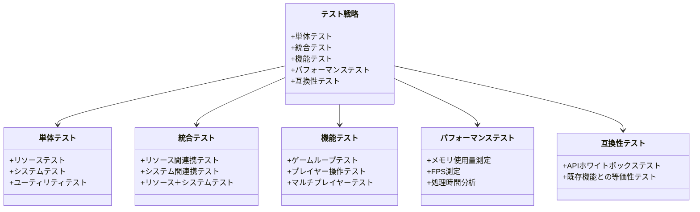

## テスト実施計画

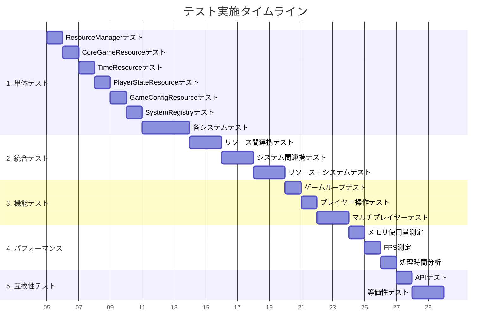

## 単体テスト戦略

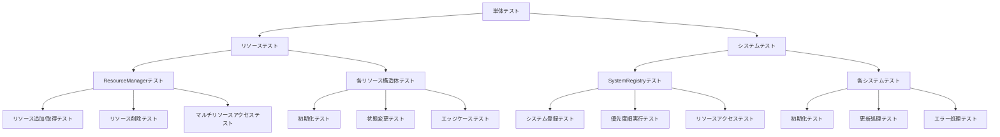

## テストケース例: CoreGameResource

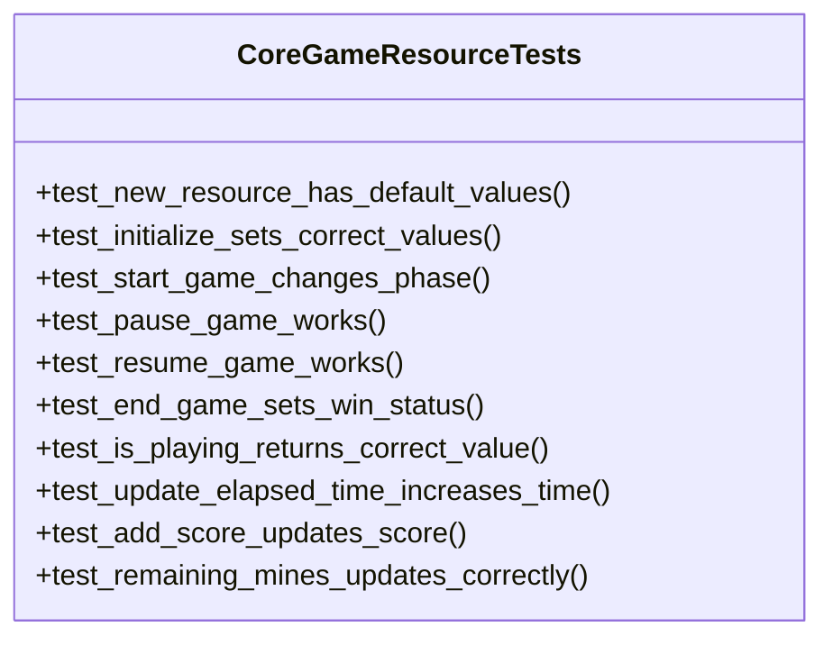

## テストケース例: SystemRegistry

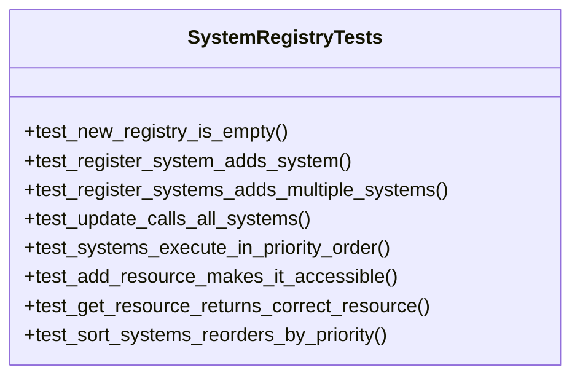

## 統合テスト戦略

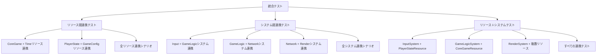

## 機能テスト戦略

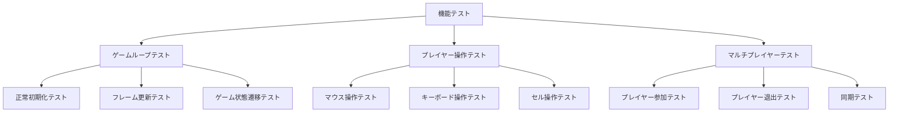

## パフォーマンステスト戦略

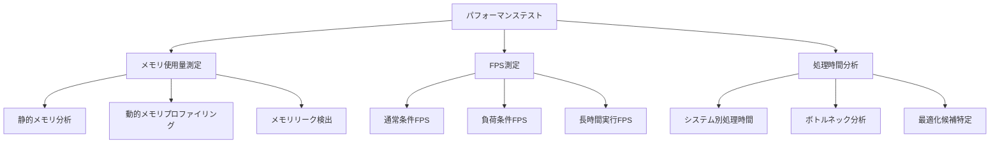

## 互換性テスト戦略

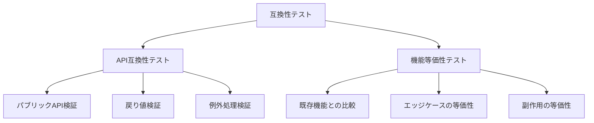

## テスト自動化

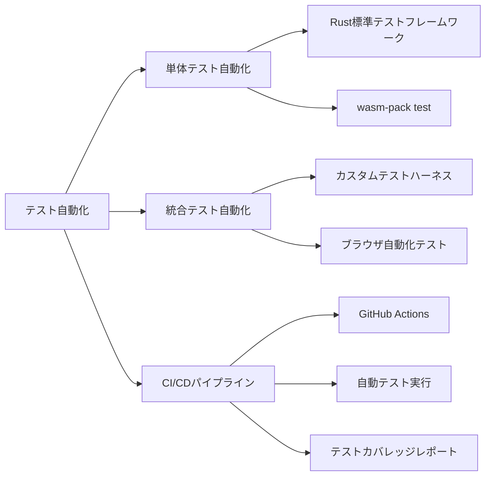

## リグレッションテスト戦略

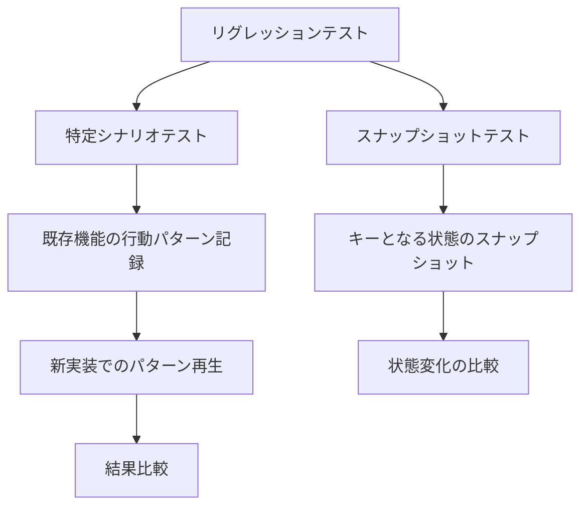

## テスト成功の定義

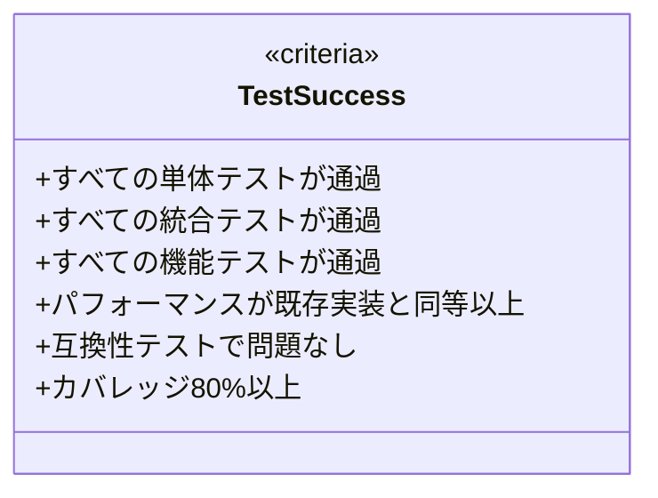

## レポート戦略

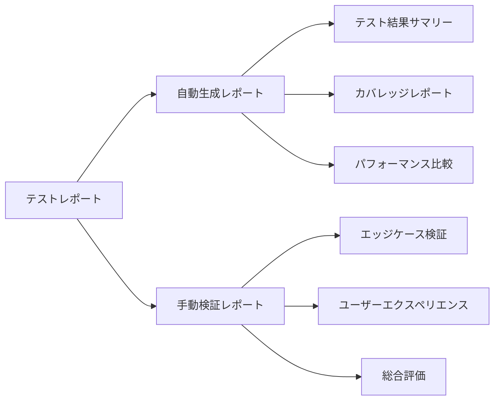

## 次のステップ

- テストケースの詳細設計
- 自動テストスクリプトの作成
- CI/CDパイプラインの構築
- テスト環境のセットアップ 