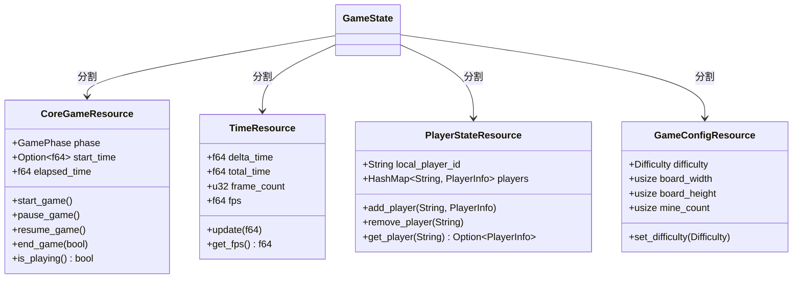
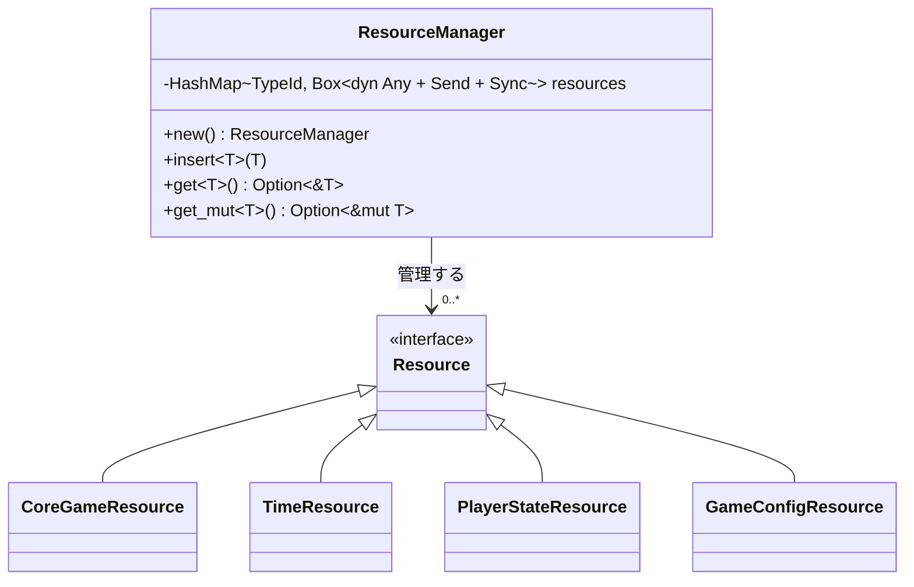
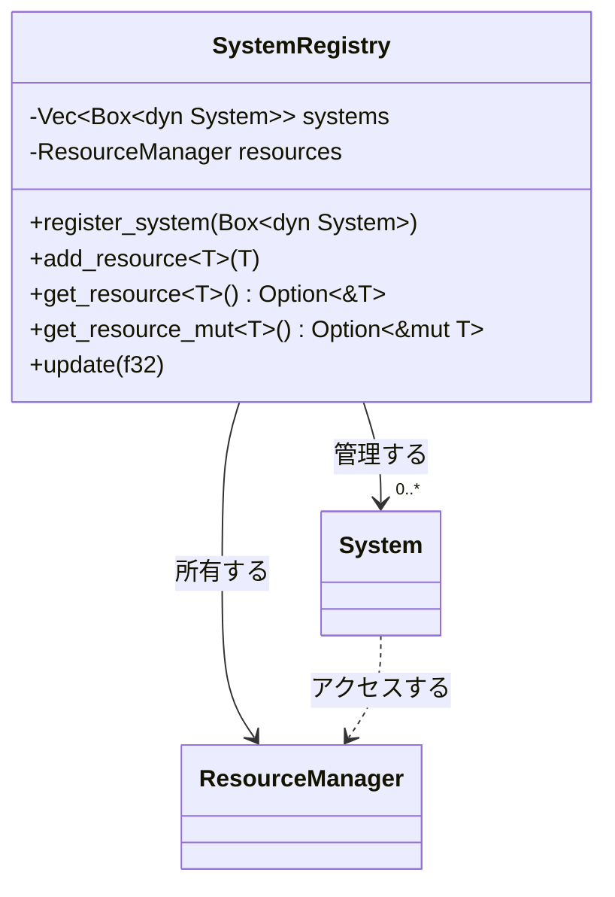

# ゲーム状態をECSリソースへ変換

## 概要

現在のゲーム状態管理はグローバルな`game_state.rs`に集中しており、これをECSパターンのリソースとして再設計します。
ゲーム状態をより細かく分割することで、関心の分離を促進し、各システムが必要なリソースだけにアクセスできるようにします。

## 現状の問題点

1. `game_state.rs`がゲームの多くの側面を一つのクラスで管理している
2. グローバルな状態へのアクセスがシステム間の依存関係を不明確にしている
3. 拡張性が限られており、新機能追加時に修正が広範囲に及ぶ

## 実装計画

### 1. リソースの設計と分割

現在の`GameState`を以下のリソースに分割します：

### 2. リソースマネージャーの実装

リソースマネージャーは、型安全な方法でリソースの格納と取得を行うためのコンテナを提供します。

**主な機能**：
- リソースの追加と取得
- 型情報に基づいたリソースの管理
- 不変参照と可変参照の提供

### 3. 各リソースの実装

#### CoreGameResourceの主な機能
- ゲームフェーズの管理（準備中、プレイ中、一時停止、ゲームオーバー）
- ゲーム開始時間と経過時間の追跡
- ゲーム状態の変更メソッド（開始、一時停止、再開、終了）

#### TimeResourceの主な機能
- フレーム間のデルタ時間管理
- 総経過時間の追跡
- FPS計算と監視
- パフォーマンス統計

#### PlayerStateResourceの主な機能
- ローカルプレイヤーと他プレイヤーの情報管理
- プレイヤーの追加・削除
- プレイヤー状態の更新（接続状態、得点など）

#### GameConfigResourceの主な機能
- 難易度設定
- ボードサイズの設定
- 地雷数の管理
- ゲームルールの設定

### 4. SystemRegistryとの統合

`SystemRegistry`にリソースマネージャーを統合し、システムがリソースにアクセスできるようにします。

### 5. 既存コードの移行ステップ

1. 新しいリソース構造体を`src/resources/`下に実装
2. 現在の`game_state.rs`の機能を対応するリソースに移行
3. 既存システムを更新して新しいリソースを使用するように変更
4. グローバルな状態参照を排除

### 6. テスト計画

1. 各リソースの単体テスト
2. リソースマネージャーの機能テスト
3. システムからリソースにアクセスするインテグレーションテスト
4. 状態遷移のテスト
5. 元の機能と同等の結果が得られることを確認

## 期待される効果

1. 関心の分離によるコードの可読性向上
2. システム間の依存関係の明確化
3. 単一責任の原則に沿った設計
4. 拡張性の向上（新しい状態やリソースを容易に追加可能）
5. テスト容易性の向上

## リスクと対策

1. **リスク**: 既存コードに広範囲な変更が必要
   **対策**: 段階的に移行し、各ステップで動作確認

2. **リスク**: パフォーマンスへの影響
   **対策**: リソースアクセスのベンチマークを取り、最適化

3. **リスク**: 移行中の機能停止
   **対策**: 一時的な互換層を設けて段階的に移行

## タイムライン

1. リソース構造体の設計と実装: 1日
2. リソースマネージャーの実装: 1日
3. 既存コードの移行: 2日
4. テストとデバッグ: 1日
5. 最終調整とドキュメント更新: 0.5日

**合計推定時間**: 5.5日 