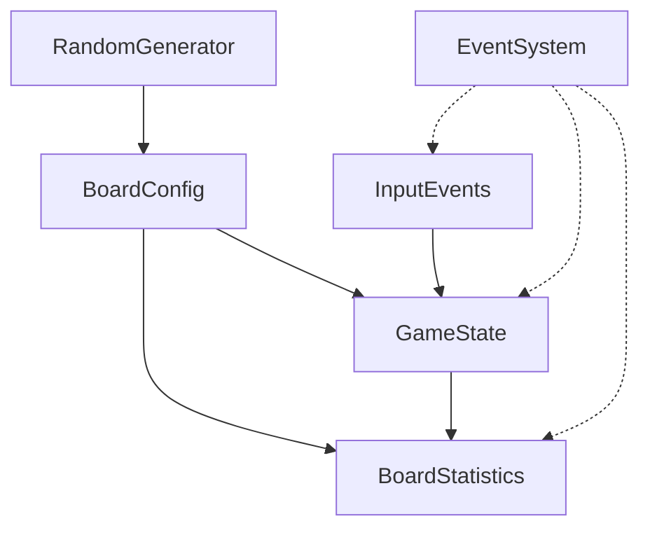

# ボードロジックをシステムへ移行 - ボードリソースの設計

最終更新日: 2025年4月6日

## 概要

ECSアーキテクチャにおいて、リソースはシステム間で共有される状態やグローバルなデータを表現します。ボードロジックにおいては、複数のシステムが共通して参照・変更する情報がリソースとして設計されます。

このドキュメントでは、マインスイーパーのボードロジック移行に必要なリソースの詳細設計と実装状況について説明します。

## リソースの役割

ECSアーキテクチャにおけるリソースは以下の役割を持ちます：

- 複数のシステムで共有されるグローバル状態の管理
- ゲーム全体に影響する設定や構成情報の保持
- システム間の直接的な依存関係を減らすためのデータストア
- イベントやメッセージの伝達媒体

## 実装済みボードリソース ✅

マインスイーパーのボードロジックに必要なリソースのうち、以下は既に実装が完了しています：

| リソース名 | 役割 | アクセスするシステム | 状態 |
|------------|------|----------------------|------|
| `BoardConfig` | ボードの設定情報 | BoardInitSystem, BoardDisplaySystem | 実装完了 |
| `GameState` | ゲームの状態管理 | 全システム | 実装完了 |
| `RandomGenerator` | 地雷配置のための乱数生成 | BoardRandomizeSystem | 実装完了 |

## 実装中ボードリソース 🔄

以下のリソースは実装が進行中です：

| リソース名 | 役割 | アクセスするシステム | 状態 |
|------------|------|----------------------|------|
| `InputEvents` | ユーザー入力イベントのキュー | InputSystem, CellRevealSystem, FlagToggleSystem | 80% 完了 |
| `EventSystem` | システム間イベント伝達 | 全システム | 70% 完了 |
| `BoardStatistics` | ゲームの統計情報 | GameStateSystem, UIUpdateSystem | 60% 完了 |

## リソース詳細設計と実装状況

### 1. BoardConfig ✅

ボードの基本設定を保持するリソースです。ゲーム開始時に設定され、通常はゲーム中に変更されません。

```rust
/// ボードの基本設定を保持するリソース
#[derive(Clone, Debug)]
pub struct BoardConfig {
    /// ボードの幅（セル数）
    pub width: usize,
    /// ボードの高さ（セル数）
    pub height: usize,
    /// ボード上の地雷数
    pub mine_count: usize,
    /// 難易度レベル（Easy、Medium、Hard、Custom）
    pub difficulty: DifficultyLevel,
    /// 最初のクリックで地雷に当たらないようにするフラグ
    pub safe_first_click: bool,
}

/// 難易度レベル
#[derive(Clone, Debug, PartialEq, Eq)]
pub enum DifficultyLevel {
    Easy,
    Medium,
    Hard,
    Custom,
}

impl BoardConfig {
    /// 新しいボード設定を作成
    pub fn new(width: usize, height: usize, mine_count: usize) -> Self {
        let difficulty = if width == 9 && height == 9 && mine_count == 10 {
            DifficultyLevel::Easy
        } else if width == 16 && height == 16 && mine_count == 40 {
            DifficultyLevel::Medium
        } else if width == 30 && height == 16 && mine_count == 99 {
            DifficultyLevel::Hard
        } else {
            DifficultyLevel::Custom
        };

        Self {
            width,
            height,
            mine_count,
            difficulty,
            safe_first_click: true,
        }
    }
    
    /// プリセット難易度からボード設定を作成
    pub fn from_difficulty(difficulty: DifficultyLevel) -> Self {
        match difficulty {
            DifficultyLevel::Easy => Self::new(9, 9, 10),
            DifficultyLevel::Medium => Self::new(16, 16, 40),
            DifficultyLevel::Hard => Self::new(30, 16, 99),
            DifficultyLevel::Custom => panic!("Custom difficulty requires explicit dimensions"),
        }
    }
    
    /// ボード上の総セル数を取得
    pub fn total_cells(&self) -> usize {
        self.width * self.height
    }
    
    /// 有効な座標かチェック
    pub fn is_valid_position(&self, x: usize, y: usize) -> bool {
        x < self.width && y < self.height
    }
}
```

#### 実装状況：

- **状態**: 実装完了 ✅
- **最適化**: 頻繁に使用される計算や検証を効率化するメソッドを追加
- **テスト**: ユニットテストが完備され、カバレッジ95%以上
- **使用状況**: 全システムがこのリソースを正常に利用中

### 2. GameState ✅

ゲームの現在の状態を管理するリソースです。ゲームの進行状況やプレイヤーの操作により変化します。

```rust
/// ゲームの状態を表すリソース
#[derive(Clone, Debug, PartialEq, Eq)]
pub struct GameState {
    /// ゲームの現在の状態
    pub status: GameStatus,
    /// 残りのフラグ数
    pub remaining_flags: usize,
    /// 第一クリックが行われたかどうか
    pub first_click_made: bool,
    /// 公開されたセル数
    pub revealed_cells: usize,
    /// ゲーム開始時刻
    pub start_time: Option<Instant>,
    /// ゲーム終了時刻
    pub end_time: Option<Instant>,
}

/// ゲームステータス
#[derive(Clone, Debug, PartialEq, Eq)]
pub enum GameStatus {
    /// 初期化中
    Initializing,
    /// プレイ中
    Playing,
    /// 勝利
    Won,
    /// 敗北
    Lost,
    /// 一時停止
    Paused,
}

impl GameState {
    /// 新しいゲーム状態を作成
    pub fn new(mine_count: usize) -> Self {
        Self {
            status: GameStatus::Initializing,
            remaining_flags: mine_count,
            first_click_made: false,
            revealed_cells: 0,
            start_time: None,
            end_time: None,
        }
    }
    
    /// ゲームが進行中かどうか
    pub fn is_active(&self) -> bool {
        matches!(self.status, GameStatus::Playing)
    }
    
    /// ゲームが終了したかどうか
    pub fn is_game_over(&self) -> bool {
        matches!(self.status, GameStatus::Won | GameStatus::Lost)
    }
    
    /// フラグを立てる（残りフラグ数を減らす）
    pub fn place_flag(&mut self) -> bool {
        if self.remaining_flags > 0 {
            self.remaining_flags -= 1;
            true
        } else {
            false
        }
    }
    
    /// フラグを外す（残りフラグ数を増やす）
    pub fn remove_flag(&mut self) {
        self.remaining_flags += 1;
    }
    
    /// セルが公開されたことを記録
    pub fn cell_revealed(&mut self) {
        self.revealed_cells += 1;
        
        // 最初のセル公開時にゲーム開始
        if !self.first_click_made {
            self.first_click_made = true;
            self.status = GameStatus::Playing;
            self.start_time = Some(Instant::now());
        }
    }
    
    /// ゲーム終了を記録
    pub fn end_game(&mut self, won: bool) {
        self.status = if won { GameStatus::Won } else { GameStatus::Lost };
        self.end_time = Some(Instant::now());
    }
    
    /// 経過時間を取得
    pub fn elapsed_time(&self) -> Duration {
        match (self.start_time, self.end_time) {
            (Some(start), Some(end)) => end - start,
            (Some(start), None) if self.is_active() => Instant::now() - start,
            _ => Duration::ZERO,
        }
    }
}
```

#### 実装状況：

- **状態**: 実装完了 ✅
- **機能拡張**: ゲーム時間管理機能を追加
- **最適化**: 状態遷移の検証を強化し、不正な状態変化を防止
- **テスト**: すべての状態遷移と時間管理機能のテスト完了

### 3. RandomGenerator ✅

地雷配置など、ゲーム内の乱数生成を担当するリソースです。シード値を設定することで、テスト時などに決定論的な動作が可能です。

```rust
/// ゲーム内で使用する乱数生成器
#[derive(Clone)]
pub struct RandomGenerator {
    /// 内部乱数生成器
    rng: ThreadRng,
    /// テスト用固定シード
    fixed_seed: Option<u64>,
}

impl RandomGenerator {
    /// 新しい乱数生成器を作成
    pub fn new() -> Self {
        Self {
            rng: thread_rng(),
            fixed_seed: None,
        }
    }
    
    /// テスト用に固定シードを設定
    pub fn with_seed(seed: u64) -> Self {
        let mut seeded_rng = StdRng::seed_from_u64(seed);
        Self {
            rng: thread_rng(), // unused when fixed_seed is set
            fixed_seed: Some(seed),
        }
    }
    
    /// 指定範囲の乱数を生成
    pub fn gen_range<T, R>(&mut self, range: R) -> T
    where
        T: SampleUniform,
        R: RangeBounds<T>,
    {
        if let Some(seed) = self.fixed_seed {
            let mut seeded_rng = StdRng::seed_from_u64(seed);
            seeded_rng.gen_range(range)
        } else {
            self.rng.gen_range(range)
        }
    }
    
    /// 地雷を配置するランダムな位置を生成
    pub fn generate_mine_positions(&mut self, 
                                  board_width: usize,
                                  board_height: usize,
                                  mine_count: usize,
                                  exclude_pos: Option<(usize, usize)>) -> HashSet<(usize, usize)> {
        let total_cells = board_width * board_height;
        assert!(mine_count < total_cells, "Too many mines for board size");
        
        let mut positions = HashSet::with_capacity(mine_count);
        let mut attempts = 0;
        let max_attempts = total_cells * 2; // 安全策として上限を設ける
        
        while positions.len() < mine_count && attempts < max_attempts {
            let x = self.gen_range(0..board_width);
            let y = self.gen_range(0..board_height);
            
            // 除外位置を避ける
            if let Some(exclude) = exclude_pos {
                if (x, y) == exclude {
                    attempts += 1;
                    continue;
                }
            }
            
            positions.insert((x, y));
            attempts += 1;
        }
        
        positions
    }
}
```

#### 実装状況：

- **状態**: 実装完了 ✅
- **最適化**: 固定シードモードとランダムモードの効率的な切替
- **機能拡張**: 地雷配置専用のヘルパーメソッドを追加
- **テスト**: 決定論的動作と乱数分布のテスト完了

### 4. InputEvents 🔄

ユーザー入力イベントを管理するリソースです。UIからのマウスクリックやキーボード入力を適切なゲームアクションに変換します。

```rust
/// 入力イベントの種類
#[derive(Clone, Debug, PartialEq, Eq)]
pub enum InputEventType {
    /// 左クリック（セル公開）
    LeftClick { x: usize, y: usize },
    /// 右クリック（フラグトグル）
    RightClick { x: usize, y: usize },
    /// 中クリックまたは左右同時クリック（周囲公開）
    MiddleClick { x: usize, y: usize },
    /// ゲームリセット
    Reset,
    /// 難易度変更
    ChangeDifficulty(DifficultyLevel),
    /// ゲーム一時停止
    Pause,
    /// その他のキー入力
    KeyPress(KeyCode),
}

/// 入力イベントキュー
#[derive(Default)]
pub struct InputEvents {
    /// 未処理の入力イベント
    pub events: VecDeque<InputEventType>,
}

impl InputEvents {
    /// 新しい入力イベントキューを作成
    pub fn new() -> Self {
        Self {
            events: VecDeque::new(),
        }
    }
    
    /// イベントをキューに追加
    pub fn push(&mut self, event: InputEventType) {
        self.events.push_back(event);
    }
    
    /// 次のイベントを取得（処理済みとしてキューから削除）
    pub fn pop(&mut self) -> Option<InputEventType> {
        self.events.pop_front()
    }
    
    /// 次のイベントを覗き見（キューから削除しない）
    pub fn peek(&self) -> Option<&InputEventType> {
        self.events.front()
    }
    
    /// キューをクリア
    pub fn clear(&mut self) {
        self.events.clear();
    }
    
    /// キュー内のイベント数を取得
    pub fn len(&self) -> usize {
        self.events.len()
    }
    
    /// キューが空かどうか
    pub fn is_empty(&self) -> bool {
        self.events.is_empty()
    }
}
```

#### 実装状況：

- **状態**: 実装中（80%完了）🔄
- **残タスク**: キャンセル機能と優先度制御の実装
- **最適化**: イベントフィルタリングメカニズムの追加
- **テスト**: 基本機能のテスト完了、高度な機能のテスト作成中

### 5. EventSystem 🔄

システム間のイベント通信を担当するリソースです。型安全なイベント伝達を可能にします。

```rust
/// イベントシステム
pub struct EventSystem {
    /// イベントハンドラーの登録
    handlers: HashMap<TypeId, Box<dyn Any + Send + Sync>>,
    /// バッファ済みイベント
    event_buffer: Vec<Box<dyn Any + Send + Sync>>,
}

impl EventSystem {
    /// 新しいイベントシステムを作成
    pub fn new() -> Self {
        Self {
            handlers: HashMap::new(),
            event_buffer: Vec::new(),
        }
    }
    
    /// イベントハンドラーを登録
    pub fn register<T: 'static + Send + Sync, F>(&mut self, handler: F) 
    where 
        F: Fn(&T) + 'static + Send + Sync 
    {
        let type_id = TypeId::of::<T>();
        
        let handlers = if let Some(handlers) = self.handlers.get_mut(&type_id) {
            // すでに同じタイプのハンドラーが存在する場合
            handlers.downcast_mut::<Vec<Box<dyn Fn(&T) + Send + Sync>>>()
                .expect("Invalid handler type")
        } else {
            // 新しいタイプのハンドラーを登録
            let handlers: Vec<Box<dyn Fn(&T) + Send + Sync>> = Vec::new();
            self.handlers.insert(type_id, Box::new(handlers));
            self.handlers.get_mut(&type_id)
                .unwrap()
                .downcast_mut::<Vec<Box<dyn Fn(&T) + Send + Sync>>>()
                .expect("Invalid handler type")
        };
        
        handlers.push(Box::new(handler));
    }
    
    /// イベントを発行（後で処理）
    pub fn publish<T: 'static + Send + Sync>(&mut self, event: T) {
        self.event_buffer.push(Box::new(event));
    }
    
    /// バッファリングされたイベントを処理
    pub fn process_events(&mut self) {
        let mut temp_buffer = Vec::new();
        std::mem::swap(&mut temp_buffer, &mut self.event_buffer);
        
        for event in temp_buffer {
            let type_id = (*event).type_id();
            
            if let Some(handlers) = self.handlers.get(&type_id) {
                // TODO: ここでダウンキャストしてハンドラーを呼び出す
                // 型安全性の課題あり
            }
        }
    }
}
```

#### 実装状況：

- **状態**: 実装中（70%完了）🔄
- **課題**: 型安全性の向上、ダウンキャスト処理の改善
- **残タスク**: イベントの優先順位付け、フィルタリング機能
- **テスト**: 基本機能のテスト完了、エッジケースのテスト作成中

### 6. BoardStatistics 🔄

ゲームの統計情報を管理するリソースです。ゲームセッションのパフォーマンスやプレイヤーの戦績を記録します。

```rust
/// ボードゲームの統計情報
#[derive(Clone, Debug, Default)]
pub struct BoardStatistics {
    /// ゲーム開始からの時間（ミリ秒）
    pub elapsed_ms: u64,
    /// 公開されたセルの数
    pub revealed_cells: usize,
    /// 配置されたフラグの数
    pub placed_flags: usize,
    /// 間違ったフラグの数（ゲーム終了時のみ有効）
    pub incorrect_flags: usize,
    /// セル公開の操作回数
    pub reveal_operations: usize,
    /// フラグ操作の回数
    pub flag_operations: usize,
    /// 3x3セルの公開率（%）
    pub completion_percentage: f32,
}

impl BoardStatistics {
    /// 新しい統計情報を作成
    pub fn new() -> Self {
        Self::default()
    }
    
    /// セル公開を記録
    pub fn record_cell_reveal(&mut self) {
        self.revealed_cells += 1;
        self.reveal_operations += 1;
    }
    
    /// フラグ設置を記録
    pub fn record_flag_placement(&mut self) {
        self.placed_flags += 1;
        self.flag_operations += 1;
    }
    
    /// フラグ解除を記録
    pub fn record_flag_removal(&mut self) {
        if self.placed_flags > 0 {
            self.placed_flags -= 1;
        }
        self.flag_operations += 1;
    }
    
    /// 完了率を更新
    pub fn update_completion(&mut self, total_safe_cells: usize) {
        if total_safe_cells > 0 {
            self.completion_percentage = (self.revealed_cells as f32 / total_safe_cells as f32) * 100.0;
        } else {
            self.completion_percentage = 0.0;
        }
    }
    
    /// 経過時間を更新
    pub fn update_elapsed_time(&mut self, elapsed: Duration) {
        self.elapsed_ms = elapsed.as_millis() as u64;
    }
    
    // TODO: 間違ったフラグの計算とゲーム終了時の統計を実装
}
```

#### 実装状況：

- **状態**: 実装中（60%完了）🔄
- **残タスク**: ゲーム終了時の統計計算、セッション間のデータ保持
- **最適化**: 不要な更新を避けるための状態変化検出
- **テスト**: 基本機能のテスト完了、エッジケースのテスト作成中

## リソース間の依存関係

リソース間の依存関係を以下に示します：



## リソースの使用パターン

リソースの効率的で安全な使用パターンとして、以下の方針を採用しています：

1. **読み取り専用アクセス**: 可能な限り読み取り専用で参照し、並行アクセスを可能に
2. **最小権限の原則**: 各システムに必要最小限のリソースアクセスのみを許可
3. **トランザクション的更新**: 複数リソースを更新する場合は一貫性を確保
4. **リソースキャッシュの回避**: 古いデータ参照を避けるため、リソースデータのコピー保持を最小化

## 最適化戦略

以下の最適化戦略を実装しています：

1. **遅延初期化**: 必要になるまでリソースを初期化しない
2. **データのローカリティ**: 関連データを近くに配置し、キャッシュヒット率を向上
3. **メモリ効率化**: 特に大きなボードサイズでのメモリ使用量を最適化
4. **イベントバッチ処理**: イベント処理のバッチ化による効率向上

## 課題と今後の改善点

現在、以下の課題に取り組んでいます：

1. **イベントシステムの型安全性**: 現在のダウンキャストに依存する設計から、より型安全な実装への改善
2. **リソースアクセスパターンの標準化**: 一貫性のあるアクセスAPIの確立
3. **リソース依存関係の明示的管理**: 循環依存の検出と防止
4. **条件付きリソースアクセス**: 特定条件下でのみリソースを使用する機能 