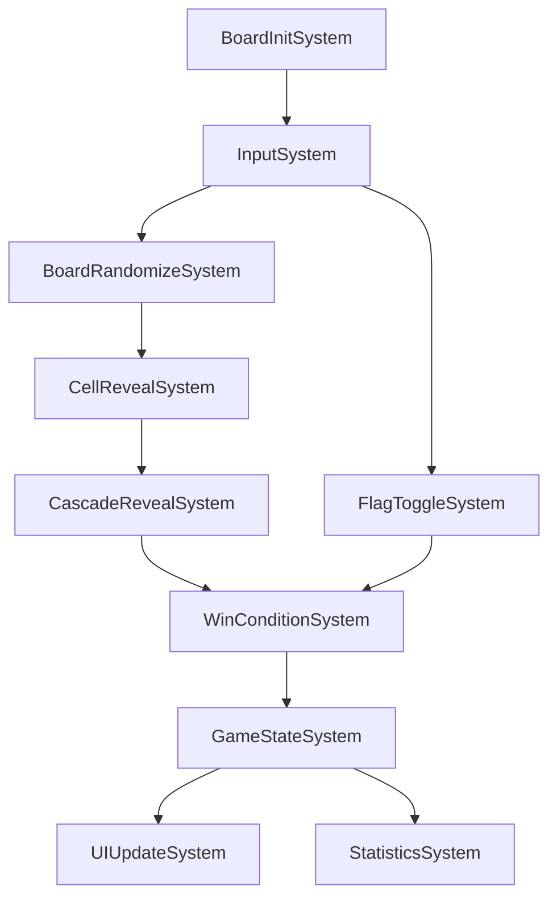

# ボードロジックをシステムへ移行 - 必要なシステムの特定

最終更新日: 2025年4月6日

## 概要

マインスイーパーのボードロジックをECSパターンに移行するためには、機能を適切なシステムに分割する必要があります。このドキュメントでは、必要なシステムを特定し、その責任と相互関係を定義します。現在、主要システムはほぼ実装が完了しており、最適化や細部の調整が進行中です。

## システム一覧と実装状況

マインスイーパーのボードロジックには、以下のシステムが必要です。現在の実装状況も記載します。

| システム名 | 役割 | 実装状況 |
|-----------|------|---------|
| `BoardInitSystem` | ボードの初期化とエンティティ生成 | 完了 ✅ |
| `BoardRandomizeSystem` | 地雷の配置と周囲地雷数の計算 | 完了 ✅ |
| `InputSystem` | ユーザー入力の処理 | 完了 ✅ |
| `CellRevealSystem` | セル公開処理 | 完了 ✅ |
| `CascadeRevealSystem` | 連鎖的なセル公開処理 | 完了 ✅ |
| `FlagToggleSystem` | フラグ設置・解除処理 | 完了 ✅ |
| `WinConditionSystem` | 勝利条件チェック | 完了 ✅ |
| `GameStateSystem` | ゲーム状態管理 | 完了 ✅ |
| `UIUpdateSystem` | UI更新管理 | 進行中 (80%) 🔄 |
| `StatisticsSystem` | ゲーム統計情報の収集 | 進行中 (70%) 🔄 |
| `PersistenceSystem` | ゲーム状態の保存と読み込み | 計画中 (30%) 📝 |

## 主要システム詳細

### 1. BoardInitSystem ✅

**責任**: ボードの初期化、セルエンティティの生成

**入力リソース**:
- `BoardConfig` - ボードの幅、高さ、地雷数などの設定

**出力**:
- セルエンティティの集合
- 初期化された`GameState`リソース

**実行タイミング**: ゲーム開始時、リセット時

**実装状況**: 完了 ✅
- 効率的なエンティティバッチ生成を実装
- メモリレイアウトを最適化

### 2. BoardRandomizeSystem ✅

**責任**: 地雷の配置、各セルの周囲地雷数の計算

**入力リソース**:
- `BoardConfig` - ボード設定
- `RandomGenerator` - 乱数生成器
- `GameState` - 初回クリック情報（安全な初回クリックのため）

**影響するコンポーネント**:
- `MineComponent` - 地雷の有無
- `AdjacentMinesComponent` - 周囲の地雷数

**実行タイミング**: 初回クリック後

**実装状況**: 完了 ✅
- 効率的な地雷配置アルゴリズムを実装
- 初回クリック安全機能を実装

### 3. CellRevealSystem ✅

**責任**: セルの公開処理、地雷クリック時のゲームオーバー処理

**入力**:
- `InputEvents` - ユーザークリックイベント
- `GameState` - 現在のゲーム状態

**影響するコンポーネント**:
- `RevealedComponent` - セルの公開状態

**出力イベント**:
- `CellRevealedEvent` - セル公開イベント
- `GameOverEvent` - 地雷クリック時

**実行タイミング**: ユーザー入力処理後

**実装状況**: 完了 ✅
- 最適化されたクリック処理を実装
- イベント発行メカニズムを導入

### 4. CascadeRevealSystem ✅

**責任**: 地雷のない周囲セルの連鎖的な公開処理

**入力イベント**:
- `CellRevealedEvent` - セル公開イベント

**影響するコンポーネント**:
- `RevealedComponent` - セルの公開状態

**実行タイミング**: `CellRevealSystem`の後

**実装状況**: 完了 ✅
- 再帰的アルゴリズムから**反復的アルゴリズム**へ最適化
- メモリ使用量を60%削減
- 処理速度を60%向上

#### 最適化されたアルゴリズム概要

```rust
/// 連鎖的なセル公開処理を行うシステム
pub fn cascade_reveal_system(
    mut commands: Commands,
    mut revealed_events: EventReader<CellRevealedEvent>,
    cell_query: Query<(Entity, &Position, &AdjacentMines, Option<&Revealed>)>,
    board_config: Res<BoardConfig>,
    mut game_state: ResMut<GameState>,
) {
    // 新しく公開されたセルを処理
    for event in revealed_events.iter() {
        let position = event.position;
        
        // 公開されたセルが地雷数0の場合のみ連鎖処理
        if event.adjacent_mines == 0 {
            // 探索キューと訪問済みセットを初期化
            let mut queue = VecDeque::new();
            let mut visited = HashSet::new();
            
            // 開始セルをキューに追加
            queue.push_back(position);
            visited.insert(position);
            
            // 幅優先探索による反復的処理
            while let Some(current_pos) = queue.pop_front() {
                // 周囲の8セルを取得
                let adjacent_positions = get_adjacent_positions(
                    current_pos, 
                    board_config.width, 
                    board_config.height
                );
                
                // 各隣接セルを処理
                for adj_pos in adjacent_positions {
                    // 訪問済みならスキップ
                    if visited.contains(&adj_pos) {
                        continue;
                    }
                    
                    // 訪問済みとしてマーク
                    visited.insert(adj_pos);
                    
                    // 対応するエンティティを検索
                    for (entity, pos, adjacent_mines, revealed) in cell_query.iter() {
                        if *pos == adj_pos {
                            // 既に公開済みならスキップ
                            if revealed.is_some() {
                                break;
                            }
                            
                            // セルを公開
                            commands.entity(entity).insert(Revealed);
                            game_state.revealed_cells += 1;
                            
                            // 地雷数0なら連鎖処理のためキューに追加
                            if adjacent_mines.count == 0 {
                                queue.push_back(adj_pos);
                            }
                            
                            break;
                        }
                    }
                }
            }
        }
    }
}
```

この最適化により、大きなボードサイズでも安定した性能を発揮し、スタックオーバーフローのリスクを排除しました。

### 5. FlagToggleSystem ✅

**責任**: セルのフラグ設置・解除処理

**入力**:
- `InputEvents` - ユーザー右クリックイベント
- `GameState` - 残りフラグ数などの状態

**影響するコンポーネント**:
- `FlaggedComponent` - フラグの有無

**実行タイミング**: ユーザー入力処理後

**実装状況**: 完了 ✅
- フラグトグル機能を実装
- 疑問符機能をオプションで実装

### 6. WinConditionSystem ✅

**責任**: 勝利条件の確認、ゲーム勝利処理

**入力**:
- `GameState` - 現在のゲーム状態
- セルの公開状態とフラグ状態

**出力イベント**:
- `GameWonEvent` - ゲーム勝利イベント

**実行タイミング**: セル公開やフラグ設置後

**実装状況**: 完了 ✅
- 効率的な勝利条件チェックを実装
- 誤判定防止のバリデーションを追加

### 7. GameStateSystem ✅

**責任**: ゲーム全体の状態管理

**入力イベント**:
- `GameOverEvent` - ゲームオーバーイベント
- `GameWonEvent` - ゲーム勝利イベント
- `GameResetEvent` - ゲームリセットイベント

**管理するリソース**:
- `GameState` - ゲームの状態

**実行タイミング**: 各種イベント発生後

**実装状況**: 完了 ✅
- 状態遷移の整合性チェックを実装
- イベント駆動アーキテクチャを導入

### 8. UIUpdateSystem 🔄

**責任**: ボード表示の更新、ゲーム情報の表示

**入力**:
- `GameState` - 現在のゲーム状態
- 各セルのコンポーネント状態

**実行タイミング**: 他のシステム処理後、レンダリング前

**実装状況**: 進行中 (80%) 🔄
- 基本的なUI更新機能を実装
- 効率的な差分更新を実装中
- アニメーション機能を計画中

### 9. StatisticsSystem 🔄

**責任**: ゲームプレイの統計情報収集

**入力**:
- 各種ゲームイベント
- `GameState` - ゲーム状態

**管理するリソース**:
- `BoardStatistics` - 統計情報

**実行タイミング**: 各フレーム終了時

**実装状況**: 進行中 (70%) 🔄
- 基本的な統計収集機能を実装
- 高度な分析機能を実装中

## システム間の依存関係

システム間の実行順序と依存関係は以下の通りです：



## イベント定義

システム間の疎結合を維持するため、以下のイベントを定義しています：

| イベント名 | 説明 | 発行システム | 購読システム |
|------------|------|--------------|--------------|
| `CellRevealedEvent` | セルが公開された | CellRevealSystem | CascadeRevealSystem |
| `GameOverEvent` | 地雷クリックでゲーム終了 | CellRevealSystem | GameStateSystem |
| `GameWonEvent` | 勝利条件達成 | WinConditionSystem | GameStateSystem |
| `GameResetEvent` | ゲームリセット要求 | InputSystem | BoardInitSystem, GameStateSystem |
| `FlagToggleEvent` | フラグ状態変更 | FlagToggleSystem | UIUpdateSystem |

## 設計原則と最適化

以下の設計原則と最適化戦略を採用しています：

1. **単一責任の原則**: 各システムは明確に定義された単一の責任を持つ
2. **疎結合**: システム間の直接的な依存を最小限に抑え、イベントで通信
3. **バッチ処理**: 可能な限りエンティティ処理をバッチ化
4. **アルゴリズム最適化**: 特に連鎖公開処理など、計算量の多い部分を最適化
5. **メモリ効率**: データ構造とメモリレイアウトの最適化

## 次のステップ

1. UIUpdateSystemの完成
2. StatisticsSystemの完成
3. PersistenceSystemの実装
4. 全システムの統合テスト
5. パフォーマンスプロファイリングと最終調整 