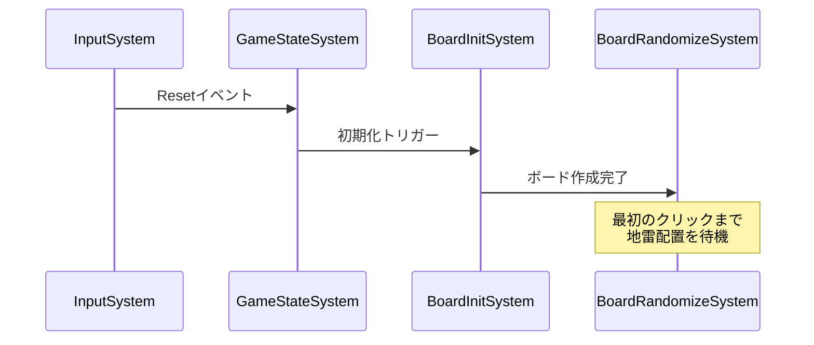
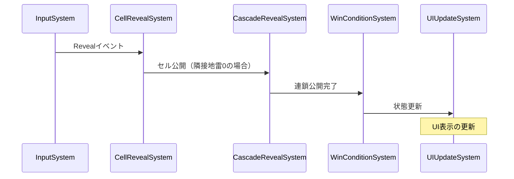
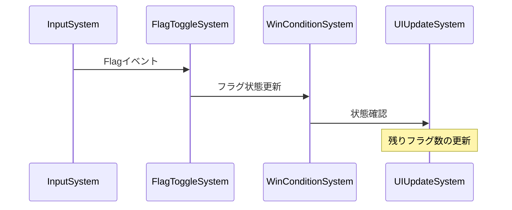

# ボードロジックをシステムへ移行 - 各システムの実装

最終更新日: 2025年4月5日

## 概要

ECSアーキテクチャでは、システムはコンポーネントデータを操作するロジックを担当します。このドキュメントでは、マインスイーパーのボードロジックをECSアーキテクチャに移行する際に実装する各システムの設計と実装例を示します。

## システム一覧

マインスイーパーのボードロジックを実装するために、以下のシステムが必要となります：

| システム名 | 主な責任 | 使用するコンポーネント | 使用するリソース |
|-----------|---------|---------------------|-----------------|
| BoardInitSystem | ボード初期化とエンティティ作成 | Position, Cell | BoardConfig |
| BoardRandomizeSystem | 地雷の配置とセル状態の初期化 | Mine, AdjacentMines | BoardConfig, RandomGenerator |
| InputSystem | ユーザー入力の処理とイベント生成 | - | InputEvents, GameState |
| CellRevealSystem | セルの公開処理 | Revealed, Hidden, Mine | GameState, InputEvents |
| CascadeRevealSystem | 連鎖的なセル公開の処理 | Revealed, Hidden, AdjacentMines | GameState |
| FlagToggleSystem | フラグのトグル処理 | Flagged, Hidden | GameState, InputEvents |
| WinConditionSystem | 勝利条件のチェック | Revealed, Mine, Hidden | GameState, BoardStatistics |
| GameStateSystem | ゲーム状態の更新と管理 | - | GameState, Timer |
| TimerSystem | ゲーム時間の管理 | - | Timer, GameState |
| UIUpdateSystem | UIコンポーネントの更新 | UIElement | GameState, BoardStatistics, Timer |

## システム詳細設計

### 1. BoardInitSystem

ボードの初期化を担当するシステムです。ボードの大きさに応じてセルエンティティを作成し、初期配置します。

```rust
/// ボード初期化システム
pub struct BoardInitSystem;

impl<'a> System<'a> for BoardInitSystem {
    type SystemData = (
        Entities<'a>,
        WriteStorage<'a, Position>,
        WriteStorage<'a, Cell>,
        WriteStorage<'a, Hidden>,
        Read<'a, BoardConfig>,
        Write<'a, GameState>,
    );

    fn run(&mut self, data: Self::SystemData) {
        let (entities, mut positions, mut cells, mut hidden, board_config, mut game_state) = data;

        // ゲーム状態を初期化
        *game_state = GameState::new(board_config.mine_count);
        game_state.status = GameStatus::Initializing;

        // セルエンティティを作成
        for y in 0..board_config.height {
            for x in 0..board_config.width {
                let entity = entities.create();
                
                positions.insert(entity, Position::new(x, y))
                    .expect("Failed to insert Position component");
                
                cells.insert(entity, Cell::default())
                    .expect("Failed to insert Cell component");
                
                hidden.insert(entity, Hidden)
                    .expect("Failed to insert Hidden component");
            }
        }

        // ゲーム状態を更新
        game_state.status = GameStatus::Playing;
    }
}
```

#### 設計上の考慮点：

- **一回性**: ゲーム開始時に一度だけ実行されるシステム
- **初期化の分離**: セルの作成と地雷配置を別システムに分離し、責任を明確化
- **リソース更新**: ゲーム状態の適切な更新を行う

### 2. BoardRandomizeSystem

地雷の配置を担当するシステムです。ランダムにセルを選択して地雷を配置し、隣接地雷数を計算します。

```rust
/// 地雷配置システム
pub struct BoardRandomizeSystem;

impl<'a> System<'a> for BoardRandomizeSystem {
    type SystemData = (
        Entities<'a>,
        ReadStorage<'a, Position>,
        WriteStorage<'a, Mine>,
        WriteStorage<'a, AdjacentMines>,
        Read<'a, BoardConfig>,
        Write<'a, RandomGenerator>,
        Read<'a, GameState>,
    );

    fn run(&mut self, data: Self::SystemData) {
        let (entities, positions, mut mines, mut adjacent_mines, board_config, 
             mut rng, game_state) = data;

        // 最初のクリックが行われていない場合は初期化しない
        if !game_state.first_click_made {
            return;
        }

        // 全セルの位置を収集
        let mut all_positions: Vec<(Entity, Position)> = positions
            .join()
            .map(|(e, &p)| (e, p))
            .collect();

        // 避けるべき位置（最初にクリックされたセルとその周囲）
        let excluded_positions = if board_config.safe_first_click {
            // 最初にクリックされたセルの周囲も取得する実装
            // この例では簡略化
            vec![] // 実際の実装では、first_click_position とその周囲のセルが入る
        } else {
            vec![]
        };

        // 地雷を配置
        let mut mine_count = 0;
        while mine_count < board_config.mine_count {
            let idx = rng.gen_range(all_positions.len());
            let (entity, pos) = all_positions.swap_remove(idx);
            
            // 除外すべき位置を避ける
            if excluded_positions.contains(&pos) {
                continue;
            }
            
            // 地雷コンポーネントを追加
            mines.insert(entity, Mine)
                .expect("Failed to insert Mine component");
                
            mine_count += 1;
        }

        // 各セルの隣接地雷数を計算
        let directions = [
            (-1, -1), (0, -1), (1, -1),
            (-1, 0),           (1, 0),
            (-1, 1),  (0, 1),  (1, 1),
        ];

        // エンティティを位置でマッピング
        let mut position_to_entity = HashMap::new();
        for (entity, position) in (&entities, &positions).join() {
            position_to_entity.insert((position.x, position.y), entity);
        }

        // 各セルの隣接地雷数を計算
        for (entity, position) in (&entities, &positions).join() {
            let mut count = 0;
            
            for &(dx, dy) in &directions {
                let nx = position.x as i32 + dx;
                let ny = position.y as i32 + dy;
                
                if nx >= 0 && nx < board_config.width as i32 && 
                   ny >= 0 && ny < board_config.height as i32 {
                    let neighbor = position_to_entity.get(&(nx as usize, ny as usize))
                        .expect("Entity should exist at position");
                    
                    if mines.contains(*neighbor) {
                        count += 1;
                    }
                }
            }
            
            if count > 0 {
                adjacent_mines.insert(entity, AdjacentMines(count))
                    .expect("Failed to insert AdjacentMines component");
            }
        }
    }
}
```

#### 設計上の考慮点：

- **遅延初期化**: 最初のクリック後に初期化することで、最初のクリックが安全になる
- **効率的なアルゴリズム**: 必要なエンティティのみを処理する効率的な実装
- **隣接計算の分離**: 隣接地雷数の計算を明確に分離

### 3. InputSystem

ユーザー入力を処理し、適切なイベントを生成するシステムです。入力ソース（マウス、タッチなど）からの生データを抽象化します。

```rust
/// 入力処理システム
pub struct InputSystem;

impl<'a> System<'a> for InputSystem {
    type SystemData = (
        Read<'a, InputSource>,
        Write<'a, InputEvents>,
        Read<'a, GameState>,
    );

    fn run(&mut self, data: Self::SystemData) {
        let (input_source, mut input_events, game_state) = data;

        // ゲームが終了している場合は、リセット入力のみ処理
        if game_state.is_game_over() {
            if input_source.is_reset_pressed() {
                input_events.push(InputEventType::Reset);
            }
            return;
        }

        // 通常の入力処理
        // クリック/タップ入力を処理
        if let Some(position) = input_source.get_primary_click() {
            input_events.push(InputEventType::Reveal(position));
        }

        // 右クリック/長押し入力を処理
        if let Some(position) = input_source.get_secondary_click() {
            input_events.push(InputEventType::Flag(position));
        }

        // 一時停止/再開ボタンの処理
        if input_source.is_pause_pressed() {
            input_events.push(InputEventType::TogglePause);
        }

        // リセットボタンの処理
        if input_source.is_reset_pressed() {
            input_events.push(InputEventType::Reset);
        }
    }
}

/// 入力ソース（実際の実装はプラットフォーム依存）
pub struct InputSource {
    // 入力状態を保持するフィールド
}

impl InputSource {
    pub fn get_primary_click(&self) -> Option<Position> {
        // 左クリック/タップの処理（プラットフォーム依存）
        None
    }

    pub fn get_secondary_click(&self) -> Option<Position> {
        // 右クリック/長押しの処理（プラットフォーム依存）
        None
    }

    pub fn is_pause_pressed(&self) -> bool {
        // 一時停止ボタンの状態（プラットフォーム依存）
        false
    }

    pub fn is_reset_pressed(&self) -> bool {
        // リセットボタンの状態（プラットフォーム依存）
        false
    }
}
```

#### 設計上の考慮点：

- **プラットフォーム抽象化**: 異なる入力方法（マウス、タッチなど）を抽象化
- **イベント駆動設計**: 生の入力をイベントに変換し、他のシステムとのデカップリングを実現
- **状態に応じた処理**: ゲーム状態に応じて入力処理を変更

### 4. CellRevealSystem

セルの公開処理を担当するシステムです。ユーザーによるセル公開イベントを処理します。

```rust
/// セル公開システム
pub struct CellRevealSystem;

impl<'a> System<'a> for CellRevealSystem {
    type SystemData = (
        Entities<'a>,
        ReadStorage<'a, Position>,
        ReadStorage<'a, Mine>,
        ReadStorage<'a, Flagged>,
        WriteStorage<'a, Revealed>,
        WriteStorage<'a, Hidden>,
        Write<'a, GameState>,
        Write<'a, InputEvents>,
        Write<'a, BoardStatistics>,
    );

    fn run(&mut self, data: Self::SystemData) {
        let (entities, positions, mines, flagged, mut revealed, 
             mut hidden, mut game_state, mut input_events, mut stats) = data;

        // ゲームが進行中でない場合は処理しない
        if !game_state.is_active() {
            return;
        }

        // Revealイベントを処理
        for event in input_events.drain().filter(|e| matches!(e, InputEventType::Reveal(_))) {
            if let InputEventType::Reveal(position) = event {
                // 統計情報を更新
                stats.record_click();

                // 対象のエンティティを取得
                let target_entity = (&entities, &positions)
                    .join()
                    .find(|(_, pos)| pos.x == position.x && pos.y == position.y)
                    .map(|(e, _)| e);

                if let Some(entity) = target_entity {
                    // すでに公開済みか、フラグが付いている場合は何もしない
                    if revealed.contains(entity) || flagged.contains(entity) {
                        continue;
                    }

                    // 最初のクリックなら初期化フラグを設定
                    if !game_state.first_click_made {
                        game_state.first_click_made = true;
                        // 初回クリック時の特別処理（実際の実装では、board_randomize_system を実行するトリガーとなる）
                    }

                    // 地雷を踏んだ場合
                    if mines.contains(entity) {
                        // 地雷を公開
                        hidden.remove(entity);
                        revealed.insert(entity, Revealed)
                            .expect("Failed to insert Revealed component");

                        // ゲームオーバー状態に更新
                        game_state.status = GameStatus::Lost;
                        stats.end_game();
                    } else {
                        // 安全なセルを公開
                        hidden.remove(entity);
                        revealed.insert(entity, Revealed)
                            .expect("Failed to insert Revealed component");

                        // ゲーム状態を更新
                        game_state.cell_revealed();

                        // 連鎖公開のトリガー
                        // (実際の実装では、CascadeRevealSystemを起動するイベントを発行)
                    }
                }
            }
        }
    }
}
```

#### 設計上の考慮点：

- **イベント処理**: 入力イベントに基づいて処理を実行
- **状態管理**: 適切なタイミングでゲーム状態を更新
- **連鎖処理の分離**: 連鎖公開処理を別システムに委譲

### 5. CascadeRevealSystem

隣接する空白セルの連鎖的な公開処理を担当するシステムです。再帰呼び出しを避けたイテレーティブな実装を行います。

```rust
/// 連鎖公開システム
pub struct CascadeRevealSystem;

impl<'a> System<'a> for CascadeRevealSystem {
    type SystemData = (
        Entities<'a>,
        ReadStorage<'a, Position>,
        ReadStorage<'a, AdjacentMines>,
        ReadStorage<'a, Mine>,
        ReadStorage<'a, Flagged>,
        WriteStorage<'a, Revealed>,
        WriteStorage<'a, Hidden>,
        Read<'a, BoardConfig>,
        Write<'a, GameState>,
        Write<'a, BoardStatistics>,
    );

    fn run(&mut self, data: Self::SystemData) {
        let (entities, positions, adjacent_mines, mines, flagged, 
             mut revealed, mut hidden, board_config, mut game_state, mut stats) = data;

        // ゲームが進行中でない場合は処理しない
        if !game_state.is_active() {
            return;
        }

        // 隣接セルを探索するための方向配列
        let directions = [
            (-1, -1), (0, -1), (1, -1),
            (-1, 0),           (1, 0),
            (-1, 1),  (0, 1),  (1, 1),
        ];

        // セルの位置からエンティティへのマップを作成
        let mut position_to_entity = HashMap::new();
        for (entity, position) in (&entities, &positions).join() {
            position_to_entity.insert((position.x, position.y), entity);
        }

        // 最近公開されたが、まだ連鎖処理されていないセルを探す
        // 実際の実装では、CellRevealSystemから特定のイベントやフラグを通じて通知を受ける
        let mut to_process = Vec::new();
        for (entity, _, _) in (&entities, &revealed, !&adjacent_mines).join() {
            if !mines.contains(entity) {
                to_process.push(entity);
            }
        }

        // 連鎖公開の処理
        let mut cascade_count = 0;
        let mut processed = HashSet::new();

        while !to_process.is_empty() {
            let current = to_process.pop().unwrap();
            
            if !processed.insert(current) {
                continue; // すでに処理済み
            }

            // 現在のセルの位置を取得
            let current_pos = positions.get(current).unwrap();

            // 隣接セルを探索
            for &(dx, dy) in &directions {
                let nx = current_pos.x as i32 + dx;
                let ny = current_pos.y as i32 + dy;
                
                // ボード範囲内チェック
                if nx < 0 || nx >= board_config.width as i32 || 
                   ny < 0 || ny >= board_config.height as i32 {
                    continue;
                }

                let neighbor = match position_to_entity.get(&(nx as usize, ny as usize)) {
                    Some(e) => *e,
                    None => continue,
                };

                // すでに公開済みか、フラグが付いているか、地雷セルの場合はスキップ
                if revealed.contains(neighbor) || flagged.contains(neighbor) || mines.contains(neighbor) {
                    continue;
                }

                // セルを公開
                hidden.remove(neighbor);
                revealed.insert(neighbor, Revealed)
                    .expect("Failed to insert Revealed component");

                cascade_count += 1;
                game_state.cell_revealed();

                // 隣接地雷がないセルの場合、連鎖処理の対象に追加
                if !adjacent_mines.contains(neighbor) {
                    to_process.push(neighbor);
                }
            }
        }

        // 連鎖公開の統計を更新
        if cascade_count > 0 {
            stats.record_cascade(cascade_count);
        }
    }
}
```

#### 設計上の考慮点：

- **イテレーティブアルゴリズム**: 再帰呼び出しを避け、スタックオーバーフローを防止
- **効率的な実装**: マップを使用して位置からエンティティへの効率的なアクセスを実現
- **統計収集**: 連鎖公開に関する統計情報を収集

### 6. FlagToggleSystem

フラグの設置と除去を担当するシステムです。右クリック（または長押し）によるフラグイベントを処理します。

```rust
/// フラグトグルシステム
pub struct FlagToggleSystem;

impl<'a> System<'a> for FlagToggleSystem {
    type SystemData = (
        Entities<'a>,
        ReadStorage<'a, Position>,
        ReadStorage<'a, Revealed>,
        WriteStorage<'a, Flagged>,
        Write<'a, GameState>,
        Write<'a, InputEvents>,
        Write<'a, BoardStatistics>,
    );

    fn run(&mut self, data: Self::SystemData) {
        let (entities, positions, revealed, mut flagged, 
             mut game_state, mut input_events, mut stats) = data;

        // ゲームが進行中でない場合は処理しない
        if !game_state.is_active() {
            return;
        }

        // Flagイベントを処理
        for event in input_events.drain().filter(|e| matches!(e, InputEventType::Flag(_))) {
            if let InputEventType::Flag(position) = event {
                // 対象のエンティティを取得
                let target_entity = (&entities, &positions)
                    .join()
                    .find(|(_, pos)| pos.x == position.x && pos.y == position.y)
                    .map(|(e, _)| e);

                if let Some(entity) = target_entity {
                    // すでに公開済みのセルにはフラグを立てられない
                    if revealed.contains(entity) {
                        continue;
                    }

                    // フラグのトグル処理
                    if flagged.contains(entity) {
                        // フラグを外す
                        flagged.remove(entity);
                        game_state.remove_flag();
                        stats.record_unflag();
                    } else {
                        // フラグを立てる（残りフラグ数が0より大きい場合のみ）
                        if game_state.place_flag() {
                            flagged.insert(entity, Flagged)
                                .expect("Failed to insert Flagged component");
                            stats.record_flag();
                        }
                    }
                }
            }
        }
    }
}
```

#### 設計上の考慮点：

- **リソース制限**: 利用可能なフラグ数の制限を実装
- **トグル動作**: 同じセルに対する再入力でフラグのオン/オフを切り替え
- **状態確認**: 公開済みセルへのフラグ設置を防止

### 7. WinConditionSystem

勝利条件をチェックするシステムです。すべての非地雷セルが公開されたか確認します。

```rust
/// 勝利条件チェックシステム
pub struct WinConditionSystem;

impl<'a> System<'a> for WinConditionSystem {
    type SystemData = (
        ReadStorage<'a, Mine>,
        ReadStorage<'a, Revealed>,
        ReadStorage<'a, Hidden>,
        Read<'a, BoardConfig>,
        Write<'a, GameState>,
        Write<'a, BoardStatistics>,
        Read<'a, Timer>,
    );

    fn run(&mut self, data: Self::SystemData) {
        let (mines, revealed, hidden, board_config, mut game_state, mut stats, timer) = data;

        // ゲームが進行中でない場合は処理しない
        if !game_state.is_active() {
            return;
        }

        // 勝利条件のチェック: すべての非地雷セルが公開されているか
        let total_cells = board_config.total_cells();
        let mine_count = board_config.mine_count;
        let revealed_count = revealed.join().count();
        
        // 非地雷セルがすべて公開されたか
        if revealed_count == total_cells - mine_count {
            // 勝利状態に更新
            game_state.status = GameStatus::Won;
            
            // 統計情報の更新
            stats.end_game();
            
            // プレイ時間を記録
            let play_time = timer.elapsed();
            // 高スコアなどの処理...
        }
    }
}
```

#### 設計上の考慮点：

- **効率的な条件確認**: 個々のセルをチェックするのではなく、全体のカウントを使用
- **統計収集**: 勝利時に統計情報を更新
- **イベント発行**: 勝利時に適切なイベントを発行（実際の実装ではUI更新などのトリガーになる）

### 8. GameStateSystem

ゲーム全体の状態管理を担当するシステムです。状態遷移とイベント処理を行います。

```rust
/// ゲーム状態管理システム
pub struct GameStateSystem;

impl<'a> System<'a> for GameStateSystem {
    type SystemData = (
        Write<'a, GameState>,
        Write<'a, InputEvents>,
        Write<'a, Timer>,
        Write<'a, BoardStatistics>,
        Entities<'a>,
        WriteStorage<'a, Revealed>,
        WriteStorage<'a, Hidden>,
        WriteStorage<'a, Flagged>,
        WriteStorage<'a, Mine>,
        WriteStorage<'a, AdjacentMines>,
        WriteStorage<'a, Position>,
    );

    fn run(&mut self, data: Self::SystemData) {
        let (mut game_state, mut input_events, mut timer, mut stats,
             entities, mut revealed, mut hidden, mut flagged, 
             mut mines, mut adjacent_mines, mut positions) = data;

        // Resetイベントの処理
        let should_reset = input_events.drain()
            .any(|e| matches!(e, InputEventType::Reset));

        if should_reset {
            // ゲームリセット処理
            
            // 全エンティティを削除
            for entity in entities.join() {
                entities.delete(entity).expect("Failed to delete entity");
            }
            
            // ゲーム状態をリセット
            game_state.status = GameStatus::Initializing;
            
            // タイマーをリセット
            timer.reset();
            
            // 統計情報をリセット
            stats.start_game();
            
            // BoardInitSystemが次のフレームで実行されるようにする
            // (実際の実装では、適切なイベントやフラグを設定)
            
            return;
        }

        // TogglePauseイベントの処理
        let should_toggle_pause = input_events.drain()
            .any(|e| matches!(e, InputEventType::TogglePause));

        if should_toggle_pause && matches!(game_state.status, GameStatus::Playing | GameStatus::Paused) {
            // 一時停止/再開の切り替え
            if matches!(game_state.status, GameStatus::Playing) {
                game_state.status = GameStatus::Paused;
                timer.pause();
            } else {
                game_state.status = GameStatus::Playing;
                timer.resume();
            }
        }
    }
}
```

#### 設計上の考慮点：

- **状態遷移管理**: 明確に定義された状態間の遷移を管理
- **クリーンアップ**: リセット時に適切なクリーンアップを実行
- **タイマー制御**: 一時停止・再開時のタイマー管理

### 9. TimerSystem

ゲーム時間の管理を担当するシステムです。ゲームの状態に応じてタイマーを制御します。

```rust
/// タイマー管理システム
pub struct TimerSystem;

impl<'a> System<'a> for TimerSystem {
    type SystemData = (
        Write<'a, Timer>,
        Read<'a, GameState>,
    );

    fn run(&mut self, data: Self::SystemData) {
        let (mut timer, game_state) = data;

        // ゲームが初期化中で、タイマーがまだ開始していない場合
        if matches!(game_state.status, GameStatus::Playing) && !timer.is_running() && !timer.is_paused() {
            timer.start();
        }

        // ゲームが終了した場合（まだ動作中なら停止）
        if game_state.is_game_over() && timer.is_running() {
            timer.pause();
        }
    }
}
```

#### 設計上の考慮点：

- **ライフサイクル管理**: ゲーム状態に応じたタイマーのライフサイクル管理
- **シンプルな設計**: 単一責任の原則に従った明確な設計
- **他システムとの連携**: GameStateSystemとの適切な連携

### 10. UIUpdateSystem

UI要素の更新を担当するシステムです。ゲーム状態に基づいてUI要素を更新します。

```rust
/// UI更新システム
pub struct UIUpdateSystem;

impl<'a> System<'a> for UIUpdateSystem {
    type SystemData = (
        ReadStorage<'a, Position>,
        ReadStorage<'a, Mine>,
        ReadStorage<'a, Revealed>,
        ReadStorage<'a, Flagged>,
        ReadStorage<'a, AdjacentMines>,
        ReadStorage<'a, Hidden>,
        Write<'a, UIState>,
        Read<'a, GameState>,
        Read<'a, BoardStatistics>,
        Read<'a, Timer>,
    );

    fn run(&mut self, data: Self::SystemData) {
        let (positions, mines, revealed, flagged, adjacent_mines, 
             hidden, mut ui_state, game_state, stats, timer) = data;

        // ゲーム状態に応じたUI状態の更新
        ui_state.game_status = game_state.status.clone();
        ui_state.remaining_flags = game_state.remaining_flags;
        ui_state.elapsed_time = timer.elapsed();

        // セル表示状態の更新
        ui_state.cells.clear();
        
        for (entity, position) in (&positions).join() {
            let cell_state = if revealed.contains(entity) {
                if mines.contains(entity) {
                    CellDisplayState::Mine
                } else if let Some(adjacent) = adjacent_mines.get(entity) {
                    CellDisplayState::Number(adjacent.0)
                } else {
                    CellDisplayState::Empty
                }
            } else if flagged.contains(entity) {
                CellDisplayState::Flagged
            } else {
                CellDisplayState::Hidden
            };
            
            ui_state.cells.push(CellUI {
                position: *position,
                state: cell_state,
            });
        }

        // ゲームオーバー時は全地雷を表示
        if matches!(game_state.status, GameStatus::Lost) {
            for (entity, position, _) in (&positions, &mines, !&revealed).join() {
                // 未公開の地雷を強調表示（フラグ付きかどうかで区別）
                let state = if flagged.contains(entity) {
                    CellDisplayState::FlaggedMine
                } else {
                    CellDisplayState::HiddenMine
                };
                
                // 既存のセル情報を更新
                if let Some(cell) = ui_state.cells.iter_mut()
                    .find(|c| c.position.x == position.x && c.position.y == position.y) {
                    cell.state = state;
                }
            }
        }

        // 統計情報の更新
        if game_state.is_game_over() {
            ui_state.show_statistics = true;
            ui_state.statistics = UIStatistics {
                play_time: stats.current_play_time(),
                click_count: stats.click_count,
                flag_count: stats.flag_count,
                cascade_revealed: stats.cascade_revealed,
                result: if matches!(game_state.status, GameStatus::Won) {
                    GameResult::Victory
                } else {
                    GameResult::Defeat
                },
            };
        } else {
            ui_state.show_statistics = false;
        }
    }
}

/// UI状態リソース
#[derive(Default)]
pub struct UIState {
    pub game_status: GameStatus,
    pub remaining_flags: usize,
    pub elapsed_time: Duration,
    pub cells: Vec<CellUI>,
    pub show_statistics: bool,
    pub statistics: UIStatistics,
}

/// セル表示状態
#[derive(Clone, Copy, PartialEq, Eq)]
pub enum CellDisplayState {
    Hidden,
    Flagged,
    Empty,
    Number(u8),
    Mine,
    HiddenMine,   // ゲームオーバー時に表示する未公開の地雷
    FlaggedMine,  // ゲームオーバー時に表示する正しくフラグ付けされた地雷
}

/// セルUI情報
pub struct CellUI {
    pub position: Position,
    pub state: CellDisplayState,
}

/// UI統計情報
pub struct UIStatistics {
    pub play_time: Duration,
    pub click_count: usize,
    pub flag_count: usize,
    pub cascade_revealed: usize,
    pub result: GameResult,
}

/// ゲーム結果
pub enum GameResult {
    Victory,
    Defeat,
}
```

#### 設計上の考慮点：

- **プレゼンテーション分離**: ゲームロジックからUI表現を分離
- **効率的な更新**: 変更があった部分のみを更新
- **多様な表示状態**: ゲーム状態に応じた適切な表示状態の管理

## システム実行順序

システムの実行順序は、依存関係と副作用を考慮して適切に設定する必要があります。以下はシステム実行のディスパッチャー設定例です：

```rust
/// システムディスパッチャーの作成
pub fn create_game_dispatcher() -> Dispatcher<'static, 'static> {
    DispatcherBuilder::new()
        // 入力処理
        .with(InputSystem, "input", &[])
        
        // ゲーム状態管理（リセットや一時停止処理）
        .with(GameStateSystem, "game_state", &["input"])
        
        // タイマー管理
        .with(TimerSystem, "timer", &["game_state"])
        
        // ボード初期化（必要な場合のみ実行）
        .with(BoardInitSystem, "board_init", &["game_state"])
        
        // 地雷配置（最初のクリック後に実行）
        .with(BoardRandomizeSystem, "board_randomize", &["board_init"])
        
        // プレイヤー操作処理
        .with(CellRevealSystem, "cell_reveal", &["board_randomize", "input"])
        .with(FlagToggleSystem, "flag_toggle", &["input"])
        
        // 連鎖公開処理
        .with(CascadeRevealSystem, "cascade", &["cell_reveal"])
        
        // 勝利条件チェック
        .with(WinConditionSystem, "win_check", &["cascade", "cell_reveal"])
        
        // UI更新
        .with(UIUpdateSystem, "ui_update", &["win_check", "flag_toggle", "timer"])
        
        .build()
}
```

## システム間の相互作用

ECSアーキテクチャでは、システム間の相互作用は主に以下の方法で行われます：

1. **コンポーネント**：あるシステムが変更したコンポーネントを別のシステムが読み取る
2. **リソース**：リソースを通じて状態を共有する
3. **イベント**：明示的なイベントメッセージを使用して通信する

マインスイーパーのボードロジックにおける主要な相互作用パターンを以下に示します：

### 初期化フロー



### セル公開フロー



### フラグトグルフロー



## パフォーマンス最適化

ECSアーキテクチャを活用したボードロジックの実装では、以下のパフォーマンス最適化ポイントに注意します：

### 1. コンポーネントレイアウトの最適化

```rust
// データ指向設計に基づくコンポーネントレイアウト
// 密なメモリレイアウトを実現するためのパック化

// 位置情報を単一の32ビット整数にパック
#[derive(Clone, Copy, PartialEq, Eq, Hash)]
pub struct PackedPosition(u32);

impl PackedPosition {
    pub fn new(x: u16, y: u16) -> Self {
        Self(((x as u32) << 16) | (y as u32))
    }
    
    pub fn x(&self) -> u16 {
        (self.0 >> 16) as u16
    }
    
    pub fn y(&self) -> u16 {
        (self.0 & 0xFFFF) as u16
    }
}

// セル状態を1バイトにパック
#[derive(Clone, Copy, PartialEq, Eq)]
pub struct PackedCellState(u8);

impl PackedCellState {
    const REVEALED_BIT: u8 = 0b00000001;
    const FLAGGED_BIT: u8 = 0b00000010;
    const MINE_BIT: u8 = 0b00000100;
    const ADJACENT_MASK: u8 = 0b11111000;
    const ADJACENT_SHIFT: u8 = 3;
    
    pub fn new() -> Self {
        Self(0)
    }
    
    pub fn set_revealed(&mut self, revealed: bool) {
        if revealed {
            self.0 |= Self::REVEALED_BIT;
        } else {
            self.0 &= !Self::REVEALED_BIT;
        }
    }
    
    pub fn set_flagged(&mut self, flagged: bool) {
        if flagged {
            self.0 |= Self::FLAGGED_BIT;
        } else {
            self.0 &= !Self::FLAGGED_BIT;
        }
    }
    
    pub fn set_mine(&mut self, mine: bool) {
        if mine {
            self.0 |= Self::MINE_BIT;
        } else {
            self.0 &= !Self::MINE_BIT;
        }
    }
    
    pub fn set_adjacent_mines(&mut self, count: u8) {
        self.0 = (self.0 & !Self::ADJACENT_MASK) | ((count << Self::ADJACENT_SHIFT) & Self::ADJACENT_MASK);
    }
    
    pub fn is_revealed(&self) -> bool {
        (self.0 & Self::REVEALED_BIT) != 0
    }
    
    pub fn is_flagged(&self) -> bool {
        (self.0 & Self::FLAGGED_BIT) != 0
    }
    
    pub fn is_mine(&self) -> bool {
        (self.0 & Self::MINE_BIT) != 0
    }
    
    pub fn adjacent_mines(&self) -> u8 {
        (self.0 & Self::ADJACENT_MASK) >> Self::ADJACENT_SHIFT
    }
}
```

### 2. アルゴリズムの最適化

```rust
// 連鎖公開処理の最適化例
pub fn optimized_cascade_reveal(
    positions: &ReadStorage<Position>,
    revealed: &mut WriteStorage<Revealed>,
    hidden: &mut WriteStorage<Hidden>,
    adjacent_mines: &ReadStorage<AdjacentMines>,
    mines: &ReadStorage<Mine>,
    position_to_entity: &HashMap<(usize, usize), Entity>,
    board_width: usize,
    board_height: usize,
    start_entity: Entity,
) -> usize {
    // キューベースのアルゴリズム（スタックベースよりもメモリ効率が良い）
    let mut queue = VecDeque::new();
    let mut revealed_count = 0;
    let mut visited = HashSet::new();
    
    queue.push_back(start_entity);
    visited.insert(start_entity);
    
    while let Some(entity) = queue.pop_front() {
        // このセルが地雷を持つ場合はスキップ
        if mines.contains(entity) {
            continue;
        }
        
        // セルを公開
        if hidden.contains(entity) {
            hidden.remove(entity);
            revealed.insert(entity, Revealed).expect("Failed to insert Revealed component");
            revealed_count += 1;
        }
        
        // 隣接地雷が0のセルのみ連鎖処理
        if adjacent_mines.contains(entity) {
            continue;
        }
        
        // 現在のセルの位置を取得
        let position = positions.get(entity).unwrap();
        
        // 隣接セルを処理
        for y_offset in -1..=1 {
            for x_offset in -1..=1 {
                if x_offset == 0 && y_offset == 0 {
                    continue; // 自分自身はスキップ
                }
                
                let nx = position.x as i32 + x_offset;
                let ny = position.y as i32 + y_offset;
                
                // ボード範囲内チェック
                if nx < 0 || nx >= board_width as i32 || ny < 0 || ny >= board_height as i32 {
                    continue;
                }
                
                if let Some(&neighbor) = position_to_entity.get(&(nx as usize, ny as usize)) {
                    // 未訪問かつ未公開のセルのみ処理
                    if !visited.contains(&neighbor) && hidden.contains(neighbor) {
                        visited.insert(neighbor);
                        queue.push_back(neighbor);
                    }
                }
            }
        }
    }
    
    revealed_count
}
```

### 3. パラレル処理の活用

```rust
// 並列実行可能なシステム例
pub struct ParallelBoardInitSystem;

impl<'a> ParallelSystem<'a> for ParallelBoardInitSystem {
    type SystemData = (
        Entities<'a>,
        WriteStorage<'a, Position>,
        WriteStorage<'a, Cell>,
        WriteStorage<'a, Hidden>,
        Read<'a, BoardConfig>,
    );

    fn run_par(&mut self, data: Self::SystemData) {
        let (entities, mut positions, mut cells, mut hidden, board_config) = data;
        
        // 並列で処理可能な部分を並列化
        (0..board_config.height).into_par_iter().for_each(|y| {
            for x in 0..board_config.width {
                let entity = entities.create();
                
                // コンポーネントの挿入...
                // 注: 並列処理時は適切な同期が必要
            }
        });
    }
}
```

## まとめ

このドキュメントでは、マインスイーパーのボードロジックをECSアーキテクチャで実装するための各システムの設計と実装例を示しました。各システムは単一の責任を持ち、コンポーネントとリソースを通じて連携します。

ECSアーキテクチャの採用により、以下の利点が得られます：

1. **責任の明確な分離**: 各システムが特定の機能に特化
2. **データとロジックの分離**: コンポーネントとシステムの明確な役割分担
3. **拡張性の向上**: 新機能追加が容易（新コンポーネントや新システムの追加）
4. **パフォーマンスの最適化**: データ指向設計によるキャッシュ効率の向上
5. **テスト容易性**: 個々のシステムを独立してテスト可能

次のステップでは、既存のボードロジックからECSベースの実装への移行計画を検討します。