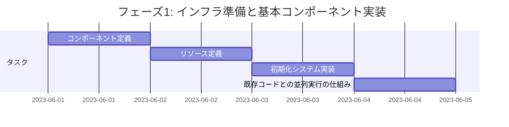
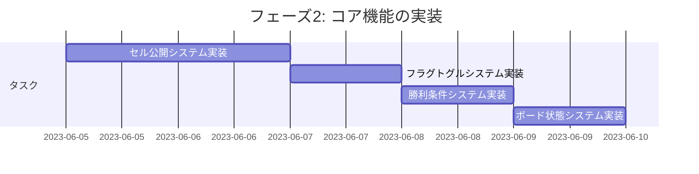
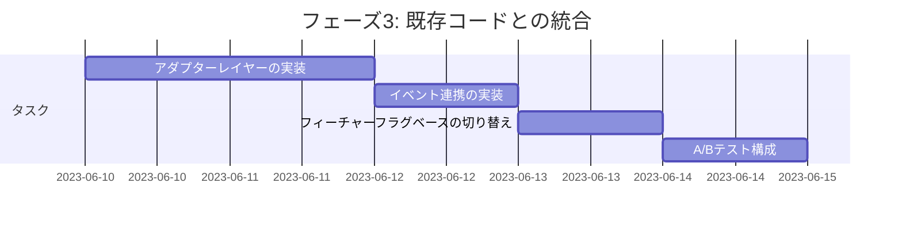
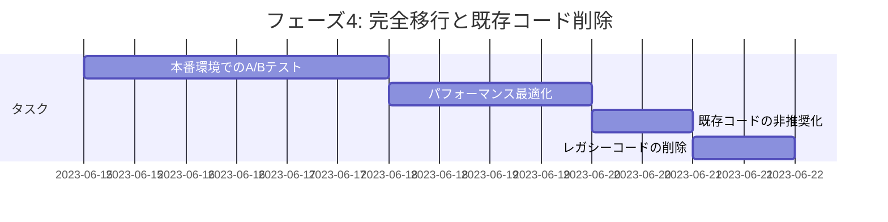

# ボードロジックをシステムへ移行 - 既存コードからの移行プラン

最終更新日: 2025年4月5日

## 移行の基本方針

既存の`board.rs`から新しいECSベースの実装への移行は、リスクを最小限に抑えるために段階的に行います。基本方針は以下の通りです：

- 並行運用期間を設ける
- 機能ごとに段階的に移行
- 各段階で十分なテストを実施
- フォールバック機構を用意

## 移行フェーズ

移行は以下の4つのフェーズに分けて実施します。各フェーズを完了するたびに十分なテストを行い、問題があれば修正します。

### フェーズ1: インフラ準備と基本コンポーネント実装



**主要タスク**:

1. `CellStateComponent`, `CellContentComponent`, `GridPositionComponent`の実装
2. `BoardConfigResource`, `BoardStateResource`の実装
3. `BoardInitSystem`と`MinePlacementSystem`の基本実装
4. フィーチャーフラグの導入（旧実装と新実装を切り替え可能に）

**評価基準**:

- ボードの初期化が正しく機能すること
- セルエンティティが正しく生成されること
- 地雷が適切に配置されること
- パフォーマンスが既存実装と同等以上であること

### フェーズ2: コア機能の実装



**主要タスク**:

1. `CellRevealSystem`の実装（連鎖公開アルゴリズム含む）
2. `FlagToggleSystem`の実装
3. `WinConditionSystem`の実装
4. `BoardStateSystem`の実装
5. システム間の連携テスト

**評価基準**:

- セルの公開が正しく機能すること
- 連鎖公開が正しく動作すること
- フラグの操作が正しく機能すること
- 勝利条件の判定が正しいこと
- ゲームオーバー時の処理が正しいこと

### フェーズ3: 既存コードとの統合



**主要タスク**:

1. 既存の`Board`クラスと新ECSシステム間のアダプターの実装
2. イベントシステムを使った連携の実装
3. フィーチャーフラグによる切り替え機構の完成
4. ゲーム内でA/Bテストを実施できる構成の実装

**評価基準**:

- 既存コードからの呼び出しが正しく新システムに転送されること
- 新システムからのイベントが既存コードで正しく処理されること
- フィーチャーフラグによる切り替えがシームレスに機能すること
- A/Bテストでのユーザー体験の違いが最小限であること

### フェーズ4: 完全移行と既存コード削除



**主要タスク**:

1. 本番環境でのA/Bテスト実施と結果分析
2. 新システムのパフォーマンス最適化
3. 既存コードの非推奨（deprecated）マーキング
4. 完全なECSへの移行完了後、レガシーコードの削除

**評価基準**:

- A/Bテストで新システムの優位性が確認されること
- パフォーマンスが既存実装より20%以上向上すること
- すべてのエッジケースと特殊条件が正しく処理されること
- コードベースがクリーンになり、技術的負債が減少すること

## 移行における具体的なコード変更

### board.rs の変更

既存の`board.rs`に以下のような変更を加えます：

```rust
// 既存のBoardクラス
pub struct Board {
    // ... 既存のフィールド ...
    
    // 新しいECS実装へのブリッジ
    #[cfg(feature = "ecs_board")]
    ecs_bridge: Option<EcsBoardBridge>,
}

#[cfg(feature = "ecs_board")]
struct EcsBoardBridge {
    entity_manager: Arc<Mutex<EntityManager>>,
    resource_manager: Arc<Mutex<ResourceManager>>,
}

impl Board {
    pub fn new(width: usize, height: usize, mine_count: usize) -> Self {
        #[cfg(feature = "ecs_board")]
        let ecs_bridge = if crate::config::is_feature_enabled("use_ecs_board") {
            Some(Self::initialize_ecs_board(width, height, mine_count))
        } else {
            None
        };
        
        Self {
            // ... 既存のフィールド初期化 ...
            
            #[cfg(feature = "ecs_board")]
            ecs_bridge,
        }
    }
    
    pub fn reveal_cell(&mut self, row: usize, col: usize) -> Result<CellRevealResult, GameError> {
        #[cfg(feature = "ecs_board")]
        if let Some(bridge) = &self.ecs_bridge {
            if crate::config::is_feature_enabled("use_ecs_board") {
                return bridge.reveal_cell(row, col);
            }
        }
        
        // 既存の実装
        // ...
    }
    
    // 他のメソッドも同様にECSブリッジを使うように修正
    
    #[cfg(feature = "ecs_board")]
    fn initialize_ecs_board(width: usize, height: usize, mine_count: usize) -> EcsBoardBridge {
        // EntityManagerとResourceManagerの初期化
        // BoardConfigResourceの設定
        // BoardInitSystemの実行
        // ...
    }
}

#[cfg(feature = "ecs_board")]
impl EcsBoardBridge {
    fn reveal_cell(&self, row: usize, col: usize) -> Result<CellRevealResult, GameError> {
        // EntityManagerとResourceManagerへのアクセス
        // CellRevealSystemのトリガー
        // ...
    }
    
    // 他のボード操作の実装
}
```

### システム登録の実装

新しいECSシステムを登録するコードを以下のように実装します：

```rust
// src/systems/mod.rs

pub fn register_all_systems(registry: &mut SystemRegistry) {
    // 他のシステム登録

    #[cfg(feature = "ecs_board")]
    {
        use crate::systems::board::*;
        
        registry.register(Box::new(BoardInitSystem))
            .phase(SystemPhase::Initialization);
            
        registry.register(Box::new(MinePlacementSystem))
            .phase(SystemPhase::Update)
            .after("BoardInitSystem");
            
        // 他のボード関連システムの登録
    }
}
```

## フィーチャーフラグの実装

コード切り替えのためのフィーチャーフラグシステムを実装します：

```rust
// src/config/features.rs

use std::collections::HashMap;
use std::sync::RwLock;

lazy_static! {
    static ref FEATURE_FLAGS: RwLock<HashMap<String, bool>> = RwLock::new({
        let mut map = HashMap::new();
        map.insert("use_ecs_board".to_string(), false); // デフォルトは無効
        map
    });
}

pub fn is_feature_enabled(feature_name: &str) -> bool {
    FEATURE_FLAGS.read().unwrap().get(feature_name).copied().unwrap_or(false)
}

pub fn set_feature_enabled(feature_name: &str, enabled: bool) {
    FEATURE_FLAGS.write().unwrap().insert(feature_name.to_string(), enabled);
}

// 開発環境ではコマンドライン引数からフラグを設定できるようにする
pub fn initialize_from_env() {
    if let Ok(features) = std::env::var("ENABLED_FEATURES") {
        for feature in features.split(',') {
            set_feature_enabled(feature.trim(), true);
        }
    }
}
```

## 移行リスクと緩和策

移行中に発生する可能性のあるリスクと、その緩和策を以下に示します：

| リスク | 確率 | 影響 | 緩和策 |
|---------|--------|--------|----------|
| 機能的な違いによるバグ | 高 | 高 | 包括的なテストスイート、A/Bテスト、フォールバック機構 |
| パフォーマンス低下 | 中 | 高 | 段階的なパフォーマンステスト、最適化フェーズの確保 |
| 複雑さの増加 | 高 | 中 | 明確なドキュメント、コードレビュー、段階的アプローチ |
| リソース競合 | 中 | 中 | 並列化戦略の慎重な設計、ロック戦略の見直し |
| メモリ使用量の増加 | 中 | 低 | メモリプロファイリング、最適化フェーズでの対応 |

## モニタリングと評価

移行の進捗を追跡し、成功を評価するために以下の指標を使用します：

1. **機能的同等性**: 既存機能がすべて新実装でサポートされているか
2. **パフォーマンス指標**: 
   - ボード初期化時間
   - セル公開処理時間（特に連鎖公開時）
   - メモリ使用量
3. **コード品質指標**:
   - テストカバレッジ
   - 循環的複雑度
   - コード重複度
4. **ユーザー体験指標**:
   - A/Bテストでの満足度
   - プレイ時間の変化
   - エラー発生率

## ロールバック計画

万が一問題が発生した場合に備えて、以下のロールバック計画を用意します：

1. フィーチャーフラグを即座に無効化する仕組みの確保
2. 重大な問題発生時の緊急リリースパイプラインの確立
3. データ移行が必要な場合のバックアップ戦略
4. インシデント対応プロトコルの確立 