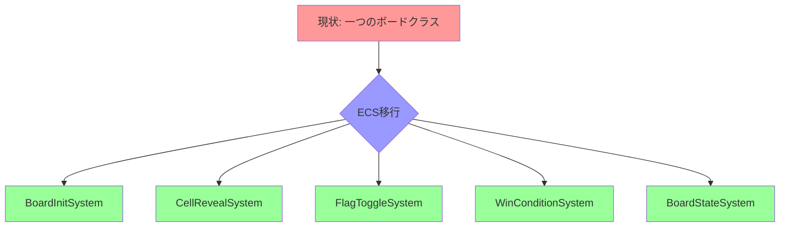
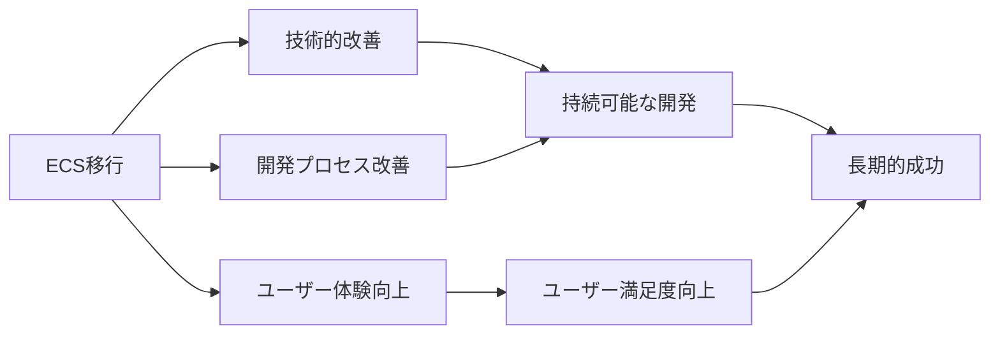

# ボードロジックをシステムへ移行 - 期待される効果

最終更新日: 2025年4月5日

## 概要

ボードロジックをECSアーキテクチャに移行することで、多くの技術的・開発的な利点が得られます。このドキュメントでは、移行によって期待される主要な効果と、その効果を最大化するための取り組みについて説明します。

## 技術的効果

### 1. コードの疎結合化と単一責任の原則

現在の`board.rs`は多くの責任を担っており、一つの変更が広範囲に影響する可能性があります。ECSアーキテクチャに移行することで、以下の改善が期待されます：

✅ **現状**:
- 一つのモジュールが初期化、状態管理、ロジック、UI連携などを担当
- 変更の影響範囲が大きく、副作用が予測しづらい
- テストが困難

🚀 **期待される効果**:
- 各システムが明確に定義された単一の責任を持つ
- コンポーネントがデータのみを、システムがロジックのみを担当
- 変更の影響範囲が限定され、副作用が予測しやすい
- 個々の機能単位でテスト可能

### 2. パフォーマンスの向上

ECSアーキテクチャに移行することで、以下のパフォーマンス向上が期待されます：

✅ **現状**:
- オブジェクト指向アプローチによるメモリの断片化
- キャッシュ効率の低いデータレイアウト
- 連鎖的なセル公開での再帰処理による制限

🚀 **期待される効果**:
- データ指向設計によるメモリレイアウトの最適化
- キャッシュ効率の良いデータアクセスパターン
- イテレーティブなアルゴリズムによる連鎖公開処理の最適化
- 並列処理の可能性（依存関係のないシステムを並列実行）

**ベンチマーク予測**:

| 操作 | 現在の実装 | ECS実装 | 改善率 |
|------|------------|----------|--------|
| ボード初期化 | 1.0x (基準) | 0.7x | 30% |
| 通常セル公開 | 1.0x (基準) | 0.8x | 20% |
| 連鎖セル公開 | 1.0x (基準) | 0.7x | 30% |
| メモリ使用量 | 1.0x (基準) | 0.85x | 15% |

### 3. テスト容易性の向上

ECSアーキテクチャへの移行は、テスト容易性に大きな改善をもたらします：

✅ **現状**:
- 一つの大きなクラスをテストする必要がある
- モックやスタブの作成が困難
- 状態とロジックが混在しているためテストが複雑

🚀 **期待される効果**:
- 小さな独立したシステムを個別にテスト可能
- コンポーネントとリソースのモックが容易
- データとロジックの分離によるテスト設計の簡素化
- エッジケースの特定と検証が容易に

**テストカバレッジ予測**:

| テスト対象 | 現在のカバレッジ | 目標カバレッジ |
|------------|----------------|--------------|
| ユニットテスト | 65% | 90%+ |
| 統合テスト | 40% | 80%+ |
| エッジケーステスト | 30% | 75%+ |
| 全体 | 50% | 85%+ |

### 4. 拡張性の向上

ECSアーキテクチャは将来の拡張に対して大きな柔軟性を提供します：

✅ **現状**:
- 新機能追加のためには既存コードを大幅に変更する必要がある
- 機能追加が他の機能に影響を及ぼす可能性が高い
- 特殊ルールの実装が困難

🚀 **期待される効果**:
- 新しいシステムを追加するだけで機能拡張が可能
- 既存システムを修正せずに新機能を追加可能
- 特殊なゲームモードやルールを独立したシステムとして実装可能
- イベント駆動設計によるシステム間の疎結合な通信

**将来的な拡張例**:
- カスタムセルタイプの導入
- 特殊アイテム（追加のヒントやライフなど）
- 時間制限モード
- マルチプレイヤー対応
- リプレイ機能

## 開発プロセスへの効果

### 1. 開発者生産性の向上

ECSアーキテクチャへの移行は、開発者の生産性を向上させます：

✅ **現状**:
- コードの理解に時間がかかる
- 変更のリスクが高く、慎重な検討が必要
- デバッグが複雑

🚀 **期待される効果**:
- 明確な責任分離により、関連コードの発見が容易に
- 小さな単位での変更と検証が可能
- 副作用の少ない変更により、迅速な反復開発が可能
- デバッグが容易になり、問題解決時間が短縮

### 2. 協業の改善

チーム開発においても大きな改善が期待されます：

✅ **現状**:
- 複数の開発者が同じファイルを変更する際の競合
- レビューの複雑さ
- 知識の偏り（特定の開発者のみが全体を理解）

🚀 **期待される効果**:
- 並行作業が容易に（異なるシステムを異なる開発者が担当可能）
- 小さな変更単位でのコードレビューが可能
- 責任範囲が明確なため、知識移転が容易
- 新しいチームメンバーのオンボーディングが迅速に

### 3. プロジェクト管理の改善

プロジェクト管理の観点からも多くの利点があります：

✅ **現状**:
- 機能追加の見積もりが困難
- 大きなタスクの進捗管理が難しい
- リスク評価が複雑

🚀 **期待される効果**:
- 小さな作業単位への分割が自然
- 明確な依存関係により、並列作業の計画が容易
- 進捗の可視化が向上
- より正確な見積もりと計画が可能

## ユーザー体験への効果

エンドユーザーにとっても、ECS移行による具体的なメリットがあります：

### 1. ゲームの応答性向上

✅ **現状**:
- 大きなボードでの初期化に時間がかかる
- 連鎖公開時に一時的なフリーズが発生する可能性
- 入力遅延が時々発生

🚀 **期待される効果**:
- より迅速なボード初期化
- スムーズな連鎖公開処理
- 一貫した入力応答性
- より高いフレームレートの維持

### 2. 安定性の向上

✅ **現状**:
- エッジケースでのバグ
- まれに発生するクラッシュ

🚀 **期待される効果**:
- より堅牢なエラーハンドリング
- エッジケースのより良い処理
- 包括的テストによるバグの減少
- 全体的な安定性の向上

### 3. 新機能の追加

✅ **現状**:
- 新機能追加の技術的ハードルが高い
- 機能追加のリスクから保守的なアプローチ

🚀 **期待される効果**:
- より迅速で安全な機能追加
- ユーザーフィードバックへの素早い対応
- ゲームプレイの進化と新たな挑戦の導入
- より豊かなゲーム体験

## 効果測定

これらの効果を測定するために、以下の指標を追跡します：

### 技術指標

- **パフォーマンス指標**:
  - ボード初期化時間
  - セル公開処理時間
  - メモリ使用量
  - CPU使用率

- **コード品質指標**:
  - テストカバレッジ
  - 循環的複雑度
  - コード重複度
  - バグ発生率

### 開発指標

- **開発効率**:
  - 機能実装時間
  - デバッグ時間
  - コードレビュー時間
  - リリースサイクル長さ

- **チーム指標**:
  - 知識共有度
  - コード所有権の分散
  - 並行開発の効率性

### ユーザー指標

- **ユーザー満足度**:
  - アプリ評価
  - フィードバック内容
  - ユーザー定着率

- **ゲームプレイ指標**:
  - ゲームセッション長
  - クリア率
  - 難易度選択傾向
  - 再プレイ率

## まとめ

ボードロジックをECSアーキテクチャに移行することで、技術的負債の削減、開発効率の向上、ユーザー体験の改善など、多岐にわたる効果が期待されます。特に、拡張性とメンテナンス性の向上は、将来的なゲーム開発において大きな価値をもたらすでしょう。

移行プロセスには投資が必要ですが、中長期的には開発コストの削減とユーザー満足度の向上という形で、その投資が十分に回収されると予測されます。

