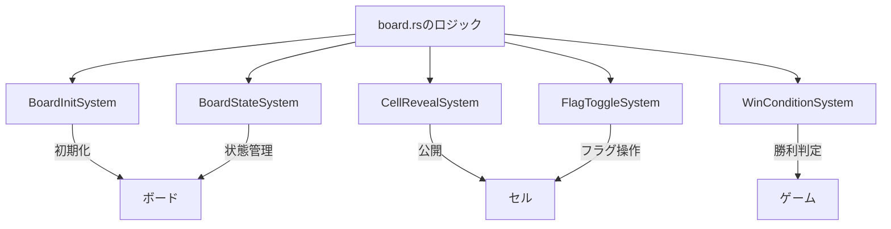
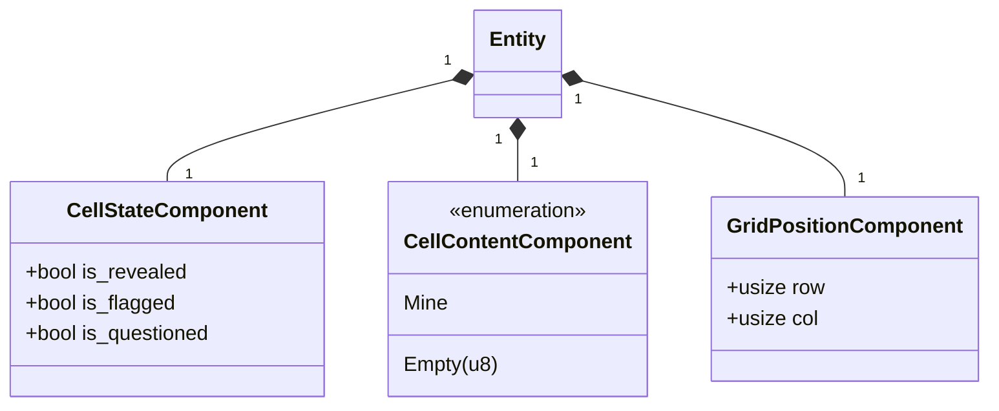
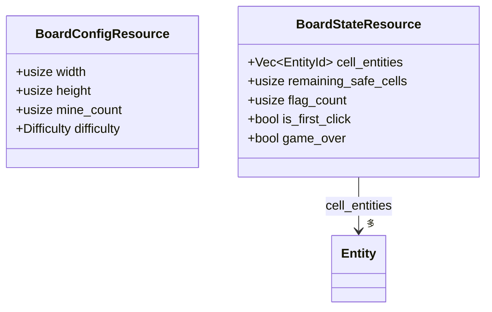
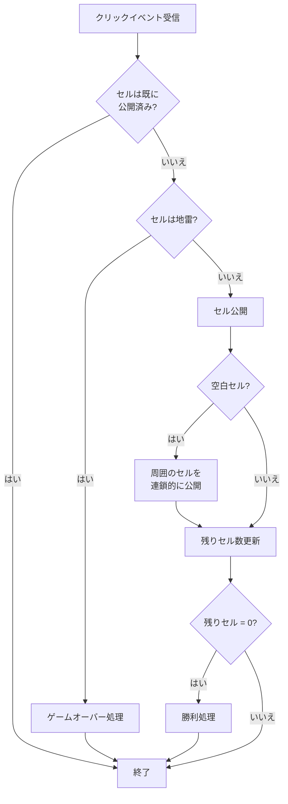
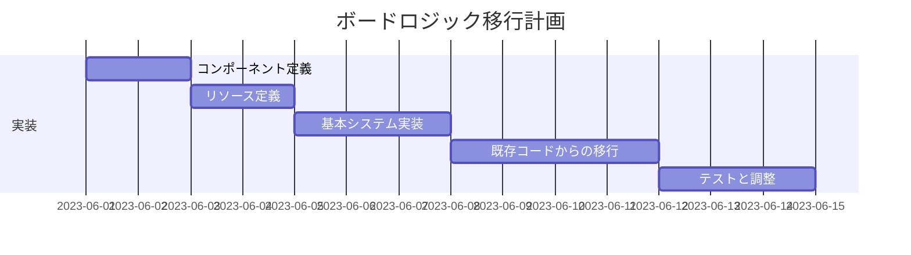

# ボードロジックをシステムへ移行

## 概要

現在、マインスイーパーのボードロジック（セル公開、フラグトグル、勝利条件チェックなど）は`board.rs`に集中しています。これをECSパターンのシステムとして再構築し、より疎結合で拡張性のある設計に変更します。

## 現状の問題点

1. ボードロジックが単一のモジュールに集中しており、責任の分離が不十分
2. エンティティとコンポーネントを使用しているが、システム化されていないため、ECSのメリットを十分に活かせていない
3. ロジックと状態管理が混在しており、拡張や変更が困難
4. テスト可能性が限られている

## 実装計画

### 1. 必要なシステムの特定

以下のボードロジック関連システムを設計・実装します：

各システムの役割:

1. **BoardInitSystem**
   - ボードの初期化、セルエンティティの生成
   - 地雷の配置、周囲の地雷数の計算

2. **CellRevealSystem**
   - セルの公開ロジック
   - 連鎖的な空白セルの公開
   - 地雷セルの公開（ゲームオーバー）

3. **FlagToggleSystem**
   - フラグ操作の処理
   - フラグカウントの更新

4. **WinConditionSystem**
   - 勝利条件のチェック
   - ゲーム終了の検出

5. **BoardStateSystem**
   - ボード全体の状態管理
   - ゲーム進行の追跡

### 2. ボード関連コンポーネントの設計

### 3. ボードリソースの設計

### 4. 各システムの実装

#### BoardInitSystem

**主な処理フロー**:
1. ボード設定に基づいてグリッドサイズを決定
2. 各セルのエンティティを作成
3. 初期状態のコンポーネントを割り当て
4. 地雷の配置（ファーストクリック安全のため、最初はダミー配置）
5. 周囲の地雷数を計算して`CellContentComponent`を更新
6. ボード状態リソースの初期化

#### CellRevealSystem

**主な処理フロー**:

#### FlagToggleSystem

**主な処理フロー**:
1. 右クリックイベントの受信
2. 対象セルの状態確認（公開済みの場合は何もしない）
3. フラグ状態の切り替え（なし→フラグ→疑問符→なし）
4. フラグカウントの更新
5. UI更新イベントの発行

#### WinConditionSystem

**主な処理フロー**:
1. 各フレームで勝利条件をチェック
2. 残りの安全セルが0になったら勝利
3. 勝利イベントの発行
4. ゲーム状態の更新

### 5. 既存コードからの移行プラン

1. **コンポーネント定義の実装**:
   - `src/components/board_components.rs`に上記コンポーネントを実装
   - テストを作成して動作確認

2. **リソース定義の実装**:
   - `src/resources/board_resources.rs`にリソースを実装
   - 初期化ロジックを追加

3. **システム実装**:
   - `src/systems/board_systems/`ディレクトリを作成
   - 各システムを実装
   - ユニットテスト作成

4. **既存ロジックのリファクタリング**:
   - 現在の`board.rs`の機能を新システムに移植
   - 段階的なテストと移行

5. **システムの登録と依存関係設定**:
   - システムレジストリにシステムを登録
   - 適切な実行順序を設定

### 6. テスト計画

1. **ユニットテスト**:
   - 各コンポーネントとリソースのテスト
   - 各システムの基本機能テスト

2. **インテグレーションテスト**:
   - システム間の相互作用テスト
   - シナリオベースのテスト（初期化→クリック→フラグ操作→勝利）

3. **エッジケーステスト**:
   - 境界のセル処理
   - 異常操作（既に公開されたセルのフラグトグルなど）

4. **パフォーマンステスト**:
   - 大きなボードでの初期化速度
   - 連鎖公開時のパフォーマンス

## 期待される効果

1. 単一責任の原則に基づくクリーンな設計
2. 各ボードロジックの独立したテストが可能に
3. 拡張性の向上（新しいボード機能の追加が容易）
4. 並列処理の可能性（依存関係のないシステムの並列実行）
5. イベント駆動型の自然な設計

## リスクと対策

1. **リスク**: セル間の相互作用が複雑で移行が困難
   **対策**: エンティティ間の関係をインデックスベースで管理し、効率的なクエリを実装

2. **リスク**: パフォーマンスへの悪影響
   **対策**: 頻繁に使用されるクエリには専用のインデックスを作成

3. **リスク**: 連鎖公開ロジックの複雑さ
   **対策**: 再帰的な処理からイテレーティブな処理に変更し、スタックオーバーフローを防ぐ

## タイムライン

1. コンポーネントとリソースの設計・実装: 1日
2. 基本システム（初期化、公開）の実装: 1.5日
3. 高度なシステム（勝利チェック、フラグ）の実装: 1.5日
4. 既存コードからの移行と統合: 2日
5. テストとデバッグ: 1.5日
6. パフォーマンス最適化: 0.5日

**合計推定時間**: 8日 