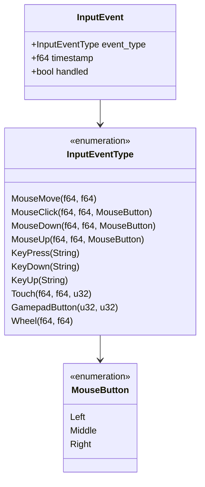
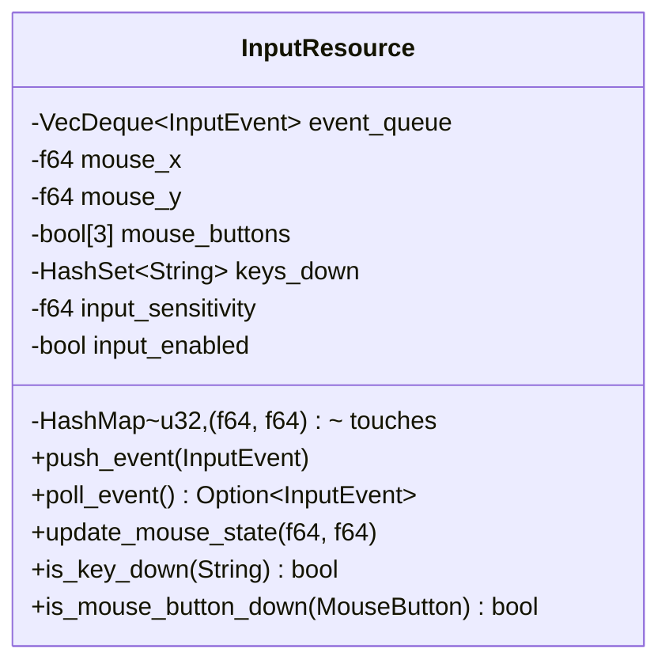
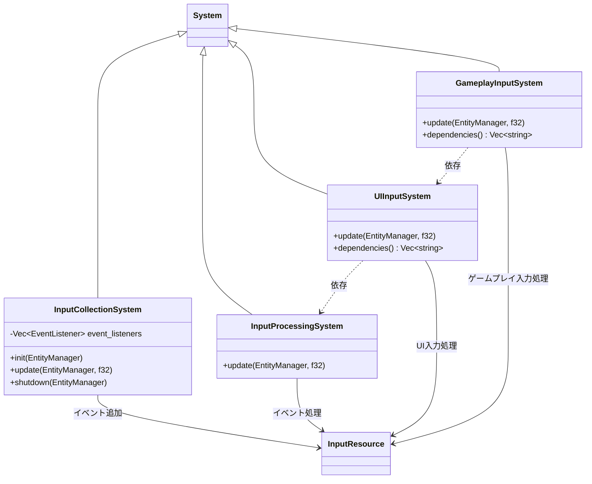
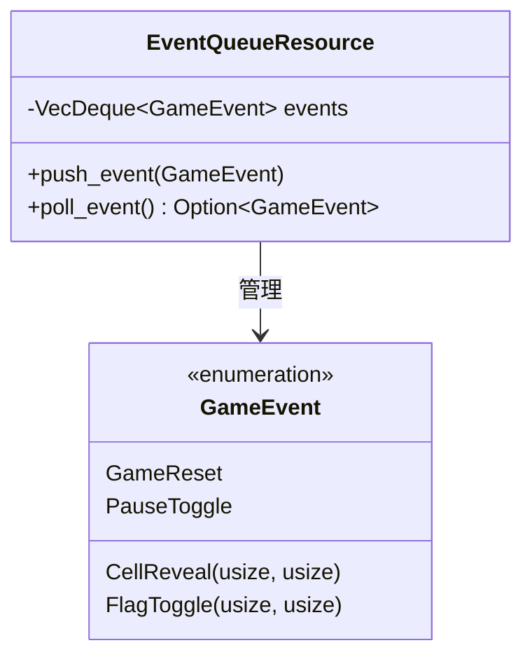
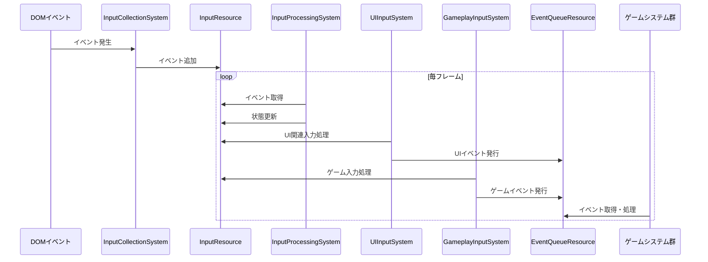
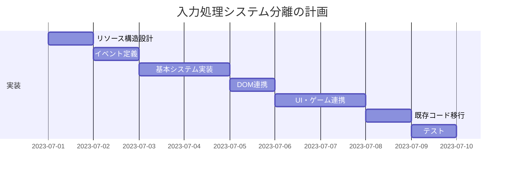

# 入力処理のシステム分離

## 概要

現在の入力処理はイベントハンドラとグローバル関数に依存しており、ゲームロジックと密結合しています。この計画では、入力処理をECSパターンのシステムとして分離し、イベント駆動型の設計に移行します。マウス入力や他の入力デバイスからの入力をクリーンな形でゲームロジックに橋渡しする仕組みを構築します。

## 現状の問題点

1. 入力処理とゲームロジックが密結合している
2. グローバル関数やコールバックへの依存度が高い
3. 異なる入力デバイスや入力方法への拡張が困難
4. テスト可能性が低い（イベントのモックが難しい）
5. 入力イベントとゲームロジックの間の明確な境界がない

## 実装計画

### 1. 入力イベントの抽象化

ユーザー入力をイベントとして抽象化し、標準化されたフォーマットで処理します。

### 2. 入力リソースの設計

ゲーム内で入力状態を追跡するリソースを設計します。

### 3. 入力システム群の設計

入力処理を担当する複数のシステムを設計します。

以下にそれぞれのシステムの役割を説明します：

**InputCollectionSystem**
- DOMイベントリスナーを設定
- マウス・キーボード・タッチイベントを捕捉
- イベントをInputResourceのキューに変換して追加

**InputProcessingSystem**
- イベントキューからイベントを取り出す
- 入力状態を更新（マウス位置、ボタン状態など）
- 汎用的な入力処理を実行

**UIInputSystem**
- UI要素に対する入力処理を担当
- ヒットテストを実行してUIとの相互作用を検出
- UIイベントを発行

**GameplayInputSystem**
- ゲームプレイ関連の入力処理を担当
- ボード上のセル位置の計算
- ゲームアクション（セル公開、フラグトグル）の発行

### 4. イベント設計

ゲーム内イベントを定義して、入力システムとゲームロジック間の通信を実現します。

### 5. 入力処理のフロー

新しい入力処理の流れを以下に示します：

### 6. 既存コードからの移行ステップ

1. **InputResource、EventQueueResourceの実装**:
   - `src/resources/input_resource.rs`
   - `src/resources/event_queue_resource.rs`

2. **入力システムの実装**:
   - `src/systems/input/input_collection_system.rs`
   - `src/systems/input/input_processing_system.rs`
   - `src/systems/input/ui_input_system.rs`
   - `src/systems/input/gameplay_input_system.rs`

3. **DOM イベントハンドラの移行**:
   - 既存のイベントハンドラをInputCollectionSystemに移行
   - グローバルコールバックからシステムベースの処理に変更

4. **イベント発行とハンドリングの導入**:
   - 入力システムからGameEventの発行
   - 他のシステムでのイベントハンドリング

5. **既存入力処理コードの段階的な削除**:
   - 新しいシステムが機能するようになった後、古いコードを削除

### 7. テスト計画

1. **InputResourceの単体テスト**:
   - イベントキューの操作
   - 状態追跡のテスト

2. **入力システムのテスト**:
   - モックイベントによるテスト
   - システム依存関係のテスト

3. **イベントシステムのテスト**:
   - イベント発行と受信のテスト
   - イベント処理順序のテスト

4. **エンドツーエンドテスト**:
   - 入力から反応までの一連のフローテスト
   - 異なる入力デバイスのシミュレーション

## 期待される効果

1. 入力処理とゲームロジックの明確な分離
2. テスト容易性の向上
3. 新しい入力方法（タッチ、ゲームパッドなど）への拡張が容易に
4. イベント駆動型アーキテクチャによるコードの疎結合化
5. 入力状態の一元管理による一貫性の向上

## リスクと対策

1. **リスク**: DOMイベントとECSサイクルの同期問題
   **対策**: イベントキューを使用して非同期イベントを同期的に処理

2. **リスク**: パフォーマンスオーバーヘッド（イベントの多重処理）
   **対策**: イベントのバッチ処理と最適化

3. **リスク**: 既存コードからの移行中の機能停止
   **対策**: フォールバックメカニズムと段階的な移行

4. **リスク**: WebAssemblyとDOMイベントの連携の複雑さ
   **対策**: 明確なインターフェイスと最小限の依存関係

## タイムライン

1. リソースとイベントシステム設計: 1日
2. 基本入力システム実装: 1.5日
3. DOM イベントハンドラ統合: 1日
4. 高度な入力処理（UI、ゲームプレイ）: 1.5日
5. 既存コードからの移行: 1日
6. テストとデバッグ: 1日

**合計推定時間**: 7日 