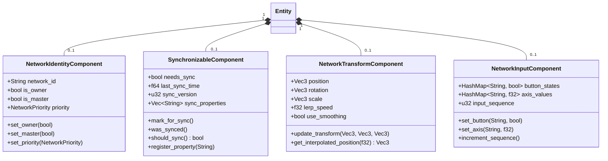
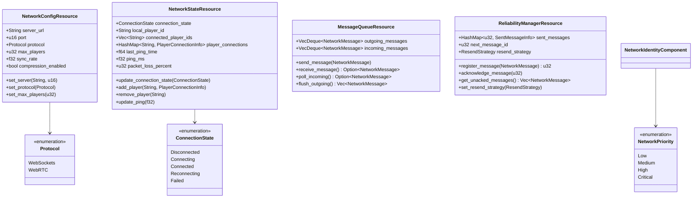
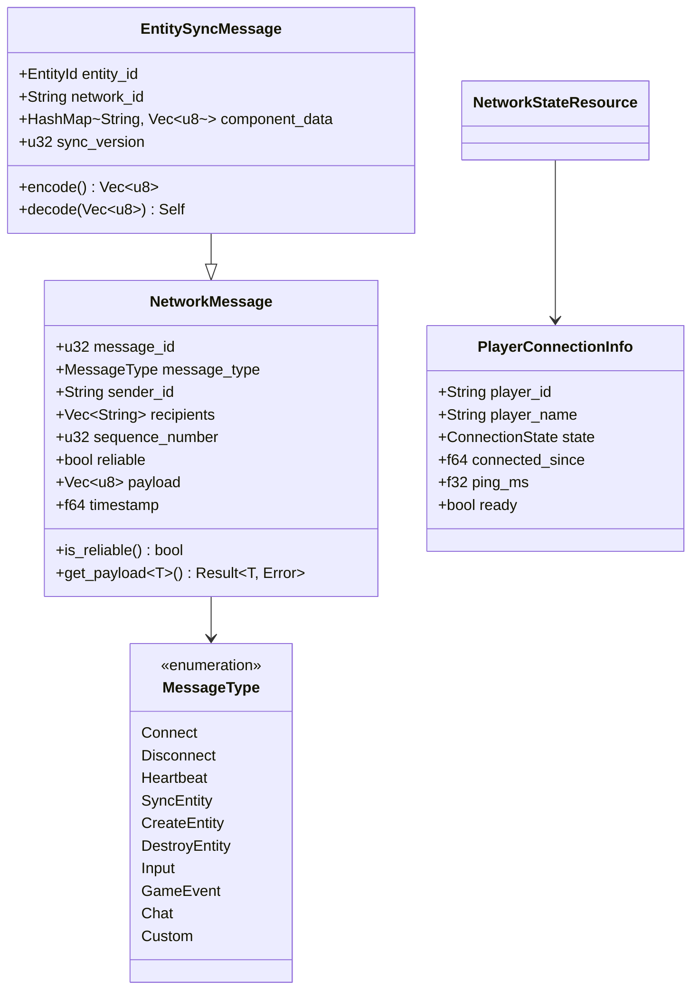
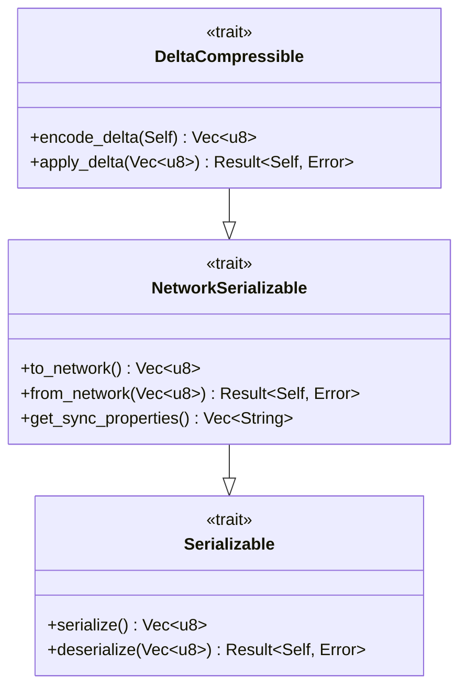
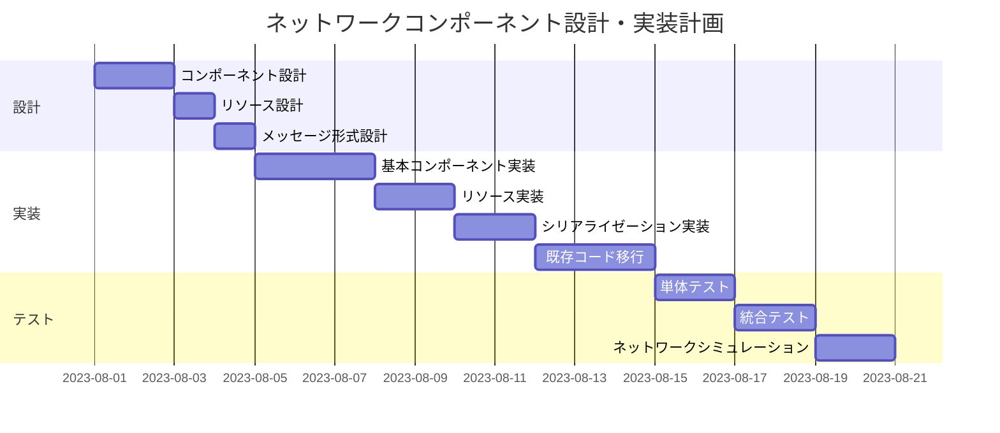

# ネットワークコンポーネントの設計

## 概要

マルチプレイヤーマインスイーパーのネットワーク機能をECSアーキテクチャに統合するために、適切なネットワークコンポーネントとリソースの設計が必要です。この計画では、プレイヤー間の同期、メッセージの送受信、ネットワーク状態管理を行うためのコンポーネントを設計します。

## 現状の問題点

1. 現在のネットワークコードはECSパターンと統合されていない
2. プレイヤー間の同期ロジックが散在している
3. メッセージの送受信処理がゲームロジックと密結合している
4. エンティティの同期に標準化された方法がない
5. ネットワークの遅延や切断の処理がロバストでない

## 実装計画

### 1. ネットワークコンポーネントの設計

ECSパターンにおけるネットワーク関連のコンポーネントとして以下を設計します:

### 2. ネットワークリソースの設計

ネットワーク状態と設定を管理するリソースを設計します：

### 3. ネットワークメッセージの定義

### 4. シリアライゼーション支援トレイト

### 5. 既存コードからの移行ステップ

1. **基本コンポーネントの実装**:
   - `src/components/network_components.rs`に上記コンポーネントを実装
   - コンポーネントのシリアライゼーション機能を開発
   - ユニットテスト作成

2. **ネットワークリソースの実装**:
   - `src/resources/network_resources.rs`にリソースを実装
   - 接続状態管理コードを移行
   - メッセージキュー機能の実装

3. **既存ネットワークコードのリファクタリング**:
   - 現在の`network.rs`の機能を新しいコンポーネントとリソースに移行
   - WebSocketコードをECSフレームワークと統合

4. **同期ロジックの実装**:
   - エンティティの同期ルールを確立
   - 差分更新（デルタ圧縮）機能の実装
   - 権限管理（オーナーシップ）の実装

5. **テストとデバッグ**:
   - ネットワークテスト環境の構築
   - シミュレーションによる遅延とパケットロスのテスト

### 6. テスト計画

1. **コンポーネントのユニットテスト**:
   - シリアライゼーション/デシリアライゼーションのテスト
   - ネットワークID管理のテスト
   - 同期フラグのテスト

2. **リソースのユニットテスト**:
   - メッセージキューの操作テスト
   - ネットワーク状態管理のテスト
   - 再送信戦略のテスト

3. **統合テスト**:
   - ローカルネットワーク環境でのエンティティ同期テスト
   - クライアント間の対話テスト
   - ネットワーク切断と再接続のテスト

4. **パフォーマンステスト**:
   - 同期パフォーマンスのベンチマーク
   - 帯域使用量の測定
   - 大量のエンティティ同期時の動作確認

## 期待される効果

1. ネットワークコードとゲームロジックの明確な分離
2. 拡張性の向上（新しい同期タイプやプロトコルの追加が容易）
3. ネットワーク関連の問題診断とデバッグの容易化
4. 帯域の効率的な使用（デルタ圧縮、優先度ベースの同期）
5. ネットワーク障害への堅牢な対応

## リスクと対策

1. **リスク**: WebAssemblyからのネットワークAPI制限
   **対策**: JavaScriptブリッジを通じた適切なラッパーの実装

2. **リスク**: 非同期処理とECSサイクルの整合性
   **対策**: メッセージキューを使用した非同期→同期変換

3. **リスク**: 大規模な同期時のパフォーマンス問題
   **対策**: 優先度ベースの同期と差分更新の実装

4. **リスク**: 複雑なネットワークエッジケースの処理
   **対策**: 徹底的なテストとシミュレーション環境の構築

## タイムライン

1. ネットワークコンポーネントとリソースの設計: 2日
2. 基本実装（コンポーネント、リソース）: 3日
3. シリアライゼーションシステムの実装: 2日
4. 既存コードからの移行: 3日
5. テストとシミュレーション: 4日
6. パフォーマンス最適化: 2日

**合計推定時間**: 16日 