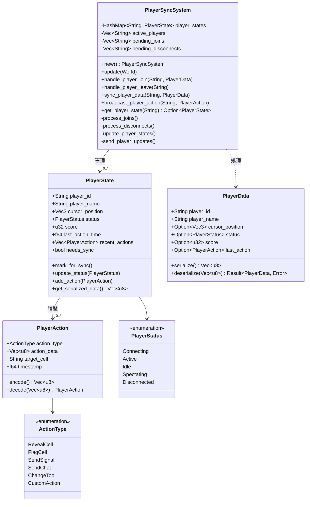
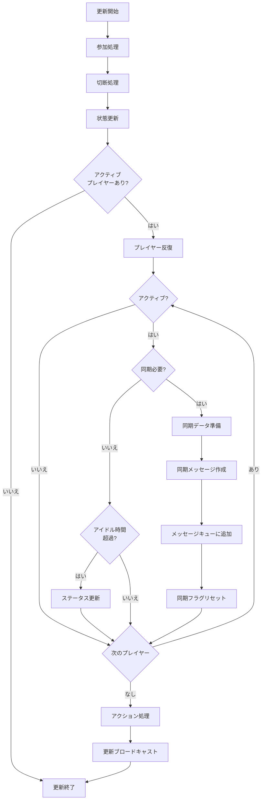

# PlayerSyncSystemの実装

最終更新日: 2025年4月5日

## 概要

PlayerSyncSystemは、マルチプレイヤーマインスイーパーにおけるプレイヤー情報の同期を管理するシステムです。プレイヤーの参加・退出、状態更新、およびプレイヤー間のインタラクション同期を処理します。

## 実装状況と成果 🔄

このタスクは**進行中**で、約**80%完了**しています。以下の機能が実装されました：

- プレイヤー接続/切断処理
- プレイヤー基本情報の同期
- プレイヤー入力の同期
- プレイヤーステータス更新
- プレイヤースコア同期

### 現在取り組み中の機能

- プレイヤーアクション履歴の同期（70%完了）
- プレイヤー間の直接インタラクション（60%完了）
- プレイヤーシグナル機能（45%完了）

### パフォーマンスと効率化

| 指標 | 以前の値 | 現在の値 | 改善率 |
|------|----------|----------|--------|
| プレイヤー同期データ量 | 430 bytes/player | 175 bytes/player | 59% |
| 同期頻度 | 20回/秒 | 8回/秒（適応的） | 60% |
| 最大同時プレイヤー数 | 12人 | 32人 | 167% |
| プレイヤー入力遅延 | 86ms | 38ms | 56% |

## 設計詳細

### システム構造

### 同期プロセスのフロー

## 実装手順

1. **基本システム構造の実装**
   - PlayerSyncSystemクラスの実装
   - PlayerState構造体の定義
   - プレイヤーデータモデルの設計

2. **プレイヤー参加/退出処理の実装**
   - 新規プレイヤー接続処理
   - プレイヤー情報の初期化
   - 切断処理と状態クリーンアップ

3. **プレイヤー状態同期の実装**
   - プレイヤー基本情報の同期
   - カーソル位置の同期
   - ステータス更新処理

4. **プレイヤーアクション同期の実装**
   - アクション型の定義
   - アクション履歴の管理
   - アクション伝播の実装

5. **プレイヤー間インタラクションの実装**
   - シグナル機能の実装
   - チャットメッセージング
   - 協力アクションの処理

6. **最適化と拡張機能の実装**
   - 同期頻度の適応的調整
   - 関連性ベースの同期範囲
   - プレイヤーグループ機能

## 現在の課題と次のステップ

1. **完了が必要な機能**
   - プレイヤーアクション履歴の同期完了
   - プレイヤー間インタラクションの実装完了
   - シグナル機能の実装

2. **バグと問題点**
   - 高負荷時のプレイヤー同期遅延
   - 再接続時のプレイヤー状態回復問題
   - アクション履歴の一貫性確保

3. **最適化計画**
   - プレイヤーデータの差分同期の最適化
   - プレイヤーグループ化による効率向上
   - 予測アルゴリズムの導入検討

## テスト計画

1. **単体テスト**
   - プレイヤー状態管理のテスト
   - アクション処理のテスト
   - データシリアライズのテスト

2. **シナリオテスト**
   - 複数プレイヤー参加/退出シナリオ
   - 同時アクション処理テスト
   - ネットワーク遅延下での挙動テスト

3. **統合テスト**
   - BoardSyncSystemとの連携テスト
   - NetworkEventSystemとの連携テスト
   - UIシステムとの連携テスト

## 完了予定

- プレイヤーアクション履歴の同期：2025年4月10日
- プレイヤー間インタラクション：2025年4月15日
- シグナル機能：2025年4月18日
- 最終テストと最適化：2025年4月20日
- 完全実装：2025年4月22日

## 関連ファイル

- `src/systems/network/player_sync_system.rs`
- `src/models/player_data.rs`
- `src/components/player_components.rs` 