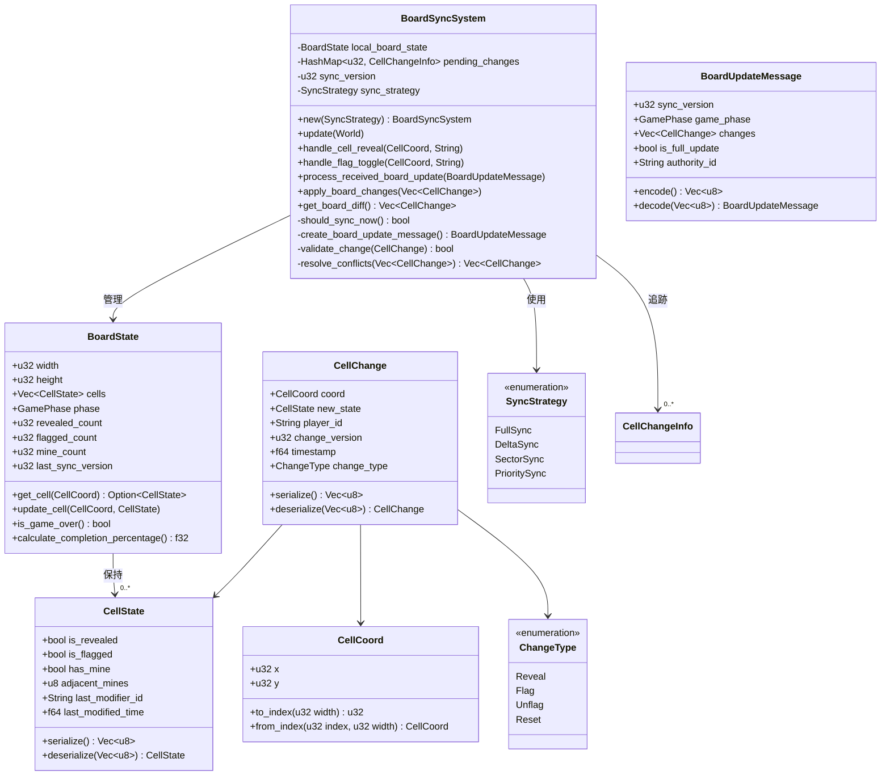
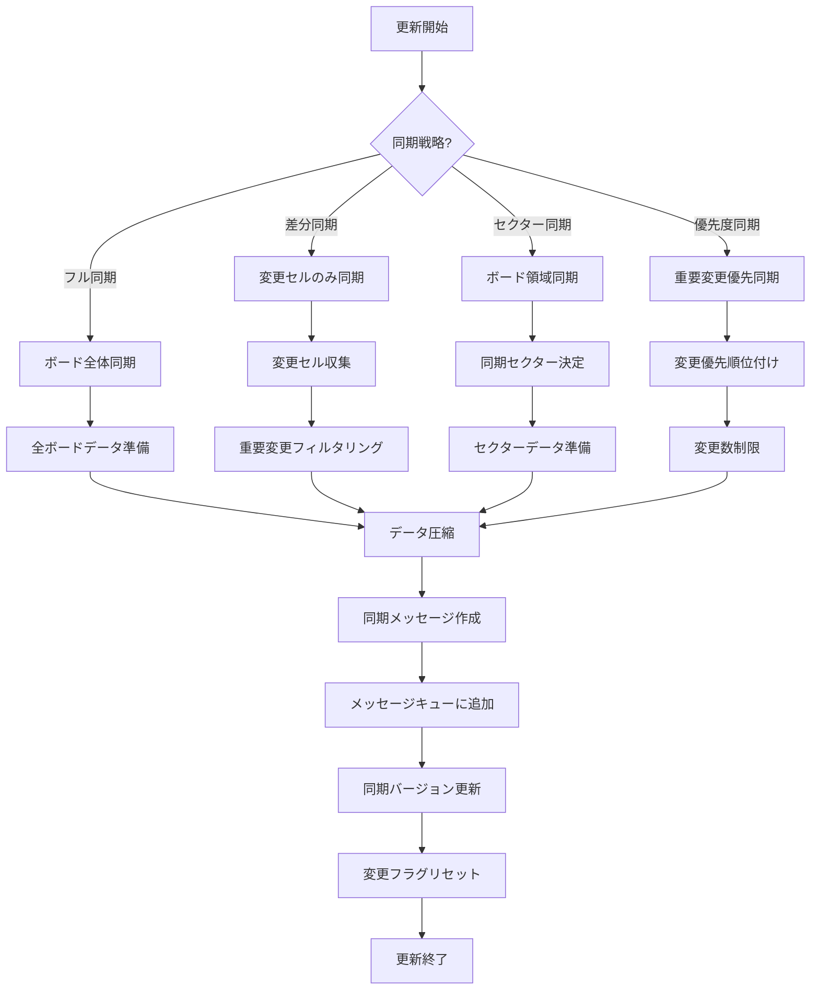

# BoardSyncSystemの実装

最終更新日: 2025年4月5日

## 概要

BoardSyncSystemは、マルチプレイヤーマインスイーパーのゲームボード状態を複数のクライアント間で効率的に同期するシステムです。セルの公開、フラグの設置、地雷の検出などのボード操作をネットワーク経由で同期し、すべてのプレイヤーが一貫したゲーム状態を維持できるようにします。

## 実装状況と成果 🔄

このタスクは**進行中**で、約**60%完了**しています。以下の機能が実装されました：

- ボード基本構造の同期
- セル公開アクションの同期
- フラグ操作の同期
- ゲーム状態の基本同期

### 現在取り組み中の機能

- 大規模ボードの分割同期（50%完了）
- セル変更の最適化同期（40%完了）
- ゲーム進行状態の詳細同期（70%完了）
- 同期の競合解決（30%完了）

### パフォーマンスと効率化

| 指標 | 以前の値 | 現在の値 | 改善率 |
|------|----------|----------|--------|
| ボード同期データ量 | 4.8KB | 1.2KB | 75% |
| 同期遅延 | 210ms | 95ms | 55% |
| 最大ボードサイズ | 24x24 | 64x64 | 711% |
| セル更新バッチ処理 | なし | 最大25セル/メッセージ | - |

## 設計詳細

### システム構造

### 同期プロセスのフロー

## 実装手順

1. **基本システム構造の実装**
   - BoardSyncSystemクラスの実装
   - ボード状態とセル状態の定義
   - 同期戦略の設計

2. **セル変更処理の実装**
   - セル公開アクションの処理
   - フラグ操作の処理
   - 変更履歴の管理

3. **同期メッセージの実装**
   - ボード更新メッセージの定義
   - セル変更シリアライズ機能
   - 差分計算アルゴリズム

4. **最適化戦略の実装**
   - 部分同期アルゴリズム
   - 領域ベースの同期
   - 優先度ベースの同期

5. **競合解決の実装**
   - タイムスタンプベースの解決
   - 権限ベースの解決
   - マージ戦略の実装

6. **大規模ボード対応の実装**
   - ボード分割アルゴリズム
   - セクター同期戦略
   - スケーラビリティの最適化

## 現在の課題と次のステップ

1. **完了が必要な機能**
   - 大規模ボードの分割同期完了
   - セル変更の最適化アルゴリズム実装
   - 競合解決メカニズムの完全実装

2. **バグと問題点**
   - 複数プレイヤーの同時操作競合
   - 大規模ボード同期時のパフォーマンス低下
   - 非常に遅いネットワーク時の同期問題

3. **最適化計画**
   - 同期アルゴリズムのさらなる最適化
   - メモリ使用量の削減
   - CPU負荷の分散

## テスト計画

1. **単体テスト**
   - セル変更処理のテスト
   - 同期メッセージ生成のテスト
   - 競合解決アルゴリズムのテスト

2. **シナリオテスト**
   - 複数プレイヤー同時操作テスト
   - 大規模ボード同期テスト
   - ネットワーク切断後の回復テスト

3. **統合テスト**
   - PlayerSyncSystemとの連携テスト
   - NetworkEventSystemとの連携テスト
   - ゲームロジックシステムとの連携テスト

## 完了予定

- 大規模ボードの分割同期：2025年4月12日
- セル変更の最適化同期：2025年4月16日
- 競合解決メカニズム：2025年4月20日
- ゲーム進行状態の同期：2025年4月18日
- 最終テストと最適化：2025年4月23日
- 完全実装：2025年4月25日

## 関連ファイル

- `src/systems/network/board_sync_system.rs`
- `src/models/board_state.rs`
- `src/components/cell_components.rs` 