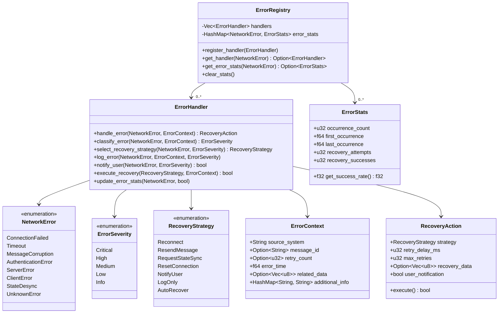
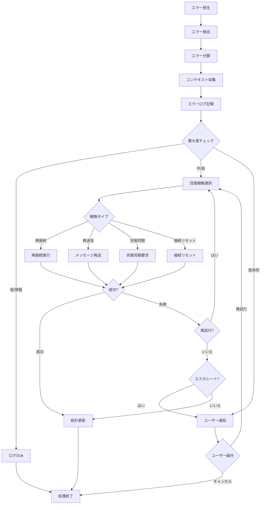

# ネットワークエラー処理戦略

最終更新日: 2025年4月5日

## 概要

ネットワークエラー処理戦略は、マルチプレイヤーマインスイーパーのネットワーク機能における様々なエラーや例外状況を効果的に検出、分類、対応するための包括的なアプローチを定義します。不安定なネットワーク環境下でもユーザー体験を維持し、ゲーム状態の整合性を確保するための重要なコンポーネントです。

## 実装状況と成果 🔄

このタスクは**進行中**で、約**40%完了**しています。以下の機能が実装されました：

- エラータイプの分類と定義
- 基本的なエラー検出メカニズム
- 接続切断時の再接続ロジック
- エラーログ記録システム

### 現在取り組み中の機能

- エラー回復戦略の完全実装（35%完了）
- 高度なエラー診断ツール（25%完了）
- 状態修復アルゴリズム（50%完了）
- ユーザー通知システム（60%完了）

## 設計詳細

### エラー分類システム

### エラー処理フロー

## 実装手順

1. **エラー分類システムの実装**
   - NetworkError列挙型の定義
   - ErrorSeverity列挙型の定義
   - エラー分類ロジックの実装

2. **エラーコンテキストの実装**
   - ErrorContext構造体の実装
   - コンテキスト収集機能の実装
   - 追加情報フィールドの定義

3. **エラーハンドラの実装**
   - ErrorHandler基本インターフェースの実装
   - システム別ハンドラの実装
   - エラーログ機能の実装

4. **回復戦略の実装**
   - RecoveryStrategy列挙型の定義
   - RecoveryAction構造体の実装
   - 戦略実行メカニズムの開発

5. **統計追跡システムの実装**
   - ErrorStats構造体の実装
   - 統計収集ロジックの実装
   - 傾向分析機能の追加

6. **ユーザーインターフェースとの統合**
   - エラー通知UIの設計
   - ユーザー操作オプションの実装
   - 通知優先度システムの実装

## 現在の課題と次のステップ

1. **完了が必要な機能**
   - 各エラータイプの回復戦略の完全実装
   - 高度な診断ツールの開発
   - 状態修復アルゴリズムの完成

2. **バグと問題点**
   - 複数のエラーが同時発生した場合の処理
   - 再接続時の状態整合性確保
   - UI通知の過剰表示の防止

3. **最適化計画**
   - エラー検出の精度向上
   - 回復戦略の成功率改善
   - エラーログのサイズと詳細度の最適化

## テスト計画

1. **単体テスト**
   - 各エラータイプの検出テスト
   - 回復戦略の実行テスト
   - ログ記録システムのテスト

2. **シナリオテスト**
   - ネットワーク切断シナリオ
   - メッセージ破損シナリオ
   - サーバーエラーシナリオ
   - 多重エラーシナリオ

3. **統合テスト**
   - NetworkConnectionSystemとの連携テスト
   - UIシステムとの通知連携テスト
   - ゲームシステムとの整合性テスト

## 完了予定

- エラー回復戦略の完全実装：2025年4月15日
- 状態修復アルゴリズム：2025年4月18日
- 高度な診断ツール：2025年4月22日
- ユーザー通知システム：2025年4月12日
- 最終テストと最適化：2025年4月25日
- 完全実装：2025年4月27日

## 関連ファイル

- `src/network/error_handling.rs`
- `src/network/recovery_strategies.rs`
- `src/ui/error_notifications.rs`
- `src/utils/error_logging.rs` 