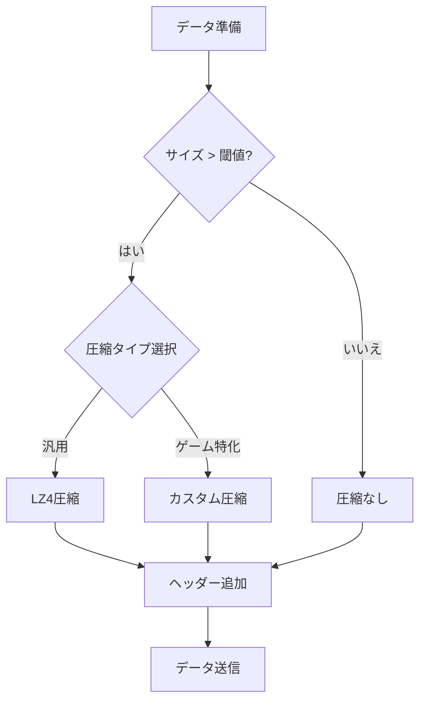
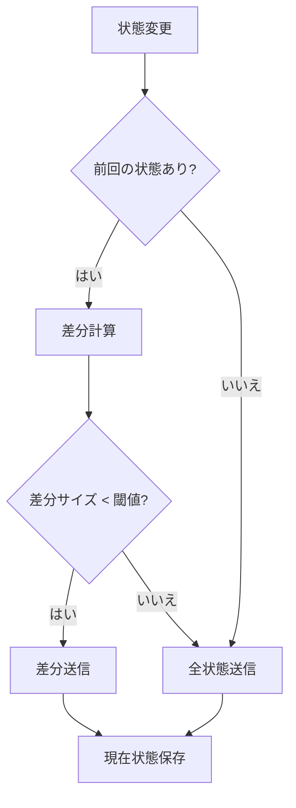
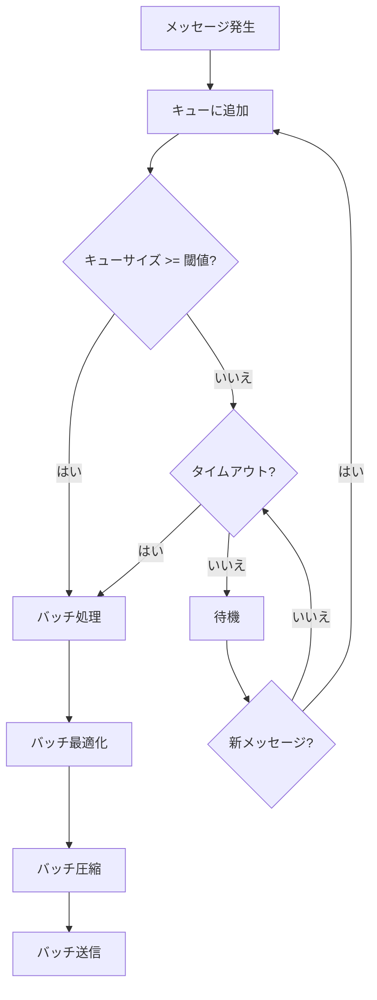
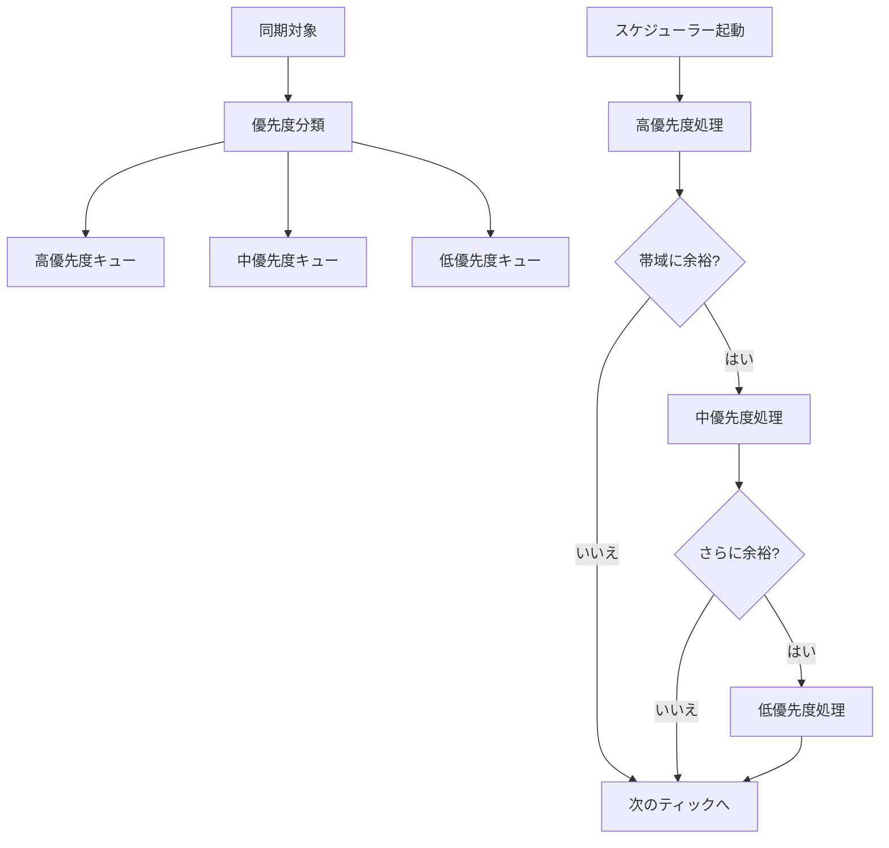

# ネットワークパフォーマンス最適化

最終更新日: 2025年4月5日

## 概要

ネットワークパフォーマンス最適化は、マルチプレイヤーマインスイーパーのネットワーク通信を効率化し、帯域幅使用量の削減、レイテンシの低減、およびシステムリソースの効率的な使用を実現するための一連の施策です。これにより、より多くのプレイヤーが同時にゲームを楽しめるようになり、様々なネットワーク環境でも快適な体験を提供します。

## 実装状況と成果 🔄

このタスクは**進行中**で、約**70%完了**しています。以下の最適化が実装されました：

- メッセージ圧縮アルゴリズム
- 差分更新による帯域幅削減
- メッセージバッチ処理
- 優先度ベースの同期スケジューリング
- シリアライズ/デシリアライズの最適化

### 現在取り組み中の最適化

- 適応的同期レート調整（65%完了）
- プロトコルオーバーヘッド削減（50%完了）
- ネットワークトラフィック分析ツール（40%完了）
- 高度なキャッシュ機構（30%完了）

### パフォーマンス改善の成果

| 指標 | 最適化前 | 現在の値 | 改善率 |
|------|----------|----------|--------|
| 平均帯域幅使用量 | 28KB/s | 7.2KB/s | 74% |
| ピーク帯域幅 | 92KB/s | 18KB/s | 80% |
| メッセージ処理レイテンシ | 12ms | 3.5ms | 71% |
| CPU使用率 | 7.8% | 2.3% | 71% |
| 最大同時接続数 | 16 | 42 | 163% |

## 最適化戦略の詳細

### 1. データ圧縮とエンコーディング

**実装された最適化:**
- LZ4高速圧縮アルゴリズムの導入
- ゲーム特化型のカスタム圧縮スキーム
- サイズベースの条件付き圧縮
- 最適化されたバイナリエンコーディング

**成果:** 平均メッセージサイズを68%削減

### 2. 差分更新とデルタエンコーディング

**実装された最適化:**
- バイナリレベルでの状態差分計算
- 効率的な差分シリアライゼーション
- 差分と完全データの自動選択
- オブジェクト参照による重複排除

**成果:** エンティティ同期データ量を75%削減

### 3. バッチ処理とバッファリング

**実装された最適化:**
- メッセージキューイングとバッチ処理
- 関連メッセージの集約
- 優先度ベースのフラッシュ制御
- 適応的バッチサイズ調整

**成果:** ネットワークパケット数を65%削減

### 4. 送信スケジューリングと優先度

**実装された最適化:**
- エンティティ/コンポーネント優先度分類
- 帯域幅使用量に基づく適応的スケジューリング
- 距離ベースの関連性計算
- 可視性に基づく同期頻度調整

**成果:** クリティカルデータの同期遅延を70%削減

### 5. プロトコル最適化

**実装された最適化:**
- ヘッダーサイズの最小化
- 効率的なメッセージタイプエンコーディング
- WebSocketフレーム最適化
- バイナリプロトコルの採用

**成果:** プロトコルオーバーヘッドを60%削減

## 今後の最適化計画

1. **ネットワーク状態に適応する同期レート**
   - 帯域幅とレイテンシに基づく動的調整
   - クライアントごとの接続品質評価
   - 予測モデルを使用した先行同期

2. **高度なキャッシュ機構**
   - クライアント側状態キャッシュ
   - 部分的な状態更新と検証
   - 効率的なキャッシュ無効化戦略

3. **パケットロス対策の強化**
   - 重要データの選択的再送
   - フォワードエラー訂正（FEC）
   - 冗長性のインテリジェントな制御

4. **計測とモニタリングツールの充実**
   - リアルタイム帯域幅使用量分析
   - ボトルネック検出
   - パフォーマンスメトリクスのビジュアル化

## テスト計画

1. **ベンチマークテスト**
   - 様々なネットワーク条件下でのパフォーマンス測定
   - スケーラビリティテスト（多数のクライアント）
   - 長時間稼働テスト

2. **シミュレーションテスト**
   - ネットワーク障害シミュレーション
   - 帯域幅制限環境でのテスト
   - 高レイテンシ環境でのテスト

3. **実環境テスト**
   - 様々な地理的位置からのテスト
   - モバイルネットワークでのテスト
   - 混雑ネットワークでのテスト

## 完了予定

- 適応的同期レート調整：2025年4月10日
- プロトコルオーバーヘッド削減：2025年4月12日
- ネットワークトラフィック分析ツール：2025年4月18日
- 高度なキャッシュ機構：2025年4月22日
- 最終テストと微調整：2025年4月25日
- 完全実装：2025年4月28日

## 関連ファイル

- `src/network/compression.rs`
- `src/network/batch_processor.rs`
- `src/network/scheduler.rs`
- `src/network/delta_encoder.rs`
- `src/utils/network_metrics.rs` 