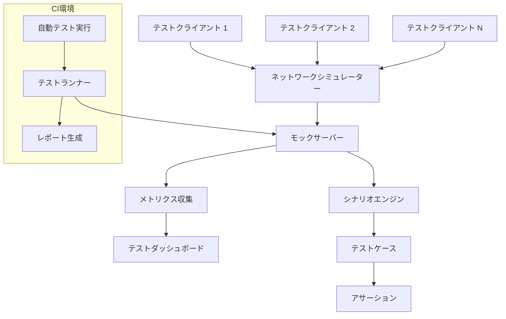
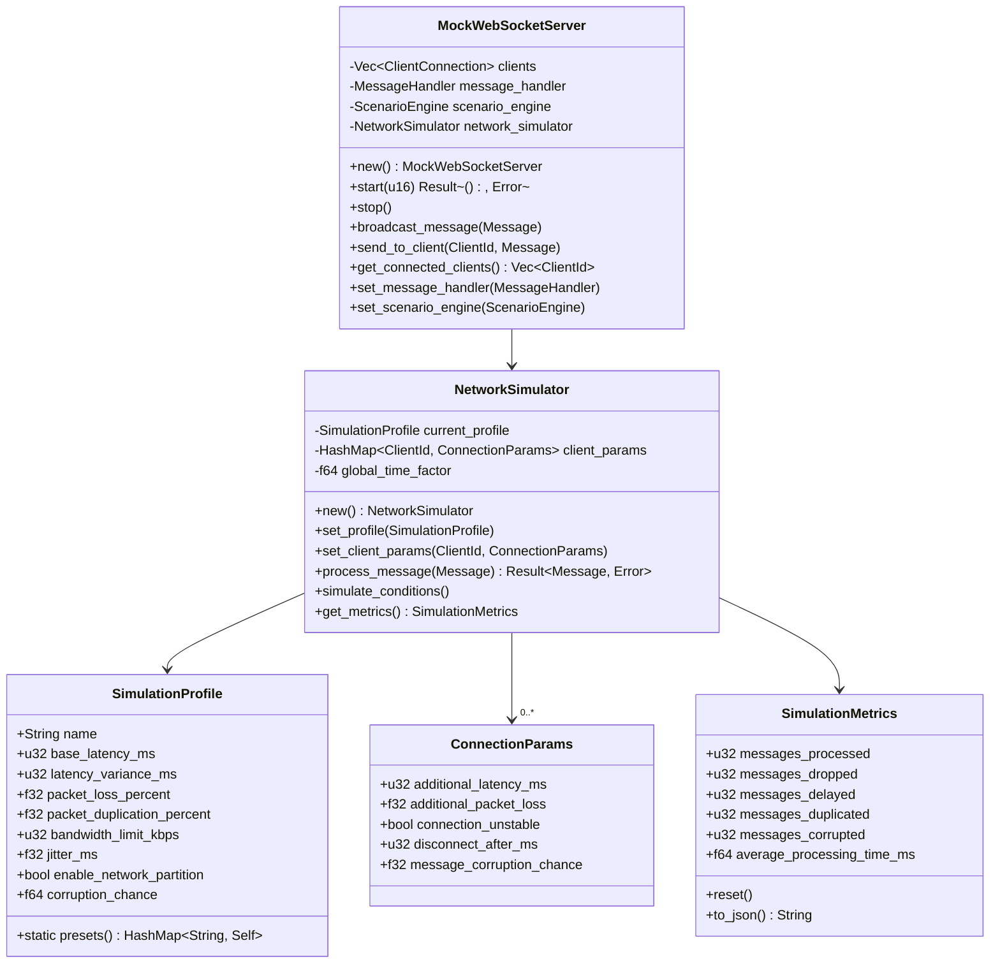
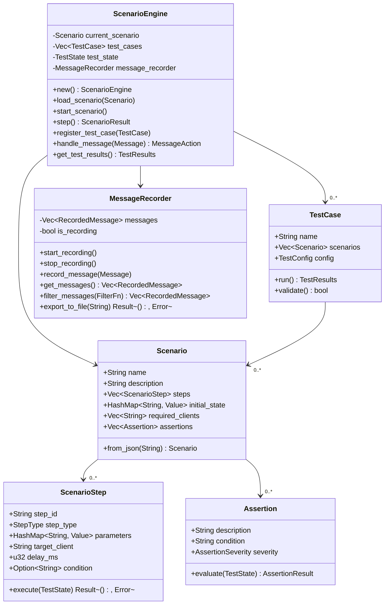

# ネットワークテスト環境の構築

最終更新日: 2025年4月5日

## 概要

ネットワークテスト環境は、マルチプレイヤーマインスイーパーのネットワーク機能を様々な条件下で効率的にテスト、検証、評価するための包括的なフレームワークです。この環境により、実際のネットワーク状況を模擬しながら、安定性、パフォーマンス、スケーラビリティを検証することが可能になります。

## 実装状況と成果 🔄

このタスクは**進行中**で、約**65%完了**しています。以下の機能が実装されました：

- モックWebSocketサーバー
- ネットワーク条件シミュレーター（遅延、パケットロス）
- 自動化テストフレームワーク
- クライアント動作レコーダー
- パフォーマンスメトリクス収集

### 現在取り組み中の機能

- 負荷テスト自動化（50%完了）
- エッジケーステスト環境（35%完了）
- ネットワークトラフィック分析ツール（70%完了）
- 継続的インテグレーションパイプライン（60%完了）

## 設計詳細

### テスト環境のアーキテクチャ



### ネットワークシミュレーション機能



### テストシナリオとケース



## 実装手順

1. **基本テストフレームワークの実装**
   - モックWebSocketサーバーの実装
   - クライアント接続シミュレーターの実装
   - テスト実行環境の構築

2. **ネットワーク条件シミュレーターの実装**
   - 遅延シミュレーション機能
   - パケットロスシミュレーション
   - 帯域幅制限シミュレーション
   - 接続不安定性シミュレーション

3. **テストシナリオエンジンの実装**
   - シナリオ定義フォーマットの設計
   - シナリオ実行エンジンの実装
   - アサーション機能の実装

4. **メトリクス収集システムの実装**
   - パフォーマンスメトリクス定義
   - データ収集メカニズムの実装
   - レポート生成機能の実装

5. **自動化テストフレームワークの統合**
   - CI/CDパイプラインとの統合
   - 自動テスト実行スクリプトの開発
   - テスト結果分析ツールの実装

6. **負荷テスト環境の構築**
   - 多数クライアントシミュレーターの実装
   - リソース使用量モニタリング
   - スケーラビリティテスト機能の実装

## 現在の課題と次のステップ

1. **完了が必要な機能**
   - 負荷テスト自動化の完成
   - エッジケーステスト環境の構築
   - CI/CDパイプラインとの完全統合

2. **課題と問題点**
   - 実際のネットワーク条件の正確な再現
   - 多数クライアントシミュレーション時のホストリソース制限
   - テスト結果の再現性確保

3. **最適化計画**
   - テスト実行時間の短縮
   - リソース使用量の最適化
   - テストカバレッジの向上

## テストシナリオ例

### 基本接続シナリオ

```json
{
  "name": "基本接続テスト",
  "description": "基本的な接続、メッセージ送受信、切断をテストする",
  "required_clients": ["client1", "client2"],
  "initial_state": {
    "game_started": false
  },
  "steps": [
    {
      "step_id": "connect_clients",
      "step_type": "ConnectClients",
      "parameters": {
        "clients": ["client1", "client2"]
      }
    },
    {
      "step_id": "verify_connection",
      "step_type": "Assert",
      "parameters": {
        "condition": "clients.connected.length == 2"
      }
    },
    {
      "step_id": "send_message",
      "step_type": "SendMessage",
      "target_client": "client1",
      "parameters": {
        "message_type": "GameStart",
        "data": {"board_size": 8}
      }
    },
    {
      "step_id": "wait_propagation",
      "step_type": "Wait",
      "parameters": {
        "duration_ms": 100
      }
    },
    {
      "step_id": "verify_receipt",
      "step_type": "Assert",
      "parameters": {
        "condition": "client2.last_message.type == 'GameStart'"
      }
    },
    {
      "step_id": "disconnect_clients",
      "step_type": "DisconnectClients",
      "parameters": {
        "clients": ["client1", "client2"]
      }
    }
  ],
  "assertions": [
    {
      "description": "すべてのクライアントが正常に接続できること",
      "condition": "test_state.connection_success_rate == 1.0",
      "severity": "Critical"
    },
    {
      "description": "メッセージが正常に伝播すること",
      "condition": "test_state.message_delivery_success_rate > 0.95",
      "severity": "High"
    }
  ]
}
```

### ネットワーク障害シナリオ

```json
{
  "name": "ネットワーク障害回復テスト",
  "description": "ネットワーク切断からの回復をテストする",
  "required_clients": ["client1", "client2"],
  "steps": [
    {
      "step_id": "setup_game",
      "step_type": "SetupGame",
      "parameters": {
        "board_size": 8,
        "mine_count": 10
      }
    },
    {
      "step_id": "connect_clients",
      "step_type": "ConnectClients",
      "parameters": {
        "clients": ["client1", "client2"]
      }
    },
    {
      "step_id": "play_moves",
      "step_type": "PlayMoves",
      "parameters": {
        "moves": [
          {"client": "client1", "x": 2, "y": 3, "action": "reveal"},
          {"client": "client2", "x": 5, "y": 6, "action": "flag"}
        ]
      }
    },
    {
      "step_id": "simulate_network_failure",
      "step_type": "SimulateNetworkCondition",
      "parameters": {
        "condition": "disconnect",
        "target": "client1",
        "duration_ms": 2000
      }
    },
    {
      "step_id": "verify_reconnection",
      "step_type": "Assert",
      "parameters": {
        "condition": "client1.connection_state == 'connected'",
        "timeout_ms": 5000
      }
    },
    {
      "step_id": "verify_state_recovery",
      "step_type": "Assert",
      "parameters": {
        "condition": "client1.board_state.equals(client2.board_state)"
      }
    }
  ]
}
```

## 完了予定

- 負荷テスト環境の完成：2025年4月12日
- エッジケーステスト環境：2025年4月16日
- ネットワークトラフィック分析ツール：2025年4月10日
- CI/CDパイプライン統合：2025年4月14日
- テストシナリオの拡充：2025年4月20日
- 最終テストと調整：2025年4月25日
- 完全実装：2025年4月28日

## 関連ファイル

- `tests/network/mock_server.rs`
- `tests/network/simulation.rs`
- `tests/network/scenarios/`
- `tools/network_tester/`
- `ci/network_test_pipeline.yml` 