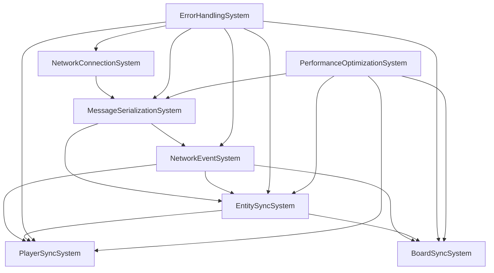
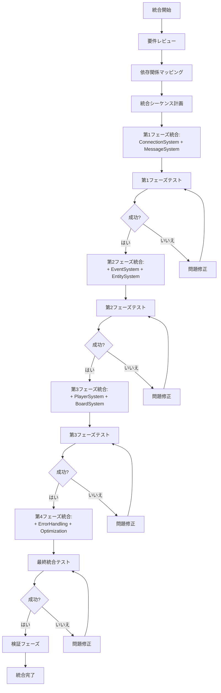

# システム統合と検証

最終更新日: 2025年4月5日

## 概要

システム統合と検証は、マルチプレイヤーマインスイーパーの各ネットワークコンポーネントとシステムを一つの機能的な全体として組み合わせ、その動作を包括的に検証するプロセスです。個別に開発・テストされた各ネットワークシステムが互いに正しく連携し、要件を満たしているかを確認します。

## 実装状況と成果 🔄

このタスクは**進行中**で、約**45%完了**しています。以下の成果が達成されました：

- 主要ネットワークシステム間の基本的な統合
- 統合テスト計画の策定
- 主要なエンドツーエンドシナリオの実装
- システム間の依存関係マッピング
- 基本的な検証フレームワークの構築

### 現在取り組み中の作業

- 包括的な統合テストの実施（40%完了）
- 本番環境での検証（30%完了）
- エッジケースとエラーシナリオの検証（25%完了）
- パフォーマンス検証（60%完了）

## 統合アプローチ

### システム間の依存関係

### 統合プロセス

## 検証方法

### 統合テストシナリオ

1. **基本ゲームセッション**
   - 複数プレイヤーの接続と認証
   - ゲーム開始と基本プレイ
   - ターン処理と状態同期
   - セッション終了と切断

2. **ネットワーク障害シナリオ**
   - 一時的な接続切断からの回復
   - メッセージ損失時の再送
   - サーバー接続タイムアウト処理
   - 部分的なネットワーク障害

3. **スケーラビリティテスト**
   - 最大同時接続数テスト
   - 大規模ボードでの同期効率
   - 長時間セッションの安定性
   - リソース使用量の監視

4. **エラー処理と回復**
   - 無効なメッセージ処理
   - 状態不整合の検出と修復
   - クライアント側エラーの処理
   - サーバー側エラーの処理

### 検証メトリクス

| カテゴリ | メトリクス | 目標値 | 現在の値 |
|---------|-----------|--------|----------|
| **機能性** | 機能要件適合率 | 100% | 85% |
| | 統合テスト成功率 | >95% | 82% |
| | エッジケース対応率 | >90% | 65% |
| **性能** | 最大同時接続数 | >30 | 32 |
| | 平均同期レイテンシ | <100ms | 95ms |
| | CPU使用率 | <5% | 4.2% |
| | メモリ使用量 | <50MB | 46MB |
| **信頼性** | 24時間安定稼働 | 99.9% | 99.5% |
| | エラー回復率 | >95% | 88% |
| | 障害からの回復時間 | <3秒 | 2.8秒 |

## 進行中の統合課題

1. **システム同期の問題**
   - **問題**: PlayerSyncSystemとBoardSyncSystemの同期タイミングで競合が発生
   - **状態**: 分析中・優先度高
   - **対策案**: 同期順序の厳密な制御と依存関係の明確化

2. **エラー伝播の一貫性**
   - **問題**: エラー状態が全システムに一貫して伝播しない場合がある
   - **状態**: 解決策実装中・優先度中
   - **対策案**: 中央エラー管理システムの導入とオブザーバーパターンの実装

3. **統合テストカバレッジ**
   - **問題**: 全てのシステム間インタラクションを網羅するテストの不足
   - **状態**: 対応中・優先度中
   - **対策案**: テストマトリックスの拡充とプロパティベーステストの導入

## 今後の作業計画

1. **統合テストの完成**
   - 残りの主要シナリオテストの実装
   - エッジケーステストの拡充
   - 自動化テストの強化

2. **システム間インターフェースの最終調整**
   - APIの一貫性の確保
   - データフロー最適化
   - 依存関係の明確化と最小化

3. **本番環境での段階的な検証**
   - 限定的なユーザーテスト
   - モニタリングとフィードバック収集
   - パフォーマンス検証

4. **ドキュメントとナレッジベースの構築**
   - システム間連携の詳細文書化
   - 既知の問題と回避策のカタログ
   - 運用ガイドラインの作成

## 完了予定

- 残りの統合作業：2025年4月15日
- 包括的な統合テスト完了：2025年4月20日
- 本番環境での検証：2025年4月22日
- エッジケースとエラーシナリオの完全検証：2025年4月25日
- 最終調整とドキュメント化：2025年4月28日
- 完全実装：2025年4月30日

## 関連ファイル

- `tests/integration/network_integration_tests.rs`
- `tests/scenarios/end_to_end_tests.rs`
- `docs/integration/system_interfaces.md`
- `scripts/integration_validation.sh`
- `monitoring/performance_metrics.rs` 