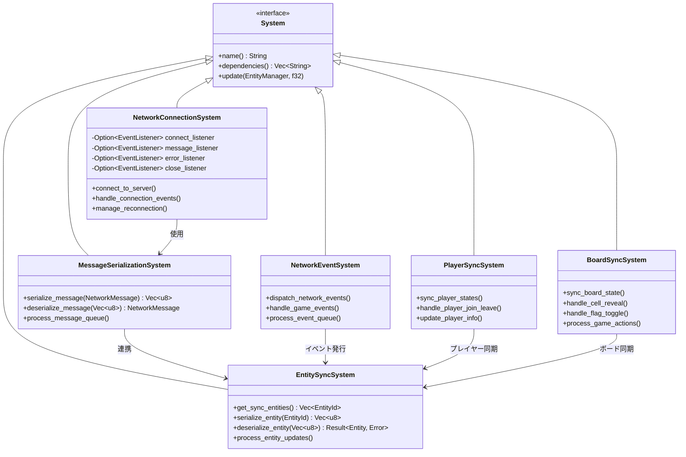
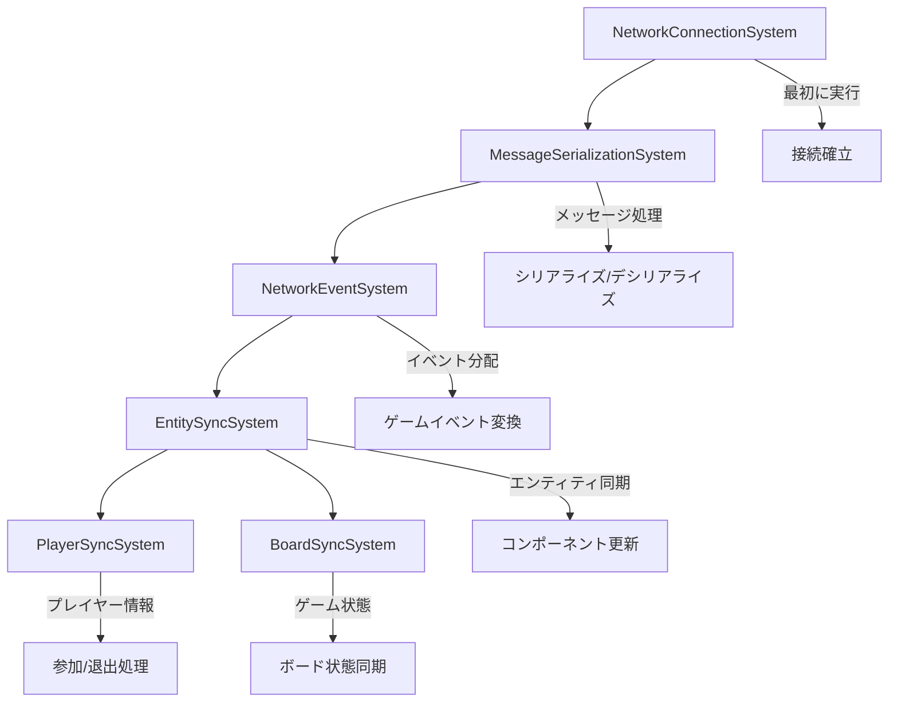
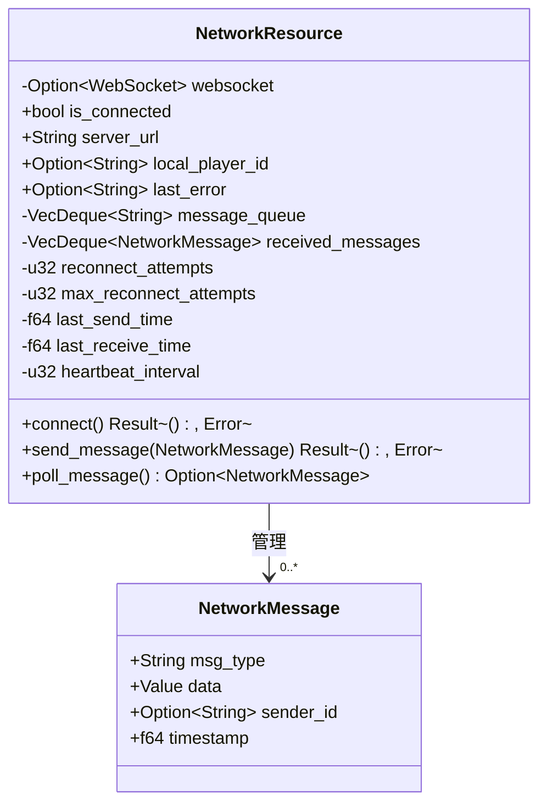
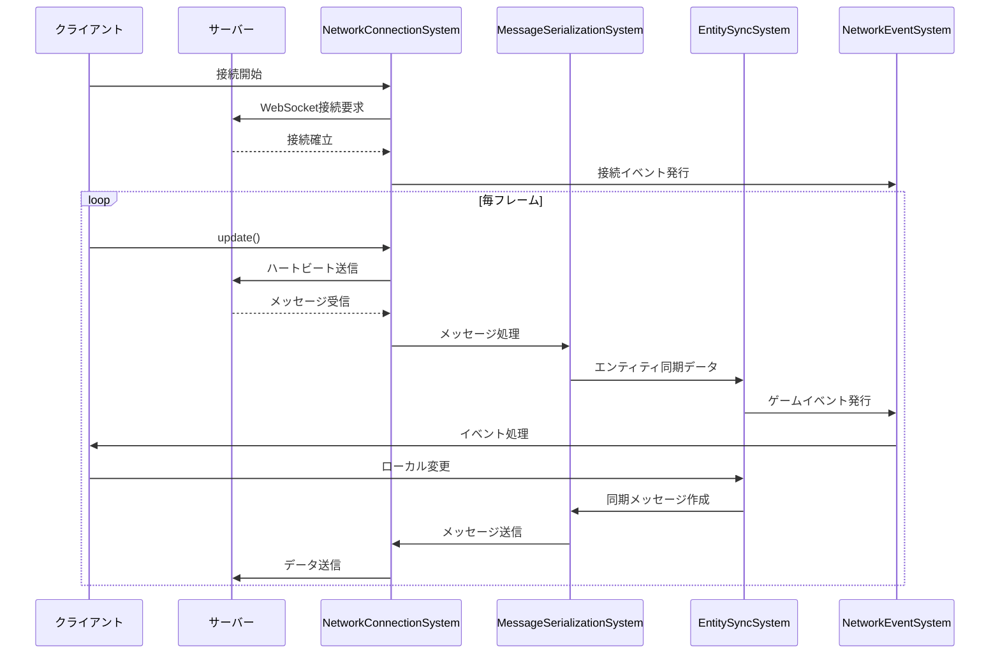
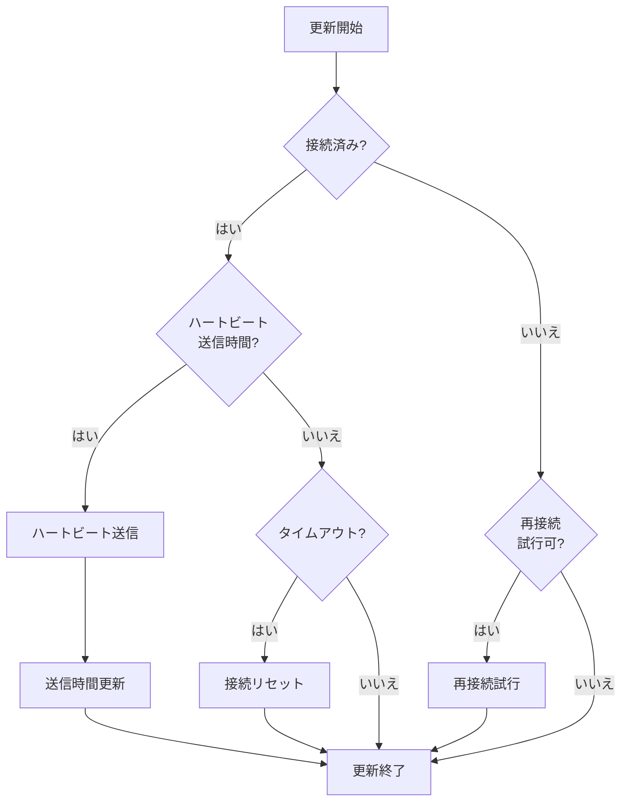
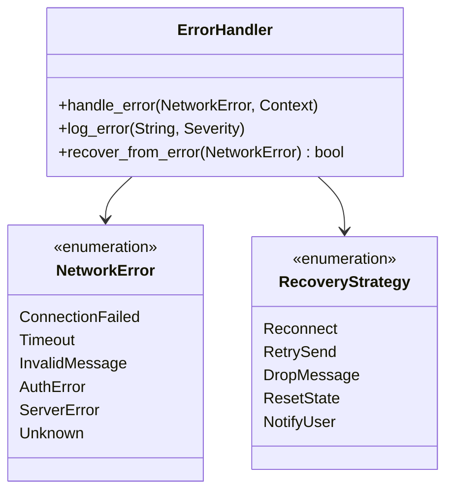
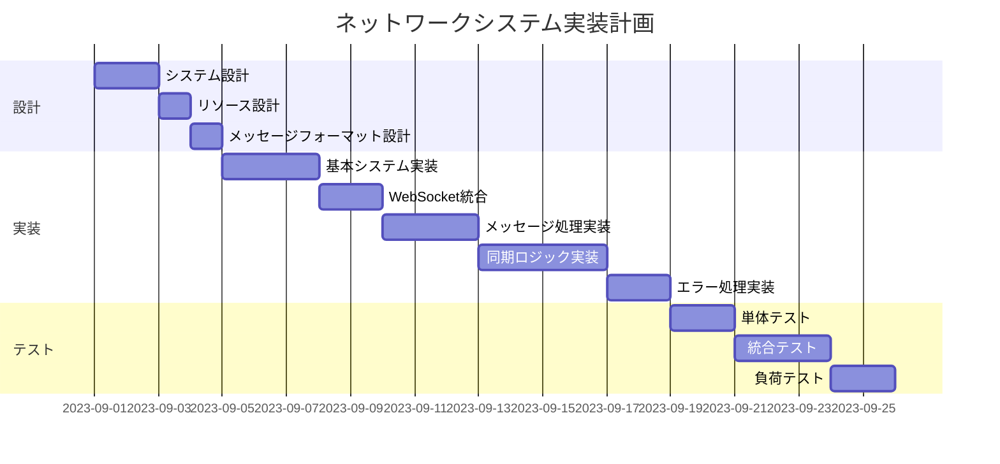

# ネットワークシステムの実装

## 概要

マルチプレイヤーマインスイーパーのネットワーク機能をECSパターンに準拠したシステムとして実装します。ネットワークコンポーネントを活用し、WebSocketを通じたリアルタイム通信、メッセージの送受信、エンティティの同期などの機能を提供する一連のシステムを設計・実装します。

## 現状の問題点

1. 現在のネットワーク処理は`network.rs`と`resources/network_state.rs`に集中しており、ECSのシステムとして分離されていない
2. WebSocketとゲームロジックの結合度が高い
3. メッセージの処理がコールバックベースで行われており、テストが困難
4. エンティティの同期ロジックが明確に定義されていない
5. エラー処理と再接続ロジックが不十分

## 実装計画

### 1. 必要なネットワークシステムの特定

以下のネットワーク関連システムを設計・実装します：

### 2. ネットワークシステムの依存関係

システム間の依存関係と実行順序：

### 3. ネットワークリソースの設計

### 4. システム間の通信フロー

### 5. 各システムの主要機能

#### NetworkConnectionSystem

**主な責任**:
- WebSocketの接続確立と管理
- 接続状態の監視
- 再接続処理
- ハートビート送信
- 接続タイムアウト処理

**処理フロー**:

#### MessageSerializationSystem

**主な責任**:
- メッセージのシリアライズ/デシリアライズ
- メッセージキューの処理
- メッセージの優先順位付け
- メッセージの圧縮と最適化

#### EntitySyncSystem

**主な責任**:
- エンティティの同期対象特定
- エンティティデータのシリアライズ/デシリアライズ
- 差分更新の計算
- エンティティ作成/削除の同期

#### NetworkEventSystem

**主な責任**:
- ネットワークイベントのディスパッチ
- ゲームイベントのネットワークイベントへの変換
- イベントキューの処理
- イベントのフィルタリングとルーティング

#### PlayerSyncSystem

**主な責任**:
- プレイヤーの参加/退出処理
- プレイヤー情報の同期
- プレイヤーエンティティの管理
- プレイヤー間の権限管理

#### BoardSyncSystem

**主な責任**:
- ボード状態の同期
- セル公開アクションの処理
- フラグトグルアクションの同期
- ゲーム進行状態の同期

### 6. エラー処理戦略

エラー処理の基本戦略:
1. エラーの種類と重大度を特定
2. 適切な回復戦略を選択
3. 必要に応じてユーザーに通知
4. エラーをログに記録
5. 状態の整合性を確保

### 7. 実装計画と移行ステップ

1. **基本システムの実装**:
   - `src/systems/network/`ディレクトリを作成
   - 各システムクラスの基本実装
   - システム間の依存関係設定

2. **WebSocket統合**:
   - 既存の`network.rs`からWebSocket処理を移行
   - イベントリスナーをシステムに統合
   - 接続管理ロジックの実装

3. **メッセージ処理**:
   - シリアライズ/デシリアライズの実装
   - メッセージタイプの定義
   - メッセージルーティングの実装

4. **同期ロジック**:
   - エンティティ同期の実装
   - 差分更新の最適化
   - 同期頻度の調整機能

5. **エラー処理**:
   - エラー回復戦略の実装
   - 再接続メカニズムの強化
   - エラーログと診断機能

### 8. テスト計画

1. **単体テスト**:
   - 各システムの基本機能テスト
   - メッセージシリアライズ/デシリアライズのテスト
   - エラー処理のテスト

2. **統合テスト**:
   - システム間連携のテスト
   - WebSocket通信のモックテスト
   - エンティティ同期の検証

3. **シナリオテスト**:
   - 複数プレイヤー接続シナリオ
   - 接続切断と再接続シナリオ
   - ネットワーク遅延下でのパフォーマンス

4. **負荷テスト**:
   - 多数のエンティティ同期時のパフォーマンス
   - メッセージ処理の効率性
   - 帯域使用量の測定

## 期待される効果

1. ネットワークコードの明確な構造化と責任分離
2. テスト容易性の向上
3. エラー耐性と回復力の強化
4. パフォーマンスの最適化（メッセージの優先順位付けと差分更新）
5. 拡張性の向上（新しい同期機能の追加が容易に）

## リスクと対策

1. **リスク**: 複雑なネットワークエッジケースの処理漏れ
   **対策**: 包括的なテストシナリオとエラー注入テスト

2. **リスク**: WebSocket APIとの連携の複雑さ
   **対策**: 適切な抽象化レイヤーとインターフェースの設計

3. **リスク**: 同期処理のパフォーマンスボトルネック
   **対策**: 差分更新と優先度ベースのスケジューリング

4. **リスク**: WebAssemblyからのネットワークAPIアクセス制限
   **対策**: JavaScriptブリッジを通じた適切なラッパーの実装

## タイムライン

1. システム設計と計画: 2日
2. 基本システム実装: 3日
3. WebSocket統合: 2日
4. メッセージ処理実装: 3日
5. 同期ロジック実装: 4日
6. エラー処理実装: 2日
7. テストと最適化: 7日

**合計推定時間**: 23日 