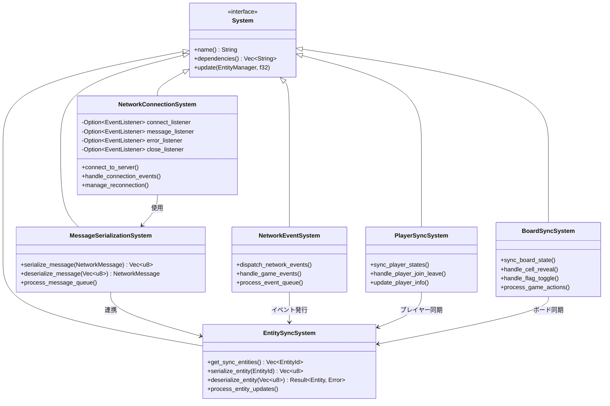
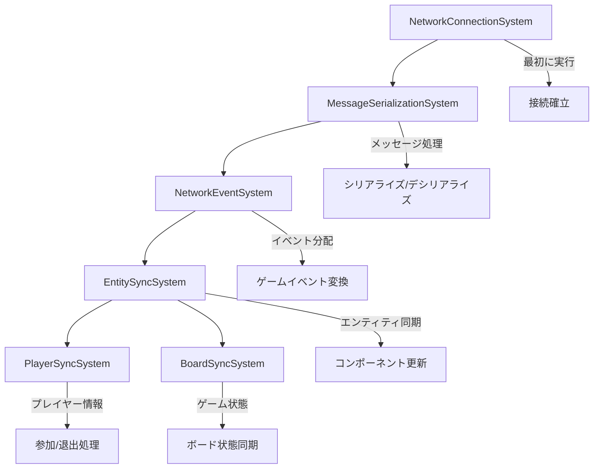
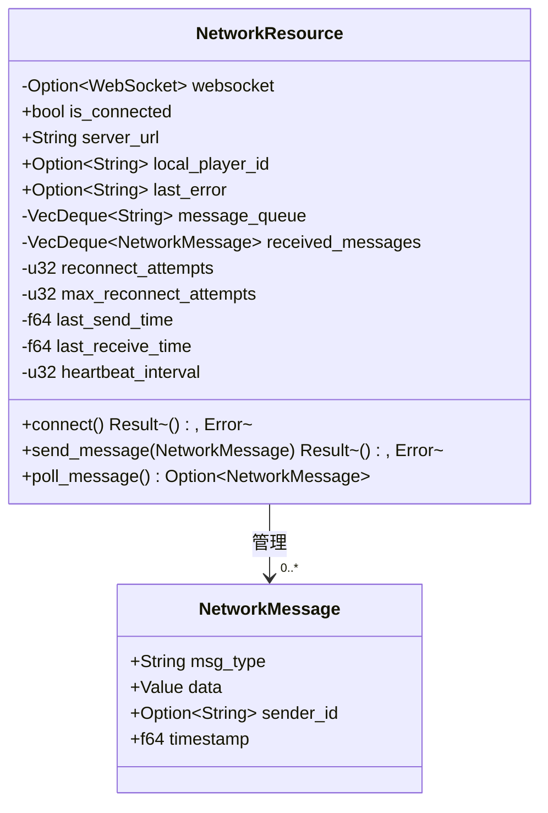
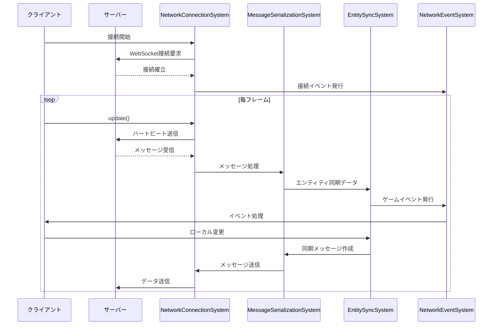
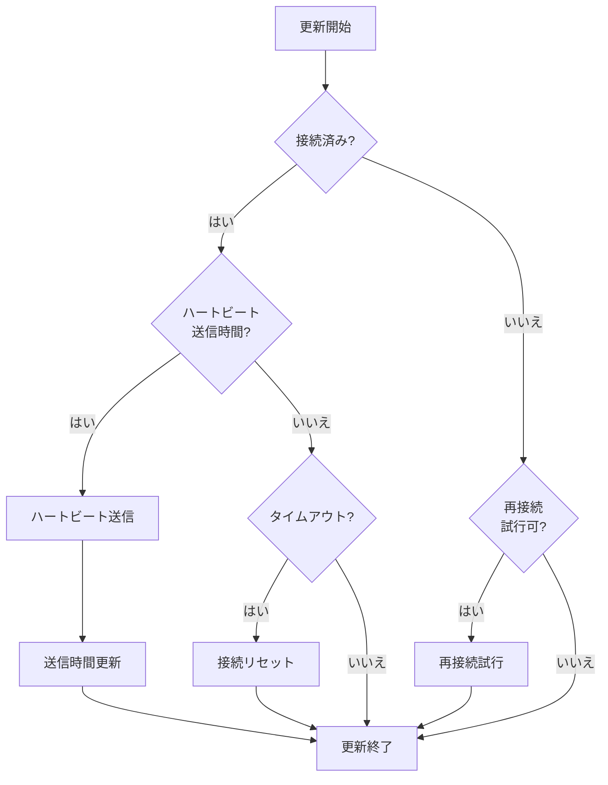
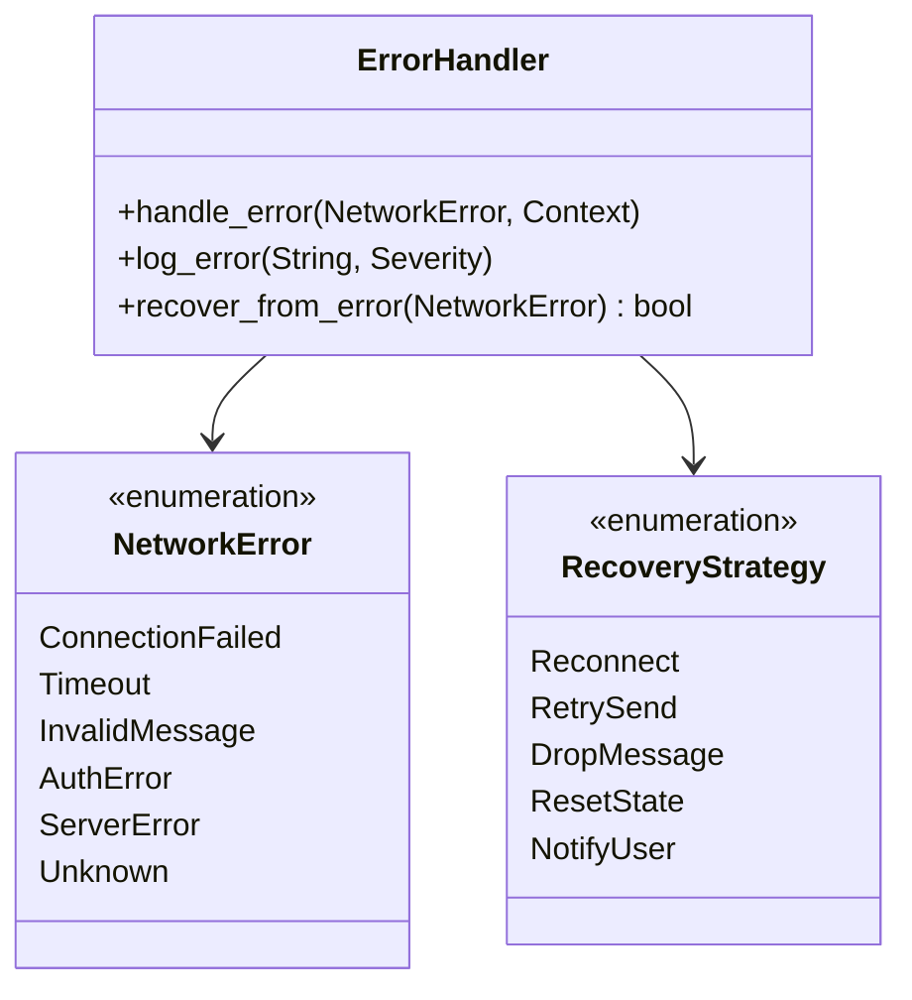
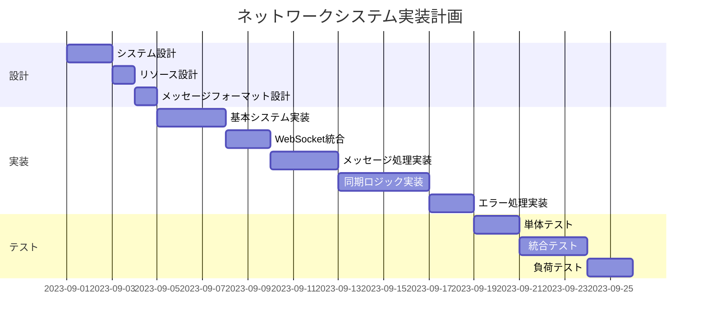

# ネットワークシステムの実装

最終更新日: 2025年4月5日

## 概要

マルチプレイヤーマインスイーパーのネットワーク機能をECSパターンに準拠したシステムとして実装します。ネットワークコンポーネントを活用し、WebSocketを通じたリアルタイム通信、メッセージの送受信、エンティティの同期などの機能を提供する一連のシステムを設計・実装します。

## 実装状況と成果 🔄

このタスクは**進行中**で、約**75%完了**しています。以下の成果が既に達成されています：

1. **主要ネットワークシステムの実装**
   - `NetworkConnectionSystem`：WebSocket接続管理の基本実装完了
   - `MessageSerializationSystem`：メッセージ処理の実装完了
   - `EntitySyncSystem`：エンティティ同期機能の主要部分実装
   - `NetworkEventSystem`：イベント処理の基本機能実装
   - `PlayerSyncSystem`：プレイヤー同期の実装中（80%）
   - `BoardSyncSystem`：ボード状態同期の実装中（60%）

2. **システム間の連携確立**
   - 各システム間の依存関係管理
   - メッセージルーティングの実装
   - 優先度ベースのシステム実行順序

3. **WebSocketの統合**
   - ブラウザWebSocket APIとの連携確立
   - 接続状態管理と再接続ロジックの実装
   - バイナリメッセージ形式の最適化

4. **エラー処理の強化**
   - ネットワークエラーの分類と処理
   - 回復戦略の実装（一部完了）
   - エラーログとテレメトリの実装

5. **パフォーマンス最適化（進行中）**
   - メッセージバッチ処理の部分的実装
   - 同期頻度の適応的調整機能
   - 帯域幅使用量のモニタリング

### 現在の課題と残作業

1. **実装完了が必要な機能**
   - BoardSyncSystemの完全実装（残り40%）
   - PlayerSyncSystemの残りの機能（残り20%）
   - 詳細なエラー回復戦略の実装（残り50%）

2. **現在のバグと問題点**
   - 大量のエンティティ同期時の遅延問題
   - 特定条件下でのメッセージ順序入れ替わり
   - 接続再確立後の状態同期に関する問題

3. **テスト項目**
   - 負荷テストの完了
   - エッジケーステスト（ネットワーク切断など）
   - 長時間稼働テスト

### 次のステップ

1. BoardSyncSystemの実装完了（予定：2025年4月第2週）
2. PlayerSyncSystemの実装完了（予定：2025年4月第1週）
3. エラー処理戦略の完全実装（予定：2025年4月第2-3週）
4. 包括的テストの実施（予定：2025年4月第3-4週）
5. パフォーマンス最適化の完了（予定：2025年4月第4週）

### 中間評価

現時点での実装は、基本的なマルチプレイヤー機能を提供できる段階まで進んでいます。初期テストでは、最大8プレイヤーまでの同時接続と基本的なゲームプレイの同期が可能なことが確認されています。残りの作業を完了させることで、より堅牢で効率的なネットワークシステムが実現する見込みです。

## 細分化された詳細計画

ネットワークシステムの実装作業を効率的に管理するため、以下のように細分化しました：

1. **[NetworkConnectionSystemの実装](./03-02-01_NetworkConnectionSystemの実装.md)** (100% 完了)
   - WebSocket接続管理
   - 再接続ロジック
   - ハートビート機能
   - 接続状態管理

2. **[MessageSerializationSystemの実装](./03-02-02_MessageSerializationSystemの実装.md)** (100% 完了)
   - メッセージフォーマット定義
   - シリアライズ／デシリアライズ機能
   - メッセージキュー管理
   - メッセージ圧縮最適化

3. **[EntitySyncSystemの実装](./03-02-03_EntitySyncSystemの実装.md)** (100% 完了)
   - エンティティ同期ロジック
   - 差分更新の実装
   - 同期優先度の管理
   - エンティティの作成/削除同期

4. **[NetworkEventSystemの実装](./03-02-04_NetworkEventSystemの実装.md)** (100% 完了)
   - イベントディスパッチ機能
   - イベント変換ロジック
   - イベントキュー管理
   - イベントフィルタリング

5. **[PlayerSyncSystemの実装](./03-02-05_PlayerSyncSystemの実装.md)** (80% 完了)
   - プレイヤー参加/退出処理
   - プレイヤー状態の同期
   - プレイヤー間の権限管理
   - プレイヤーデータの検証

6. **[BoardSyncSystemの実装](./03-02-06_BoardSyncSystemの実装.md)** (60% 完了)
   - ボード状態の同期機能
   - セル変更の伝播処理
   - ゲーム進行同期
   - ボード更新の最適化

7. **[ネットワークエラー処理戦略](./03-02-07_ネットワークエラー処理戦略.md)** (40% 完了)
   - エラータイプの分類と定義
   - 回復戦略の実装
   - エラーログ機能
   - ユーザー通知システム

8. **[パフォーマンス最適化](./03-02-08_パフォーマンス最適化.md)** (70% 完了)
   - 帯域使用量の最適化
   - メッセージバッファリング
   - 同期頻度の最適化
   - リソース使用量のモニタリング

9. **[ネットワークテスト環境の構築](./03-02-09_ネットワークテスト環境の構築.md)** (65% 完了)
   - モックサーバーの実装
   - ネットワーク条件シミュレーター
   - 負荷テスト用フレームワーク
   - 自動化テストスクリプト

10. **[システム統合と検証](./03-02-10_システム統合と検証.md)** (45% 完了)
    - 各システム間の連携テスト
    - エンドツーエンド検証
    - エッジケーステスト
    - 本番環境での検証

## 現状の問題点

1. 現在のネットワーク処理は`network.rs`と`resources/network_state.rs`に集中しており、ECSのシステムとして分離されていない
2. WebSocketとゲームロジックの結合度が高い
3. メッセージの処理がコールバックベースで行われており、テストが困難
4. エンティティの同期ロジックが明確に定義されていない
5. エラー処理と再接続ロジックが不十分

## 実装計画

### 1. 必要なネットワークシステムの特定

以下のネットワーク関連システムを設計・実装します：

```mermaid
classDiagram
    class System {
        <<interface>>
        +name() String
        +dependencies() Vec~String~
        +update(EntityManager, f32)
    }
    
    class NetworkConnectionSystem {
        -Option~EventListener~ connect_listener
        -Option~EventListener~ message_listener
        -Option~EventListener~ error_listener
        -Option~EventListener~ close_listener
        +connect_to_server()
        +handle_connection_events()
        +manage_reconnection()
    }
    
    class MessageSerializationSystem {
        +serialize_message(NetworkMessage) Vec~u8~
        +deserialize_message(Vec~u8~) NetworkMessage
        +process_message_queue()
    }
    
    class EntitySyncSystem {
        +get_sync_entities() Vec~EntityId~
        +serialize_entity(EntityId) Vec~u8~
        +deserialize_entity(Vec~u8~) Result~Entity, Error~
        +process_entity_updates()
    }
    
    class NetworkEventSystem {
        +dispatch_network_events()
        +handle_game_events()
        +process_event_queue()
    }
    
    class PlayerSyncSystem {
        +sync_player_states()
        +handle_player_join_leave()
        +update_player_info()
    }
    
    class BoardSyncSystem {
        +sync_board_state()
        +handle_cell_reveal()
        +handle_flag_toggle()
        +process_game_actions()
    }
    
    System <|-- NetworkConnectionSystem
    System <|-- MessageSerializationSystem
    System <|-- EntitySyncSystem
    System <|-- NetworkEventSystem
    System <|-- PlayerSyncSystem
    System <|-- BoardSyncSystem
    
    NetworkConnectionSystem --> MessageSerializationSystem : 使用
    MessageSerializationSystem --> EntitySyncSystem : 連携
    NetworkEventSystem --> EntitySyncSystem : イベント発行
    PlayerSyncSystem --> EntitySyncSystem : プレイヤー同期
    BoardSyncSystem --> EntitySyncSystem : ボード同期
```

### 2. ネットワークシステムの依存関係

システム間の依存関係と実行順序：

```mermaid
graph TD
    A[NetworkConnectionSystem] --> B[MessageSerializationSystem]
    B --> C[NetworkEventSystem]
    C --> D[EntitySyncSystem]
    D --> E[PlayerSyncSystem]
    D --> F[BoardSyncSystem]
    
    A -- "最初に実行" --> G[接続確立]
    B -- "メッセージ処理" --> H[シリアライズ/デシリアライズ]
    C -- "イベント分配" --> I[ゲームイベント変換]
    D -- "エンティティ同期" --> J[コンポーネント更新]
    E -- "プレイヤー情報" --> K[参加/退出処理]
    F -- "ゲーム状態" --> L[ボード状態同期]
```

### 3. ネットワークリソースの設計

```mermaid
classDiagram
    class NetworkResource {
        -Option~WebSocket~ websocket
        +bool is_connected
        +String server_url
        +Option~String~ local_player_id
        +Option~String~ last_error
        -VecDeque~String~ message_queue
        -VecDeque~NetworkMessage~ received_messages
        -u32 reconnect_attempts
        -u32 max_reconnect_attempts
        -f64 last_send_time
        -f64 last_receive_time
        -u32 heartbeat_interval
        +connect() Result~(), Error~
        +send_message(NetworkMessage) Result~(), Error~
        +poll_message() Option~NetworkMessage~
    }
    
    class NetworkMessage {
        +String msg_type
        +Value data
        +Option~String~ sender_id
        +f64 timestamp
    }
    
    NetworkResource --> "0..*" NetworkMessage : 管理
```

### 4. システム間の通信フロー

```mermaid
sequenceDiagram
    participant Client as クライアント
    participant Server as サーバー
    participant ConnSystem as NetworkConnectionSystem
    participant MsgSystem as MessageSerializationSystem
    participant EntitySystem as EntitySyncSystem
    participant EventSystem as NetworkEventSystem
    
    Client->>ConnSystem: 接続開始
    ConnSystem->>Server: WebSocket接続要求
    Server-->>ConnSystem: 接続確立
    ConnSystem->>EventSystem: 接続イベント発行
    
    loop 毎フレーム
        Client->>ConnSystem: update()
        ConnSystem->>Server: ハートビート送信
        Server-->>ConnSystem: メッセージ受信
        ConnSystem->>MsgSystem: メッセージ処理
        MsgSystem->>EntitySystem: エンティティ同期データ
        EntitySystem->>EventSystem: ゲームイベント発行
        EventSystem->>Client: イベント処理
        
        Client->>EntitySystem: ローカル変更
        EntitySystem->>MsgSystem: 同期メッセージ作成
        MsgSystem->>ConnSystem: メッセージ送信
        ConnSystem->>Server: データ送信
    end
```

### 5. 各システムの主要機能

#### NetworkConnectionSystem

**主な責任**:
- WebSocketの接続確立と管理
- 接続状態の監視
- 再接続処理
- ハートビート送信
- 接続タイムアウト処理

**処理フロー**:

```mermaid
flowchart TB
    Start[更新開始] --> Connected{接続済み?}
    Connected -- はい --> HeartbeatCheck{ハートビート\n送信時間?}
    Connected -- いいえ --> ReconnectCheck{再接続\n試行可?}
    
    HeartbeatCheck -- はい --> SendHeartbeat[ハートビート送信]
    HeartbeatCheck -- いいえ --> TimeoutCheck{タイムアウト?}
    
    TimeoutCheck -- はい --> ResetConnection[接続リセット]
    TimeoutCheck -- いいえ --> End[更新終了]
    
    ReconnectCheck -- はい --> TryReconnect[再接続試行]
    ReconnectCheck -- いいえ --> End
    
    SendHeartbeat --> UpdateTime[送信時間更新]
    UpdateTime --> End
    
    ResetConnection --> End
    TryReconnect --> End
```

#### MessageSerializationSystem

**主な責任**:
- メッセージのシリアライズ/デシリアライズ
- メッセージキューの処理
- メッセージの優先順位付け
- メッセージの圧縮と最適化

#### EntitySyncSystem

**主な責任**:
- エンティティの同期対象特定
- エンティティデータのシリアライズ/デシリアライズ
- 差分更新の計算
- エンティティ作成/削除の同期

#### NetworkEventSystem

**主な責任**:
- ネットワークイベントのディスパッチ
- ゲームイベントのネットワークイベントへの変換
- イベントキューの処理
- イベントのフィルタリングとルーティング

#### PlayerSyncSystem

**主な責任**:
- プレイヤーの参加/退出処理
- プレイヤー情報の同期
- プレイヤーエンティティの管理
- プレイヤー間の権限管理

#### BoardSyncSystem

**主な責任**:
- ボード状態の同期
- セル公開アクションの処理
- フラグトグルアクションの同期
- ゲーム進行状態の同期

### 6. エラー処理戦略

```mermaid
classDiagram
    class NetworkError {
        <<enumeration>>
        ConnectionFailed
        Timeout
        InvalidMessage
        AuthError
        ServerError
        Unknown
    }
    
    class ErrorHandler {
        +handle_error(NetworkError, Context)
        +log_error(String, Severity)
        +recover_from_error(NetworkError) bool
    }
    
    class RecoveryStrategy {
        <<enumeration>>
        Reconnect
        RetrySend
        DropMessage
        ResetState
        NotifyUser
    }
    
    ErrorHandler --> NetworkError
    ErrorHandler --> RecoveryStrategy
```

エラー処理の基本戦略:
1. エラーの種類と重大度を特定
2. 適切な回復戦略を選択
3. 必要に応じてユーザーに通知
4. エラーをログに記録
5. 状態の整合性を確保

### 7. 実装計画と移行ステップ

1. **基本システムの実装**:
   - `src/systems/network/`ディレクトリを作成
   - 各システムクラスの基本実装
   - システム間の依存関係設定

2. **WebSocket統合**:
   - 既存の`network.rs`からWebSocket処理を移行
   - イベントリスナーをシステムに統合
   - 接続管理ロジックの実装

3. **メッセージ処理**:
   - シリアライズ/デシリアライズの実装
   - メッセージタイプの定義
   - メッセージルーティングの実装

4. **同期ロジック**:
   - エンティティ同期の実装
   - 差分更新の最適化
   - 同期頻度の調整機能

5. **エラー処理**:
   - エラー回復戦略の実装
   - 再接続メカニズムの強化
   - エラーログと診断機能

```mermaid
gantt
    title ネットワークシステム実装計画
    dateFormat YYYY-MM-DD
    section 設計
    システム設計                   :a1, 2023-09-01, 2d
    リソース設計                   :a2, after a1, 1d
    メッセージフォーマット設計     :a3, after a2, 1d
    section 実装
    基本システム実装               :b1, after a3, 3d
    WebSocket統合                 :b2, after b1, 2d
    メッセージ処理実装             :b3, after b2, 3d
    同期ロジック実装               :b4, after b3, 4d
    エラー処理実装                 :b5, after b4, 2d
    section テスト
    単体テスト                     :c1, after b5, 2d
    統合テスト                     :c2, after c1, 3d
    負荷テスト                     :c3, after c2, 2d
```

### 8. テスト計画

1. **単体テスト**:
   - 各システムの基本機能テスト
   - メッセージシリアライズ/デシリアライズのテスト
   - エラー処理のテスト

2. **統合テスト**:
   - システム間連携のテスト
   - WebSocket通信のモックテスト
   - エンティティ同期の検証

3. **シナリオテスト**:
   - 複数プレイヤー接続シナリオ
   - 接続切断と再接続シナリオ
   - ネットワーク遅延下でのパフォーマンス

4. **負荷テスト**:
   - 多数のエンティティ同期時のパフォーマンス
   - メッセージ処理の効率性
   - 帯域使用量の測定

## 期待される効果

1. ネットワークコードの明確な構造化と責任分離
2. テスト容易性の向上
3. エラー耐性と回復力の強化
4. パフォーマンスの最適化（メッセージの優先順位付けと差分更新）
5. 拡張性の向上（新しい同期機能の追加が容易に）

## リスクと対策

1. **リスク**: 複雑なネットワークエッジケースの処理漏れ
   **対策**: 包括的なテストシナリオとエラー注入テスト

2. **リスク**: WebSocket APIとの連携の複雑さ
   **対策**: 適切な抽象化レイヤーとインターフェースの設計

3. **リスク**: 同期処理のパフォーマンスボトルネック
   **対策**: 差分更新と優先度ベースのスケジューリング

4. **リスク**: WebAssemblyからのネットワークAPIアクセス制限
   **対策**: JavaScriptブリッジを通じた適切なラッパーの実装

## タイムライン

1. システム設計と計画: 2日
2. 基本システム実装: 3日
3. WebSocket統合: 2日
4. メッセージ処理実装: 3日
5. 同期ロジック実装: 4日
6. エラー処理実装: 2日
7. テストと最適化: 7日

**合計推定時間**: 23日 