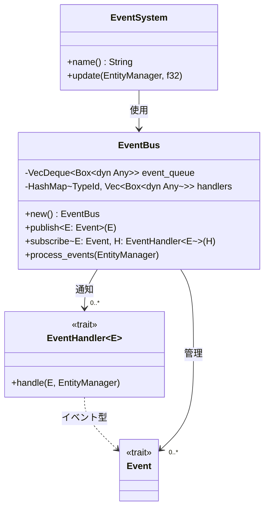
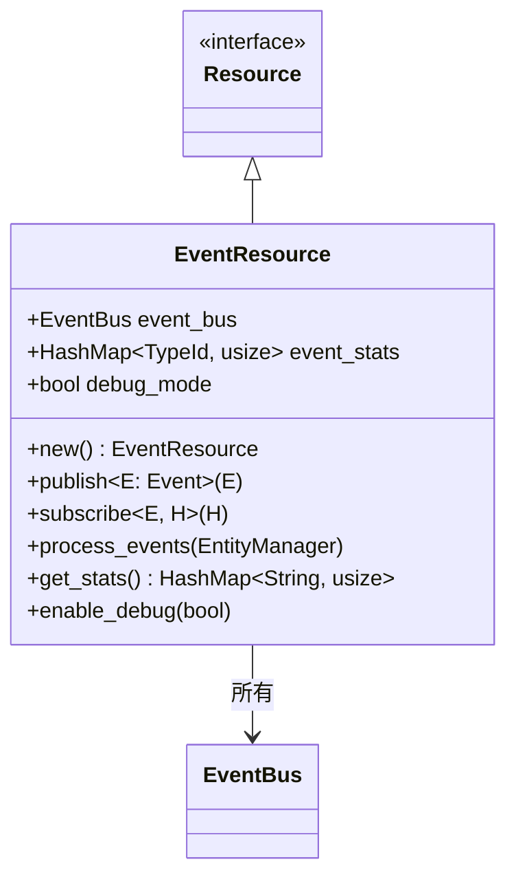
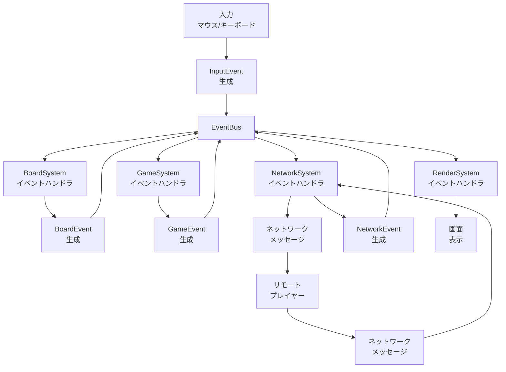
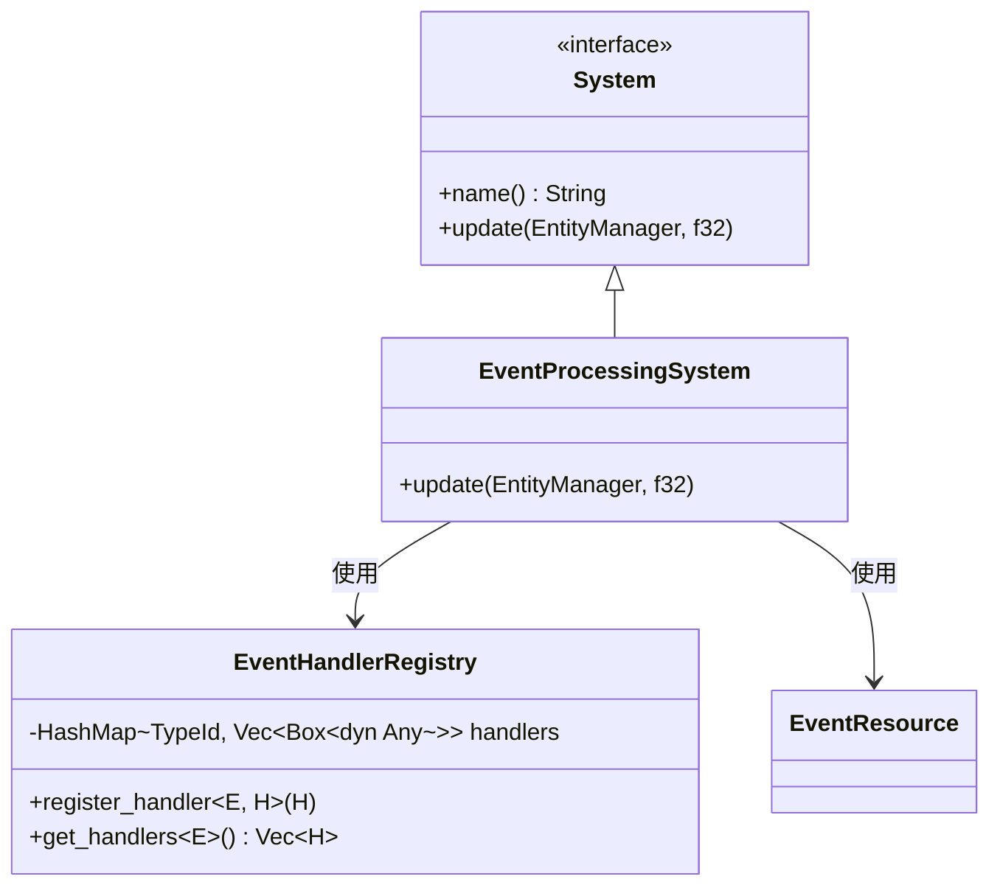
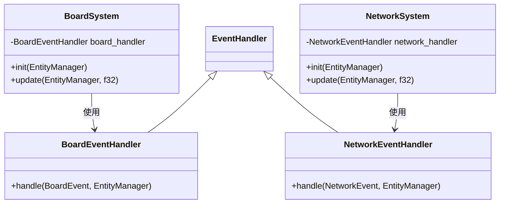
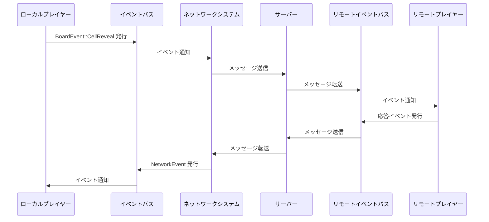
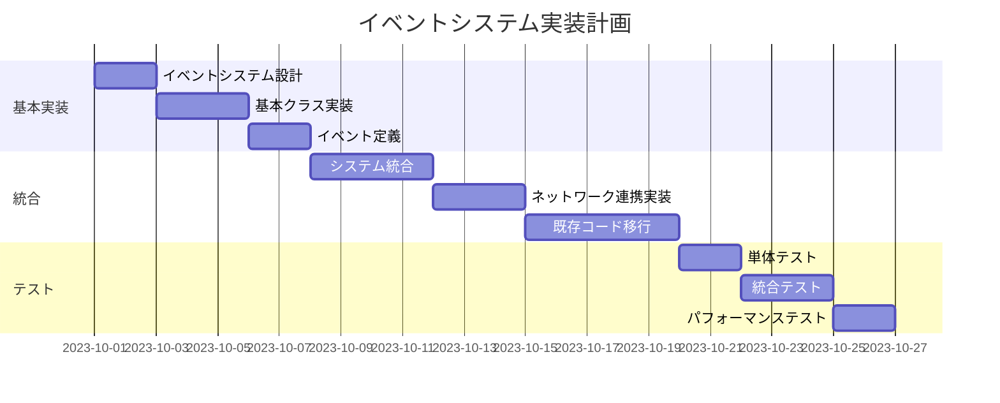

# イベントシステムの導入

## 概要

マルチプレイヤーマインスイーパーにイベント駆動型アーキテクチャを導入し、コンポーネント間、システム間、そしてネットワーク間の連携をより疎結合にします。イベントシステムはゲーム内の様々な出来事（セルの公開、フラグの設定、プレイヤーの移動など）をイベントとして発行し、それに関心のあるシステムがそれらを受け取って処理する仕組みを提供します。

## 現状の問題点

1. 現在のシステム間通信は直接的な依存関係に基づいており、疎結合になっていない
2. ネットワークメッセージとゲーム内アクションの間に明確な対応関係がない
3. テスト可能性が低い（システム間の連携をモックするのが難しい）
4. 新機能の追加時に多くのシステムを修正する必要がある
5. ユーザー入力、ゲームロジック、ネットワーク同期間の情報伝達が複雑

## 実装計画

### 1. イベントシステムの基本設計



### 2. イベントリソースの設計



### 3. イベントタイプの設計

```mermaid
classDiagram
    class Event {
        <<trait>>
    }
    
    class GameEvent {
        <<enumeration>>
        GameStart
        GameEnd{win: bool}
        GamePause
        GameResume
    }
    
    class BoardEvent {
        <<enumeration>>
        CellReveal{row: usize, col: usize, player_id: Option~String~}
        FlagToggle{row: usize, col: usize, player_id: Option~String~}
        BoardReset{difficulty: Difficulty}
        MineHit{row: usize, col: usize, player_id: Option~String~}
    }
    
    class PlayerEvent {
        <<enumeration>>
        PlayerJoin{player_id: String, name: String, color: String}
        PlayerLeave{player_id: String}
        PlayerMove{player_id: String, x: f64, y: f64}
    }
    
    class NetworkEvent {
        <<enumeration>>
        Connected{local_player_id: String}
        Disconnected{reason: String}
        MessageReceived{msg_type: String, data: Value, sender_id: String}
        MessageSent{msg_id: u32, success: bool}
    }
    
    class InputEvent {
        <<enumeration>>
        MouseClick{x: f64, y: f64, button: MouseButton}
        KeyPress{key: String}
        TouchStart{x: f64, y: f64, id: u32}
    }
    
    Event <|-- GameEvent
    Event <|-- BoardEvent
    Event <|-- PlayerEvent
    Event <|-- NetworkEvent
    Event <|-- InputEvent
```

### 4. イベントフロー設計



### 5. イベント処理システムの設計



### 6. イベントハンドラの実装例



### 7. イベントのネットワーク同期



### 8. 実装ステップ

1. **イベントシステムの基本実装**:
   - `src/events/`ディレクトリの作成
   - `event_trait.rs`: イベントトレイトの定義
   - `event_bus.rs`: イベントバスの実装
   - `event_resource.rs`: リソースとしてのイベントバス

2. **基本イベントタイプの定義**:
   - `src/events/game_events.rs`: ゲーム状態イベント
   - `src/events/board_events.rs`: ボード関連イベント
   - `src/events/player_events.rs`: プレイヤー関連イベント
   - `src/events/network_events.rs`: ネットワーク関連イベント
   - `src/events/input_events.rs`: 入力関連イベント

3. **イベント処理システムの実装**:
   - `src/systems/event_system.rs`: イベント処理システム
   - 各システムへのイベントハンドラの統合

4. **既存コードのイベント駆動型への移行**:
   - 直接的な関数呼び出しをイベント発行に置き換え
   - コールバックベースの処理をイベントハンドラに移行
   - ネットワークメッセージとイベントの対応付け

5. **テストとデバッグツールの実装**:
   - イベントログ機能
   - モックイベント発行ツール
   - イベントフロー分析ツール



### 9. テスト計画

1. **単体テスト**:
   - イベントバスの基本機能テスト
   - 各イベントタイプのシリアライズ/デシリアライズテスト
   - イベントハンドラの登録と呼び出しテスト

2. **統合テスト**:
   - 複数システム間のイベント連携テスト
   - ネットワークイベントの伝播テスト
   - イベントチェーンのテスト（一つのイベントが複数のイベントを発生させる）

3. **エッジケーステスト**:
   - 並行イベント処理テスト
   - 大量イベント発行時のパフォーマンステスト
   - イベントループ検出テスト

## 期待される効果

1. システム間の疎結合化によるコードの保守性向上
2. 機能追加時の変更範囲の局所化
3. テスト容易性の向上（モックイベントによるテスト）
4. デバッグ容易性の向上（イベントログによる問題追跡）
5. 非同期処理とECSの自然な統合

## リスクと対策

1. **リスク**: イベントハンドラの循環参照によるデッドロック
   **対策**: イベント依存グラフの分析とループ検出ツールの作成

2. **リスク**: 大量イベント処理時のパフォーマンス低下
   **対策**: イベントバッチ処理とプライオリティキューの導入

3. **リスク**: イベント駆動型への移行時の機能停止
   **対策**: 段階的移行と両方式の併用期間の設定

4. **リスク**: イベント設計の複雑化
   **対策**: イベント階層の明確な設計とドキュメント整備

## タイムライン

1. イベントシステム設計と基本クラス実装: 5日
2. イベントタイプの定義: 2日
3. システム統合とネットワーク連携: 7日
4. 既存コードの移行: 5日
5. テストとデバッグ: 7日

**合計推定時間**: 26日 