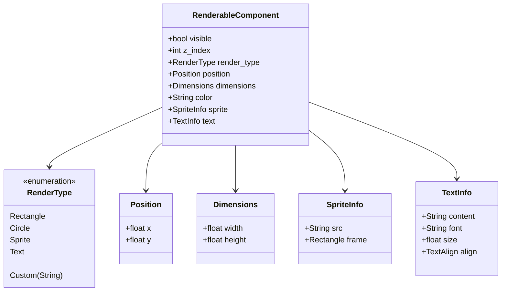
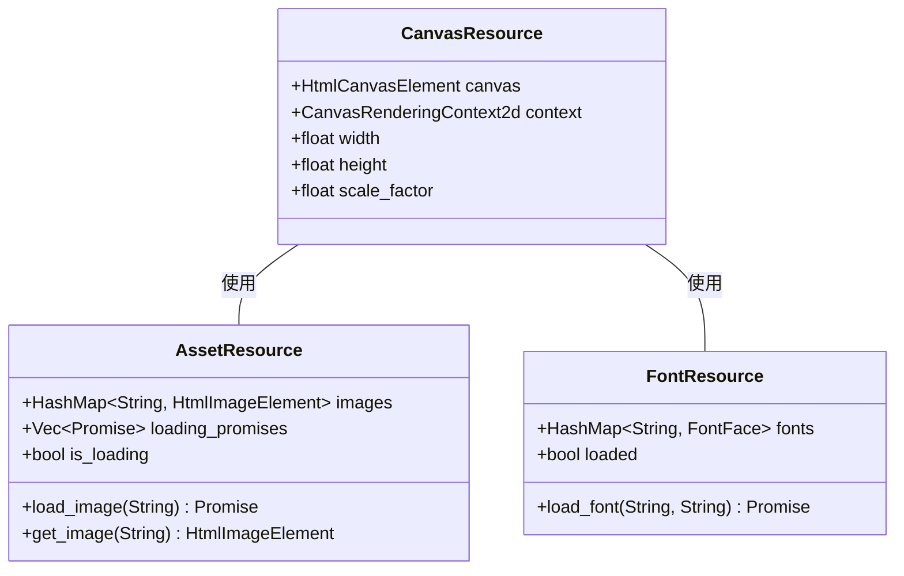
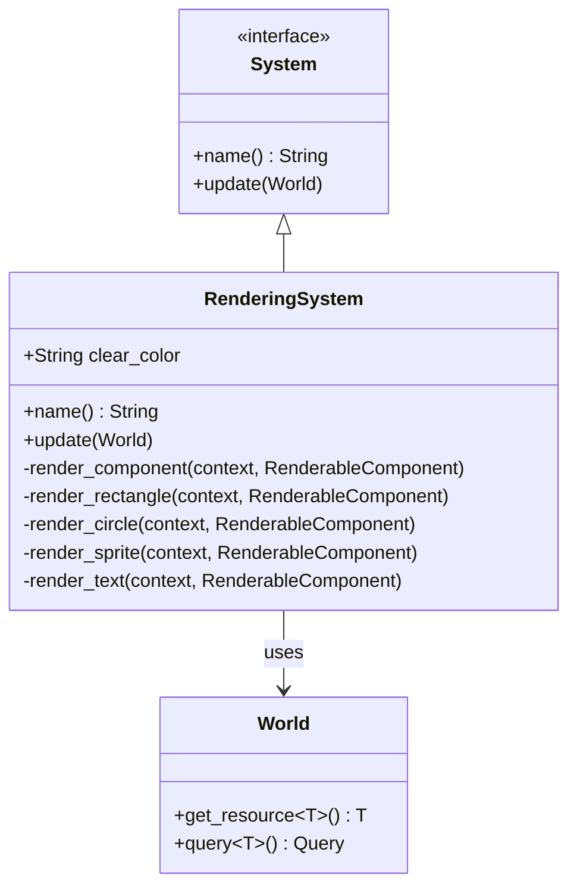
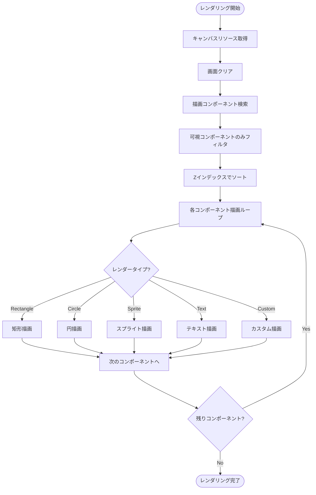
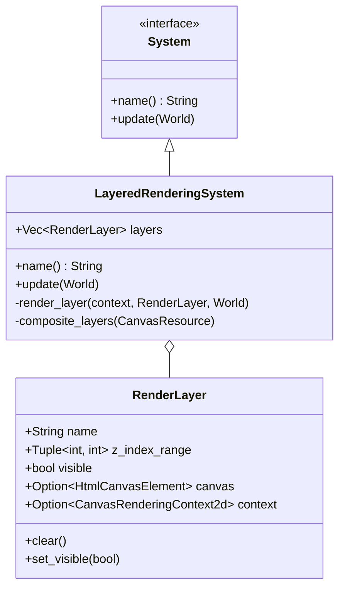
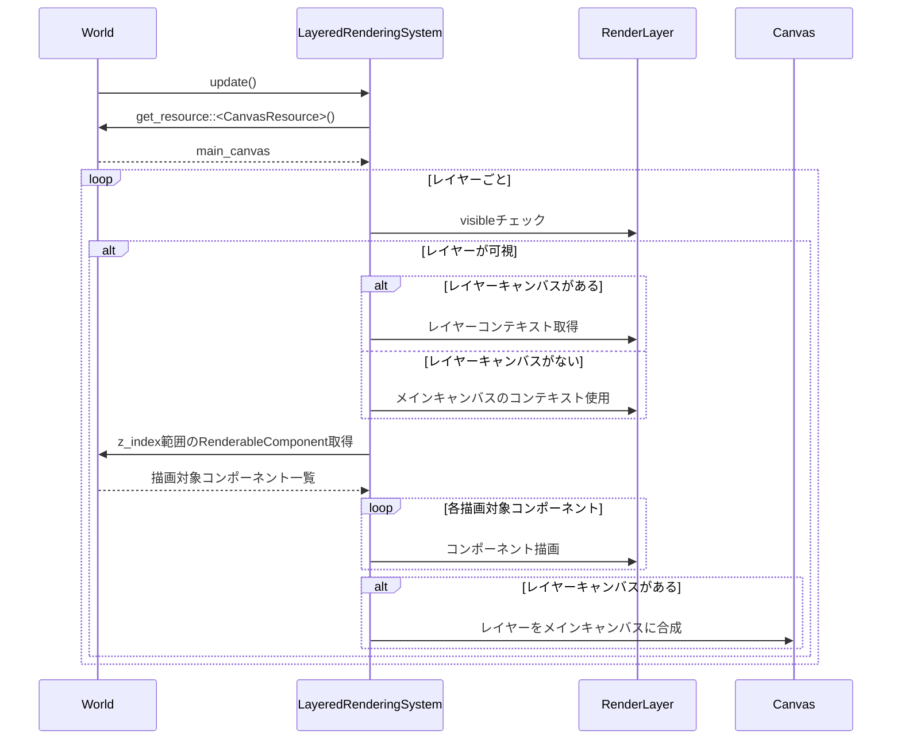
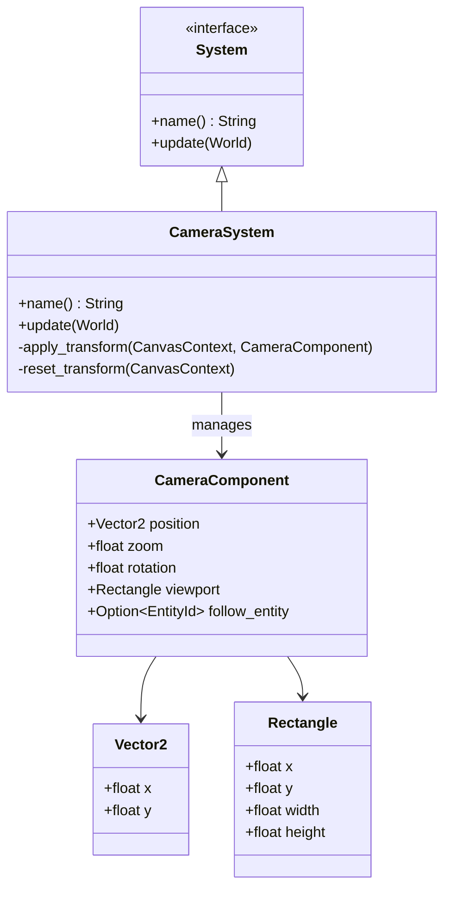
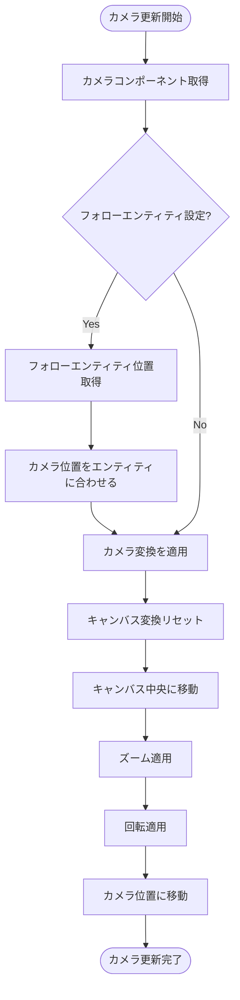

# レンダリングシステムのECS化 🎮

## 概要

現在のマインスイーパーゲームのレンダリングシステムは、従来の手続き型アプローチで実装されており、特定のゲームオブジェクトに強く結合しています。このタスクでは、レンダリングロジックをECSアーキテクチャに適合させ、コンポーネントベースの描画システムを実装します。

## 現状の課題

1. **強結合**: 現在のレンダリングコードは`rendering.rs`に集中しており、ボードやプレイヤー状態に直接依存している
2. **拡張性の制限**: 新しい視覚要素の追加が困難で、既存コードの大幅な変更が必要
3. **テスト困難**: UIロジックとゲームロジックが密接に結合しているため、単体テストが困難
4. **パフォーマンス**: 全画面の再描画が頻繁に行われ、効率が悪い

## 実装計画

### 1. レンダリングコンポーネントの設計

### 2. レンダリングリソースの設計

### 3. レンダリングシステムの実装

#### 3.1 基本レンダリングシステム

#### 3.2 レイヤー別レンダリングシステム

#### 3.3 カメラシステム

### 4. 既存レンダリングコードの移行

1. **ボードレンダリング**:
   - セルの状態に基づいて`RenderableComponent`を生成するファクトリメソッドを作成
   - 各セルを独立したエンティティとして表現するか、一括描画の最適化を検討

2. **プレイヤーレンダリング**:
   - プレイヤーエンティティに`RenderableComponent`を追加
   - カーソル位置やアクション状態の視覚化をコンポーネントベースで実装

3. **UI要素**:
   - ゲーム状態、スコア、タイマーなどのUI要素を独立したエンティティとして実装
   - UI要素専用のレイヤーを作成し、ゲーム要素と分離

## 移行ステップ

1. **準備段階**:
   - 基本コンポーネントとシステムの設計・実装 (3日)
   - テスト用のシンプルなレンダリングパイプラインの構築 (2日)

2. **基本実装**:
   - `CanvasResource`と基本的な`RenderingSystem`の実装 (2日)
   - 最初のレンダリングコンポーネントの作成とテスト (2日)

3. **拡張機能の追加**:
   - レイヤーシステムの実装 (3日)
   - カメラシステムの実装 (2日)
   - アセット管理の改善 (2日)

4. **既存コードの移行**:
   - ボードレンダリングの移行 (3日)
   - プレイヤー関連の視覚要素の移行 (2日)
   - UI要素の移行 (3日)

5. **最適化と仕上げ**:
   - パフォーマンス評価と最適化 (2日)
   - エッジケースの処理と修正 (2日)

## テスト計画

1. **単体テスト**:
   - 各レンダリングコンポーネントの描画結果を検証
   - カメラ変換の数学的正確性を確認

2. **統合テスト**:
   - 複数のエンティティが適切にレンダリングされるかを確認
   - レイヤーシステムが期待通りに機能するかを検証

3. **視覚的テスト**:
   - 参照画像との比較による回帰テスト
   - 異なる解像度とズームレベルでの表示確認

## 期待される効果

1. **モジュール性の向上**: 表示と論理の関心事の分離
2. **拡張性**: 新しい視覚要素の追加が容易に
3. **パフォーマンス**: 部分的な再描画による効率化
4. **テスト容易性**: UIコンポーネントの独立したテストが可能に

## リスクと対策

1. **パフォーマンスリスク**:
   - 多数のエンティティ描画によるオーバーヘッド
   - **対策**: バッチレンダリングの実装、キャンバスレイヤーの適切な利用

2. **互換性リスク**:
   - 既存の見た目と新しいECSベースのレンダリングの差異
   - **対策**: 視覚的な一貫性を保つための比較テスト

3. **複雑性リスク**:
   - レンダリングシステムの複雑化によるメンテナンス困難
   - **対策**: 明確な責任分担と適切な文書化

## 予想工数

- 総計: 約26人日
- コア実装: 11日
- 既存コード移行: 8日
- テストと最適化: 7日 