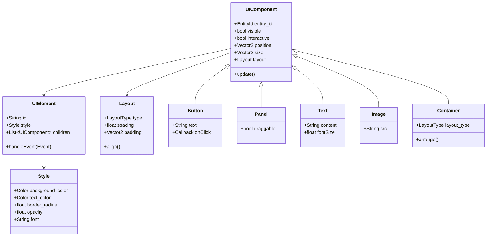
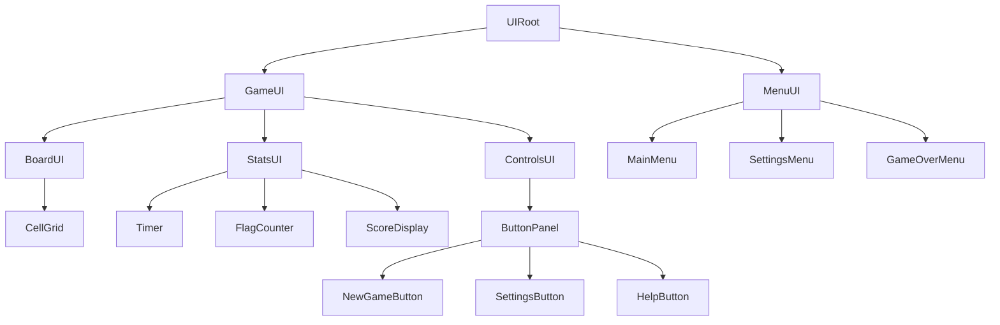
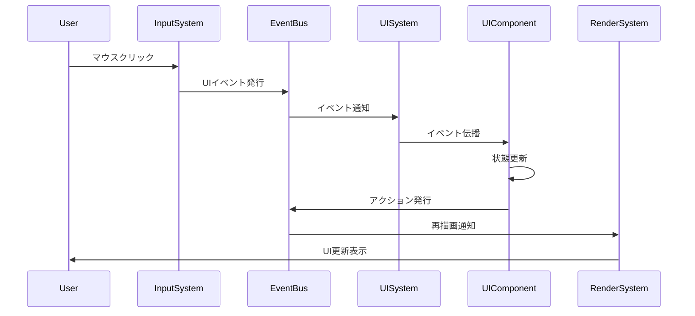
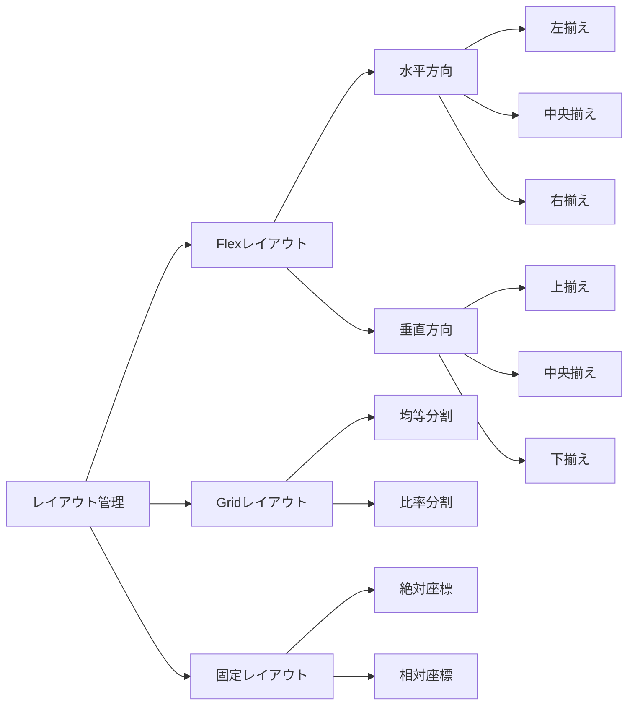
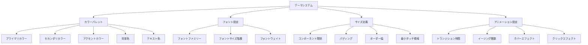
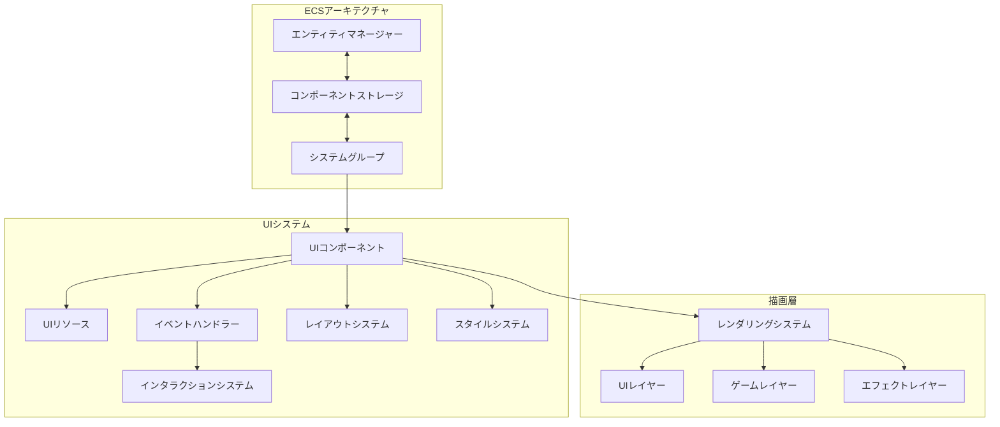
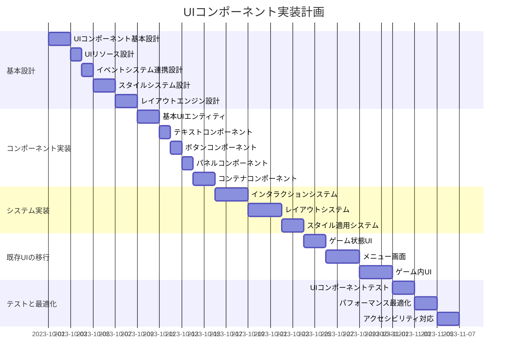
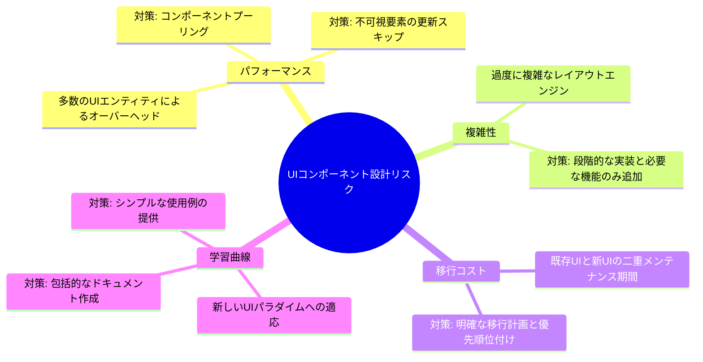

# UIコンポーネント設計 🖌️

## 概要

マインスイーパーゲームのUIを、より柔軟で再利用可能なコンポーネントベースのシステムへとリファクタリングします。現在のUI実装は、直接キャンバスに描画する手続き型アプローチであり、拡張性と保守性に制限があります。ECSアーキテクチャを活用し、宣言的なUIコンポーネントシステムを構築します。

## 現状の課題

1. **柔軟性の欠如**: 現在のUI要素は固定位置に描画され、動的なレイアウト調整が困難
2. **再利用性の低さ**: 共通UIパターンの再利用メカニズムが存在しない
3. **イベント処理の複雑さ**: UI要素とユーザー入力の関連付けが手続き型で実装されている
4. **テスト可能性**: UIコンポーネントを個別にテストする方法がない

## UI設計の概念モデル

## UI要素の階層構造

## UI・イベント連携フロー

## レイアウトシステム

## テーマシステム

## UIシステム全体構成

## 実装計画

### フェーズ1: 基本UIコンポーネント設計 (7日)

## テスト計画

1. **単体テスト**:
   - 各UIコンポーネントの独立した表示テスト
   - イベント伝播の正確性テスト
   - レイアウトアルゴリズムのテスト

2. **統合テスト**:
   - 複合的なUI構造のレンダリングテスト
   - UIとゲームシステムの連携テスト
   - イベント処理チェーンの正確性検証

3. **ユーザビリティテスト**:
   - 異なる解像度でのレイアウト適応性テスト
   - インタラクション体験の検証
   - アクセシビリティ要件への適合確認

## 期待される効果

1. **UI開発の効率化**: 再利用可能なコンポーネントによる開発時間の短縮
2. **拡張性の向上**: 新しいUI要素の追加が容易に
3. **保守性の向上**: UI関連のバグ修正が局所的に可能に
4. **一貫性のあるデザイン**: テーマシステムによる統一された見た目

## リスクと対策

## 優先実装項目

1. 基本的なテキストとボタンコンポーネント
2. シンプルなレイアウトエンジン
3. イベント処理システム
4. ゲーム状態と直接関連するUI要素
5. メニュー画面とダイアログシステム

## 予想工数

- 総計: 約35人日
- 基本設計: 8日
- コンポーネント実装: 7日
- システム実装: 8日
- 既存UI移行: 8日
- テストと最適化: 6日 