# パフォーマンス最適化 🚀

## 概要

マルチプレイヤーマインスイーパーのパフォーマンスを最適化し、より滑らかなゲーム体験を提供するための計画です。ECSアーキテクチャの特性を活かし、メモリ使用量の削減、レンダリングの効率化、ネットワーク通信の最適化など、複数の側面からパフォーマンスを向上させます。

## 現状の課題

1. **コンポーネントストレージの非効率**: 現在のコンポーネント格納方法は、メモリ使用量とアクセス速度の面で最適ではない
2. **システム実行のオーバーヘッド**: 必要でないシステムも毎フレーム実行されている
3. **レンダリングのボトルネック**: 全体的な再描画が頻繁に行われ、CPU/GPUリソースを無駄に消費
4. **ネットワークデータ量**: 不必要に大きなデータがネットワーク経由で送信される
5. **メモリリーク**: 長時間実行時にメモリ使用量が徐々に増加する傾向

## パフォーマンスプロファイル

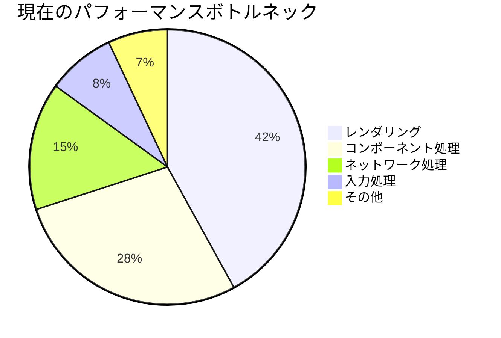

## 最適化戦略概要

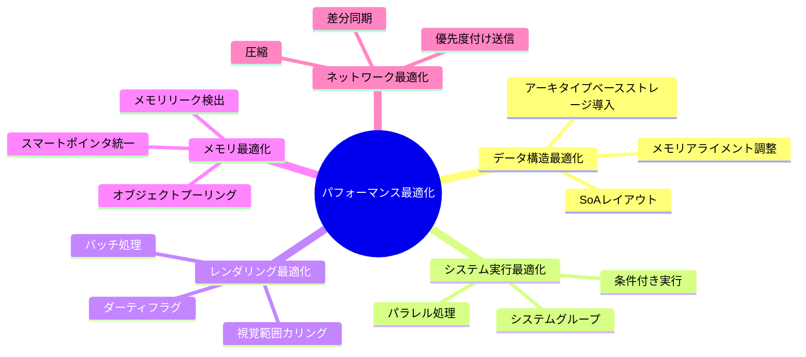

## 1. コンポーネントストレージ最適化

### アーキタイプベースのストレージシステム

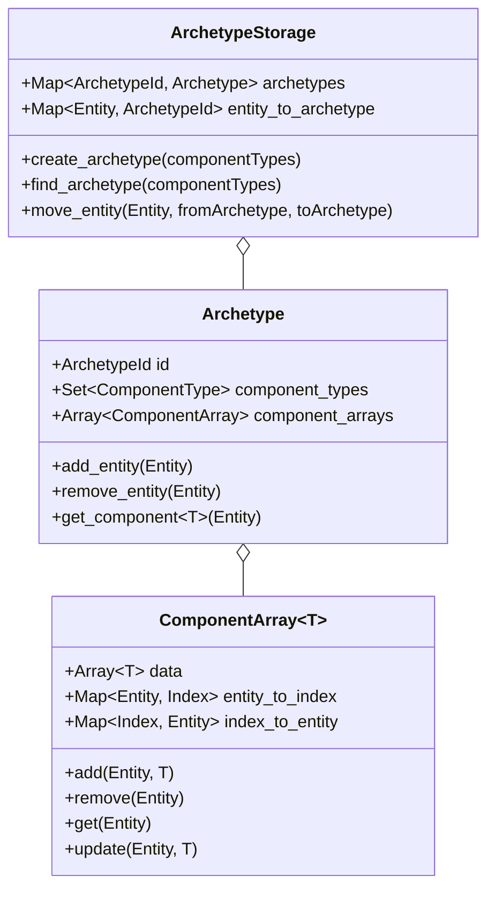

### データレイアウト最適化

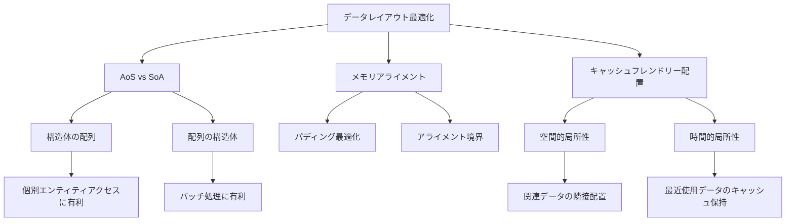

## 2. システム実行の最適化

### スケジューリングと依存関係の視覚化

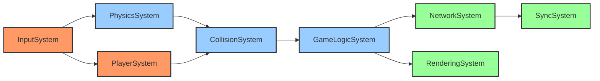

### 条件付き実行とレート制御

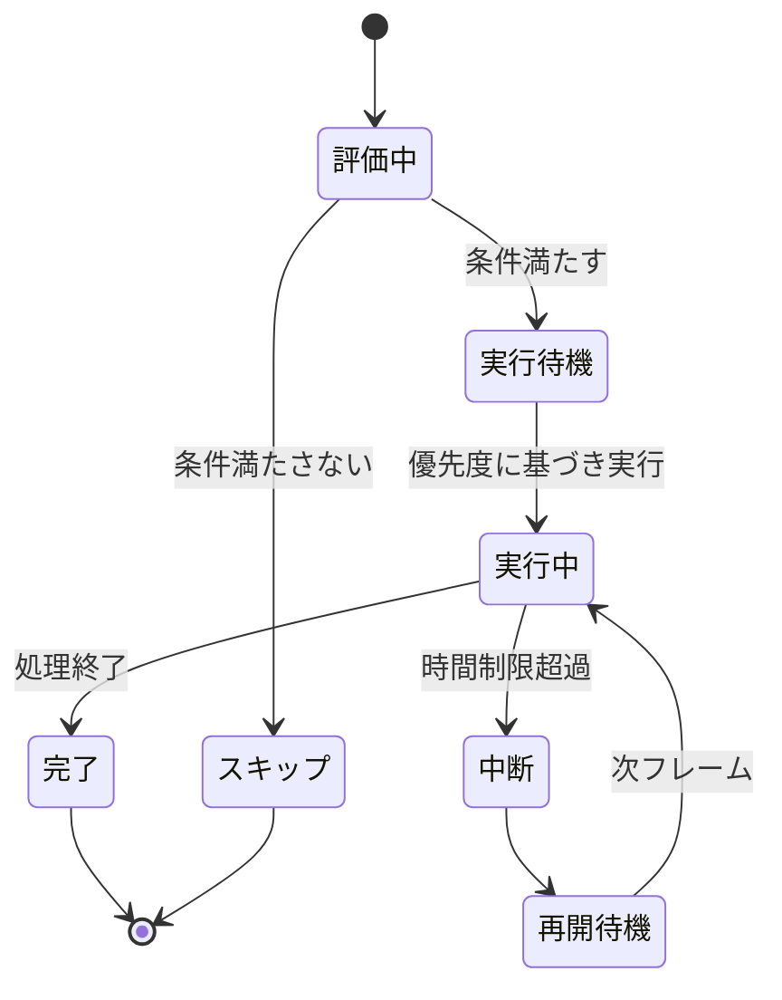

### パラレル実行の依存グラフ

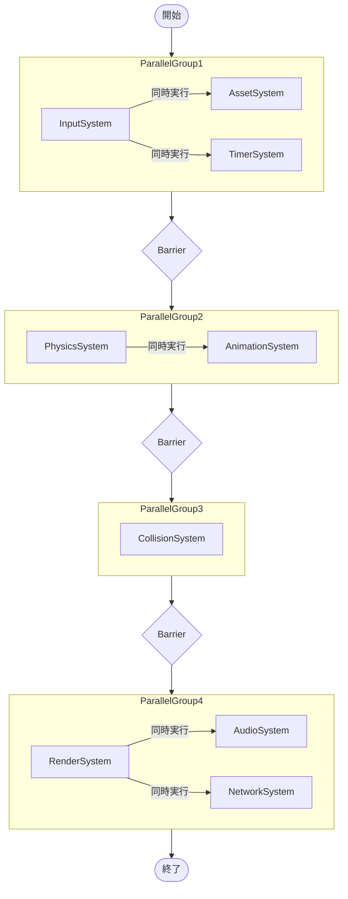

## 3. レンダリング最適化

### レンダリングパイプライン最適化

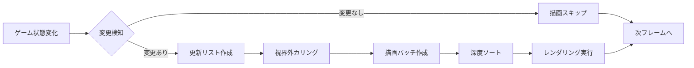

### レイヤー別描画戦略

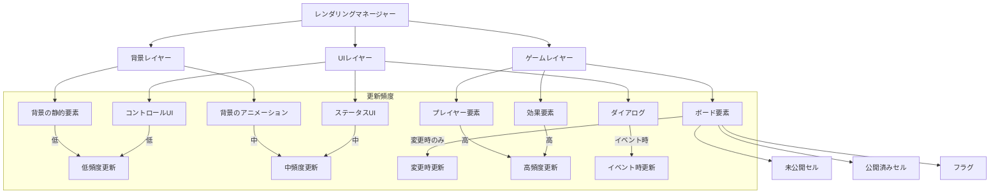

## 4. メモリ使用量最適化

### メモリ使用量の分布

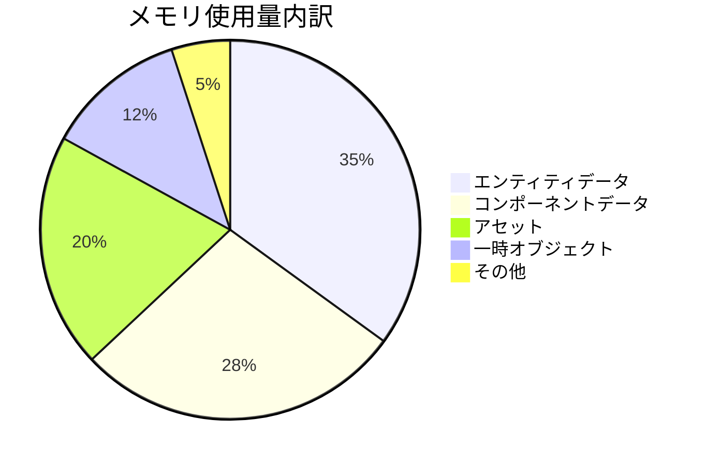

### オブジェクトプーリングシステム

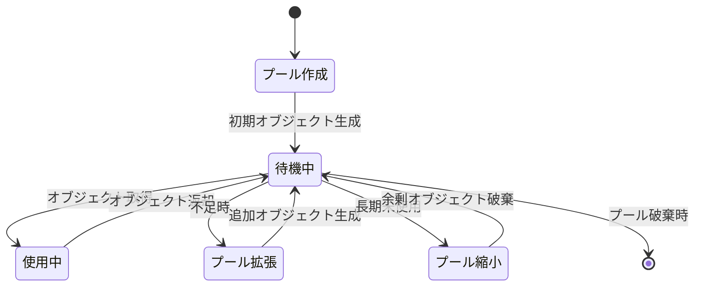

## 5. ネットワーク最適化

### 差分同期戦略

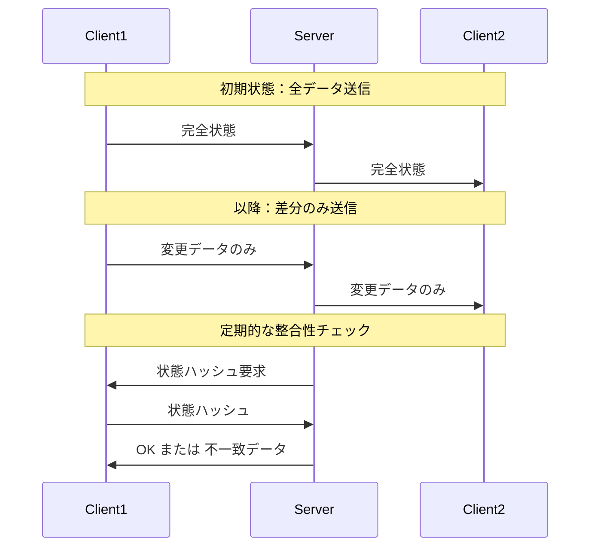

### 優先度付き同期システム

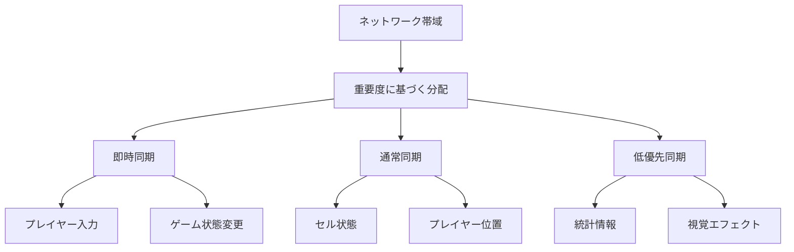

## 実装計画

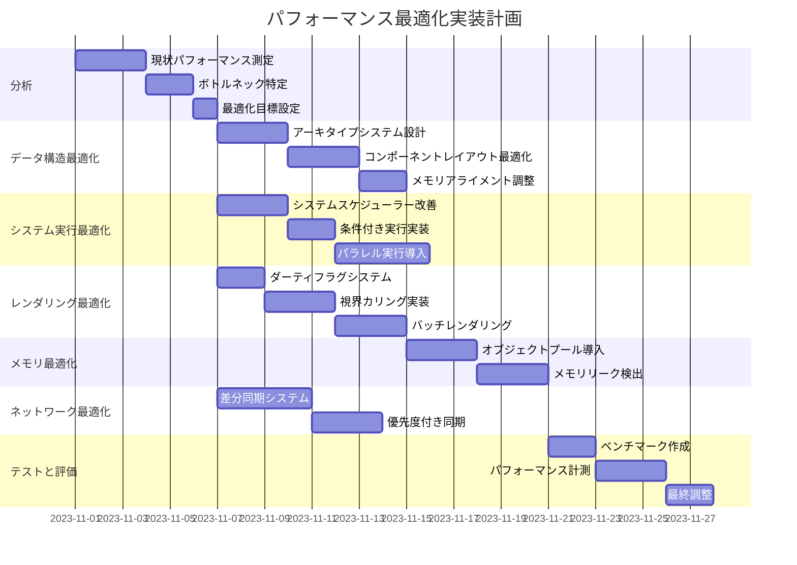

## パフォーマンス目標

```mermaid
xychart-beta
    title "最適化前後のパフォーマンス比較目標"
    x-axis [フレームレート, メモリ使用量, ロード時間, ネットワーク帯域, CPU使用率]
    y-axis "改善率(%)" 0 --> 100
    bar [30, 40, 50, 60, 35]
```

## テスト計画

1. **ベンチマーク**:
   - 標準的なゲーム状況でのフレームレート測定
   - 大規模マップでのメモリ使用量測定
   - 多プレイヤー時のネットワーク帯域測定

2. **負荷テスト**:
   - 最大エンティティ数でのパフォーマンス評価
   - 高頻度コンポーネント更新時の挙動確認
   - 低スペックデバイスでの動作テスト

3. **比較テスト**:
   - 最適化前後のメトリクス比較
   - コンポーネントアクセス速度の比較
   - レンダリング時間の比較

## 期待される効果

1. **フレームレートの向上**: 平均フレームレートを30%以上改善
2. **メモリ使用量の削減**: ピークメモリ使用量を40%削減
3. **ネットワーク帯域の削減**: 必要帯域を60%削減
4. **ロード時間の短縮**: 初期ロード時間を50%短縮

## リスクと対策

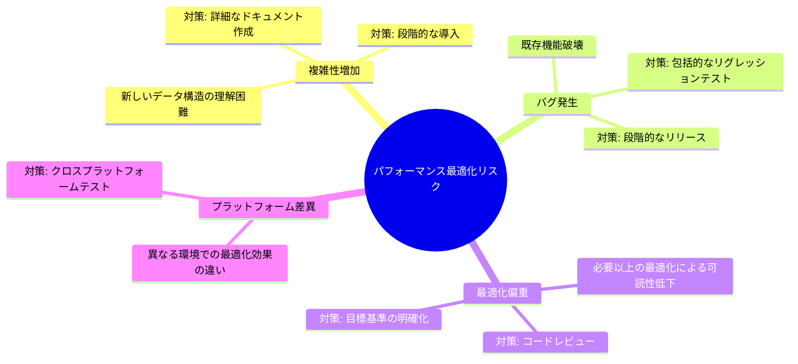

## 優先実装項目

1. コンポーネントストレージの最適化
2. レンダリングパイプラインの効率化
3. システムスケジューラーの改善
4. メモリプーリング導入
5. ネットワーク差分同期

## 予想工数

- 総計: 約38人日
- 分析フェーズ: 6日
- データ構造最適化: 8日
- システム実行最適化: 9日
- レンダリング最適化: 8日
- メモリ最適化: 6日
- ネットワーク最適化: 7日
- テストと評価: 7日 