# 拡張機能の準備 🔌

## 概要

マルチプレイヤーマインスイーパーの拡張性を高め、将来的な機能追加や変更に柔軟に対応できるようにするための計画です。プラグインシステムの導入、カスタムルールの対応、アセット管理システムの整備などを通じて、メンテナンス性と拡張性の高いアーキテクチャを実現します。

## 現状の課題

1. **高い結合度**: 現在のコードベースは機能間の結合が強く、個別の変更や拡張が困難
2. **プラグイン機構の欠如**: 新機能を追加するための標準的なインターフェースが存在しない
3. **カスタマイズ性の制限**: ゲームルールやメカニクスの変更が容易ではない
4. **アセット管理の不足**: 画像、音声、設定などのリソース管理が体系化されていない
5. **ホットリロードの欠如**: 開発中の変更を即座に反映する仕組みがない

## アーキテクチャビジョン

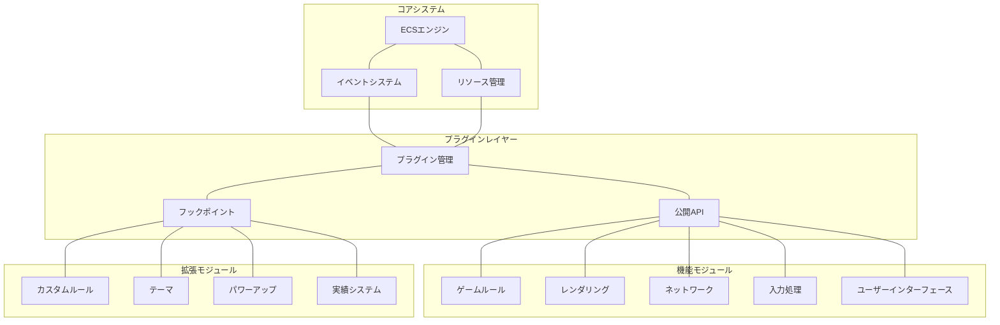

## 1. プラグインシステムの設計

### プラグインアーキテクチャ

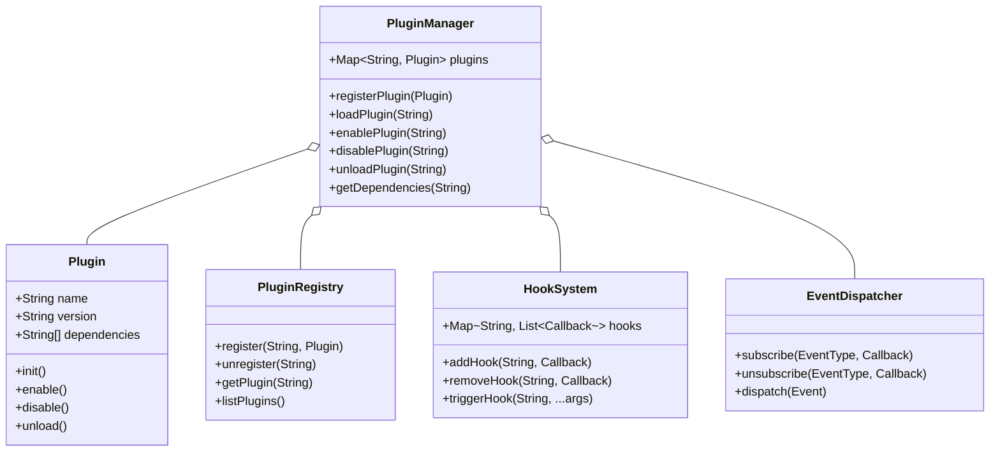

### プラグインのライフサイクル

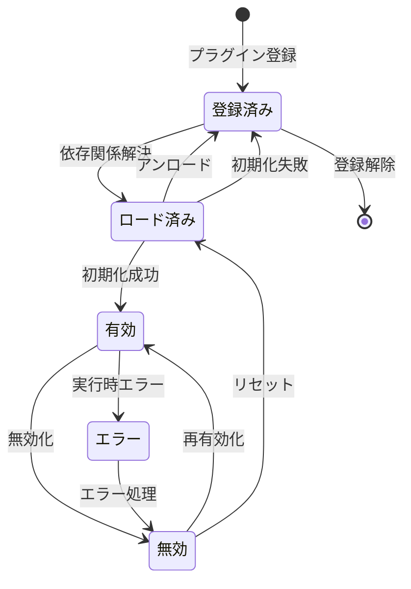

### プラグイン依存関係の管理

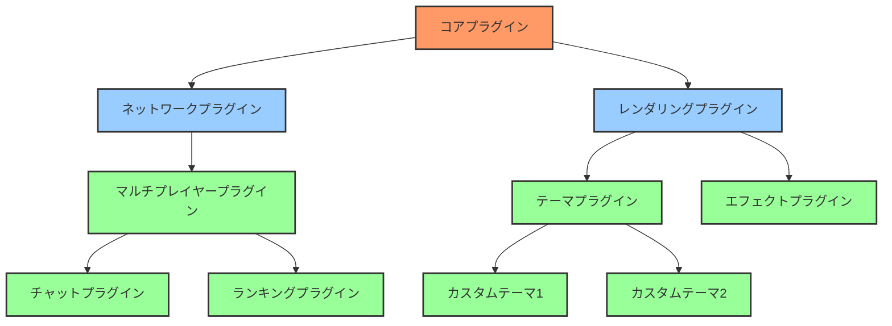

## 2. カスタムルールシステム

### ルールカスタマイズのアーキテクチャ

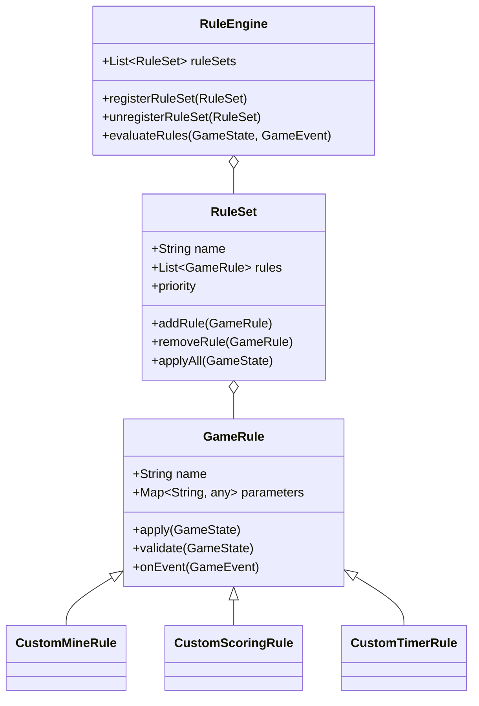

### カスタムルールのワークフロー

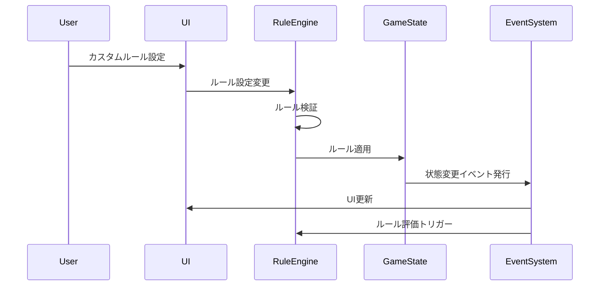

### ゲームモード設計

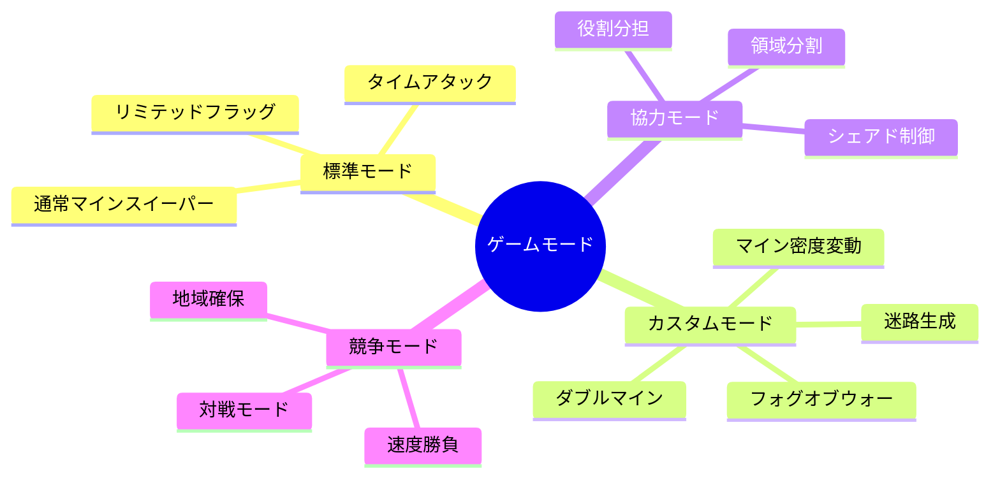

## 3. アセット管理システム

### アセットローダーの設計

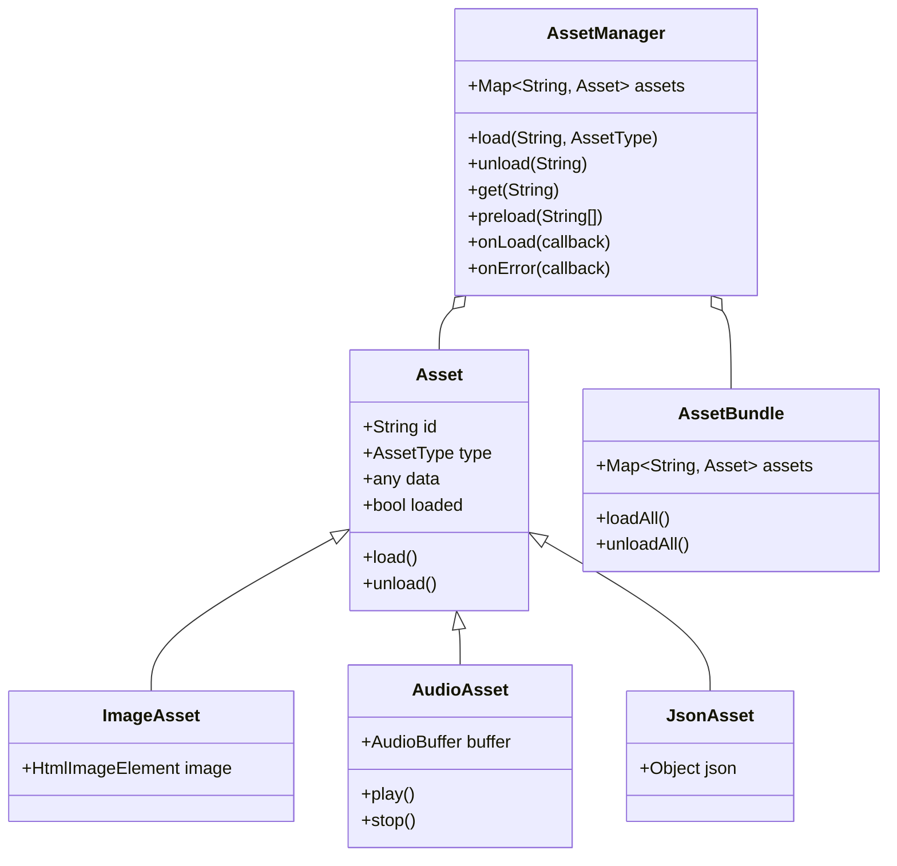

### アセットパイプライン

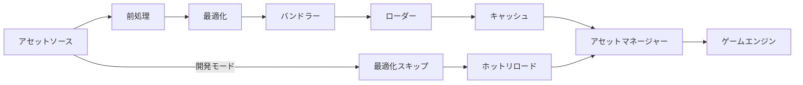

### テーマシステムの構造

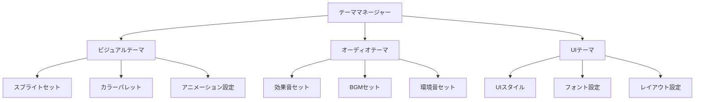

## 4. 開発ツールと環境

### 開発ワークフロー

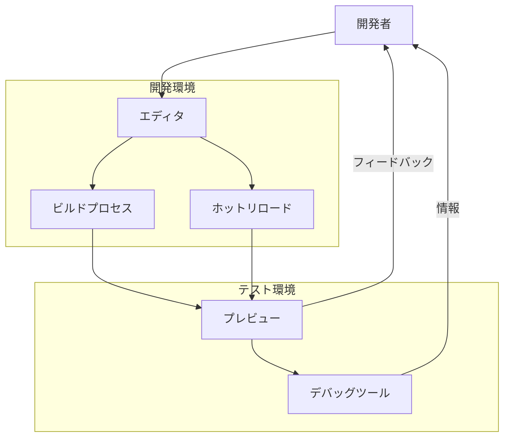

### エディタコンセプト

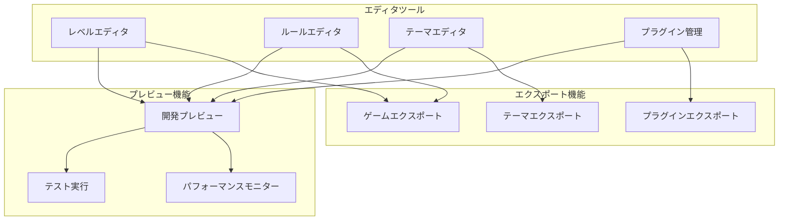

## 実装計画

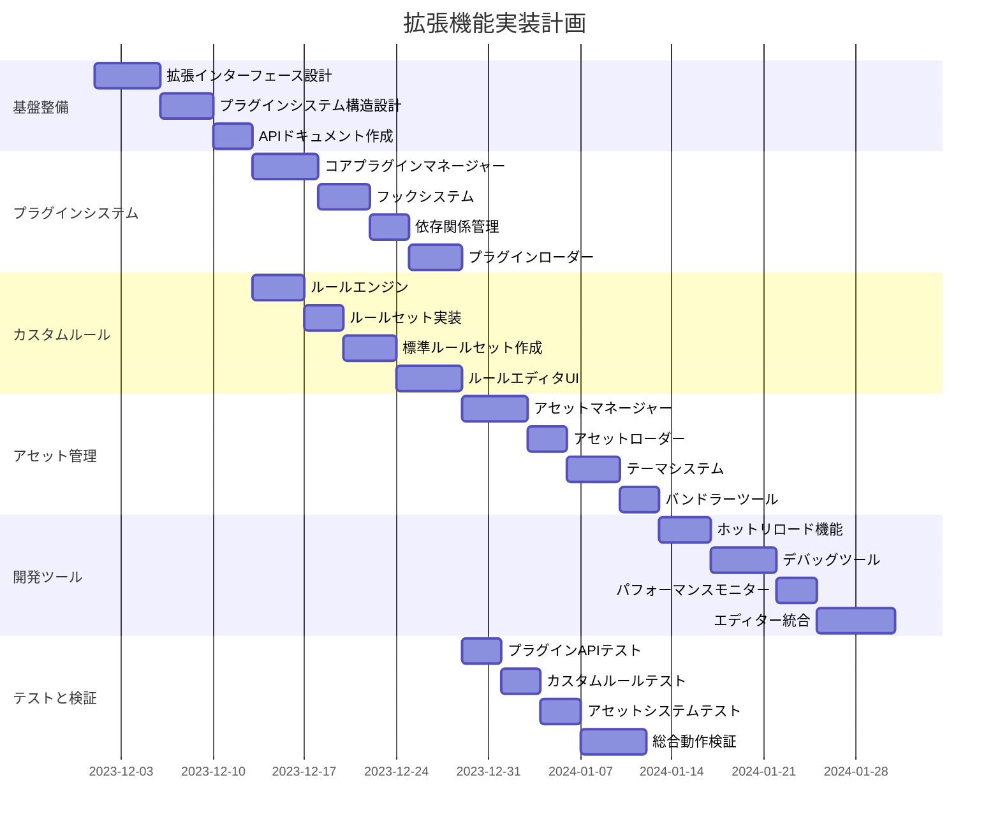

## 拡張機能サンプル計画

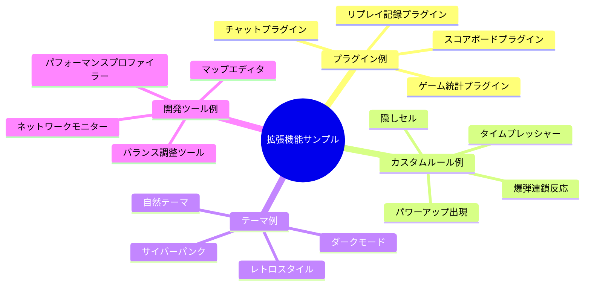

## 拡張API設計

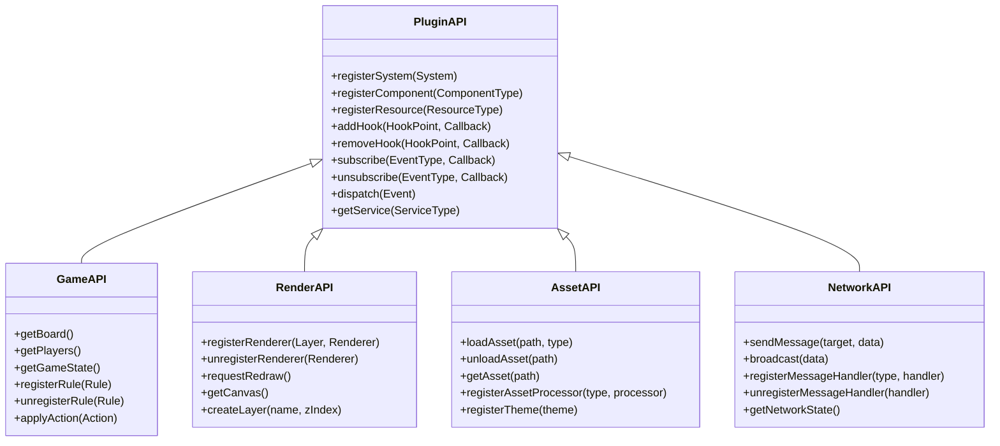

## テスト計画

1. **単体テスト**:
   - プラグインマネージャーの依存関係解決テスト
   - アセットローダーの各種アセット対応テスト
   - ルールエンジンの評価順序テスト

2. **統合テスト**:
   - プラグイン間の連携動作テスト
   - ルールセットの複合適用テスト
   - テーマ切り替え時の一貫性テスト

3. **開発者体験テスト**:
   - ホットリロードの実用性テスト
   - プラグイン開発の容易さ評価
   - ドキュメントの完全性確認

## 期待される効果

1. **拡張容易性の向上**: 新機能を最小限の変更で追加可能に
2. **モジュール化**: 機能の独立性が高まり保守が容易に
3. **コミュニティ貢献**: サードパーティによる拡張が可能に
4. **開発効率**: ホットリロードなどによる開発速度の向上
5. **カスタマイズ**: ユーザーがゲーム体験をカスタマイズ可能に

## リスクと対策

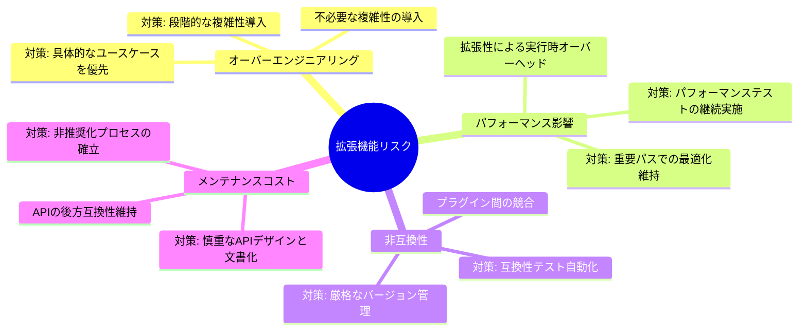

## 優先実装項目

1. プラグインマネージャーのコア機能
2. 基本的なフックポイントの設定
3. アセットローダーシステム
4. カスタムルールエンジン基盤
5. 開発用ホットリロード機能

## 予想工数

- 総計: 約71人日
- 基盤整備: 12日
- プラグインシステム: 16日
- カスタムルール: 16日
- アセット管理: 15日
- 開発ツール: 18日
- テストと検証: 14日 