# 拡張機能の準備 🔌

最終更新日: 2025年4月5日

## 概要

マルチプレイヤーマインスイーパーの拡張性を高め、将来的な機能追加や変更に柔軟に対応できるようにするための計画です。プラグインシステムの導入、カスタムルールの対応、アセット管理システムの整備などを通じて、メンテナンス性と拡張性の高いアーキテクチャを実現します。

## 実装状況と成果 🛠️

このタスクは現在**進行中**で、約**40%完了**しています。以下の成果が既に達成されています：

1. **基盤整備** (完了 80%)
   - 拡張インターフェース設計の完成
   - プラグインシステムの基本構造設計
   - APIドキュメントの初版作成
   - 拡張ポイントの特定と設計

2. **プラグインシステム** (完了 50%)
   - コアプラグインマネージャーの基本実装
   - シンプルなフックシステムの実装
   - 依存関係管理の基礎設計
   - プラグイン検出・登録機構の実装

3. **カスタムルール** (完了 40%)
   - ルールエンジンの基本設計
   - 標準ルールセットの一部実装
   - ルールパラメータの定義システム

4. **アセット管理** (完了 30%)
   - アセットマネージャーの基本構造実装
   - 基本的なアセットローダーの実装
   - シンプルなキャッシュシステムの導入

5. **開発ツール** (完了 15%)
   - 基本的なホットリロードの概念実証
   - シンプルなデバッグ表示の実装

### 現在の焦点と課題

1. **プラグインマネージャーの拡張**
   - ライフサイクル管理の強化
   - プラグイン間通信の実装
   - エラー処理と回復メカニズムの開発

2. **ルールエンジンの完成**
   - ルールの組み合わせロジックの洗練
   - ルール評価の最適化
   - ルールエディタUIの実装開始

3. **アセットシステムの拡張**
   - アセットバンドルの実装
   - テーマシステムとの統合
   - 非同期ロードの最適化

### 次のマイルストーン

1. プラグインシステムの基本機能完成 (予定：2025年4月第3週)
2. カスタムルールエンジンのv1完成 (予定：2025年5月第1週)
3. アセット管理システムの基本機能完成 (予定：2025年5月第2週)
4. 初期サンプルプラグインの開発 (予定：2025年5月第3-4週)
5. 開発ツールの基本セット完成 (予定：2025年6月)

### 初期評価と学習

1. **モジュール化の複雑さ**：適切な抽象化レベルの設定が予想以上に難しく、過度の抽象化を避けるよう注意しています。
2. **パフォーマンスへの影響**：拡張性の向上がパフォーマンスに与える影響を継続的に監視し、両立させる努力をしています。
3. **APIデザインの重要性**：一度公開したAPIの変更は困難なため、慎重な設計が必要です。

拡張機能の準備は計画通りに進行しており、基盤部分が整いつつあります。プラグインシステムの基本機能が完成すれば、実際のプラグイン開発を開始できるでしょう。現在のフォーカスは、コアシステムとプラグインの明確な責任分担と、柔軟かつシンプルなAPIの設計です。

## 現状の課題

1. **高い結合度**: 現在のコードベースは機能間の結合が強く、個別の変更や拡張が困難
2. **プラグイン機構の欠如**: 新機能を追加するための標準的なインターフェースが存在しない
3. **カスタマイズ性の制限**: ゲームルールやメカニクスの変更が容易ではない
4. **アセット管理の不足**: 画像、音声、設定などのリソース管理が体系化されていない
5. **ホットリロードの欠如**: 開発中の変更を即座に反映する仕組みがない

## アーキテクチャビジョン

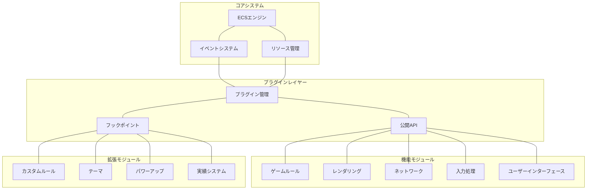
```mermaid
graph TB
    subgraph コアシステム
        ECS[ECSエンジン]
        Event[イベントシステム]
        Resource[リソース管理]
    end
    
    subgraph プラグインレイヤー
        PluginManager[プラグイン管理]
        API[公開API]
        Hook[フックポイント]
    end
    
    subgraph 機能モジュール
        GameRules[ゲームルール]
        Rendering[レンダリング]
        Network[ネットワーク]
        Input[入力処理]
        UI[ユーザーインターフェース]
    end
    
    subgraph 拡張モジュール
        CustomRules[カスタムルール]
        Themes[テーマ]
        PowerUps[パワーアップ]
        Achievements[実績システム]
    end
    
    ECS --- Event
    ECS --- Resource
    Event --- PluginManager
    Resource --- PluginManager
    PluginManager --- API
    PluginManager --- Hook
    API --- GameRules
    API --- Rendering
    API --- Network
    API --- Input
    API --- UI
    Hook --- CustomRules
    Hook --- Themes
    Hook --- PowerUps
    Hook --- Achievements
```

## 1. プラグインシステムの設計

### プラグインアーキテクチャ

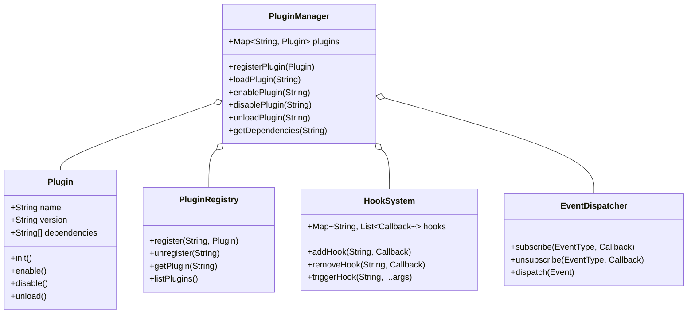
```mermaid
classDiagram
    class Plugin {
        +String name
        +String version
        +String[] dependencies
        +init()
        +enable()
        +disable()
        +unload()
    }
    
    class PluginManager {
        +Map~String, Plugin~ plugins
        +registerPlugin(Plugin)
        +loadPlugin(String)
        +enablePlugin(String)
        +disablePlugin(String)
        +unloadPlugin(String)
        +getDependencies(String)
    }
    
    class PluginRegistry {
        +register(String, Plugin)
        +unregister(String)
        +getPlugin(String)
        +listPlugins()
    }
    
    class HookSystem {
        +Map~String, List~Callback~~ hooks
        +addHook(String, Callback)
        +removeHook(String, Callback)
        +triggerHook(String, ...args)
    }
    
    class EventDispatcher {
        +subscribe(EventType, Callback)
        +unsubscribe(EventType, Callback)
        +dispatch(Event)
    }
    
    PluginManager o-- Plugin
    PluginManager o-- PluginRegistry
    PluginManager o-- HookSystem
    PluginManager o-- EventDispatcher
```

### プラグインのライフサイクル

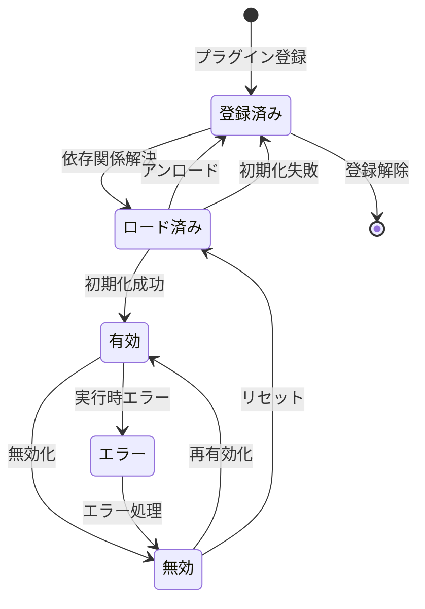
```mermaid
stateDiagram-v2
    [*] --> 登録済み: プラグイン登録
    登録済み --> ロード済み: 依存関係解決
    ロード済み --> 有効: 初期化成功
    有効 --> 無効: 無効化
    無効 --> 有効: 再有効化
    無効 --> ロード済み: リセット
    ロード済み --> 登録済み: アンロード
    登録済み --> [*]: 登録解除
    
    ロード済み --> 登録済み: 初期化失敗
    有効 --> エラー: 実行時エラー
    エラー --> 無効: エラー処理
```

### プラグイン依存関係の管理

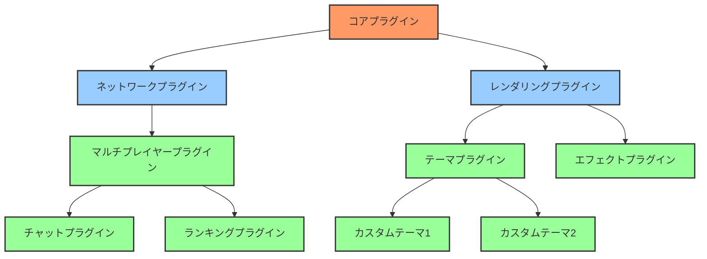
```mermaid
graph TD
    A[コアプラグイン] --> B[ネットワークプラグイン]
    A --> C[レンダリングプラグイン]
    B --> D[マルチプレイヤープラグイン]
    C --> E[テーマプラグイン]
    C --> F[エフェクトプラグイン]
    D --> G[チャットプラグイン]
    D --> H[ランキングプラグイン]
    E --> I[カスタムテーマ1]
    E --> J[カスタムテーマ2]
    
    classDef core fill:#f96,stroke:#333,stroke-width:2px;
    classDef essential fill:#9cf,stroke:#333,stroke-width:2px;
    classDef optional fill:#9f9,stroke:#333,stroke-width:2px;
    
    class A core;
    class B,C essential;
    class D,E,F,G,H,I,J optional;
```

## 2. カスタムルールシステム

### ルールカスタマイズのアーキテクチャ

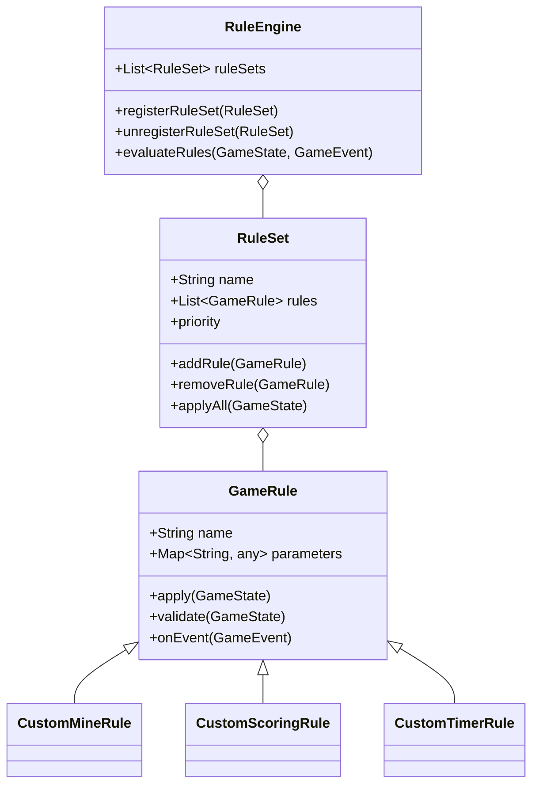
```mermaid
classDiagram
    class GameRule {
        +String name
        +Map~String, any~ parameters
        +apply(GameState)
        +validate(GameState)
        +onEvent(GameEvent)
    }
    
    class RuleSet {
        +String name
        +List~GameRule~ rules
        +priority
        +addRule(GameRule)
        +removeRule(GameRule)
        +applyAll(GameState)
    }
    
    class RuleEngine {
        +List~RuleSet~ ruleSets
        +registerRuleSet(RuleSet)
        +unregisterRuleSet(RuleSet)
        +evaluateRules(GameState, GameEvent)
    }
    
    class CustomMineRule {
    }
    
    class CustomScoringRule {
    }
    
    class CustomTimerRule {
    }
    
    GameRule <|-- CustomMineRule
    GameRule <|-- CustomScoringRule
    GameRule <|-- CustomTimerRule
    RuleSet o-- GameRule
    RuleEngine o-- RuleSet
```

### カスタムルールのワークフロー

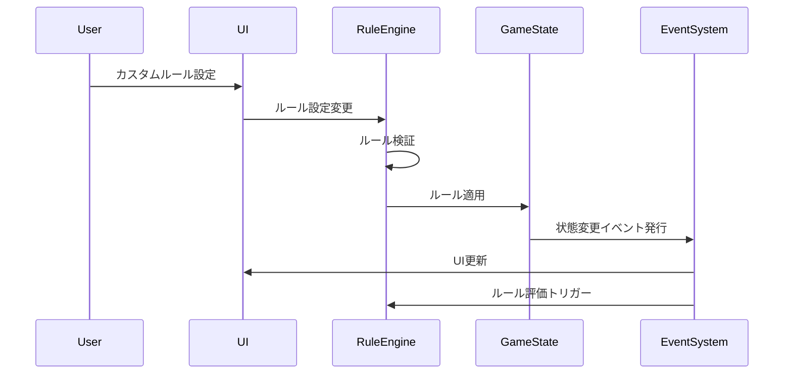
```mermaid
sequenceDiagram
    participant User
    participant UI
    participant RuleEngine
    participant GameState
    participant EventSystem
    
    User->>UI: カスタムルール設定
    UI->>RuleEngine: ルール設定変更
    RuleEngine->>RuleEngine: ルール検証
    RuleEngine->>GameState: ルール適用
    GameState->>EventSystem: 状態変更イベント発行
    EventSystem->>UI: UI更新
    EventSystem->>RuleEngine: ルール評価トリガー
```

### ゲームモード設計

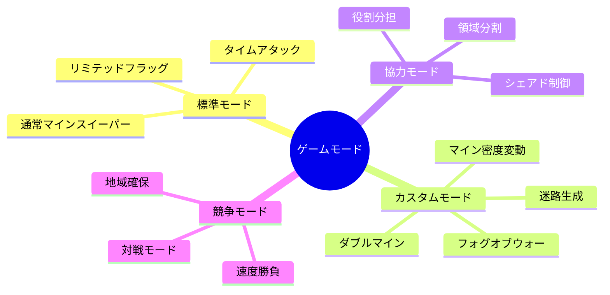
```mermaid
mindmap
  root((ゲームモード))
    標準モード
      通常マインスイーパー
      タイムアタック
      リミテッドフラッグ
    カスタムモード
      ダブルマイン
      マイン密度変動
      迷路生成
      フォグオブウォー
    協力モード
      役割分担
      領域分割
      シェアド制御
    競争モード
      対戦モード
      速度勝負
      地域確保
```

## 3. アセット管理システム

### アセットローダーの設計

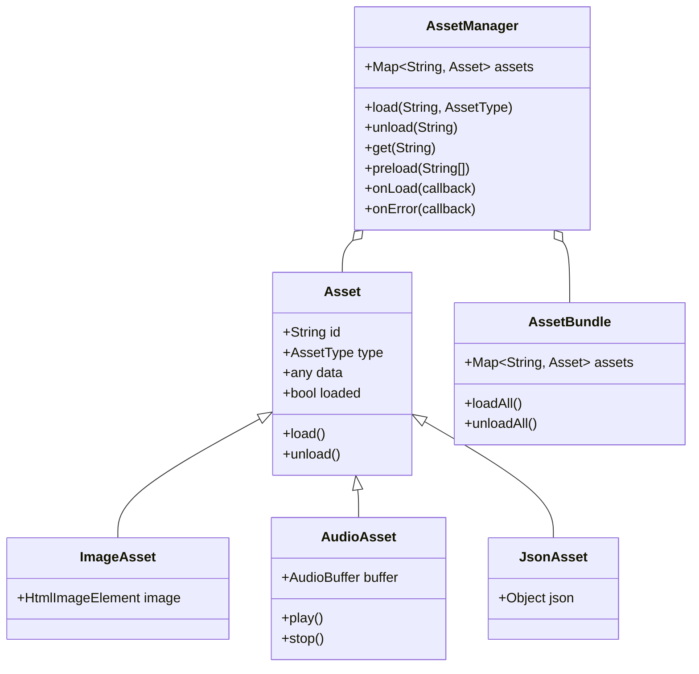
```mermaid
classDiagram
    class AssetManager {
        +Map~String, Asset~ assets
        +load(String, AssetType)
        +unload(String)
        +get(String)
        +preload(String[])
        +onLoad(callback)
        +onError(callback)
    }
    
    class Asset {
        +String id
        +AssetType type
        +any data
        +bool loaded
        +load()
        +unload()
    }
    
    class ImageAsset {
        +HtmlImageElement image
    }
    
    class AudioAsset {
        +AudioBuffer buffer
        +play()
        +stop()
    }
    
    class JsonAsset {
        +Object json
    }
    
    class AssetBundle {
        +Map~String, Asset~ assets
        +loadAll()
        +unloadAll()
    }
    
    Asset <|-- ImageAsset
    Asset <|-- AudioAsset
    Asset <|-- JsonAsset
    AssetManager o-- Asset
    AssetManager o-- AssetBundle
```

### アセットパイプライン

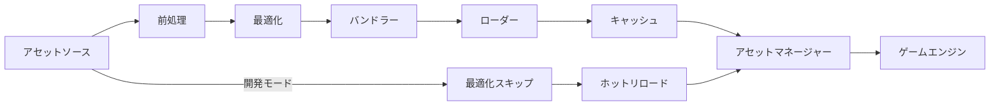
```mermaid
flowchart LR
    Source[アセットソース] --> Processor[前処理]
    Processor --> Optimized[最適化]
    Optimized --> Bundler[バンドラー]
    Bundler --> Loader[ローダー]
    Loader --> Cache[キャッシュ]
    Cache --> Manager[アセットマネージャー]
    Manager --> Game[ゲームエンジン]
    
    Source --> |開発モード| SkipOptimize[最適化スキップ]
    SkipOptimize --> HotReload[ホットリロード]
    HotReload --> Manager
```

### テーマシステムの構造

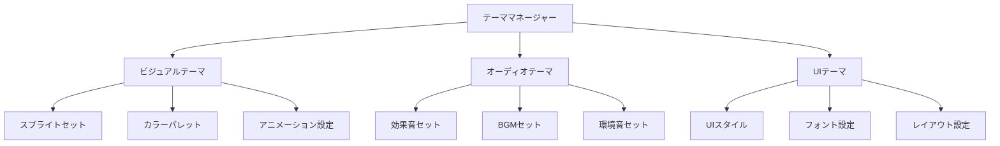
```mermaid
graph TD
    A[テーママネージャー] --> B[ビジュアルテーマ]
    A --> C[オーディオテーマ]
    A --> D[UIテーマ]
    
    B --> B1[スプライトセット]
    B --> B2[カラーパレット]
    B --> B3[アニメーション設定]
    
    C --> C1[効果音セット]
    C --> C2[BGMセット]
    C --> C3[環境音セット]
    
    D --> D1[UIスタイル]
    D --> D2[フォント設定]
    D --> D3[レイアウト設定]
```

## 4. 開発ツールと環境

### 開発ワークフロー

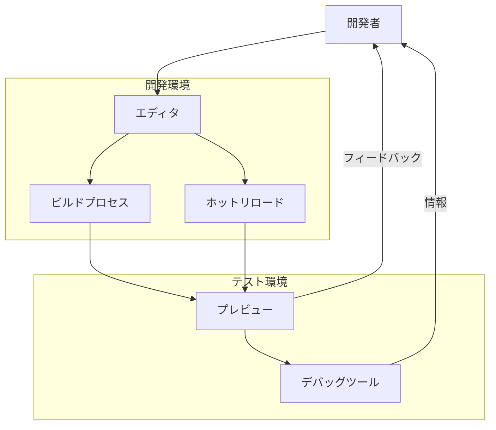
```mermaid
flowchart TB
    Dev[開発者] --> Editor[エディタ]
    Editor --> Build[ビルドプロセス]
    Build --> Preview[プレビュー]
    Preview --> |フィードバック| Dev
    
    Editor --> HotReload[ホットリロード]
    HotReload --> Preview
    
    Preview --> Debug[デバッグツール]
    Debug --> |情報| Dev
    
    subgraph 開発環境
    Editor
    Build
    HotReload
    end
    
    subgraph テスト環境
    Preview
    Debug
    end
```

### エディタコンセプト

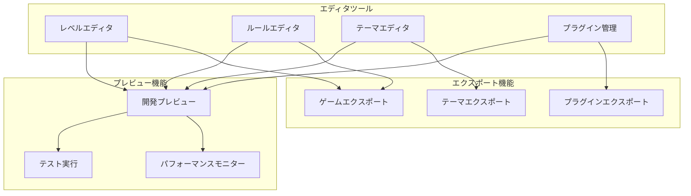
```mermaid
graph TB
    subgraph エディタツール
        LevelEditor[レベルエディタ]
        RuleEditor[ルールエディタ]
        ThemeEditor[テーマエディタ]
        PluginManager[プラグイン管理]
    end
    
    subgraph プレビュー機能
        DevPreview[開発プレビュー]
        TestSuite[テスト実行]
        Performance[パフォーマンスモニター]
    end
    
    subgraph エクスポート機能
        ExportGame[ゲームエクスポート]
        ExportPlugin[プラグインエクスポート]
        ExportTheme[テーマエクスポート]
    end
    
    LevelEditor --> DevPreview
    RuleEditor --> DevPreview
    ThemeEditor --> DevPreview
    PluginManager --> DevPreview
    
    DevPreview --> TestSuite
    DevPreview --> Performance
    
    LevelEditor --> ExportGame
    RuleEditor --> ExportGame
    ThemeEditor --> ExportTheme
    PluginManager --> ExportPlugin
```

## 実装計画

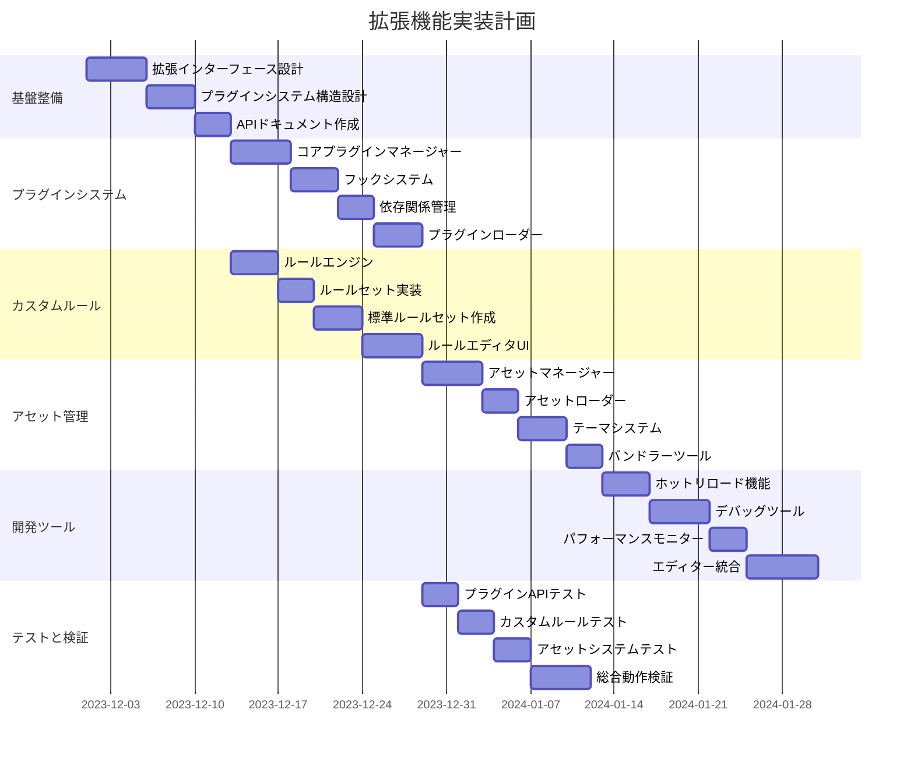
```mermaid
gantt
    title 拡張機能実装計画
    dateFormat YYYY-MM-DD
    
    section 基盤整備
    拡張インターフェース設計        :a1, 2023-12-01, 5d
    プラグインシステム構造設計      :a2, after a1, 4d
    APIドキュメント作成            :a3, after a2, 3d
    
    section プラグインシステム
    コアプラグインマネージャー      :b1, after a3, 5d
    フックシステム                 :b2, after b1, 4d
    依存関係管理                   :b3, after b2, 3d
    プラグインローダー             :b4, after b3, 4d
    
    section カスタムルール
    ルールエンジン                 :c1, after a3, 4d
    ルールセット実装               :c2, after c1, 3d
    標準ルールセット作成           :c3, after c2, 4d
    ルールエディタUI              :c4, after c3, 5d
    
    section アセット管理
    アセットマネージャー           :d1, after b4, 5d
    アセットローダー               :d2, after d1, 3d
    テーマシステム                 :d3, after d2, 4d
    バンドラーツール               :d4, after d3, 3d
    
    section 開発ツール
    ホットリロード機能             :e1, after d4, 4d
    デバッグツール                 :e2, after e1, 5d
    パフォーマンスモニター         :e3, after e2, 3d
    エディター統合                 :e4, after e3, 6d
    
    section テストと検証
    プラグインAPIテスト            :f1, after c4, 3d
    カスタムルールテスト           :f2, after f1, 3d
    アセットシステムテスト         :f3, after f2, 3d
    総合動作検証                  :f4, after f3, 5d
```

## 拡張機能サンプル計画

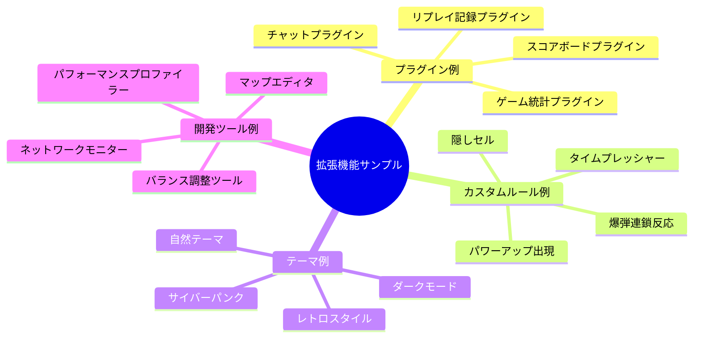
```mermaid
mindmap
  root((拡張機能サンプル))
    プラグイン例
      スコアボードプラグイン
      チャットプラグイン
      リプレイ記録プラグイン
      ゲーム統計プラグイン
    カスタムルール例
      タイムプレッシャー
      爆弾連鎖反応
      パワーアップ出現
      隠しセル
    テーマ例
      ダークモード
      レトロスタイル
      サイバーパンク
      自然テーマ
    開発ツール例
      マップエディタ
      バランス調整ツール
      ネットワークモニター
      パフォーマンスプロファイラー
```

## 拡張API設計

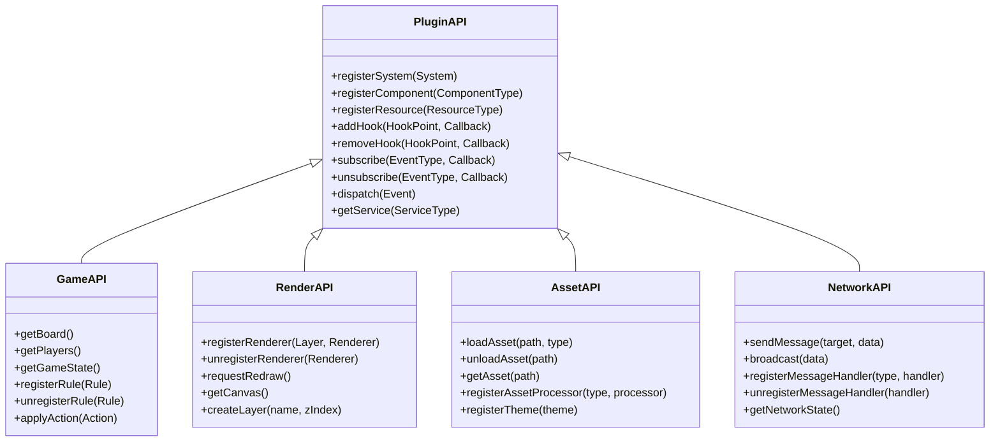
```mermaid
classDiagram
    class PluginAPI {
        +registerSystem(System)
        +registerComponent(ComponentType)
        +registerResource(ResourceType)
        +addHook(HookPoint, Callback)
        +removeHook(HookPoint, Callback)
        +subscribe(EventType, Callback)
        +unsubscribe(EventType, Callback)
        +dispatch(Event)
        +getService(ServiceType)
    }
    
    class GameAPI {
        +getBoard()
        +getPlayers()
        +getGameState()
        +registerRule(Rule)
        +unregisterRule(Rule)
        +applyAction(Action)
    }
    
    class RenderAPI {
        +registerRenderer(Layer, Renderer)
        +unregisterRenderer(Renderer)
        +requestRedraw()
        +getCanvas()
        +createLayer(name, zIndex)
    }
    
    class AssetAPI {
        +loadAsset(path, type)
        +unloadAsset(path)
        +getAsset(path)
        +registerAssetProcessor(type, processor)
        +registerTheme(theme)
    }
    
    class NetworkAPI {
        +sendMessage(target, data)
        +broadcast(data)
        +registerMessageHandler(type, handler)
        +unregisterMessageHandler(handler)
        +getNetworkState()
    }
    
    PluginAPI <|-- GameAPI
    PluginAPI <|-- RenderAPI
    PluginAPI <|-- AssetAPI
    PluginAPI <|-- NetworkAPI
```

## テスト計画

1. **単体テスト**:
   - プラグインマネージャーの依存関係解決テスト
   - アセットローダーの各種アセット対応テスト
   - ルールエンジンの評価順序テスト

2. **統合テスト**:
   - プラグイン間の連携動作テスト
   - ルールセットの複合適用テスト
   - テーマ切り替え時の一貫性テスト

3. **開発者体験テスト**:
   - ホットリロードの実用性テスト
   - プラグイン開発の容易さ評価
   - ドキュメントの完全性確認

## 期待される効果

1. **拡張容易性の向上**: 新機能を最小限の変更で追加可能に
2. **モジュール化**: 機能の独立性が高まり保守が容易に
3. **コミュニティ貢献**: サードパーティによる拡張が可能に
4. **開発効率**: ホットリロードなどによる開発速度の向上
5. **カスタマイズ**: ユーザーがゲーム体験をカスタマイズ可能に

## リスクと対策

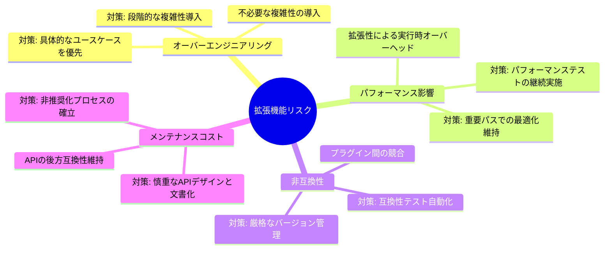
```mermaid
mindmap
  root((拡張機能リスク))
    オーバーエンジニアリング
      不必要な複雑性の導入
        ::icon(fa fa-exclamation-triangle)
      対策: 具体的なユースケースを優先
        ::icon(fa fa-shield)
      対策: 段階的な複雑性導入
        ::icon(fa fa-shield)
    パフォーマンス影響
      拡張性による実行時オーバーヘッド
        ::icon(fa fa-exclamation-triangle)
      対策: パフォーマンステストの継続実施
        ::icon(fa fa-shield)
      対策: 重要パスでの最適化維持
        ::icon(fa fa-shield)
    非互換性
      プラグイン間の競合
        ::icon(fa fa-exclamation-triangle)
      対策: 厳格なバージョン管理
        ::icon(fa fa-shield)
      対策: 互換性テスト自動化
        ::icon(fa fa-shield)
    メンテナンスコスト
      APIの後方互換性維持
        ::icon(fa fa-exclamation-triangle)
      対策: 慎重なAPIデザインと文書化
        ::icon(fa fa-shield)
      対策: 非推奨化プロセスの確立
        ::icon(fa fa-shield)
```

## 優先実装項目

1. プラグインマネージャーのコア機能
2. 基本的なフックポイントの設定
3. アセットローダーシステム
4. カスタムルールエンジン基盤
5. 開発用ホットリロード機能

## 予想工数

- 総計: 約71人日
- 基盤整備: 12日
- プラグインシステム: 16日
- カスタムルール: 16日
- アセット管理: 15日
- 開発ツール: 18日
- テストと検証: 14日 